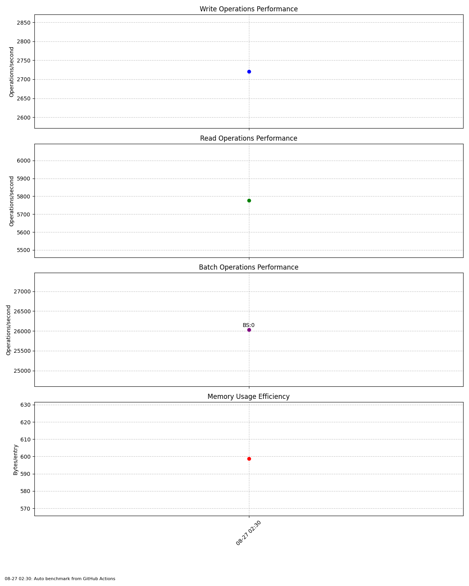

# Redis Memory Benchmark Results
Last updated: Mon Aug 25 06:02:45 UTC 2025

## Performance Summary
Here are the latest benchmark results:

- Batch Size 10: 16629.941240375236
- Batch Size 100: 25585.320921834398
- Batch Size 500: 25706.06261185065

## Charts

