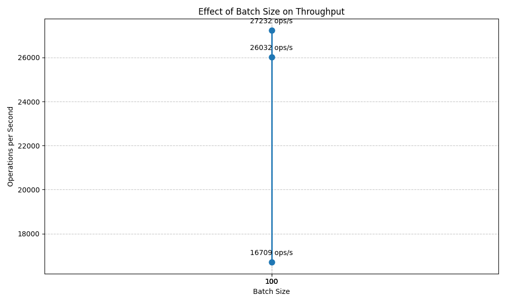

# Redis Memory Benchmark Results
Last updated: Fri Mar 21 01:36:43 UTC 2025

## Performance Summary
Here are the latest benchmark results:

- Batch Size 10: 15916.333361161496
- Batch Size 100: 25352.724283417352
- Batch Size 500: 27698.704317620486

## Charts

