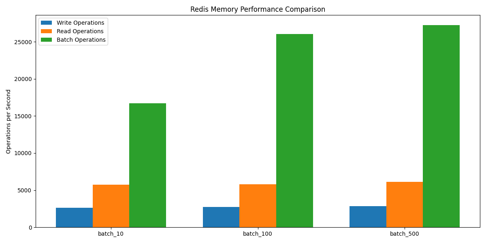

# Redis Memory Benchmark Results
Last updated: Mon Aug 25 00:18:42 UTC 2025

## Performance Summary
Here are the latest benchmark results:

- Batch Size 10: 16493.13818785243
- Batch Size 100: 25528.947752836346
- Batch Size 500: 26649.79095980583

## Charts

