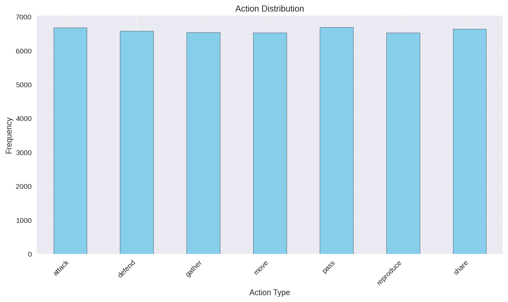
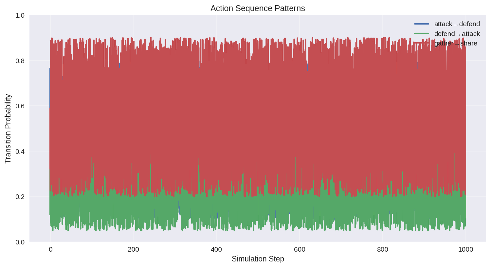
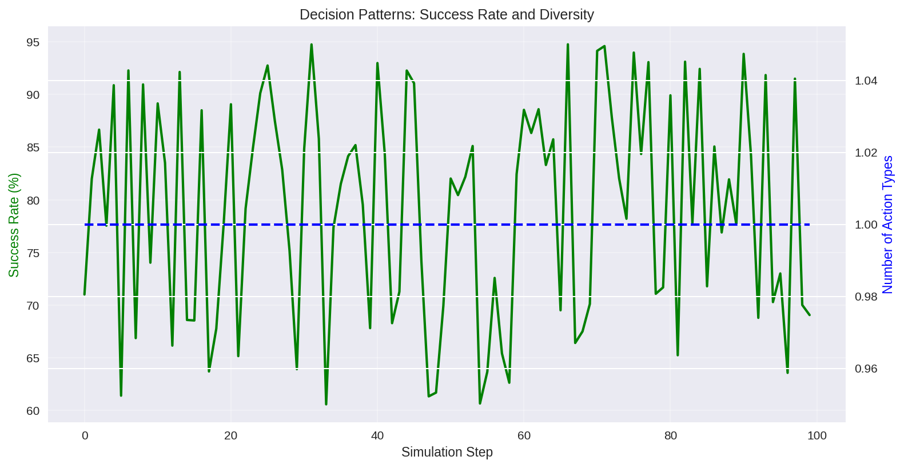
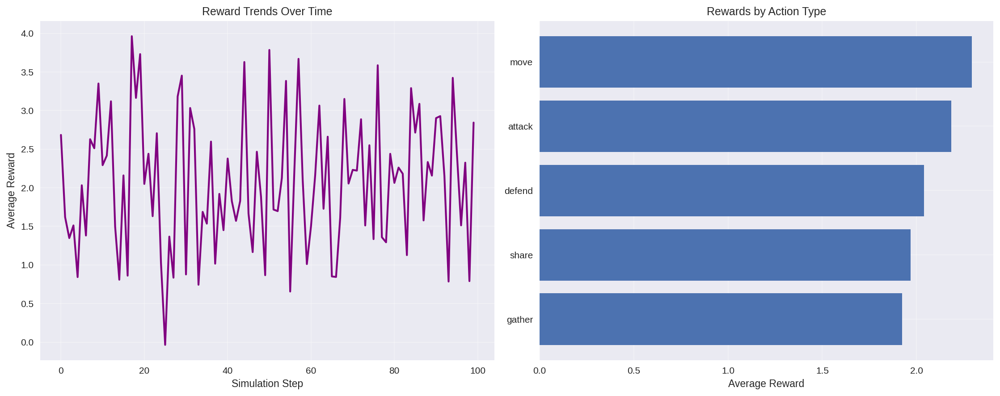
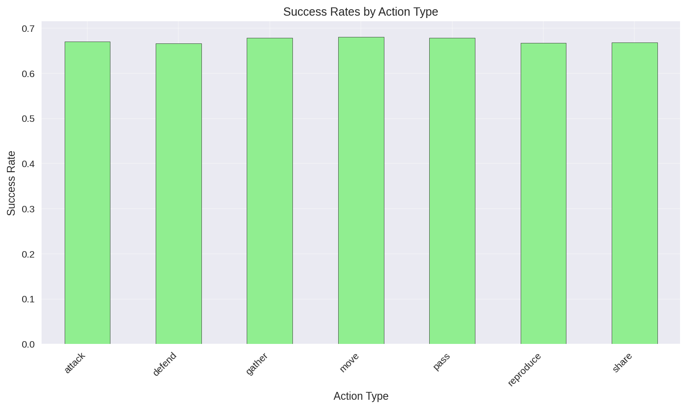
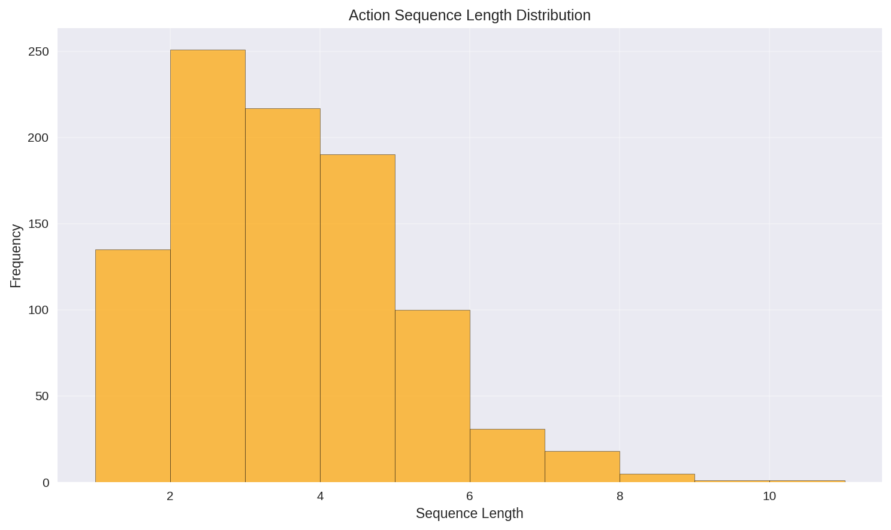

# Actions Analysis Module

**Module Name**: `actions`

Analyze action patterns, sequences, decision-making processes, and performance metrics in agent-based simulations.

---

## Overview

The Actions module examines what actions agents take, when they take them, how decisions are made, and how successful those actions are.

### Key Features

- Action frequency analysis
- Sequence pattern detection
- Decision-making analysis
- Reward/performance metrics
- Success/failure rates
- Action transitions

---

## Quick Start

```python
from pathlib import Path
from farm.analysis.service import AnalysisService, AnalysisRequest
from farm.core.services import EnvConfigService

service = AnalysisService(EnvConfigService())

result = service.run(AnalysisRequest(
    module_name="actions",
    experiment_path=Path("data/experiment"),
    output_path=Path("results/actions")
))
```

---

## Data Requirements

The module can load data from either:
1. **Database**: Loads action records from `simulation.db` and aggregates them into frequency data
2. **CSV fallback**: Loads from `data/actions.csv` if database is unavailable

### Processed Data Format

After processing, the module works with aggregated frequency data:

- `step` (int): Simulation step
- `action_type` (str): Type of action taken
- `frequency` (int/float): Number of times action occurred per step

### Database Source Columns

When loading from database, the following columns are available for analysis:
- `agent_id` (str): Agent identifier
- `action_type` (str): Type of action taken
- `step_number` (int): Simulation step
- `reward` (float): Reward received
- `resources_before/after` (dict): Resource state
- `details` (dict): Additional action metadata

Note: Analysis functions may require additional computed columns (success_rate, sequence data, etc.) depending on the specific analysis performed.

---

## Analysis Functions

### analyze_patterns

Analyze action frequency patterns and distributions.

**Outputs:**
- `action_statistics.json`: Action statistics by type
- `action_patterns.csv`: Raw action frequency data

**Metrics:**
- Most/least common actions
- Action diversity
- Frequency distributions

**Example Output** (`action_statistics.json`):
```json
{
  "total_actions": {
    "mean": 31.47,
    "median": 32.0,
    "std": 5.35,
    "min": 14.0,
    "max": 38.0,
    "q25": 30.0,
    "q75": 34.0
  },
  "action_types": {
    "attack": {
      "frequency": {
        "mean": 4.53,
        "median": 5.0,
        "std": 1.82,
        "min": 1.0,
        "max": 8.0,
        "q25": 3.5,
        "q75": 6.0
      }
    },
    "defend": {
      "frequency": {
        "mean": 4.8,
        "median": 4.0,
        "std": 1.72,
        "min": 2.0,
        "max": 9.0,
        "q25": 4.0,
        "q75": 6.0
      }
    }
  },
  "most_common_action": "move",
  "most_common_frequency": 5.21
}
```

### analyze_sequences

Detect and analyze action sequences and patterns.

**Outputs:**
- `sequence_patterns.json`: Sequence pattern statistics

**Metrics:**
- Common action chains
- Transition probabilities
- Sequence effectiveness

**Example Output** (`sequence_patterns.json`):
```json
{
  "attack->defend": {
    "avg_probability": 0.23,
    "max_probability": 0.45,
    "min_probability": 0.12,
    "probability_trend": "stable"
  },
  "defend->attack": {
    "avg_probability": 0.18,
    "max_probability": 0.32,
    "min_probability": 0.08,
    "probability_trend": "decreasing"
  },
  "gather->share": {
    "avg_probability": 0.67,
    "max_probability": 0.89,
    "min_probability": 0.45,
    "probability_trend": "increasing"
  },
  "most_common_sequence": {
    "sequence": "gather->share",
    "probability": 0.67
  }
}
```

### analyze_decisions

Analyze decision-making patterns and quality.

**Outputs:**
- `decision_patterns.json`: Decision pattern statistics

**Metrics:**
- Decision diversity by state
- Optimal vs actual choices
- Decision consistency

**Example Output** (`decision_patterns.json`):
```json
{
  "avg_success_rate": 0.74,
  "success_trend": "increasing",
  "decision_consistency": 0.68,
  "avg_action_diversity": 3.2,
  "diversity_trend": "stable"
}
```

### analyze_rewards

Analyze reward distributions and action performance.

**Outputs:**
- `reward_analysis.json`: Reward and performance metrics

**Metrics:**
- Reward by action type
- Risk/reward ratios
- Performance trends

**Example Output** (`reward_analysis.json`):
```json
{
  "overall_avg_reward": 2.34,
  "reward_trend": "increasing",
  "reward_volatility": 1.67,
  "avg_reward_variance": 0.89,
  "best_performing_action": "share",
  "best_action_reward": 3.21,
  "total_rewards": {
    "mean": 74.2,
    "median": 72.5,
    "std": 12.8,
    "min": 45.3,
    "max": 98.7
  }
}
```

### analyze_success_rates

Analyze success rates for different action types.

**Outputs:**
- `success_rates.csv`: Success rates by action type

**Metrics:**
- Success rates per action type
- Overall success patterns

**Example Output** (`success_rates.json`):
```json
{
  "attack": 0.75,
  "defend": 0.82,
  "gather": 0.68,
  "move": 0.91,
  "reproduce": 0.45,
  "share": 0.73
}
```

### analyze_action_sequences

Analyze action sequences and their characteristics.

**Outputs:**
- `action_sequences.json`: Sequence analysis results

**Metrics:**
- Common sequence patterns
- Sequence length distributions
- Transition frequencies

**Example Output** (`action_sequences.json`):
```json
{
  "common_sequences": {
    "attack->defend->gather": 45,
    "gather->share->move": 38,
    "defend->attack->move": 29,
    "move->gather->share": 52
  },
  "avg_sequence_length": 2.8,
  "max_sequence_length": 5,
  "transition_matrix": {
    "attack": {
      "defend": 0.45,
      "move": 0.32,
      "gather": 0.23
    },
    "defend": {
      "attack": 0.38,
      "gather": 0.29,
      "share": 0.33
    },
    "gather": {
      "share": 0.67,
      "move": 0.21,
      "attack": 0.12
    },
    "move": {
      "gather": 0.44,
      "defend": 0.28,
      "attack": 0.28
    },
    "share": {
      "move": 0.52,
      "gather": 0.31,
      "defend": 0.17
    }
  }
}
```

---

## Visualization Functions

### plot_frequencies

Plot action frequency distributions.

**Output:** `action_distribution.png`

**Description:** Creates a line plot showing how frequently each action type occurs over simulation steps. Each action type is represented by a different colored line with markers, making it easy to track changes in action preferences over time.



### plot_sequences

Visualize action sequence patterns.

**Output:** `sequence_patterns.png`

**Description:** Displays transition probabilities between action pairs over time as line plots. Shows how likely it is for one action to follow another, with each transition represented by a different line. Useful for understanding behavioral patterns and decision chains.



### plot_decisions

Plot decision-making patterns and quality.

**Output:** `decision_patterns.png`

**Description:** Creates a dual-axis plot showing success rates (left axis) and action diversity (right axis) over time. Success rates are shown as a green line, while action diversity is shown as a blue dashed line. Helps identify relationships between decision quality and behavioral variety.



### plot_rewards

Visualize reward distributions by action.

**Output:** `reward_distributions.png`

**Description:** Creates a two-panel plot. The left panel shows reward trends over time as a purple line plot. The right panel displays average rewards by action type as a horizontal bar chart, sorted by reward value. Useful for identifying which actions are most rewarding and how rewards change over time.



### plot_action_distribution

Plot action distribution as a bar chart.

**Output:** `action_distribution.png`

**Description:** Creates a vertical bar chart showing the total frequency of each action type across all simulation steps. Bars are colored in sky blue with black edges, and action types are displayed on the x-axis with rotated labels for readability. Provides a quick overview of which actions are most prevalent.


### plot_success_rates

Plot success rates by action type.

**Output:** `success_rates.png`

**Description:** Creates a vertical bar chart showing success rates for each action type. Bars are colored in light green with black edges, with action types on the x-axis. Success rates are displayed as decimal values between 0 and 1. Helps identify which actions are most effective.



### plot_action_sequences

Plot action sequence length distribution.

**Output:** `action_sequences.png`

**Description:** Creates a histogram showing the distribution of action sequence lengths. Bars are colored in orange with black edges, showing how many sequences exist at each length. The x-axis represents sequence length, and the y-axis shows frequency count. Useful for understanding typical behavioral pattern lengths.



---

## Function Groups

- **"all"**: All functions
- **"analysis"**: All analysis functions
- **"plots"**: All visualization functions
- **"basic"**: `analyze_patterns`, `plot_frequencies`
- **"sequences"**: Sequence-focused analysis
- **"performance"**: Reward and decision analysis

---

## Examples

### Action Frequency Analysis

```python
result = service.run(AnalysisRequest(
    module_name="actions",
    experiment_path=Path("data/experiment"),
    output_path=Path("results/actions"),
    group="basic"
))

# Read action patterns
import pandas as pd
actions_df = pd.read_csv(result.output_path / "action_patterns.csv")
print(actions_df.sort_values('frequency', ascending=False).head())
```

### Sequence Mining

```python
result = service.run(AnalysisRequest(
    module_name="actions",
    experiment_path=Path("data/experiment"),
    output_path=Path("results/sequences"),
    group="sequences",
    analysis_kwargs={
        "analyze_sequences": {
            "min_length": 3,
            "max_length": 5,
            "min_support": 10
        }
    }
))
```

### Performance by Agent Type

```python
result = service.run(AnalysisRequest(
    module_name="actions",
    experiment_path=Path("data/experiment"),
    output_path=Path("results/performance"),
    group="performance",
    processor_kwargs={
        "group_by_agent_type": True
    }
))

# Compare performance
df = result.dataframe
for agent_type in df['agent_type'].unique():
    type_df = df[df['agent_type'] == agent_type]
    mean_reward = type_df['reward'].mean()
    print(f"{agent_type}: {mean_reward:.3f}")
```

---

## Integration Examples

### With Learning Module

```python
# Compare actions before/after learning
learning_result = service.run(AnalysisRequest(
    module_name="learning",
    experiment_path=Path("data/experiment"),
    output_path=Path("results/learning")
))

actions_result = service.run(AnalysisRequest(
    module_name="actions",
    experiment_path=Path("data/experiment"),
    output_path=Path("results/actions")
))

# Analyze action choices over time
# ... correlation analysis ...
```

---

## Global Metrics Registry

The Actions module uses a comprehensive global metrics registry stored in `metrics_registry.json` at the project root. This JSON file serves as the centralized reference for all metric definitions, schemas, and validation rules.

### Registry Structure

The metrics registry organizes metrics into categories:

- **action_statistics**: Overall action frequencies and per-action statistics
- **sequence_patterns**: Action transition probabilities and sequence patterns
- **decision_patterns**: Success rates and decision-making metrics
- **reward_metrics**: Reward distributions and performance metrics
- **success_rates**: Success rates for different action types
- **action_sequences**: Sequence length distributions and transition matrices

### Accessing the Registry

```python
from farm.utils.metrics_registry import get_metrics_registry

# Get the registry instance
registry = get_metrics_registry()

# Get all categories
categories = registry.get_all_categories()
print(f"Available categories: {categories}")

# Get metrics for a specific category
reward_metrics = registry.get_category_metrics('reward_metrics')

# Get definition for a specific metric
avg_reward_def = registry.get_metric_definition('reward_metrics', 'overall_avg_reward')
print(f"Description: {avg_reward_def['description']}")
print(f"Data type: {avg_reward_def['data_type']}")
print(f"Tags: {avg_reward_def['tags']}")
```

### Validation and Metadata

Each metric in the registry includes:
- **name**: Metric identifier
- **description**: Human-readable description
- **data_type**: Expected data type (str, int, float, dict, list)
- **unit**: Measurement unit (optional)
- **range_description**: Valid value ranges (optional)
- **example_value**: Sample output format
- **required**: Whether the metric is required for analysis
- **tags**: Categorization tags for filtering and grouping

### Validation Example

```python
from farm.utils.metrics_registry import validate_metric_data

# Validate a metric value
errors = validate_metric_data('decision_patterns', 'avg_success_rate', 0.74)
if errors:
    print(f"Validation errors: {errors}")
else:
    print("✓ Metric value is valid")
```

### Querying by Tags

```python
from farm.utils.metrics_registry import get_metrics_registry

registry = get_metrics_registry()

# Find all reward-related metrics
reward_metrics = registry.get_metrics_by_tag('reward')
print(f"Found {len(reward_metrics)} reward-related metrics")

# Find all trend metrics
trend_metrics = registry.get_metrics_by_tag('trend')
print(f"Found {len(trend_metrics)} trend metrics")
```

### Registry Summary

```python
from farm.utils.metrics_registry import get_registry_summary

summary = get_registry_summary()
print(f"Registry version: {summary['version']}")
print(f"Total categories: {summary['total_categories']}")
```

---

## See Also

- [API Reference](../API_REFERENCE.md)
- [Learning Module](./Learning.md)
- [Agents Module](./Agents.md)

