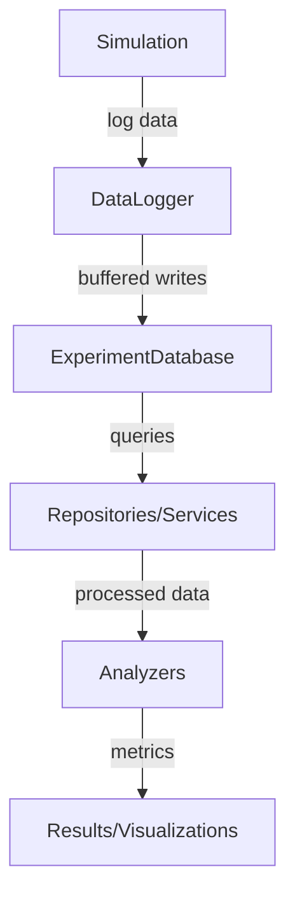
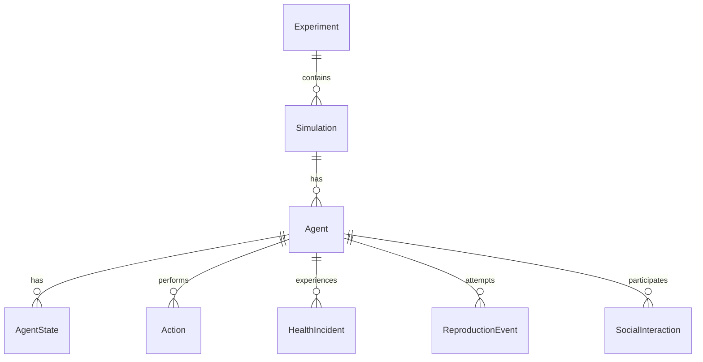

# Simulation Database Schema

This document describes the database schema used to store simulation data. The database uses SQLite with SQLAlchemy ORM and consists of multiple tables tracking different aspects of the simulation.

## Database Overview

### Hierarchy: Experiment → Simulation → Agent

The data model is structured hierarchically to support complex research workflows:

- **Experiment**: The top-level container that groups multiple related simulations. Represented by `ExperimentModel` in the database.
  - Contains metadata like name, description, hypothesis, status, variables, and results summary.
  - Relationships: One-to-many with Simulations.

- **Simulation**: A single run of the simulation environment. Represented by `Simulation` model.
  - Tagged with a unique `simulation_id`.
  - Contains configuration parameters, start/end times, and summary metrics.
  - Relationships: Many-to-one with Experiment; One-to-many with Agents, Actions, States, etc.

- **Agent**: Individual entities within a simulation. Represented by `AgentModel`.
  - Attributes: agent_id, birth/death time, type, position, resources, health, genome, generation.
  - Relationships: One-to-many with States, Actions, Health Incidents, Learning Experiences.

This hierarchy allows storing multiple simulations (with their agents and data) in a single database file via `ExperimentDatabase`, using `simulation_id` to differentiate data.

### Multi-Simulation Support

All tables include a `simulation_id` column to support storing multiple simulations in a single database:

- **simulation_id**: String(64) foreign key to `simulations.simulation_id`
- Enables filtering and querying across multiple simulations
- Supports experiment-level analysis and comparison

### Data Flow: From Logging to Analysis

Data moves through the system in a structured flow to ensure efficiency and reliability:

1. **Logging During Simulation**:
   - Simulations use `DataLogger` (or `ExperimentDataLogger` for multi-simulation) to record data.
   - Data is buffered in memory (e.g., action_buffer, learning_exp_buffer) to reduce database writes.
   - Buffers flush based on size (default 1000) or time interval (default 30s).
   - Transactions ensure atomicity; bulk inserts are used for performance.

2. **Storage**:
   - Core storage in SQLite via `SimulationDatabase` or `ExperimentDatabase`.
   - For multi-simulation: Data tagged with `simulation_id`.
   - Optional in-memory mode for faster operations, with persistence options.

3. **Retrieval and Analysis**:
   - Repositories (e.g., AgentRepository) provide query interfaces.
   - Services (e.g., ActionsService) add business logic.
   - Analyzers (e.g., in farm/database/analyzers/) process data into metrics like dominance, advantage.
   - DataRetriever handles population statistics and advanced queries.

**Performance Optimizations**:
- Buffered logging to minimize I/O.
- Indexes on key columns (e.g., agent_type, birth_time).
- Bulk operations and transaction management.
- In-memory database support for high-throughput scenarios.
- Query optimization in repositories.

### ExperimentDatabase Support

`ExperimentDatabase` extends `SimulationDatabase` to support storing multiple simulations in a single SQLite file.

- **Multi-Simulation Storage**:
  - Each simulation is assigned a unique `simulation_id`.
  - All data tables include `simulation_id` column for filtering.
  - Consistent schema across simulations.

- **Context Management**:
  - Use `create_simulation_context(simulation_id)` to get a `SimulationContext` object.
  - This context ensures all logging operations tag data with the correct `simulation_id`.
  - Acts as a simulation-specific view into the shared database.

- **Experiment vs. Simulation Data**:
  - Experiment-level: Metadata in `experiments` table.
  - Simulation-level: Per-simulation records in `simulations` table, plus tagged data in other tables.
  - Query across simulations by filtering on `simulation_id`.

### Architecture Diagrams

#### Data Flow Diagram



#### Repository Relationships



### Usage Patterns

#### Running Experiments with Multiple Simulations

```python
from farm.database.experiment_database import ExperimentDatabase
from farm.runners.experiment_runner import ExperimentRunner

db = ExperimentDatabase('experiment.db', 'exp_001')
context1 = db.create_simulation_context('sim_001')
# Run simulation 1 using context1.logger

context2 = db.create_simulation_context('sim_002')
# Run simulation 2 using context2.logger
```

#### Querying Cross-Simulation Data

```python
from sqlalchemy import create_engine
from sqlalchemy.orm import sessionmaker
from farm.database.models import AgentModel

engine = create_engine('sqlite:///experiment.db')
Session = sessionmaker(bind=engine)
with Session() as session:
    agents = session.query(AgentModel).filter(
        AgentModel.simulation_id.in_(['sim_001', 'sim_002']),
        AgentModel.agent_type == 'control'
    ).all()
```

## Tables Overview

### Experiments Table

Stores experiment-level metadata and groups related simulations.

| Column          | Type                   | Description                                         |
| --------------- | ---------------------- | --------------------------------------------------- |
| experiment_id   | STRING(64) PRIMARY KEY | Unique identifier for the experiment                |
| name            | STRING(255)            | Human-readable name of the experiment               |
| description     | STRING(4096)           | Detailed description of the experiment's purpose    |
| hypothesis      | STRING(2048)           | The research hypothesis being tested                |
| creation_date   | DATETIME               | When the experiment was created                     |
| last_updated    | DATETIME               | When the experiment was last modified               |
| status          | STRING(50)             | Current status (planned/running/completed/analyzed) |
| tags            | JSON                   | List of keywords/tags for categorization            |
| variables       | JSON                   | Dictionary of variables being manipulated           |
| results_summary | JSON                   | High-level findings from the experiment             |
| notes           | STRING(4096)           | Additional research notes or observations           |

### Simulations Table

Stores metadata about simulation runs.

| Column             | Type                   | Description                          |
| ------------------ | ---------------------- | ------------------------------------ |
| simulation_id      | STRING(64) PRIMARY KEY | Unique identifier for the simulation |
| experiment_id      | STRING(64)             | Reference to Experiments table       |
| start_time         | DATETIME               | When simulation started              |
| end_time           | DATETIME               | When simulation ended                |
| status             | STRING(50)             | Current simulation status            |
| parameters         | JSON                   | Simulation parameters                |
| results_summary    | JSON                   | Summary of results                   |
| simulation_db_path | STRING(255)            | Path to simulation database          |

### Agents Table

Stores metadata and lifecycle information for each agent.

| Column             | Type                   | Description                                       |
| ------------------ | ---------------------- | ------------------------------------------------- |
| simulation_id      | STRING(64)             | Reference to Simulations table                    |
| agent_id           | STRING(64) PRIMARY KEY | Unique identifier for each agent                  |
| birth_time         | INTEGER                | Simulation step when agent was created            |
| death_time         | INTEGER                | Simulation step when agent died (NULL if alive)   |
| agent_type         | STRING(50)             | Type of agent (system/independent/control)        |
| position_x         | FLOAT                  | Initial X coordinate                              |
| position_y         | FLOAT                  | Initial Y coordinate                              |
| initial_resources  | FLOAT                  | Starting resource amount                          |
| starting_health    | FLOAT                  | Starting health points                            |
| starvation_counter | INTEGER                | Counter for consecutive steps with zero resources |
| genome_id          | STRING(64)             | Unique identifier for agent's genome. Format: `parent1:parent2:counter` where counter >= 1. Examples: `::1` (first initial), `agent_a:1` (first clone), `agent_a:agent_b:1` (first sexual reproduction), `agent_a:agent_b:2` (second from same parents) |
| generation         | INTEGER                | Generation number in evolutionary lineage         |
| action_weights     | JSON                   | Dictionary of action names to their weights       |

### AgentStates Table

Tracks the state of each agent at each simulation step.

| Column         | Type                    | Description                              |
| -------------- | ----------------------- | ---------------------------------------- |
| simulation_id  | STRING(64)              | Reference to Simulations table           |
| id             | STRING(128) PRIMARY KEY | Unique identifier (agent_id-step_number) |
| step_number    | INTEGER                 | Simulation step number                   |
| agent_id       | STRING(64)              | Reference to Agents table                |
| position_x     | FLOAT                   | X coordinate                             |
| position_y     | FLOAT                   | Y coordinate                             |
| position_z     | FLOAT                   | Z coordinate                             |
| resource_level | FLOAT                   | Current resource amount                  |
| current_health | FLOAT                   | Current health points                    |
| is_defending   | BOOLEAN                 | Whether agent is in defensive stance     |
| total_reward   | FLOAT                   | Accumulated reward                       |
| age            | INTEGER                 | Agent's current age in steps             |

### ResourceStates Table

Tracks the state of resources at each simulation step.

| Column        | Type                | Description                        |
| ------------- | ------------------- | ---------------------------------- |
| simulation_id | STRING(64)          | Reference to Simulations table     |
| id            | INTEGER PRIMARY KEY | Unique identifier for state record |
| step_number   | INTEGER             | Simulation step number             |
| resource_id   | INTEGER             | Unique resource identifier         |
| amount        | FLOAT               | Current resource amount            |
| position_x    | FLOAT               | X coordinate                       |
| position_y    | FLOAT               | Y coordinate                       |

### SimulationSteps Table

Stores aggregate metrics for each simulation step.

| Column                        | Type       | Description                               |
| ----------------------------- | ---------- | ----------------------------------------- |
| simulation_id                 | STRING(64) | Reference to Simulations table            |
| step_number                   | INTEGER    | Simulation step number                    |
| total_agents                  | INTEGER    | Total number of alive agents              |
| system_agents                 | INTEGER    | Number of system agents                   |
| independent_agents            | INTEGER    | Number of independent agents              |
| control_agents                | INTEGER    | Number of control agents                  |
| total_resources               | FLOAT      | Total resources in environment            |
| average_agent_resources       | FLOAT      | Mean resources per agent                  |
| births                        | INTEGER    | New agents this step                      |
| deaths                        | INTEGER    | Agent deaths this step                    |
| current_max_generation        | INTEGER    | Highest generation number                 |
| resource_efficiency           | FLOAT      | Resource utilization (0-1)                |
| resource_distribution_entropy | FLOAT      | Measure of resource distribution evenness |
| average_agent_health          | FLOAT      | Mean health across agents                 |
| average_agent_age             | INTEGER    | Mean age of agents                        |
| average_reward                | FLOAT      | Mean reward accumulated                   |
| combat_encounters             | INTEGER    | Number of combat interactions             |
| successful_attacks            | INTEGER    | Number of successful attacks              |
| resources_shared              | FLOAT      | Amount of resources shared                |
| resources_shared_this_step    | FLOAT      | Resources shared in current step          |
| combat_encounters_this_step   | INTEGER    | Combat encounters in current step         |
| successful_attacks_this_step  | INTEGER    | Successful attacks in current step        |
| genetic_diversity             | FLOAT      | Measure of genome variety (0-1)           |
| dominant_genome_ratio         | FLOAT      | Prevalence of most common genome (0-1)    |
| resources_consumed            | FLOAT      | Total resources consumed                  |

### AgentActions Table

Records actions taken by agents during simulation.

| Column           | Type                | Description                      |
| ---------------- | ------------------- | -------------------------------- |
| simulation_id    | STRING(64)          | Reference to Simulations table   |
| action_id        | INTEGER PRIMARY KEY | Unique identifier for action     |
| step_number      | INTEGER             | When action occurred             |
| agent_id         | STRING(64)          | Agent that took action           |
| action_type      | STRING(20)          | Type of action taken             |
| action_target_id | STRING(64)          | Target of action (if any)        |
| reward           | FLOAT               | Reward received for action       |
| details          | STRING(1024)        | Additional action details        |

### LearningExperiences Table

Records learning experiences and outcomes.

| Column              | Type                | Description                       |
| ------------------- | ------------------- | --------------------------------- |
| simulation_id       | STRING(64)          | Reference to Simulations table    |
| experience_id       | INTEGER PRIMARY KEY | Unique identifier for experience  |
| step_number         | INTEGER             | When experience occurred          |
| agent_id            | STRING(64)          | Agent that had experience         |
| module_type         | STRING(50)          | Type of learning module           |
| module_id           | STRING(64)          | Identifier for specific module    |
| action_taken        | INTEGER             | Action index taken                |
| action_taken_mapped | STRING(20)          | Human-readable action description |
| reward              | FLOAT               | Reward received                   |

### HealthIncidents Table

Tracks changes in agent health status.

| Column        | Type                | Description                    |
| ------------- | ------------------- | ------------------------------ |
| simulation_id | STRING(64)          | Reference to Simulations table |
| incident_id   | INTEGER PRIMARY KEY | Unique identifier for incident |
| step_number   | INTEGER             | When incident occurred         |
| agent_id      | STRING(64)          | Affected agent                 |
| health_before | FLOAT               | Health before incident         |
| health_after  | FLOAT               | Health after incident          |
| cause         | STRING(50)          | Cause of health change         |
| details       | STRING(512)         | Additional incident details    |

### SimulationConfig Table

Stores simulation configuration data.

| Column        | Type                | Description                    |
| ------------- | ------------------- | ------------------------------ |
| simulation_id | STRING(64)          | Reference to Simulations table |
| config_id     | INTEGER PRIMARY KEY | Unique identifier for config   |
| timestamp     | INTEGER             | When config was created        |
| config_data   | STRING(4096)        | JSON configuration data        |

### ReproductionEvents Table

Records reproduction attempts and outcomes in the simulation.

| Column                      | Type                | Description                                    |
| --------------------------- | ------------------- | ---------------------------------------------- |
| simulation_id               | STRING(64)          | Reference to Simulations table                 |
| event_id                    | INTEGER PRIMARY KEY | Unique identifier for the reproduction event   |
| step_number                 | INTEGER             | Simulation step when the reproduction occurred |
| parent_id                   | STRING(64)          | ID of the agent attempting reproduction        |
| offspring_id                | STRING(64)          | ID of the created offspring (if successful)    |
| success                     | BOOLEAN             | Whether the reproduction attempt succeeded     |
| parent_resources_before     | FLOAT               | Parent's resource level before reproduction    |
| parent_resources_after      | FLOAT               | Parent's resource level after reproduction     |
| offspring_initial_resources | FLOAT               | Resources given to offspring (if successful)   |
| failure_reason              | STRING(255)         | Reason for failed reproduction attempt         |
| parent_generation           | INTEGER             | Generation number of parent agent              |
| offspring_generation        | INTEGER             | Generation number of offspring (if successful) |
| parent_position_x           | FLOAT               | X-coordinate where reproduction occurred       |
| parent_position_y           | FLOAT               | Y-coordinate where reproduction occurred       |
| timestamp                   | DATETIME            | When the event occurred                        |

### SocialInteractions Table

Records social interactions between agents in the simulation.

| Column                     | Type                | Description                                    |
| -------------------------- | ------------------- | ---------------------------------------------- |
| simulation_id              | STRING(64)          | Reference to Simulations table                 |
| interaction_id             | INTEGER PRIMARY KEY | Unique identifier for the social interaction   |
| step_number                | INTEGER             | Simulation step when the interaction occurred  |
| initiator_id               | STRING(64)          | ID of the agent that initiated the interaction |
| recipient_id               | STRING(64)          | ID of the agent that received the interaction  |
| interaction_type           | STRING(50)          | Type of social interaction                     |
| subtype                    | STRING(50)          | Specific subtype of the interaction            |
| outcome                    | STRING(50)          | Outcome of the interaction                     |
| resources_transferred      | FLOAT               | Amount of resources exchanged                  |
| distance                   | FLOAT               | Distance between agents during interaction     |
| initiator_resources_before | FLOAT               | Initiator's resource level before interaction  |
| initiator_resources_after  | FLOAT               | Initiator's resource level after interaction   |
| recipient_resources_before | FLOAT               | Recipient's resource level before interaction  |
| recipient_resources_after  | FLOAT               | Recipient's resource level after interaction   |
| group_id                   | STRING(64)          | Identifier for group/cluster behavior          |
| details                    | JSON                | Additional interaction-specific details        |
| timestamp                  | DATETIME            | When the interaction occurred                  |

## Relationships

- `Simulations.experiment_id` → `Experiments.experiment_id`: Links simulations to their experiment
- `AgentStates.agent_id` → `Agents.agent_id`: Links agent states to their agent records
- `AgentActions.agent_id` → `Agents.agent_id`: Links actions to agents
- `AgentActions.action_target_id` → `Agents.agent_id`: Links actions to target agents
- `AgentActions.state_before_id` → `AgentStates.id`: Links actions to prior state
- `AgentActions.state_after_id` → `AgentStates.id`: Links actions to resulting state
- `HealthIncidents.agent_id` → `Agents.agent_id`: Links health incidents to agents
- `LearningExperiences.agent_id` → `Agents.agent_id`: Links learning experiences to agents
- `ReproductionEvents.parent_id` → `Agents.agent_id`: Links reproduction events to parent agents
- `ReproductionEvents.offspring_id` → `Agents.agent_id`: Links reproduction events to offspring agents
- `SocialInteractions.initiator_id` → `Agents.agent_id`: Links social interactions to initiating agents
- `SocialInteractions.recipient_id` → `Agents.agent_id`: Links social interactions to recipient agents

## Indexes

The schema includes optimized indexes for common queries:

- Agents: agent_type, birth_time, death_time, simulation_id
- AgentStates: agent_id, step_number, simulation_id
- ResourceStates: step_number, resource_id, simulation_id
- AgentActions: step_number, agent_id, action_type, simulation_id
- LearningExperiences: step_number, agent_id, module_type, simulation_id
- HealthIncidents: step_number, agent_id, simulation_id
- ReproductionEvents: step_number, parent_id, success, simulation_id
- SocialInteractions: step_number, initiator_id, recipient_id, interaction_type, simulation_id

## Notes

- Uses SQLite as the backend database
- Implements foreign key constraints
- Includes indexes for performance optimization
- Supports concurrent access through session management
- Uses transaction safety with automatic rollback
- All tables include simulation_id for multi-simulation support
- Primary keys use appropriate data types (String for agent_id, Integer for auto-incrementing IDs)
