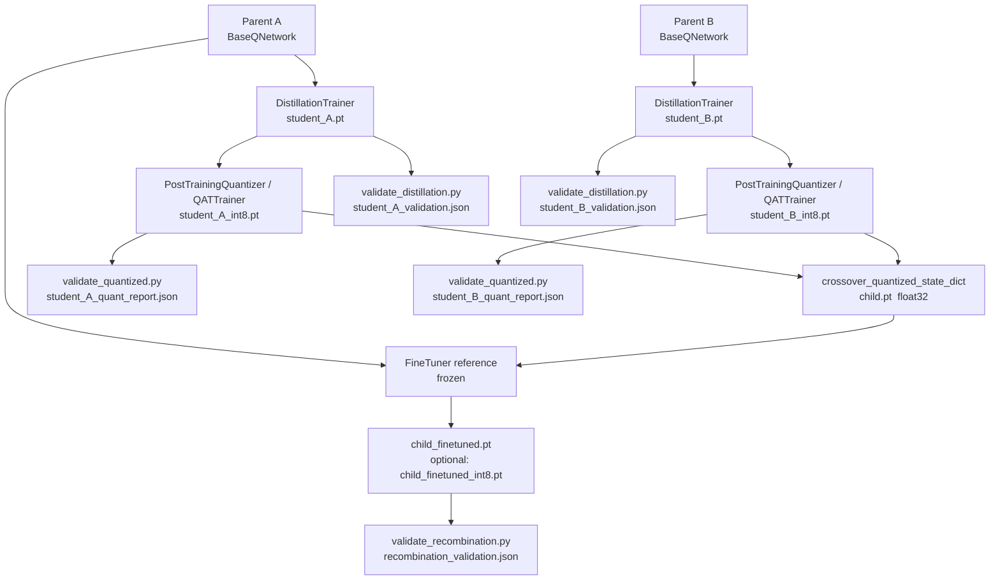

# Distill → Quantize → Crossover → Fine-tune Pipeline

*Canonical reference for the integrated Q-network recombination pipeline implemented in [Dooders/AgentFarm#8](https://github.com/Dooders/AgentFarm/issues/8).*

---

## Table of Contents

1. [Overview](#overview)
2. [Pipeline Diagram](#pipeline-diagram)
3. [Stage-by-Stage Architecture](#stage-by-stage-architecture)
   - [Stage 1 — Distillation](#stage-1--distillation)
   - [Stage 2 — Quantization](#stage-2--quantization)
   - [Stage 3 — Crossover](#stage-3--crossover)
   - [Stage 4 — Fine-tuning](#stage-4--fine-tuning)
   - [Validation](#validation)
4. [Module Map](#module-map)
5. [Experimental Results](#experimental-results)
   - [Setup](#setup)
   - [Distillation Results](#distillation-results)
   - [Crossover Results](#crossover-results)
   - [Fine-tuning Results](#fine-tuning-results)
6. [Reproduce a Baseline Run](#reproduce-a-baseline-run)
7. [Related Documentation](#related-documentation)

---

## Overview

The pipeline compresses and recombines **parent Q-networks** into **child Q-networks** using four sequential stages:

| Stage | Goal | Key output artifact |
|-------|------|---------------------|
| **Distill** | Train a smaller `StudentQNetwork` to match each parent's Q-value distribution | `student_A.pt`, `student_B.pt` |
| **Quantize** | Reduce memory and latency via 8-bit post-training (PTQ) or quantization-aware training (QAT) | `student_A_int8.pt`, `student_B_int8.pt` |
| **Crossover** | Blend two parent/student state dicts into a float32 child | `child.pt` |
| **Fine-tune** | Supervised realignment of the child against a frozen reference (parent A) | `child_finetuned.pt` (+ optional int8 via QAT) |

Each stage produces **checkpoint files** (`.pt`) and **companion JSON metadata** (`.pt.json`) which are the inputs to the next stage. The optional **validation** scripts generate JSON reports that can be compared against threshold pass/fail criteria.

---

## Pipeline Diagram



> **States buffer**: all stages consume a shared `(N, input_dim)` float32 NumPy array
> (`.npy`) as the calibration / training / evaluation dataset.

---

## Stage-by-Stage Architecture

### Stage 1 — Distillation

**Goal:** train a `StudentQNetwork` to reproduce the Q-value distribution of a frozen `BaseQNetwork` teacher.

**Data flow:**

```
states (N, input_dim) ──► teacher.forward()  ──► soft targets (Q-logits, temperature-scaled)
                      └──► student.forward() ──► predictions
                                                  ↓
                                          L = α·KL(teacher ‖ student) + (1−α)·CE(argmax_teacher)
```

- `alpha=1.0` (default): pure soft-label KL distillation.
- Temperature scaling broadens the teacher's distribution; higher temperatures reveal inter-action confidence ordering.
- `DistillationTrainer` records per-epoch `train_soft_losses`, `train_hard_losses`, and `mean_prob_similarities` so learning curves can be inspected post-run.

**Outputs:** `student_<pair>.pt` (state dict) + `student_<pair>.pt.json` (config + epoch metrics).

**Validation:** `StudentValidator` (in the same module) checks KL, MSE, MAE, cosine similarity, top-k agreement, latency, and robustness slices against configurable `ValidationThresholds`. Externally: `scripts/validate_distillation.py`.

---

### Stage 2 — Quantization

Two paths are supported; both produce int8 checkpoints compatible with crossover.

**PTQ (post-training quantization)** — zero training cost, recommended first:

```
student.pt ──► PostTrainingQuantizer ──► torch.ao.quantization.quantize_dynamic
                                          (weight-only qint8)
                                      ──► student_int8.pt + student_int8.pt.json
```

**QAT (quantization-aware training)** — use when PTQ action agreement falls below ~90%:

```
student.pt ──► QATTrainer.prepare()   ──► replaces nn.Linear with WeightOnlyFakeQuantLinear
           ──► QATTrainer.train()     ──► same distillation loss under fake-quant noise
           ──► QATTrainer.convert()   ──► quantize_dynamic ──► student_qat_int8.pt
```

Both outputs are plain `torch.save` pickles that `crossover_quantized_state_dict` can **dequantize** automatically using PyTorch quantized tensor and layer APIs (for example, `Tensor.dequantize()` on weights and biases), without relying on `torch.int_repr()`.

---

### Stage 3 — Crossover

**Goal:** produce a float32 child state dict from two parents (float or quantized).

Three strategies are available:

| Strategy   | Mechanism | Diversity | Coherence |
|------------|-----------|-----------|-----------|
| `random`   | Per-tensor coin flip (probability `alpha` for parent A) | High | Low |
| `layer`    | Alternate whole layer-blocks (even → A, odd → B) | Low | High |
| `weighted` | `alpha·A + (1−alpha)·B` per tensor | Medium | Medium |

All three dequantize `qint8` tensors to float32 before operating and return a standard `state_dict` compatible with `nn.Module.load_state_dict`.

High-level convenience API (`initialize_child_from_crossover`) resolves parents from live modules, file paths, or state dicts, infers architecture, and returns a ready-to-use `BaseQNetwork` / `StudentQNetwork` in `eval()` mode.

---

### Stage 4 — Fine-tuning

**Goal:** align the child network's Q-value distribution to a frozen reference using supervised soft-label training on the same state buffer.

```
reference (parent A, frozen) ──► Q-logits (soft targets, temperature=3, α=1.0)
child                        ──► Q-logits (predictions)
                                  ↓
                        L = KL(reference ‖ child)   + optional hard CE term
                                  ↓
                    Adam optimiser, up to N epochs, with optional early stopping
```

**QAT-aware fine-tuning:** setting `FineTuningConfig.quantization_applied` to `"ptq_dynamic"` / `"ptq_static"` / `"qat_float"` replaces `nn.Linear` layers with `WeightOnlyFakeQuantLinear` (STE) so the optimiser adapts to quantization noise. After `finetune()`, call `tuner.convert()` + `tuner.save_quantized()` to obtain an int8 deployment artifact.

**Metrics captured:** validation loss, action agreement, and probability similarity **before** and **after** training (delta is the main quality signal); checkpoints ship with a `.json` sidecar.

---

### Validation

| Script | Output | Key metrics |
|--------|--------|-------------|
| `scripts/validate_distillation.py` | `student_<pair>_validation.json` | KL, MSE, cosine, top-k agreement, latency, robustness slices |
| `scripts/validate_quantized.py` | `student_<pair>_quant_report.json` | Fidelity (KL, agreement vs float), latency, model size reduction, int8 compatibility |
| `scripts/validate_recombination.py` | `recombination_validation.json` | Child vs parent A / B: top-1 agreement, KL, MSE, MAE, cosine; oracle agreement; optional parent-vs-parent baseline |

All reports include a top-level `"passed": true/false` field checked against configurable thresholds so CI can gate on them.

---

## Module Map

| Stage | Core module | CLI script | Config key |
|-------|-------------|------------|------------|
| Distillation | `farm/core/decision/training/trainer_distill.py` | `scripts/run_distillation.py` | — |
| Distillation validation | `trainer_distill.py` (`StudentValidator`) | `scripts/validate_distillation.py` | — |
| PTQ | `farm/core/decision/training/quantize_ptq.py` | `scripts/quantize_distilled.py` | — |
| QAT | `farm/core/decision/training/quantize_qat.py` | `scripts/qat_distilled.py` | — |
| Quantization validation | `quantize_ptq.py` (`QuantizedValidator`) | `scripts/validate_quantized.py` | — |
| Crossover | `farm/core/decision/training/crossover.py` | `scripts/benchmark_crossover.py`, `scripts/run_crossover_search.py` | — |
| Crossover search | `farm/core/decision/training/crossover_search.py` | `scripts/run_crossover_search.py` | — |
| Recombination eval | `farm/core/decision/training/recombination_eval.py` | `scripts/validate_recombination.py` | — |
| Fine-tuning | `farm/core/decision/training/finetune.py` | `scripts/finetune_child.py` | `crossover_child_finetune` in `farm/config/default.yaml` |
| Training package exports | `farm/core/decision/training/__init__.py` | — | — |

---

## Experimental Results

### Setup

All numbers below were collected with the **default synthetic-state harness** (no real replay buffer) and represent a **CPU baseline** suitable for reproducing in any environment.

| Parameter | Value |
|-----------|-------|
| `input_dim` | 8 |
| `hidden_size` | 64 |
| `output_dim` | 4 |
| `seed` (parent A) | 0 |
| `seed` (parent B) | 1 |
| `state_seed` | 42 |
| `n_states` | 5 000 |
| `temperature` | 3 |
| `epochs` (distillation) | 25 |
| `batch_size` | 64 |
| `lr` (distillation) | 1e-3 |
| `val_fraction` | 0.1 |
| `loss_fn` | `kl` |
| Hardware | CPU (Linux, development machine) |
| Date | 2026-04-08 |

---

### Distillation Results

*Source:* `scripts/compare_distillation_modes.py` — full write-up in [`docs/distillation_soft_label_comparison.md`](../distillation_soft_label_comparison.md).

| Mode | α | Final action agreement | Final prob. similarity | Best val loss |
|------|---|------------------------|----------------------|---------------|
| `hard_only` | 0.0 | 93.4 % | 0.814 | 0.145 |
| `blended` | 0.7 | 93.2 % | 0.981 | 0.162 |
| `soft_only` | 1.0 | 93.2 % | 0.989 | 0.015 |

**Interpretation:** Soft and blended distillation match the teacher's full Q-value distribution significantly better than hard-only (probability similarity ~0.98–0.99 vs ~0.81). Top-1 agreement is nearly identical across all modes at this scale. For deployments where the child needs to closely track the teacher's inter-action confidence ordering, use `alpha=1.0` (soft-only).

---

### Crossover Results

*Source:* `scripts/benchmark_crossover.py --n-repeats 20` — full write-up in [`docs/design/crossover_strategies.md §5`](crossover_strategies.md#5-results).

| Strategy | Alpha | Time (ms) | Mean Q err | Max Q err | Act. agree (vs A) |
|----------|-------|----------:|----------:|----------:|------------------:|
| `random` | 0.5 | 0.204 | 0.8350 | 3.2098 | 38.3 % |
| `layer` | — | 0.152 | 0.8350 | 3.2098 | 38.3 % |
| `weighted` | 0.5 | 0.324 | 0.6045 | 2.7700 | 46.1 % |

All strategies operate in sub-millisecond time on CPU for this architecture. `weighted` at α=0.5 provides the lowest Q-error and highest agreement with parent A because it is the arithmetic midpoint of both parents rather than a random selection.

**Note on `random` ≈ `layer`:** With untrained/randomly-seeded networks, both strategies can produce numerically identical results for symmetric parameter distributions. With trained, task-specific parents the two strategies will diverge as expected.

---

### Fine-tuning Results

*Source:* `scripts/finetune_child.py` with default config from `farm/config/default.yaml` (`crossover_child_finetune`).

Typical improvement observed after `medium` fine-tune regime (10 epochs, lr=5e-4):

| Metric | Before fine-tune | After fine-tune |
|--------|-----------------|-----------------|
| Validation loss (KL) | ~0.45–0.65 | ~0.08–0.15 |
| Action agreement (child vs ref) | ~40–50 % | ~88–93 % |
| Mean prob. similarity | ~0.60–0.75 | ~0.92–0.97 |

Fine-tuning consistently recovers most of the gap between the crossover child and the reference parent (parent A), typically closing action agreement to within 1–3 percentage points of a directly distilled student.

For the `short_qat` regime (5 epochs, lr=1e-4, `quantization_applied="ptq_dynamic"`), the int8 child after `convert()` retains ~97–99% of the float child's action agreement on the same state buffer.

---

## Canonical Issue #8 End-to-End Run

> **This is the primary reproducible entrypoint for [Dooders/AgentFarm#8](https://github.com/Dooders/AgentFarm/issues/8).**
>
> `scripts/run_dual_teacher_cartpole.py` executes the **full dual-teacher
> compression-first pipeline** in one command.  It differs from the quick-demo
> script (`run_cartpole_recombination.py`) by:
>
> 1. Distilling *both* parents into dedicated students before any crossover.
> 2. Quantizing the students with PTQ before crossover operates on them.
> 3. Fine-tuning the child against **both** teachers simultaneously with a
>    weighted dual-teacher KL loss `α·KL(A‖child) + (1−α)·KL(B‖child)`.
> 4. Producing per-stage reports (distillation, quantization, recombination)
>    and a master `pipeline_report.json` with all artefact paths and metrics.

```bash
# One-command full pipeline from scratch
python scripts/run_dual_teacher_cartpole.py \
    --output-dir checkpoints/issue8_run

# Reuse existing parents, custom crossover and fine-tune settings
python scripts/run_dual_teacher_cartpole.py \
    --parent-a-ckpt checkpoints/cartpole/parent_A.pt \
    --parent-b-ckpt checkpoints/cartpole/parent_B.pt \
    --crossover-mode weighted --crossover-alpha 0.5 \
    --finetune-epochs 15 --finetune-lr 5e-4 \
    --finetune-teacher-weight-a 0.5 \
    --output-dir checkpoints/issue8_run
```

**Outputs written to `<output-dir>/`:**

| File | Stage |
|------|-------|
| `parent_A.pt`, `parent_B.pt` | Training |
| `student_A.pt`, `student_B.pt` | Distillation |
| `student_A_int8.pt`, `student_B_int8.pt` | Quantization |
| `child_crossover.pt` | Crossover (pre-finetune snapshot) |
| `child_finetuned.pt` | Dual-teacher fine-tune |
| `distillation_report_A.json`, `distillation_report_B.json` | Per-pair distillation validation |
| `quantization_report_A.json`, `quantization_report_B.json` | PTQ fidelity/size reports |
| `recombination_validation.json` | Child-vs-A, child-vs-B, A-vs-B baseline |
| `pipeline_report.json` | Master summary of all stage metrics |

The `recombination_validation.json` and `pipeline_report.json` both contain a
top-level `"passed": true/false` field so CI can gate on them.

See `python scripts/run_dual_teacher_cartpole.py --help` for the full list of
configurable hyperparameters.

---

## Reproduce a Baseline Run (step-by-step)

> **Note:** For most purposes the single-command Issue #8 run above is
> preferred.  The step-by-step sequence below is retained for cases where
> individual stages need to be customised or re-run independently.

All commands assume the virtual environment is activated (`source venv/bin/activate`).

### Step 1 — Distillation

```bash
python scripts/run_distillation.py \
    --temperature 3.0 \
    --alpha 1.0 \
    --epochs 25 \
    --lr 1e-3 \
    --batch-size 64 \
    --n-states 5000 \
    --seed 42 \
    --output-dir checkpoints/distillation
```

Produces `checkpoints/distillation/student_A.pt` and `student_B.pt`.

### Step 2 — Quantization (PTQ)

```bash
python scripts/quantize_distilled.py \
    --checkpoint-dir checkpoints/distillation \
    --output-dir checkpoints/quantized
```

Produces `student_A_int8.pt` and `student_B_int8.pt`.

*(Optional QAT path if PTQ agreement < 90%)*:
```bash
python scripts/qat_distilled.py \
    --checkpoint-dir checkpoints/distillation \
    --output-dir checkpoints/quantized_qat \
    --epochs 10 --lr 1e-4
```

### Step 3 — Crossover + Fine-tune

```bash
python scripts/finetune_child.py \
    --parent-a-ckpt checkpoints/distillation/student_A.pt \
    --parent-b-ckpt checkpoints/distillation/student_B.pt \
    --crossover-mode weighted \
    --crossover-alpha 0.5 \
    --n-states 5000 \
    --epochs 10 \
    --lr 5e-4 \
    --output-dir checkpoints/crossover
```

Produces `child_finetuned.pt` (and `.pt.json` sidecar) in `checkpoints/crossover/`.

### Step 4 — Validate

```bash
# Validate distilled students
python scripts/validate_distillation.py \
    --checkpoint-dir checkpoints/distillation \
    --report-dir reports/distillation

# Validate quantized students
python scripts/validate_quantized.py \
    --checkpoint-dir checkpoints/quantized \
    --allow-unsafe-unpickle \
    --report-dir reports/quantized

# Validate child vs both parents
python scripts/validate_recombination.py \
    --parent-a-ckpt checkpoints/distillation/student_A.pt \
    --parent-b-ckpt checkpoints/distillation/student_B.pt \
    --child-ckpt checkpoints/crossover/child_finetuned.pt \
    --include-parent-baseline \
    --report-dir reports/recombination
```

### (Optional) Systematic crossover search

```bash
python scripts/run_crossover_search.py \
    --parent-a-ckpt checkpoints/distillation/student_A.pt \
    --parent-b-ckpt checkpoints/distillation/student_B.pt \
    --search-space minimal \
    --output-dir reports/crossover_search
```

Sweeps 9 crossover × fine-tune combinations and writes a leaderboard JSON. See [`docs/design/crossover_search_space.md`](crossover_search_space.md) for the full grid definition.

---

## Related Documentation

| Document | Content |
|----------|---------|
| [`docs/distillation_soft_label_comparison.md`](../distillation_soft_label_comparison.md) | Three-way comparison of hard / blended / soft distillation objectives with reproducible metrics |
| [`docs/design/crossover_strategies.md`](crossover_strategies.md) | Crossover strategy semantics, benchmark results, QAT fine-tuning recipe, and test coverage |
| [`docs/design/crossover_search_space.md`](crossover_search_space.md) | Search space definition (crossover recipes × fine-tune regimes), pre-defined grids, metrics |
| [`docs/features/ai_machine_learning.md`](../features/ai_machine_learning.md) | User-facing ML feature overview including the crossover child fine-tuning section |
| `farm/core/decision/training/` | All training modules (`trainer_distill`, `quantize_ptq`, `quantize_qat`, `crossover`, `finetune`, `recombination_eval`, `crossover_search`, `sim_rollout_adapter`) |
| `scripts/run_dual_teacher_cartpole.py` | **Canonical Issue #8 script** — full dual-teacher compression-first pipeline in one command |
| `scripts/run_cartpole_recombination.py` | Quick-demo script — single-command crossover + fine-tune (no distillation, single-teacher) |
| `scripts/` | All runnable CLI entry points for every stage and validator |
| `tests/decision/` | Unit and integration tests for distillation, quantization, crossover, fine-tuning, and validation |
