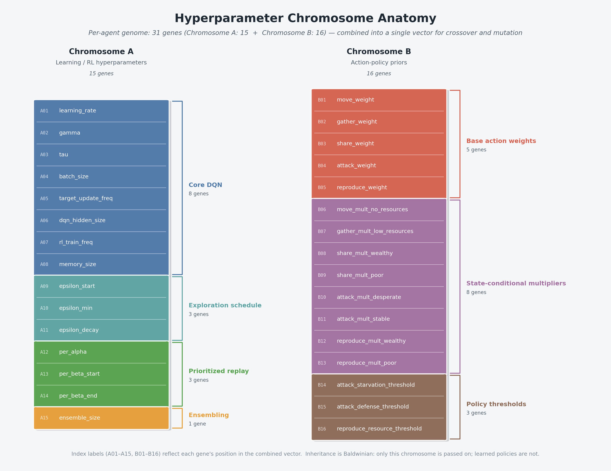
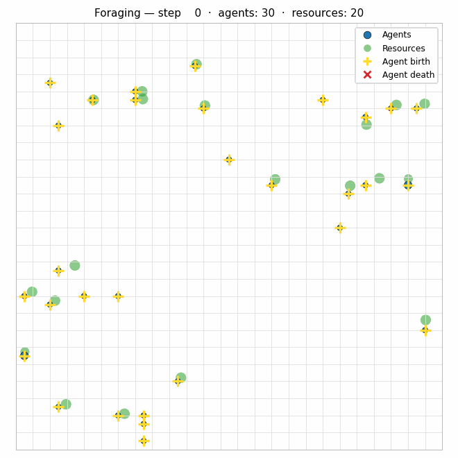

A recurring question in evolutionary computation and agent-based modeling is
simple: how much adaptive behavior can emerge under ecological constraints
like finite resources and costly reproduction, without a hand-crafted fitness
function or a predefined optimum to chase? This experiment is a small step
toward answering that: each agent carries its own
[hyperparameter chromosome](../design/hyperparameter_chromosome.md),
offspring inherit it (with optional mutation and crossover), and selection is
whatever the resource environment happens to apply.

This isn't meant as a claim of open-ended evolution - it's a bounded
simulation in which evolutionary dynamics are layered on top of
[reinforcement learning](../deep_q_learning.md) agents that have to feed
themselves to stay alive.

## What's evolving

Each agent owns a `HyperparameterChromosome` built from its decision config at
construction time. The schema (documented in
[Hyperparameter Chromosome Design](../design/hyperparameter_chromosome.md))
is currently two logical chromosomes that are crossed and mutated as a single
gene vector:

**Chromosome A - learning / RL hyperparameters.** Knobs that shape *how* the
agent learns during its lifetime:

**Chromosome B - action-policy priors.** Knobs that shape *what* the agent is
biased toward doing before learning kicks in:



Integer-valued genes (`memory_size`, `batch_size`, `target_update_freq`,
`dqn_hidden_size`, `rl_train_freq`, `ensemble_size`) are stored as real values
on the chromosome and rounded with a bounds check when projected back into the
decision config.

None of these genes directly encode behavior. Chromosome A shapes the learning
dynamics, Chromosome B shapes the prior over action choice; the learned policy
itself is not part of the genome.

## Inheritance, mutation, and crossover

When an agent reproduces, the child's chromosome is derived from the parent's:

- **Default path:** asexual - deep-copy the parent chromosome and apply
per-gene mutation.
- **Crossover enabled:** sexual - pick a co-parent, combine the two
chromosomes (`SINGLE_POINT`, `UNIFORM`, `BLEND`, or `MULTI_POINT`), then
mutate.

The resulting chromosome is written back into the child's decision config
before its `DecisionModule` is constructed, so the offspring starts life with
the inherited learning priors already baked in.

## Selection through ecology, not a fitness function

There is no explicit selection operator in the simulation loop. Selection is
emergent and ecological:

- **Finite resources.** Resource nodes deplete as agents gather from them.
- **Metabolic cost.** Every step debits a base consumption rate from the
agent's resource pool.
- **Starvation.** After a configurable number of zero-resource steps, the
agent terminates.
- **Costly reproduction.** Reproduction requires meeting an offspring-cost
threshold, which is paid out of the parent's resources.

Lineages whose hyperparameters happen to produce agents that forage well
enough to cover both metabolism and reproduction persist. Lineages that don't,
die out. That's the whole selection story.

## Foraging

Agents have an explicit `gather` action: locate the nearest resource node
within range via the
[spatial index](../spatial/spatial_indexing.md), consume from it, and credit
the agent's resource pool. Foraging is one of the actions the RL policy
chooses among, so the evolved learning hyperparameters and the foraging
behavior are coupled through the decision module.



The GIF above is a 50x50 world rendered from a sample run; you can regenerate
it (or render any other simulation) with
[`scripts/make_foraging_gif.py`](../../scripts/make_foraging_gif.py):

```bash
python scripts/make_foraging_gif.py \
    --db-path docs/sample/simulation.db \
    --output docs/devlog/figures/foraging-grid.gif \
    --max-steps 1000 --step-stride 6 --fps 12
```

## Learning during life - Baldwinian, not Lamarckian

Within an agent's lifetime, a `DecisionModule` driven by RL updates from
experience. At reproduction time, however, only the **hyperparameter
chromosome** is passed on; the offspring builds a fresh decision module. No
Q-values, weights, or replay buffers cross the generational boundary.

That makes the system
Baldwinian: evolution tunes the *priors* and *learning
dynamics* (how fast to learn, how much to discount the future, how aggressively
to explore), and each generation has to acquire its own experience inside
those priors.

## Scope and limits of this experiment

**It is:**

- A per-agent hyperparameter genome with mutation and optional crossover.
- An ecological selection regime driven by resource scarcity and
reproduction costs.
- RL agents whose learning hyperparameters are themselves under selection.

**It isn't (yet):**

- Open-ended evolution in the ALife sense - runs are bounded simulations.
- A genome that encodes full behavior or network architecture - only a  
narrow set of hyperparameters evolve through this path.
- Lamarckian inheritance by default - the baseline keeps cold-start offspring
  policies. (An opt-in `lamarckian` mode that warm-starts offspring policy
  weights was since added under #849, but it is not the default and showed no
  robust fitness gain; see the
  [Baldwinian vs Lamarckian A/B](../experiments/intrinsic_evolution/inheritance_mode_ab.md).)

## Current state and next questions

Current capabilities in this line of work:

- The intrinsic runner supports explicit initial-conditions profiles,
  selection-pressure controls, and per-step telemetry, so ecology can be varied
  systematically instead of ad hoc.
- Speciation and lineage tracking are part of the standard analysis outputs,
  including snapshot-based cluster traces and lineage-tree analysis.
- Cross-run profile comparisons (for example,
  conservative/balanced/buffered resource buffers) are part of the workflow,
  not one-off side analysis.
- The chromosome/reproduction path is documented and parameterized in the
  [Intrinsic evolution docs](../experiments/intrinsic_evolution/intrinsic_evolution.md)
  and [Hyperparameter chromosome design](../design/hyperparameter_chromosome.md).

Open questions and next targets:

- ~~[Run broader multi-seed cohorts per profile and treat trends as distributions,
  not single trajectories.](https://github.com/Dooders/AgentFarm/issues/847)~~
  **Done (2026-05-12):** a 6-seed × 3-profile sweep
  (`scripts/run_stable_profile_seed_sweep.py` +
  `scripts/analyze_stable_profile_seed_sweep.py`, PR #863) now aggregates
  per-profile distributions with mean/variance/95% CI and a
  robust-vs-seed-sensitive classification. See
  [When one seed disagrees with six](2026-05-12-seed-sweep-reality-check.md).
- [Push farther on inherited payload design (policy priors/module state) to test
  when richer inheritance helps versus overfits to local ecology.](https://github.com/Dooders/AgentFarm/issues/848)
  **Re-derived from first principles (2026-06-15):** since the full-policy
  warm-start (#849) turned out to be a fitness null and within-life learning
  is near-null at the default horizon (#878), the payload plan is no longer
  "copy more of the network." See
  [Inherited payload design](../design/inherited_payload_design.md) for the
  weights-plus-continuation-machinery variant ladder (P0–P4) and the
  signal-budget precondition.
- [Add explicit Baldwinian-vs-Lamarckian A/B runs under matched settings to
  quantify when warm-starting offspring is worth the stability trade-off.](https://github.com/Dooders/AgentFarm/issues/849)

The practical focus is no longer whether the mechanism exists, but which
inheritance/ecology combinations produce robust gains across runs.

## Related docs

- [Glossary](../glossary.md)
- [Hyperparameter chromosome design](../design/hyperparameter_chromosome.md)
- [Intrinsic evolution experiment docs](../experiments/intrinsic_evolution/intrinsic_evolution.md)
- [Resource-buffer follow-up devlog](2026-05-04-resource-buffer-shapes-intrinsic-evolution.md)
