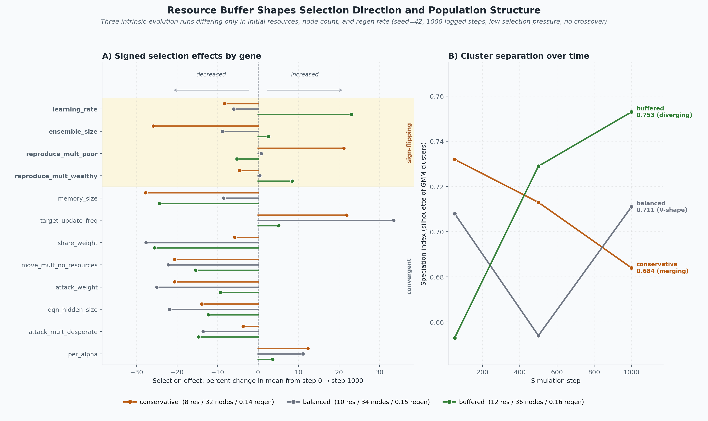
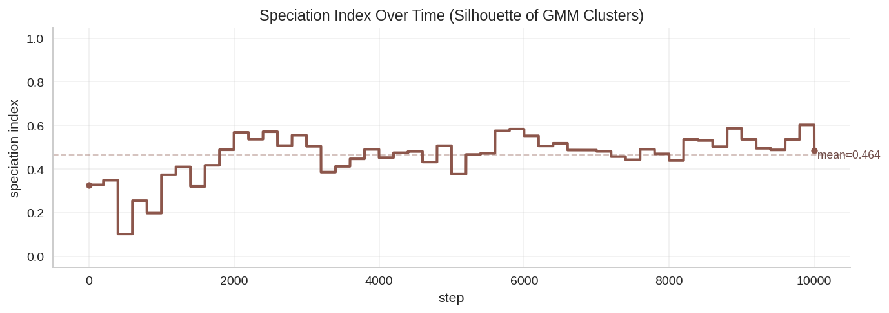
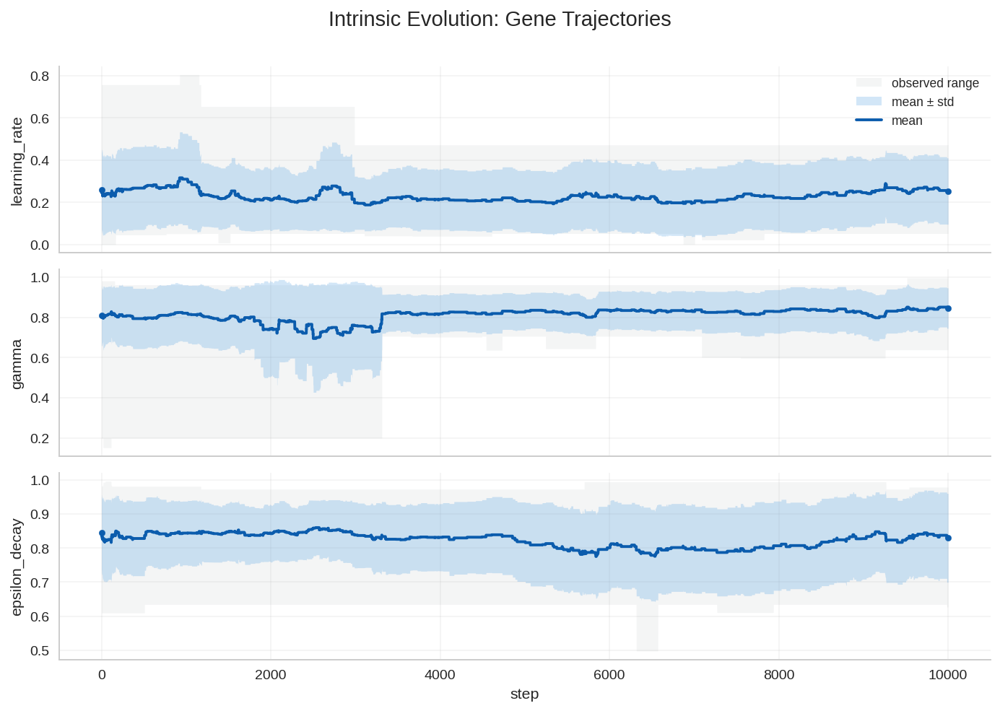
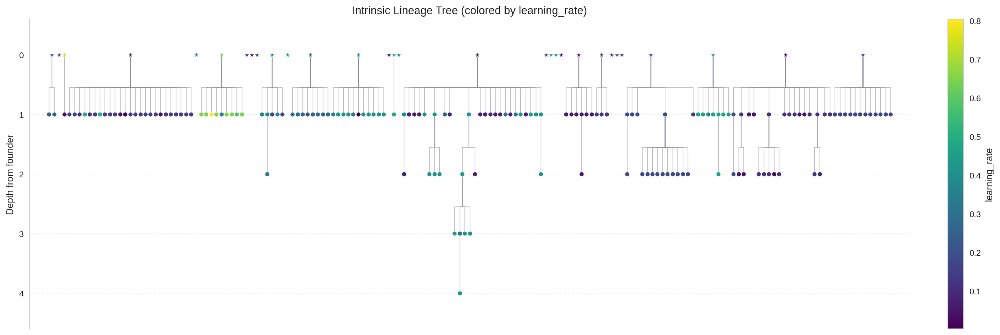

> **Update (2026-05-12):** A 6-seed-per-profile follow-up revisited these
> claims. The robust signal is that speciation diverges across all three
> profiles; the single-seed `learning_rate`/`ensemble_size` direction-flip
> findings were not robust under replication. See
> [When one seed disagrees with six](2026-05-12-seed-sweep-reality-check.md).

A natural follow-up to the [hyperparameter genome experiments](2026-04-23-evolving-hyperparameter-genomes-foraging-learning-agents.md)
is whether the *amount* of food in the world changes *what* gets selected,
not just how many agents survive. So I ran the
[intrinsic-evolution runner](../experiments/intrinsic_evolution/intrinsic_evolution.md)
three times with everything held fixed except the `stable` initial-conditions
profile — small adjustments to the starting resource pool, count, and regen
rate — and compared the outputs.

Short answer: yes, and in more interesting ways than I expected. The
direction of selection on most ecological/behavioural genes is shared
across all three regimes, but a few core knobs (notably `learning_rate`
and `ensemble_size`) flip sign with the buffer. The cluster structure of
the population does the same: under abundant food clusters keep separating,
under tight food they merge.

The raw numbers and side-by-side tables live in
[stable profile comparison](../experiments/intrinsic_evolution/stable_profile_comparison.md).
This post is the narrative.

## What was held fixed, what changed

Every run is 1,000 logged steps after a 200-step warmup, single seed (42),  
30 founders seeded by independent mutation, mutation rate 0.15 / scale 0.10,  
crossover off, GMM  
[speciation](../glossary.md#speciation) tracking, and `selection_pressure="low"` (a
small density-dependent reproduction cost, no global carrying-cap term).

The only thing that varies is the resource buffer:

| Variant      | Initial resources / agent | Resource nodes | Regen rate |
| ------------ | ------------------------- | -------------- | ---------- |
| conservative | 8                         | 32             | 0.14       |
| balanced     | 10                        | 34             | 0.15       |
| buffered     | 12                        | 36             | 0.16       |

The deltas are small on purpose. I wanted to see how sensitive the
selection signal is to a modest change in food, not crash one of the
simulations.

## The three profiles, in numbers

After the 200-step warmup, the populations look very different. After 1000
more steps, they look much more alike:

| Variant      | Post-warmup pop | Peak | Mean  | Final | Final speciation idx |
| ------------ | --------------- | ---- | ----- | ----- | -------------------- |
| conservative | 135             | 137  | 87.8  | 88    | 0.684                |
| balanced     | 100             | 120  | 96.4  | 92    | 0.711                |
| buffered     | 165             | 171  | 111.1 | 99    | 0.753                |

So the resource buffer mostly stretches the *transient*. By the end, all
three are in the 88–99 range. What it does *not* equalise is the genome
each run ends up with.

## Where the genes agreed

Across all three runs the population drifts in the same direction on the
behavioural and ecological knobs. Cheaper, less aggressive, less social,
less wandery, smaller networks, and a small but consistent shift toward
more prioritised replay and slower target-network syncing:

- `attack_weight` and `share_weight` both fall — by 9–28% depending on
variant. Aggression and altruism are both expensive when there is no
explicit signal that either one pays off.
- `move_mult_no_resources` falls 15–22% in all three. Wandering when
hungry doesn't survive selection.
- `memory_size` falls 8–28% and `dqn_hidden_size` falls 12–22%. Smaller
brains beat bigger brains when the rest of the policy is fixed and
reproduction is what matters.
- `per_alpha` rises 4–12% and `target_update_freq` rises 5–34%. Both are
consistent with selection for more stable, less-thrashy learning.

This is the most robust pattern in the comparison: it shows up regardless
of how much food the world has. With low selection pressure and no
crossover, agents drift toward the cheapest viable behavioural profile.

## Where they disagreed

The fun part. A handful of genes flip direction by buffer:

| Gene                     | conservative | balanced | buffered   |
| ------------------------ | ------------ | -------- | ---------- |
| `learning_rate`          | -8.3%        | -6.0%    | **+23.1%** |
| `ensemble_size`          | **-25.9%**   | -8.8%    | +2.6%      |
| `reproduce_mult_wealthy` | -4.6%        | +0.4%    | **+8.4%**  |
| `reproduce_mult_poor`    | **+21.2%**   | +0.8%    | -5.2%      |

`learning_rate` is the clearest one. With more food the population selects
*for* faster learners (+23% in buffered); with less food it selects for
slower, more conservative updates (-8% in conservative). Balanced sits in
between. There seems to be a real gradient: how aggressive the learning
prior should be depends on how much slack the environment offers a
mistake.

`ensemble_size` is the most striking single-locus shift in the comparison.
Conservative chops it by 26%, balanced trims it slightly, buffered does
nothing. A "compress the brain when starvation gets close" signature.

The reproduce multipliers tell a coherent story too. Buffered evolves
*selective* reproduction — breed when wealthy, hold off when poor.
Conservative evolves *opportunistic* reproduction — when food is short,
the survivors are the ones who reproduce whenever they can, especially
when poor.

## Reading the speciation traces

The speciation index is a silhouette score on chromosome-space clusters (see
[intrinsic evolution docs](../experiments/intrinsic_evolution/intrinsic_evolution.md)).
Higher means clusters are better separated. Plotting it over time tells
you whether the population is splitting into niches or collapsing back
toward one type. The three runs all start in the 0.65–0.73 range and
diverge:

- Conservative: 0.732 → 0.713 → 0.684 — monotonically declining.
Clusters merge.
- Balanced: 0.708 → 0.654 → 0.711 — V-shape. The population briefly
consolidates and then re-splits.
- Buffered: 0.653 → 0.729 → 0.753 — monotonically rising. Clusters
separate further over time.

Resource buffer not only sets *what* evolves on average, it sets *how
much* the population can afford to spread out in chromosome space. With
abundant food, sub-populations have room to drift apart from each other.
With tight food, the survivors look more and more alike.

## Lineage trees

All three runs hit the same maximum lineage depth of 3 (great-grandchildren
make it to the final snapshot), but the breadth differs. Buffered keeps
the most founders alive at the end (18 of 30), conservative and balanced
both keep 15. Conservative has the flattest tree (mean depth 1.011), which
together with the falling speciation index suggests a population mostly
made up of "founders who never became grandparents".

## What this is and isn't

This is a single-seed comparison across three closely-spaced resource
regimes. The qualitative pattern — convergent selection on cheapness,
direction flips on `learning_rate` and `ensemble_size`, and a clean
buffer-vs-speciation trend — is consistent across all three points,
which is more informative than three runs at the same setting would
be. But every individual number here should be replicated across seeds
before getting too attached to it.

It's also a low-selection-pressure regime. With a stiffer
`selection_pressure="medium"` or `"high"`, the convergent shifts on the
ecological genes would probably be sharper, and the buffer-dependent
splits might either amplify or wash out. I haven't tested that yet.

## What's next

A few obvious follow-ups:

- [A small seed sweep per profile (4-8 seeds) to bracket the
  speciation-trajectory direction and the `learning_rate` shift.](https://github.com/Dooders/AgentFarm/issues/843)
- [Longer conservative runs to see if the falling speciation index
  resolves into a single dominant cluster or stabilises around k=2.](https://github.com/Dooders/AgentFarm/issues/844)
- [Re-run buffered with crossover enabled, to test whether gene flow
  collapses the rising speciation pattern or leaves it intact.](https://github.com/Dooders/AgentFarm/issues/845)
- [Add `stress` and `legacy` profiles to widen the buffer axis.](https://github.com/Dooders/AgentFarm/issues/846)

For the full numerical results, side-by-side tables, and per-variant
artifact links, see
[stable profile comparison](../experiments/intrinsic_evolution/stable_profile_comparison.md).

## Related docs

- [Glossary](../glossary.md)
- [Intrinsic evolution experiment docs](../experiments/intrinsic_evolution/intrinsic_evolution.md)
- [Hyperparameter chromosome design](../design/hyperparameter_chromosome.md)
- [Hyperparameter genome devlog](2026-04-23-evolving-hyperparameter-genomes-foraging-learning-agents.md)
