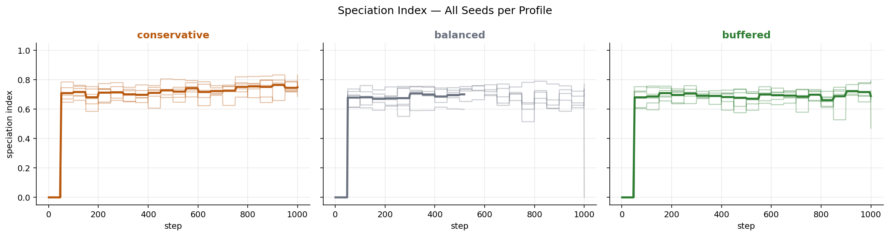
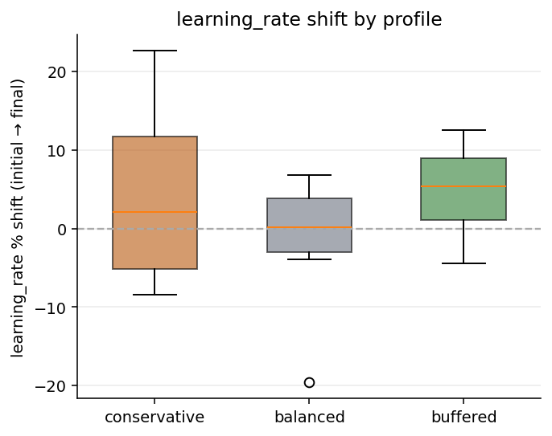
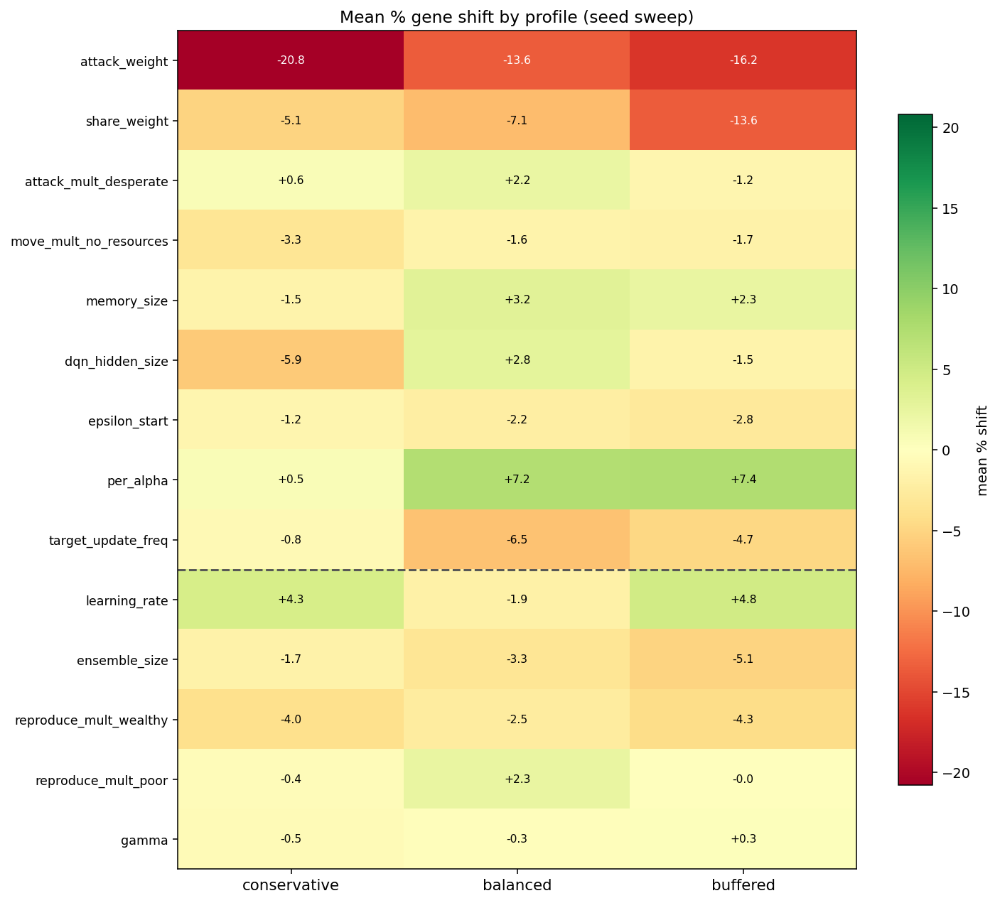

A week ago I posted
[Does the resource buffer pick the genes?](2026-05-04-resource-buffer-shapes-intrinsic-evolution.md),
a three-way comparison of intrinsic-evolution runs at conservative, balanced,
and buffered resource levels. It made three concrete claims off a single
seed: the speciation trajectory direction *flipped* with the buffer
(merging under conservative, V-shaped under balanced, diverging under
buffered), `learning_rate` *flipped* sign with the buffer (negative at low
food, positive at high food), and `ensemble_size` did the same.

I then re-ran the comparison with 6 seeds per profile — 18 runs total — to
see which of those numbers were the experiment talking and which were the
seed talking. The answer is mostly: the seed was talking. Most of the
flip claims do not survive replication. One qualitative pattern survives
strongly, and a few magnitude trends survive weakly. This post is the
walk-through, and the methods lesson is at the end.

## Setup

Three sub-profiles of the `stable` initial-conditions preset
(`conservative`, `balanced`, `buffered`), 6 seeds each
(`[42, 7, 19, 101, 137, 256]`), 1000 logged steps after a 200-step warmup.
Everything else is held the same as the
[05-04 comparison](2026-05-04-resource-buffer-shapes-intrinsic-evolution.md):
30 founders seeded by independent mutation, mutation rate 0.15 / scale
0.10, crossover off, GMM speciation tracking, `selection_pressure="low"`.

Runner: `scripts/run_stable_profile_seed_sweep.py`.
Analyzer: `scripts/analyze_stable_profile_seed_sweep.py`.
Aggregated outputs: `experiments/stable_profile_sweep/aggregate/`.

## What survived

**Speciation always diverges.** All 18 runs come out classified as
`diverging` (positive slope on the speciation index over time), and the
direction agreement is 1.00 within every profile. That is the strongest
single result in the sweep.

| Profile      | Mean final speciation | 95% CI         | Slope / 100 steps |
| ------------ | --------------------- | -------------- | ----------------- |
| conservative | 0.748                 | [0.697, 0.800] | 0.0258            |
| balanced     | 0.590                 | [0.280, 0.899] | 0.0239            |
| buffered     | 0.689                 | [0.565, 0.812] | 0.0200            |

**Population scales monotonically with the buffer**, as expected:
conservative 84 / balanced 96 / buffered 108 mean. The resource knob is
doing what it should do at the ecological level.

**A handful of per-gene shifts have consistent sign across all three
profiles**, even though the strict ≥75% within-profile sign-agreement
test calls every gene "seed-sensitive". The most striking ones:

| Gene                  | conservative | balanced | buffered | Note                       |
| --------------------- | -----------: | -------: | -------: | -------------------------- |
| `attack_weight`       |       −20.8% |   −13.6% |   −16.2% | Negative in every run      |
| `attack_mult_stable`  |       −17.3% |   −17.1% |   −17.1% | Remarkably consistent mag. |
| `share_weight`        |        −5.1% |    −7.1% |   −13.6% | Negative; gradient by buf. |
| `per_alpha`           |        +0.5% |    +7.2% |    +7.4% | Positive everywhere        |
| `epsilon_start`       |        −1.2% |    −2.2% |    −2.8% | Small, monotonic           |

The robust qualitative story from the original post — "agents drift away
from aggression and altruism, toward more stable learning" — still
holds at the population-mean level. What does not hold is the buffer
flipping any of these directions.

## What didn't survive

**The speciation-trajectory split.** The 05-04 post had
`conservative → merging`, `balanced → V-shape`, `buffered → diverging`.
With six seeds per profile that split disappears: every profile's modal
direction is `diverging`, and the per-profile slopes are all positive
and within a factor of ~1.3 of each other.

**The `learning_rate` flip.** This was the headline gene-level claim of
the original post. The single-seed run had:

| Profile      | learning_rate shift (single seed, 05-04) |
| ------------ | ---------------------------------------- |
| conservative | −8.3%                                    |
| balanced     | −6.0%                                    |
| buffered     | **+23.1%**                               |

The six-seed sweep gives:

| Profile      | Mean % shift | 95% CI            | Sign agreement |
| ------------ | -----------: | ----------------- | -------------- |
| conservative |         +4.3 | [−8.41, +17.03]   | 0.00           |
| balanced     |         −1.9 | [−11.81, +8.05]   | 0.00           |
| buffered     |         +4.8 | [−1.79, +11.34]   | 0.67           |

Every 95% CI straddles zero. Within each profile the seeds disagree
about whether the shift is positive or negative at almost a coin-flip
rate. The +23% in the original buffered run is the high tail of a
distribution centred near +5%, not a structural property of the regime.

**The `ensemble_size` flip.** Original numbers were `−25.9 / −8.8 / +2.6`.
Six-seed means are `−1.7 / −3.3 / −5.1`, all with CIs straddling zero
and 0.00 sign agreement on conservative. Direction is roughly
*consistent* across profiles (slight negative) but with no real flip,
and the −26% single-seed value was an outlier.

**The `reproduce_mult_wealthy` / `reproduce_mult_poor` flips.** Both
collapse into low-magnitude shifts within noise (means ranging from
−4.3% to +2.3%), no robust sign-flip pattern.

The gene-shift heatmap below shows the full picture. Cells that looked
clean and oppositely-signed in the single-seed comparison go closer to
zero and lose direction once you average over six seeds:

## What partially survived

The strict ≥75% within-profile sign-agreement threshold classifies all
31 genes as "seed-sensitive". That's harsh and a bit misleading.
Several genes show clear and consistent direction across profiles but
have a couple of contrarian seeds, which is enough to flunk the strict
test:

- `attack_weight`, `share_weight`: negative mean in every profile, and
  buffered's `attack_weight` CI excludes zero.
- `attack_mult_stable`: same mean (~−17%) in all three profiles, with
  large per-seed variance.
- `per_alpha`: positive in every profile, with the lower CI bound above
  zero for both `balanced` and `buffered`.

So "this gene moves the same way regardless of how much food the world
has" is a real pattern. "This gene flips direction depending on how
much food the world has" largely is not.

## A non-obvious twist

The post's intuition was "more food → more room in chromosome space →
higher speciation". The sweep says the opposite, mildly:

- conservative: 0.748 mean final speciation
- balanced: 0.590
- buffered: 0.689

Conservative is the *highest* and tightest (CI `[0.697, 0.800]`),
buffered is moderate, and balanced is both the lowest mean and the
most variable (CI `[0.280, 0.899]`). The balanced profile sits in
between conservative and buffered in resource level but is not in
between them in outcome variance — it's a wider distribution than
either neighbour. That asymmetry is worth its own follow-up; my guess
is that "balanced" sits near a tipping point between two failure
modes, but I don't have evidence yet.

## The methods lesson

Which kinds of claims got falsified and which survived divides
cleanly:

- **Qualitative directional claims that aggregate over many runs**
  ("speciation diverges", "agents shed aggression", "population
  scales with food") held up.
- **Per-locus magnitude claims off a single seed** ("`learning_rate`
  drops 8% under conservative", "`ensemble_size` is chopped by 26%")
  did not. They were the noisy tail of a centred-near-zero distribution.
- **Direction-flip claims off a single seed** ("low food selects
  against X, high food selects for X") are the most fragile kind.
  All four of those from the prior post collapsed.

The rule-of-thumb I'm internalising is: report a *direction* and a
*rough magnitude* from a single seed, but never report a *flip*
between regimes before running ≥5 seeds at each regime. Flips look
like they carry the most signal per word, so they're the most
tempting to write up; but they're also the easiest to manufacture
by accident with one seed at each setting.

The thing the 05-04 post got right structurally is harder to see now:
the qualitative behavioural shift (less aggression, less altruism,
more stable learning) was visible in three single-seed runs and
survives at six seeds each, which is genuine information. The thing
it got wrong was treating *between-regime differences* in those gene
shifts as signal when the *within-regime variance* across seeds was
larger than the between-regime mean differences.

## Implications

For this project, the biggest implication is a change in what counts as
"enough evidence" for a claim.

- Treat multi-seed agreement as the baseline for directional claims.
  Especially for "X flips across conditions" statements, assume fragility
  until replication says otherwise.
- Treat profile effects as distribution shifts, not deterministic signs.
  In this sweep, the buffer changes means and variances clearly, but not
  the sign of most gene shifts.
- Keep uncertainty in the headline, not just in appendix tables. Means,
  CIs, and sign-agreement should travel together in the narrative.
- Prioritise mechanism tests over rerunning old single-seed stories.
  The productive next questions are long-horizon behavior, crossover/gene-flow
  effects, and why `balanced` is a high-variance regime.

In short: publish fewer flip claims, publish more replicated patterns.

## What's next

Revising the four follow-ups at the end of the 05-04 post in light of
the sweep:

- The "small seed sweep per profile" item is now done.
- Longer conservative runs are still worth doing, but the motivation
  changes. It's no longer "does the conservative cluster merge?" —
  it doesn't, all three profiles diverge. The new question is whether
  the rising speciation index in conservative continues to climb, or
  plateaus near the current 0.75.
  ([Issue #867](https://github.com/Dooders/AgentFarm/issues/867).)
- Crossover-on rerun of buffered remains open and now extra
  interesting: if speciation diverges *without* gene flow, does
  gene flow knock it back down?
  ([Issue #845](https://github.com/Dooders/AgentFarm/issues/845).)
- Widening the buffer axis to include `stress` and `legacy` profiles
  is still on the list, but should be multi-seed from the start.
  ([Issue #846](https://github.com/Dooders/AgentFarm/issues/846).)

One new follow-up I'd add: dig into why `balanced` is the
high-variance profile. The natural prediction was a monotonic
relationship between buffer level and outcome variance; the data
shows a peak in the middle instead.

For the raw aggregate numbers, see
`experiments/stable_profile_sweep/aggregate/seed_sweep_summary.md`
and `seed_sweep_summary.json`.

## Related docs

- [Prior devlog: does the resource buffer pick the genes?](2026-05-04-resource-buffer-shapes-intrinsic-evolution.md)
- [Glossary](../glossary.md)
- [Intrinsic evolution experiment docs](../experiments/intrinsic_evolution/intrinsic_evolution.md)
- [Hyperparameter chromosome design](../design/hyperparameter_chromosome.md)
- [Hyperparameter genome devlog](2026-04-23-evolving-hyperparameter-genomes-foraging-learning-agents.md)
