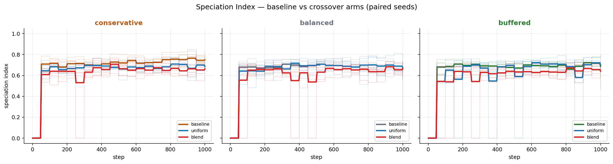

The [05-12 seed sweep](2026-05-12-seed-sweep-reality-check.md) gave a clean baseline:
with crossover off, speciation trajectories diverged across conservative,
balanced, and buffered resource profiles. The obvious mechanism question was
whether that divergence was mostly an artifact of mutation-only inheritance.
If we add gene flow, do clusters collapse?

I re-ran the same 6-seed matrix with crossover enabled and compared each run
against its no-crossover counterpart by profile and seed.

Short answer: **it depends on the profile**. Gene flow robustly homogenizes
conservative runs, does not robustly collapse buffered runs, and stays noisy in
balanced runs.

## Setup

Two crossover arms, each paired against the existing no-crossover baseline:

- `uniform`: per-gene coin-flip recombination
- `blend`: BLX-alpha interpolation (`alpha=0.5`)

Shared setup:

- profiles: `conservative`, `balanced`, `buffered`
- seeds: `[42, 7, 19, 101, 137, 256]`
- logged steps: 1000 (after 200-step warmup)
- selection pressure: `low`
- speciation tracking: GMM, max k = 4
- database mode: **disk-backed SQLite** (`--disk-database`)

Commands and full artifact paths live in
[crossover_rerun.md](../experiments/intrinsic_evolution/crossover_rerun.md).

## The headline result

| Profile | uniform | blend |
| --- | --- | --- |
| conservative | **robustly collapses** | **robustly collapses** |
| balanced | no robust effect | no robust effect |
| buffered | no robust effect | no robust effect |

Verdict rule is the same one used in analysis scripts: paired delta on
`speciation_final` or `speciation_slope` with 95% CI excluding zero and at
least 75% within-profile sign agreement.

## What changes by profile

### Conservative: crossover homogenizes

This is the biggest surprise in the rerun. Against no-crossover baseline:

- `uniform` final speciation delta: `-0.063` (95% CI excludes zero, 6/6 negative)
- `blend` final speciation delta: `-0.086` (95% CI excludes zero, 6/6 negative)

These runs still classify as `diverging` in direction, but they diverge to a
lower separation level than the baseline. In other words, crossover does not
invert trajectory direction here; it compresses endpoint separation.

### Buffered (#845): trajectory survives gene flow

Issue [#845](https://github.com/Dooders/AgentFarm/issues/845) asked whether
gene flow collapses the buffered "rising speciation" pattern.

Across all six seeds, buffered trajectories are still `diverging` under both
arms. Paired deltas on final speciation and slope are not robustly negative.

| Metric | Baseline | uniform | blend |
| --- | --- | --- | --- |
| Mean final speciation | 0.689 | 0.698 | 0.641 |
| Mean slope (/100 steps) | 0.020 | 0.027 | 0.026 |
| Direction agreement | diverging (6/6) | diverging (6/6) | diverging (6/6) |

Blend does lower mean speciation over the run, but not enough to qualify as a
robust collapse on the final-index or slope criteria.

### Balanced: still the high-variance middle

Balanced remains the least stable profile in this line of experiments.
Neither arm produces a robust paired shift in final speciation or slope. This
matches the earlier "balanced is unusually variable" pattern from 05-12.

## What this says about the mechanism

The buffer seems to control how much recombination can homogenize lineages:

- under tighter-resource conservative conditions, crossover compresses cluster separation;
- under buffered conditions, crossover mixes genes but does not erase the
  diverging trajectory pattern;
- balanced remains near a regime boundary where variance dominates.

So the updated claim is stronger and cleaner than the original single-seed
story: **resource profile does not just shape selection outcomes; it shapes the
strength of gene-flow homogenization itself.**

## Caveats

- This remains a low-selection-pressure regime (`selection_pressure="low"`).
- Metrics answer trajectory and endpoint questions, not causality at the
  behavioral-policy level.
- Several per-gene shifts (including `learning_rate`) remain seed-sensitive.

## What's next

- Long-horizon conservative sweeps (Issue
  [#867](https://github.com/Dooders/AgentFarm/issues/867)):
  does crossover compression persist or saturate over 3k-5k steps?
- Wider profile axis with `stress` and `legacy` (Issue
  [#846](https://github.com/Dooders/AgentFarm/issues/846)).
- Follow-up on why `balanced` is the variance peak.

## Related docs

- [When one seed disagrees with six](2026-05-12-seed-sweep-reality-check.md)
- [Does the resource buffer pick the genes?](2026-05-04-resource-buffer-shapes-intrinsic-evolution.md)
- [Crossover rerun experiment doc](../experiments/intrinsic_evolution/crossover_rerun.md)
- [Intrinsic evolution docs](../experiments/intrinsic_evolution/intrinsic_evolution.md)
