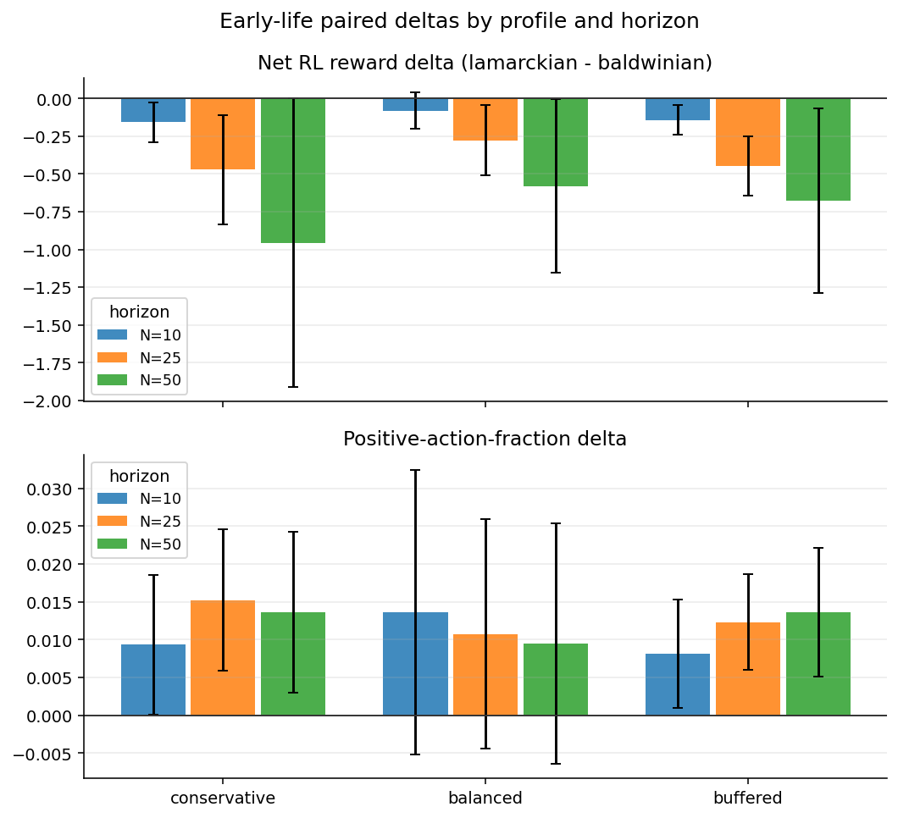
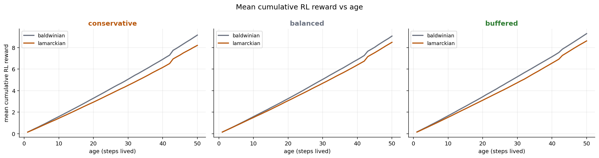
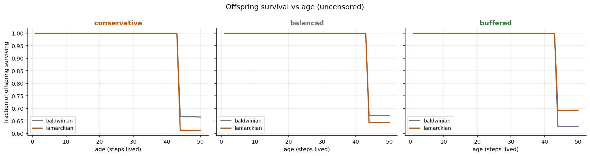

The [05-21 inheritance A/B](2026-05-21-baldwinian-vs-lamarckian-ab-harness.md)
left a sharp open question. Lamarckian policy warm-start fired for ~85% of
reproduction events, yet whole-population summaries (population, speciation)
did not move robustly in any profile. One honest reading was that we were
measuring at the wrong level: population and speciation are emergent,
high-variance summaries, and any effect of inheriting a parent's policy should
show up *most strongly right after birth*, before ecology washes it out.

This post tests that directly. It reuses the same 36-run dataset, but instead
of whole-population readouts it scores each offspring over its first *N* steps
of life. The answer is a clean negative: **at the newborn level there are two
small, robust behavioral shifts under warm-start, but neither is a fitness
gain — and they don't even point the same way.** "Measuring at the wrong level"
does not rescue Lamarckian.

## Two reward channels (don't conflate them)

This sim logs two unrelated reward signals, and keeping them separate is the
whole point of this post:

- **RL reward** (`agent_states.total_reward`): the per-step signal the decision
  module trains on, `resource_delta + 0.5*health_delta + survival_bonus` (see
  [reward.py](../../farm/core/agent/components/reward.py)). This is the
  fitness-relevant "did the agent get richer/healthier/stay alive" channel.
- **Per-action module reward** (`agent_actions.reward`): a separate per-action
  value that is nearly constant (~0.135 for ~89% of actions), with a minority
  of larger positives and some negatives. The only thing it supports here is a
  coarse "positive-action fraction" — how often an early action returned a
  positive value rather than a penalty.

An earlier draft of this post told a "more hits, smaller hits" story linking
these two. That was wrong: they are different channels and shouldn't be put in
a single causal chain. The corrected reading treats them as two independent
readouts, below.

## What we measured

For every offspring (an agent born after the 200-step warmup) across both
arms, scored at three horizons *N* ∈ {10, 25, 50} steps of life:

| Readout | Source | Definition |
| --- | --- | --- |
| survival to age N | `agents` | fraction of (uncensored) offspring alive at age N |
| net RL reward at age N | `agent_states.total_reward` | accumulated RL reward at age N |
| positive-action fraction | `agent_actions.reward` | fraction of actions in the first N steps with `reward > 0` |
| resource level at age N | `agent_states.resource_level` | instantaneous resources at age N |
| parent RL-reward gap | lineage + `total_reward` | `\|offspring − parent\|` RL reward over the same wall-clock window |

Cohorts are the two **arms**: Lamarckian offspring (~85% warm-started: 0.852 /
0.849 / 0.849 for conservative / balanced / buffered) vs Baldwinian offspring
(cold start by design). A true per-offspring "applied vs skipped" split isn't
recoverable from the stored artifacts — only aggregate warm-start counts are
logged — so this is an arm-level comparison.

The parent-anchored readout is enabled by a small data-spelunking win:
`agents.genome_id` is formatted `"<parent_agent_id>:<counter>"`, so every
offspring links back to its parent (100% linkage in every run) without a
dedicated parent column.

Paired deltas (`lamarckian − baldwinian`) are computed per (profile, seed) and
gated with the same rule used elsewhere in this project: **95% CI excludes
zero AND within-profile sign agreement ≥ 75%.**

Runner: `scripts/analyze_early_life_fitness.py`.
Figures: `scripts/plot_early_life_fitness.py`.
Outputs: `experiments/inheritance_ab/early_life/`.

## Headline result

Two small, robust shifts, pointing in opposite directions, neither a fitness
gain:

- **Net early RL reward is lower under Lamarckian.** The paired delta is
  negative in all 9 profile×horizon cells, and robustly so for balanced (N=25:
  Δ −0.277, CI [−0.511, −0.042], 6/6 seeds) and buffered (N=25: Δ −0.449, CI
  [−0.645, −0.252], 6/6). This is the fitness-relevant channel, and it moves
  the *wrong* way for the warm-start arm.

- **Positive-action fraction is slightly higher under Lamarckian** — about
  +1.0 to +1.5 percentage points. Robust in conservative (N=25: Δ +0.015,
  N=50: Δ +0.014) and buffered (N=25: Δ +0.012, N=50: Δ +0.014), each 6/6.
  Because actions are either positive or negative here (no zeros), this is
  equivalent to **slightly fewer negative-reward actions**. It is not a reward
  *magnitude* gain — most positive actions return the same ~0.135 — so it does
  not translate into more accumulated RL reward.

- **Survival, resource level, and the parent RL-reward gap don't move.**
  Survival is identical until offspring start dying around age ~42 (a
  population-wide attrition cliff, not an arm effect); resource level and the
  parent gap are flat and CI-wide everywhere.



The two panels are measuring different things: the top (RL reward) is uniformly
below zero, the bottom (positive-action fraction) is uniformly above it.

The RL-reward gap shows up as a small, persistent offset rather than a
crossover — the Baldwinian trace sits just above the Lamarckian one and the two
stay roughly parallel as offspring age:



And survival is unaffected: both arms track each other until the same
attrition cliff:



## How to read this

The 05-21 post raised the possibility that whole-population summaries were
simply too coarse to see a real Lamarckian advantage. This analysis does not
support that escape hatch:

1. **Warm-start does change newborn behavior.** Offspring take slightly fewer
   negative-reward actions early on. Arms are genuinely different at the
   action-selection layer for newborns, not just on paper.

2. **But it is not a head start.** The fitness-relevant RL reward is, if
   anything, slightly *lower*, and resources and survival don't move. Inheriting
   a parent's policy reshapes how a newborn acts without making it better off in
   its first 50 steps.

3. **So the verdict from 05-21 holds, for the right reason.** It isn't that the
   effect hides below population-level noise; the newborn-level effects exist
   but are tiny and don't favor warm-start on the channel that matters.

Practical takeaway, unchanged: **keep Baldwinian as the default.**

## Caveats

- **Conditional on survival.** Net RL reward, resource level, and the parent
  gap at age N are computed over offspring that *reached* age N. At N=50 that's
  ~60-70% of (uncensored) offspring. Survival deltas are small and non-robust,
  so the two arms condition on similarly sized subpopulations, but these are
  survivor estimates, not whole-cohort ones.
- **The two headline metrics are measured on different cohorts.** Net RL reward
  is survivor-conditioned (above), but positive-action fraction spans every
  offspring that took an action in its first N steps — including those that died
  before N. The runner records both cohort sizes (`n_reached` vs `n_acted`) for
  transparency. Because survival barely moves before the age-~42 cliff the two
  cohorts are close in size, but the "reward down, positive-actions up" framing
  is two readouts on overlapping-but-not-identical populations, not one
  population measured two ways.
- **Coarse action signal.** Because ~89% of action rewards are the same value,
  "positive-action fraction" is a blunt instrument; treat the +1.5pp as a
  directional behavioral nudge, not a precise effect size.
- **No multiple-comparison correction.** This runs 5 metrics × 3 profiles × 3
  horizons = 45 paired tests at n=6. The trustworthy signal is the *direction*
  (RL reward negative in 9/9 cells; positive-action fraction up in 9/9);
  individual "robust" cells are weak on their own.

## What shipped (analysis)

- `scripts/analyze_early_life_fitness.py` — per-offspring early-life scoring
  from the run databases, paired deltas, and the same robustness gate as the
  other inheritance scripts (genome-id parent linkage, right-censoring at the
  simulation horizon, the two reward channels kept separate).
- `scripts/plot_early_life_fitness.py` — the three figures above.

To reproduce:

```bash
python scripts/analyze_early_life_fitness.py \
  --ab-dir experiments/inheritance_ab

python scripts/plot_early_life_fitness.py \
  --summary experiments/inheritance_ab/early_life/early_life_summary.json
```

## Open questions

- **What drives the lower RL reward?** Net RL reward is resource/health-delta
  driven; a per-step decomposition (resource vs health vs survival bonus) would
  show whether warm-started offspring spend down resources faster early or
  simply gather less.
- **True applied vs skipped split.** This stays an arm-level comparison
  because warm-start status isn't logged per offspring. Adding that telemetry
  and re-running would isolate the ~15% cold-start fallbacks from the
  warm-started majority.
- **Richer inherited payloads (#848).** If a bare policy copy reshapes behavior
  without a payoff, does inheriting optimizer state or replay buffer contents
  change the early-life picture?

## Related docs

- [Baldwinian vs Lamarckian: policy warm-start across three resource regimes](2026-05-21-baldwinian-vs-lamarckian-ab-harness.md)
- [Is the DQN actually learning?](2026-05-16-is-the-dqn-actually-learning.md)
- [Inheritance A/B experiment doc](../experiments/intrinsic_evolution/inheritance_mode_ab.md)
