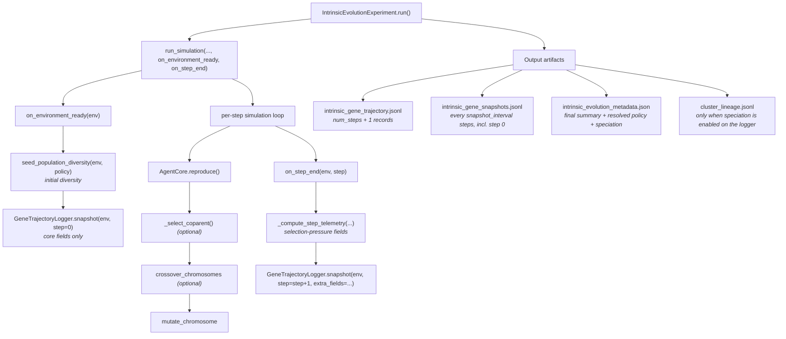

# Intrinsic Evolution Experiment

The intrinsic evolution experiment treats hyperparameter selection as an
*emergent* property of a single simulation. Each agent carries its own
`HyperparameterChromosome`; offspring inherit it, optionally crossed with a
co-parent and mutated; selection happens implicitly because agents must
survive and reproduce in the shared resource environment.

The runner answers questions like:

> *How does the learning-rate (or any other hyperparameter) distribution
> evolve under intra-population competition?*

### Executive summary

This experiment studies how a population's learning settings change over time
inside one shared world. Each individual starts with its own settings, and
successful individuals tend to pass those settings on with small variations. As
conditions shift, the population adapts: some strategies spread, others fade,
and sometimes multiple strategies coexist. Instead of choosing settings through
separate trial runs, this approach lets adaptation happen continuously during
the simulation, then records both overall trends and family-line detail so you
can see not just what changed, but how it changed.

## Overview

Think of this experiment as watching a population learn *how to learn* while
they are busy trying to survive. Instead of deciding one perfect setting in
advance (for example, one fixed learning speed for everyone), each individual
starts with its own settings. As the simulation runs, individuals that cope
better with the environment tend to leave more descendants, and those
descendants inherit similar settings with small changes. Over time, the mix of
settings in the population shifts naturally.

The key idea is that there is no separate outside judge scoring each setting in
isolation. The environment itself is the judge. Food availability, crowding,
competition, timing, and chance all combine to determine which individuals
survive long enough to reproduce. Because everyone is competing at once, a
strategy that works well in one moment may stop working later if the population
or resource situation changes.

At the start of a run, the experiment intentionally introduces variety so the  
population is not a clone army. That early diversity gives evolution something  
to work with. During reproduction, offspring usually resemble their parent, but  
they can also pick up blended traits from a second nearby parent (if that  
option is enabled). Small random variation keeps new possibilities entering the  
population instead of locking into one policy too early.

As the simulation advances, the experiment records two useful views:

- A **timeline view** that summarizes the population at every step (for
example, average and spread of important settings).
- A **snapshot view** that periodically saves individual-level details so you
can trace family lines and see which trait combinations persisted.

By combining these, you can answer both "What happened overall?" and "Which
lineages drove that change?".

The experiment also supports stronger or weaker competitive pressure. In plain
language, this means you can increase how costly it is to reproduce in crowded
conditions, making differences between individuals matter more. When pressure is
higher, weak strategies are filtered out faster; when pressure is lower, more
variation can coexist for longer.

One important caveat: success is always partly contextual. A lineage may rise
because of favorable location or timing, not only because its inherited
settings are universally better. For that reason, conclusions should come from
multiple runs and trends across runs, not a single dramatic trajectory.

When used well, this experiment is a practical way to study adaptation in
realistic, changing conditions. It shows whether one dominant style emerges, or
whether multiple viable styles can coexist as niches form in the same
environment.

## Architecture




The trajectory file always contains `num_steps + 1` records: one for the
initial state (written from `on_environment_ready`) and one for each
completed simulation step. The initial step-0 record carries only the
core aggregate fields; selection-pressure telemetry is added from step 1
onward (see [Telemetry](#telemetry)).

## When to use

Reach for the intrinsic runner when you care about:

- **Frequency-dependent dynamics.** The "best" learning rate may depend on
what other agents are doing — something a monoculture evaluation cannot
surface.
- **Non-stationarity.** Resource depletion or population shifts can change
the optimal hyperparameters mid-run; an in-situ GA tracks that.
- **Cost.** One simulation instead of `generations x population_size`
separate simulations for a comparable amount of selection pressure.
- **Biological realism.** The environment itself becomes the fitness
function rather than a human-chosen scalar.

## Reproduction contract

`AgentCore.reproduce()` only applies crossover/mutation when an enabled
`IntrinsicEvolutionPolicy` is attached to the environment:

- When `environment.intrinsic_evolution_policy` is `None` or disabled,
children inherit the parent's chromosome unchanged.
- When the policy is attached and enabled (as the
`IntrinsicEvolutionExperiment` runner does), reproduction runs optional
crossover with a co-parent, then mutation, using the policy's knobs.

## Components


| Module                                                                                                   | Purpose                                                                                                                                                                                                   |
| -------------------------------------------------------------------------------------------------------- | --------------------------------------------------------------------------------------------------------------------------------------------------------------------------------------------------------- |
| `[farm/runners/intrinsic_evolution_experiment.py](../../farm/runners/intrinsic_evolution_experiment.py)` | `IntrinsicEvolutionPolicy`, `IntrinsicEvolutionExperimentConfig`, `IntrinsicEvolutionResult`, `seed_population_diversity()`, `IntrinsicEvolutionExperiment`                                               |
| `[farm/runners/gene_trajectory_logger.py](../../farm/runners/gene_trajectory_logger.py)`                 | `GeneTrajectoryLogger`: writes per-step aggregates, periodic full snapshots, and (when `enable_speciation=True`) a cached `speciation_index` on every trajectory line plus a `cluster_lineage.jsonl` file |
| `[farm/core/agent/core.py](../../farm/core/agent/core.py)`                                               | `AgentCore._derive_child_chromosome` and `_select_coparent` (called from `reproduce`)                                                                                                                     |
| `[farm/core/simulation.py](../../farm/core/simulation.py)`                                               | `run_simulation(..., on_environment_ready, on_step_end)` callback hooks the runner uses                                                                                                                   |
| `[farm/analysis/speciation/](../../farm/analysis/speciation/)`                                           | `detect_clusters_gmm`, `detect_clusters_dbscan`, `match_clusters_greedy`, `compute_speciation_index`, `compute_niche_correlation`, `plot_chromosome_space_clusters`                                       |


## Quick start

```python
from farm.config import SimulationConfig
from farm.core.hyperparameter_chromosome import (
    BoundaryMode,
    CrossoverMode,
    MutationMode,
)
from farm.runners.intrinsic_evolution_experiment import (
    IntrinsicEvolutionExperiment,
    IntrinsicEvolutionExperimentConfig,
    IntrinsicEvolutionPolicy,
)

base_config = SimulationConfig.from_centralized_config(environment="development")

policy = IntrinsicEvolutionPolicy(
    enabled=True,
    seed_initial_diversity=True,
    seed_mutation_rate=1.0,
    seed_mutation_scale=0.2,
    mutation_rate=0.1,
    mutation_scale=0.1,
    mutation_mode=MutationMode.GAUSSIAN,
    boundary_mode=BoundaryMode.CLAMP,
    crossover_enabled=True,
    crossover_mode=CrossoverMode.UNIFORM,
    coparent_strategy="nearest_alive_same_type",
    coparent_max_radius=10.0,
)

config = IntrinsicEvolutionExperimentConfig(
    num_steps=2000,
    snapshot_interval=100,
    policy=policy,
    output_dir="experiments/intrinsic_evolution_smoke",
    seed=42,
)

result = IntrinsicEvolutionExperiment(base_config, config).run()
print(f"Final population: {result.final_population}")
print(f"Final mean LR: {result.final_gene_statistics['learning_rate']['mean']}")
```

## `IntrinsicEvolutionPolicy` reference


| Field                    | Default                        | Meaning                                                                                                                                                          |
| ------------------------ | ------------------------------ | ---------------------------------------------------------------------------------------------------------------------------------------------------------------- |
| `enabled`                | `True`                         | Master switch. When `False`, reproduction inherits chromosomes unchanged.                                                                                        |
| `seed_initial_diversity` | `True`                         | Mutate every initial agent's chromosome once before the loop starts so the starting population is not a monoculture.                                             |
| `seed_mutation_rate`     | `1.0`                          | Per-gene mutation probability for the seed pass.                                                                                                                 |
| `seed_mutation_scale`    | `0.2`                          | Per-gene scale for the seed pass. Larger spreads the population further.                                                                                         |
| `mutation_rate`          | `0.1`                          | Per-gene mutation probability at each reproduction event.                                                                                                        |
| `mutation_scale`         | `0.1`                          | Per-gene scale at each reproduction event.                                                                                                                       |
| `mutation_mode`          | `MutationMode.GAUSSIAN`        | `gaussian` or `multiplicative`. See `[HyperparameterChromosome` docs](../design/hyperparameter_chromosome.md).                                                   |
| `boundary_mode`          | `BoundaryMode.CLAMP`           | `clamp`, `reflect`, or `interior_biased`. Controls out-of-bounds handling after mutation.                                                                        |
| `interior_bias_fraction` | `1e-3`                         | Used only when `boundary_mode = interior_biased`.                                                                                                                |
| `crossover_enabled`      | `False`                        | When `True`, pick a co-parent and run `crossover_chromosomes` before mutation.                                                                                   |
| `crossover_mode`         | `CrossoverMode.UNIFORM`        | Crossover operator (`single_point`, `uniform`, `blend`, `multi_point`).                                                                                          |
| `blend_alpha`            | `0.5`                          | BLX-alpha extent for blend crossover.                                                                                                                            |
| `num_crossover_points`   | `2`                            | Pivot count for multi-point crossover.                                                                                                                           |
| `coparent_strategy`      | `"nearest_alive_same_type"`    | Either `nearest_alive_same_type` or `random_alive_same_type`. When `allow_cross_type_pollination` is `False` (default), both filter to alive agents of the same `agent_type`; when `True`, all alive agents are eligible. |
| `coparent_max_radius`    | `None`                         | Optional spatial cap on the co-parent search; `None` is unbounded.                                                                                               |
| `allow_cross_type_pollination` | `False`                  | When `True`, co-parent candidates may come from any `agent_type`, enabling cross-type gene flow. When `False` (default), only same-type agents are eligible.      |
| `seed`                   | `None`                         | Optional RNG seed. Falls back to `IntrinsicEvolutionExperimentConfig.seed`.                                                                                      |
| `selection_pressure`     | `None`                         | Convenience knob for density-dependent cost. Accepts `"none"`, `"low"`, `"medium"`, `"high"` or a float in *[0, 1]*. Overrides `reproduction_pressure` when set. |
| `reproduction_pressure`  | `ReproductionPressureConfig()` | Fine-grained density-dependent cost config (all zero by default). Ignored when `selection_pressure` is set.                                                      |


If no eligible co-parent exists when crossover is enabled, reproduction
silently falls back to mutation-only inheritance. This is the only way
crossover can become asexual at runtime; everything else is policy-driven.

## `IntrinsicEvolutionExperimentConfig` reference


| Field               | Default                      | Meaning                                                                                                                                          |
| ------------------- | ---------------------------- | ------------------------------------------------------------------------------------------------------------------------------------------------ |
| `num_steps`         | `2000`                       | Length of the simulation.                                                                                                                        |
| `snapshot_interval` | `100`                        | Cadence of full per-agent chromosome snapshots. Per-step aggregates are always recorded.                                                         |
| `policy`            | `IntrinsicEvolutionPolicy()` | See above.                                                                                                                                       |
| `output_dir`        | `None`                       | When set, the runner writes JSONL trajectory and metadata files here (and forwards `path=output_dir` to `run_simulation` for its own artifacts). |
| `seed`              | `None`                       | Top-level RNG seed propagated to `run_simulation` and the policy if the policy seed is unset.                                                    |


## Output artifacts

When `output_dir` is set, three new files are written alongside whatever
`run_simulation` produces (config, database, etc.). A fourth file
(`cluster_lineage.jsonl`) is added when speciation is enabled on the
underlying `GeneTrajectoryLogger` (see
[Speciation and niche detection](#speciation-and-niche-detection)).

### `intrinsic_gene_trajectory.jsonl`

One record per logged step. The runner writes `num_steps + 1` total
lines: a step-0 line from `on_environment_ready`, then one line after
each completed simulation step. Compact and safe to write at every step.

The step-0 record contains only the core aggregate fields. From step 1
onward the runner also merges in selection-pressure
[Telemetry](#telemetry) fields, and (if speciation is enabled on the
logger) every record additionally carries a cached `speciation_index`.

```json
{
  "step": 0,
  "n_alive": 30,
  "n_with_chromosome": 30,
  "gene_stats": {
    "learning_rate": {
      "mean": 0.012,
      "median": 0.011,
      "std": 0.004,
      "min": 0.005,
      "max": 0.022,
      "at_min_count": 0.0,
      "at_max_count": 0.0,
      "boundary_fraction": 0.0
    },
    "gamma": { ... },
    "epsilon_decay": { ... }
  }
}
```

The `gene_stats` schema is produced by
`farm.core.hyperparameter_chromosome.compute_gene_statistics` and lists
per-gene aggregates (mean, median, std, min, max, plus boundary
counters) for every evolvable gene in the chromosome.

### `intrinsic_gene_snapshots.jsonl`

One record every `snapshot_interval` steps (always at step 0). Heavier;
used for lineage / per-agent analysis. The per-agent fields written by
the runner are exactly those listed below — notably no `x`, `y`,
`energy`, or `reproduction_cost` is included by default. Tooling that
needs spatial or resource context (e.g.
`[compute_niche_correlation](#offline-cluster-analysis)`) must enrich
these records from another source.

```json
{
  "step": 0,
  "agents": [
    {
      "agent_id": "0",
      "agent_type": "system",
      "generation": 0,
      "parent_ids": ["seed"],
      "chromosome": { "learning_rate": 0.012, "gamma": 0.99, ... }
    },
    ...
  ]
}
```

### `intrinsic_evolution_metadata.json`

A single object summarizing the run. Includes the resolved policy with
enums serialized to plain strings so it round-trips cleanly, and a
`speciation` block reflecting the configuration of the
`GeneTrajectoryLogger` that was actually used for this run:

```json
{
  "num_steps_completed": 2000,
  "num_steps_configured": 2000,
  "snapshot_interval": 100,
  "final_population": 47,
  "final_gene_statistics": { ... },
  "policy": {
    "enabled": true,
    "mutation_mode": "gaussian",
    "boundary_mode": "clamp",
    "crossover_mode": "uniform",
    ...
  },
  "speciation": {
    "enabled": false,
    "algorithm": "gmm",
    "max_k": 5,
    "seed": 0,
    "scaler": "none"
  },
  "seed": 42
}
```

The `speciation` block always reports the logger's *configured* values,
even when speciation tracking is disabled (i.e. when `enabled=False` the
remaining fields show the logger defaults). This makes it possible to
distinguish "speciation was off" from "speciation ran with these
settings". Field meanings:


| Field       | Meaning                                                                                                                                                                                                    |
| ----------- | ---------------------------------------------------------------------------------------------------------------------------------------------------------------------------------------------------------- |
| `enabled`   | Whether `cluster_lineage.jsonl` was written and `speciation_index` was added to trajectory rows.                                                                                                           |
| `algorithm` | `"gmm"` or `"dbscan"`.                                                                                                                                                                                     |
| `max_k`     | Upper bound on `k` for the GMM/BIC sweep.                                                                                                                                                                  |
| `seed`      | Logger-level RNG seed used for clustering.                                                                                                                                                                 |
| `scaler`    | Feature scaler applied before clustering. One of `"none"`, `"standard"`, or `"robust"`. Centroids in `cluster_lineage.jsonl` are inverse-transformed back to raw gene units regardless of the scaler used. |


## Caveats and known limitations

- **Confounded fitness.** Survival and reproduction in a shared environment
are noisy. An agent might "win" because of position, lineage timing, or
social context rather than its hyperparameters. Replicate runs across
multiple seeds and look at distributions, not single trajectories.
- **Sparse initial coverage of genotype space.** When
`seed_initial_diversity=True` (the default), each starting agent's
chromosome is mutated independently using `seed_mutation_rate=1.0` and
`seed_mutation_scale=0.2`. This typically yields one distinct
chromosome per agent in expectation, but exact uniqueness is not
guaranteed (collisions are possible, especially with small populations
or low scales). Statistical power per genotype is low until lineages
expand.
- **Crossover requires same `agent_type`.** Cross-type pollination is not
supported. Co-parent selection always filters to identical
`agent_type`.

## Selection pressure

The runner exposes two ways to strengthen (or weaken) selection without
touching the underlying simulation's ecology:

### Quick start: `selection_pressure` preset

Set `selection_pressure` on `IntrinsicEvolutionPolicy` to a named preset or
a float in *[0, 1]*:

```python
policy = IntrinsicEvolutionPolicy(
    selection_pressure="medium",  # "none", "low", "medium", "high" or float
)
```

A float `0.0` equals `"none"` (no density cost) and `1.0` equals `"high"`.
Intermediate values scale the `"high"` preset's coefficients linearly.


| Preset     | `local_density_coefficient` | `global_carrying_capacity` | `global_carrying_capacity_coefficient` |
| ---------- | --------------------------- | -------------------------- | -------------------------------------- |
| `"none"`   | 0.0                         | 0 (disabled)               | 0.0                                    |
| `"low"`    | 0.5                         | 0 (disabled)               | 0.0                                    |
| `"medium"` | 1.0                         | 100                        | 0.5                                    |
| `"high"`   | 2.0                         | 100                        | 1.0                                    |


### Fine-grained: `ReproductionPressureConfig`

For more control, set `reproduction_pressure` explicitly (ignored when
`selection_pressure` is also set):

```python
from farm.core.agent.config.component_configs import ReproductionPressureConfig

policy = IntrinsicEvolutionPolicy(
    reproduction_pressure=ReproductionPressureConfig(
        local_density_radius=8.0,          # cells around the parent to count
        local_density_coefficient=1.5,     # extra resource cost per neighbour
        global_carrying_capacity=150,      # K
        global_carrying_capacity_coefficient=0.8,
    ),
)
```

The effective offspring cost for an agent at reproduction time is:

```
effective_cost = base_cost
               + local_density_coefficient * n_neighbours_within_radius
               + global_carrying_capacity_coefficient * base_cost * (pop / K)
```

`K` is only applied when `global_carrying_capacity > 0`.  All coefficients
default to zero, so the default config (and any policy without
`selection_pressure`) matches legacy behaviour exactly.

### Telemetry

Trajectory records from step 1 onward in `intrinsic_gene_trajectory.jsonl`
include four selection-pressure telemetry fields. The initial step-0
record (written before any simulation step has executed) does **not**
include these fields.

When density-dependent costs are disabled (the default), all agents
share the same base reproduction cost, so the cost-derived metrics
collapse to:

- `mean_reproduction_cost` equals the (constant) base offspring cost,
- `effective_selection_strength` is `0.0`,
- `realized_birth_rate` and `realized_death_rate` are still measured
from actual population deltas.


| Field                          | Meaning                                                                                                                                                 |
| ------------------------------ | ------------------------------------------------------------------------------------------------------------------------------------------------------- |
| `mean_reproduction_cost`       | Mean effective offspring cost across alive agents at this step. Equals the shared base cost when no pressure is configured.                             |
| `realized_birth_rate`          | `births / prev_population` (0 when there was no prior population).                                                                                      |
| `realized_death_rate`          | `deaths / prev_population` (0 when there was no prior population).                                                                                      |
| `effective_selection_strength` | Coefficient of variation (std/mean) of per-agent effective costs; a proxy for the opportunity for selection. Zero when all agents face identical costs. |


Example trajectory record with pressure active:

```json
{
  "step": 42,
  "n_alive": 28,
  "n_with_chromosome": 28,
  "gene_stats": { "learning_rate": { ... }, ... },
  "mean_reproduction_cost": 7.4,
  "realized_birth_rate": 0.071,
  "realized_death_rate": 0.036,
  "effective_selection_strength": 0.12
}
```

## Lineage tree visualization

The `intrinsic_gene_snapshots.jsonl` artifact contains everything needed to
reconstruct a full lineage DAG for any intrinsic run.  The
`farm.analysis.phylogenetics` module provides a first-class loader and plot
helper.

### Quick start

```python
from farm.analysis.phylogenetics import (
    build_intrinsic_lineage_dag,
    extract_chromosomes_from_snapshots,
    load_intrinsic_snapshots,
    compute_surviving_lineage_count_over_time,
    compute_lineage_depth_over_time,
    plot_intrinsic_lineage_tree,
)
from farm.analysis.common.context import AnalysisContext
import pathlib

# Build the lineage DAG from a run directory (or direct file path)
tree = build_intrinsic_lineage_dag("experiments/my_intrinsic_run")

# Summary statistics
s = tree.summary()
print(f"Nodes: {s.num_nodes}, max depth: {s.max_depth}, is_dag: {tree.is_dag}")

# Per-step surviving-lineage count and depth
snaps = load_intrinsic_snapshots("experiments/my_intrinsic_run")
lineage_counts  = compute_surviving_lineage_count_over_time(tree, snaps)
depth_over_time = compute_lineage_depth_over_time(tree, snaps)

# Plot – colour nodes by learning_rate chromosome value
chromosomes = extract_chromosomes_from_snapshots(snaps)
ctx = AnalysisContext(output_path=pathlib.Path("experiments/my_intrinsic_run"))
plot_intrinsic_lineage_tree(tree, ctx, gene="learning_rate", chromosomes=chromosomes)
```

See `[notebooks/intrinsic_lineage_tree.ipynb](../../notebooks/intrinsic_lineage_tree.ipynb)`
for a full walkthrough including synthetic fixture data that runs without a
real experiment on disk.

### API reference


| Function                                                          | Description                                            |
| ----------------------------------------------------------------- | ------------------------------------------------------ |
| `load_intrinsic_snapshots(path)`                                  | Parse JSONL; return list of step dicts.                |
| `flatten_snapshots_to_agent_records(snaps)`                       | Deduplicate agents; infer `birth_time` / `death_time`. |
| `build_intrinsic_lineage_dag(path)`                               | One-stop loader → DAG builder.                         |
| `extract_chromosomes_from_snapshots(snaps)`                       | `agent_id → chromosome` dict (last-seen values).       |
| `compute_surviving_lineage_count_over_time(tree, snaps)`          | List of `(step, count)` tuples.                        |
| `compute_lineage_depth_over_time(tree, snaps)`                    | List of `(step, max_depth, mean_depth)` tuples.        |
| `plot_intrinsic_lineage_tree(tree, ctx, *, gene, chromosomes, …)` | Layered dendrogram; optional gene-value colouring.     |


The `PhylogeneticTree` object returned by `build_intrinsic_lineage_dag` also
supports `.to_json()` and `.to_newick()` export for external tree viewers.

## Speciation and niche detection

Frequency-dependent dynamics naturally produce multimodal gene distributions
(e.g., a high-LR explorer cluster coexisting with a low-LR exploiter cluster).
The `farm.analysis.speciation` module detects and tracks this structure.

### Enabling speciation tracking at run time

Speciation is a feature of `GeneTrajectoryLogger`, not of
`IntrinsicEvolutionExperiment` itself. There are three paths:

1. **Stock library runner (default).**
  `IntrinsicEvolutionExperiment` constructs `GeneTrajectoryLogger` with
   the speciation arguments at their defaults (`enable_speciation=False`,
   `speciation_algorithm="gmm"`, `speciation_max_k=5`,
   `speciation_seed=0`, `speciation_scaler="none"`). No
   `cluster_lineage.jsonl` is written and trajectory rows do not include
   `speciation_index`. The `intrinsic_evolution_metadata.json`
   `speciation` block reports these defaults with `enabled=false`.
2. **CLI driver
  (`[scripts/run_intrinsic_evolution_experiment.py](../../scripts/run_intrinsic_evolution_experiment.py)`).**
   The CLI exposes `--enable-speciation` (default `True`, with
   `--no-speciation` to disable), `--speciation-algorithm` (`gmm` or
   `dbscan`, default `gmm`), `--speciation-max-k` (default `4`), and
   `--speciation-scaler` (`none` / `standard` / `robust`, default
   `none`). The clustering RNG seed is taken from the global
   experiment `--seed`; there is no separate `--speciation-seed`
   flag. When speciation is enabled the script monkey-patches
   `GeneTrajectoryLogger` inside
   `farm.runners.intrinsic_evolution_experiment` so the runner-built
   logger picks up those settings. Use this path when you want
   speciation tracking from the standard runner without writing custom
   code.
3. **Standalone logger.** When using `GeneTrajectoryLogger` directly,
  pass the arguments at construction time:

> **Dependency.** Speciation clustering uses scikit-learn
> (`sklearn.mixture.GaussianMixture`, `sklearn.cluster.DBSCAN`,
> `sklearn.preprocessing.{StandardScaler, RobustScaler}`,
> `sklearn.metrics.silhouette_score`). The `farm.analysis.speciation`
> module imports lazily and raises an `ImportError` from a
> `_require_sklearn()` guard when these features are exercised without
> scikit-learn installed. Install with `pip install scikit-learn` if
> your environment does not already include it.

When enabled:

- The cluster computation runs at snapshot steps only (i.e. every
`snapshot_interval` steps, including step 0). The most recent
`speciation_index` is cached on the logger and emitted on **every**
trajectory row (including non-snapshot steps), so the value is
piecewise-constant between snapshot recomputations.
- `speciation_index` is a float in `[0, 1]`. `0.0` is reported when only
a single cluster (or none) is present; values approaching `1.0`
indicate well-separated sub-populations.
- A `cluster_lineage.jsonl` file is written alongside the existing
artifacts. Each line has exactly these fields: `step`, `cluster_id`
(stable across snapshots via greedy centroid matching), `centroid`
(in raw gene units, even when a non-`"none"` scaler was used),
`size`, `parent_cluster_id` (or `null` for new clusters), and
`scaler` (the scaler in effect for that snapshot). Note that the
in-memory `ClusterLineageRecord` dataclass also has an optional
`gene_stats` field, but it is not included in the JSONL row.

### Offline cluster analysis

```python
from farm.analysis.speciation import (
    detect_clusters_gmm,
    detect_clusters_dbscan,
    match_clusters_greedy,
    compute_speciation_index,
    compute_niche_correlation,
    plot_chromosome_space_clusters,
)
from farm.analysis.phylogenetics import load_intrinsic_snapshots, extract_chromosomes_from_snapshots
from farm.analysis.common.context import AnalysisContext
import pathlib

# Load snapshot data
snapshots = load_intrinsic_snapshots("experiments/my_run")

# Detect clusters at a chosen snapshot step
last_snap = snapshots[-1]
chrom_dicts = [a["chromosome"] for a in last_snap["agents"]]

# GMM-BIC approach (primary)
result = detect_clusters_gmm(chrom_dicts, max_k=5, seed=42, scaler="none")
print(f"Detected k={result.k} clusters, speciation index={compute_speciation_index(result):.3f}")

# DBSCAN baseline
result_db = detect_clusters_dbscan(chrom_dicts, eps=0.05, min_samples=3, scaler="none")

# Niche correlation (spatial / resource stats per cluster)
#
# NOTE: agents written to intrinsic_gene_snapshots.jsonl by the runner
# do NOT carry x / y / energy / reproduction_cost. To get non-zero
# spatial or energy means here you must enrich each agent dict with
# those fields from another source (e.g. the simulation database) and
# pass the enriched list, with chromosome dicts ordered identically to
# the cluster_result.labels.
agents_at_step = last_snap["agents"]
niche = compute_niche_correlation(result, agents_at_step)
for cluster in niche:
    print(f"Cluster {cluster['cluster_id']}: n={cluster['size']}, "
          f"mean_x={cluster['mean_x']}, mean_energy={cluster['mean_energy']}")

# PCA scatter plot
ctx = AnalysisContext(output_path=pathlib.Path("experiments/my_run"))
plot_chromosome_space_clusters(chrom_dicts, result, ctx, step=last_snap["step"])
```

### Cluster persistence across snapshots

The `match_clusters_greedy` function assigns stable string IDs (e.g., `"c0"`,
`"c1"`) to clusters detected at consecutive snapshots by greedily matching
cluster centroids at minimum Euclidean distance.

```python
prev_records = []
id_counter = 0

for snap in snapshots:
    chrom_dicts = [a["chromosome"] for a in snap["agents"]]
    result = detect_clusters_gmm(chrom_dicts, max_k=5, seed=42, scaler="none")
    new_records, id_counter = match_clusters_greedy(
        prev_records,
        result.centroids,
        result.sizes,
        result.gene_names,
        step=snap["step"],
        id_counter_start=id_counter,
    )
    prev_records = new_records
    for rec in new_records:
        print(f"step={rec.step} cluster={rec.cluster_id} "
              f"parent={rec.parent_cluster_id} size={rec.size}")
```

### API reference


| Symbol                                                                                     | Description                                                                                                                                                                                                                                                                                          |
| ------------------------------------------------------------------------------------------ | ---------------------------------------------------------------------------------------------------------------------------------------------------------------------------------------------------------------------------------------------------------------------------------------------------- |
| `VALID_SCALERS`                                                                            | Tuple of accepted `scaler` strings: `("none", "standard", "robust")`.                                                                                                                                                                                                                                |
| `detect_clusters_gmm(chromosomes, *, max_k, seed, scaler="none", gene_names=None)`         | GMM with BIC-selected k; returns `ClusterResult`. Validates `scaler` against `VALID_SCALERS` before requiring sklearn; centroids are returned in raw gene units even when scaling is applied.                                                                                                        |
| `detect_clusters_dbscan(chromosomes, *, eps, min_samples, scaler="none", gene_names=None)` | DBSCAN baseline; returns `ClusterResult` with the same scaler-validation and centroid-inverse-transform behavior.                                                                                                                                                                                    |
| `match_clusters_greedy(prev, centroids, sizes, gene_names, step, …)`                       | Greedy centroid matcher; returns `(records, next_counter)`. The current logger also propagates the `scaler` field into each emitted `ClusterLineageRecord`.                                                                                                                                          |
| `compute_speciation_index(cluster_result)`                                                 | Silhouette-based scalar in `[0, 1]`. Returns `0.0` when `k <= 1`; otherwise returns `max(0.0, min(1.0, silhouette_score))`, so the value is always clamped non-negative even if the underlying silhouette score is negative or above 1.                                                              |
| `compute_niche_correlation(cluster_result, agents, …)`                                     | Per-cluster spatial / resource means. Requires agent records that include `x`, `y`, `energy`, and `reproduction_cost`; intrinsic snapshot records do not include these by default.                                                                                                                   |
| `plot_chromosome_space_clusters(chromosomes, result, ctx, …)`                              | PCA / scatter plot coloured by cluster.                                                                                                                                                                                                                                                              |
| `ClusterResult`                                                                            | Dataclass: `algorithm`, `k`, `labels`, `centroids`, `sizes`, `gene_names`, `silhouette_score`, `bic_scores`, `scaler` (default `"none"`).                                                                                                                                                            |
| `ClusterLineageRecord`                                                                     | In-memory dataclass: `step`, `cluster_id`, `centroid`, `size`, `parent_cluster_id`, optional `gene_stats`. The persisted `cluster_lineage.jsonl` row is `{step, cluster_id, centroid, size, parent_cluster_id, scaler}` (with `scaler` taken from the producing `ClusterResult`, not the dataclass). |


> Speciation clustering requires scikit-learn at call time (see the
> dependency note above). Validation of `scaler` is performed before
> the sklearn import is required, so passing an invalid scaler still
> raises `ValueError` even in environments without scikit-learn.

## Testing

- `[tests/runners/test_intrinsic_evolution_experiment.py](../../tests/runners/test_intrinsic_evolution_experiment.py)`: policy / config validation, `seed_population_diversity`, runner orchestration with mocked `run_simulation`, artifact persistence (including the `speciation` block in `intrinsic_evolution_metadata.json` for both default-disabled and explicitly-enabled logger configurations), `ReproductionPressureConfig` validation, `selection_pressure` presets (none/low/medium/high/float), `_compute_effective_reproduction_cost` unit tests, trajectory telemetry field presence, and zero birth/death rates for stable populations.
- `[tests/core/agent/test_reproduce_chromosome_policy.py](../../tests/core/agent/test_reproduce_chromosome_policy.py)`: no-policy passthrough, mutation path, co-parent selection (nearest, random, radius, type-filter, alive-filter), crossover end-to-end.
- `[tests/test_agent_reproduction_hyperparameters.py](../../tests/test_agent_reproduction_hyperparameters.py)`: updated to assert the new contract (no policy = inheritance unchanged).
- `[tests/analysis/test_intrinsic_lineage.py](../../tests/analysis/test_intrinsic_lineage.py)`: `load_intrinsic_snapshots`, `flatten_snapshots_to_agent_records`, `build_intrinsic_lineage_dag`, `compute_surviving_lineage_count_over_time`, `compute_lineage_depth_over_time`, `extract_chromosomes_from_snapshots`, `plot_intrinsic_lineage_tree` (with and without gene colouring).
- `[tests/analysis/test_speciation.py](../../tests/analysis/test_speciation.py)`: `detect_clusters_gmm` (empty/single/bimodal, determinism, gene-name override), `detect_clusters_dbscan`, `match_clusters_greedy` (stable IDs, new-ID allocation, known-fixture split), `compute_speciation_index`, `compute_niche_correlation` (per-cluster means, noise exclusion), `GeneTrajectoryLogger` speciation integration (trajectory field, `cluster_lineage.jsonl`, stable caching between snapshot steps), `plot_chromosome_space_clusters` (2-gene, 1-gene, 3-gene/PCA, DBSCAN, custom filename), and the `scaler` parameter (validation against `VALID_SCALERS` including on empty input, mixed-scale clusters with `"standard"` / `"robust"`, and centroid round-trip back to raw gene units after scaling).

