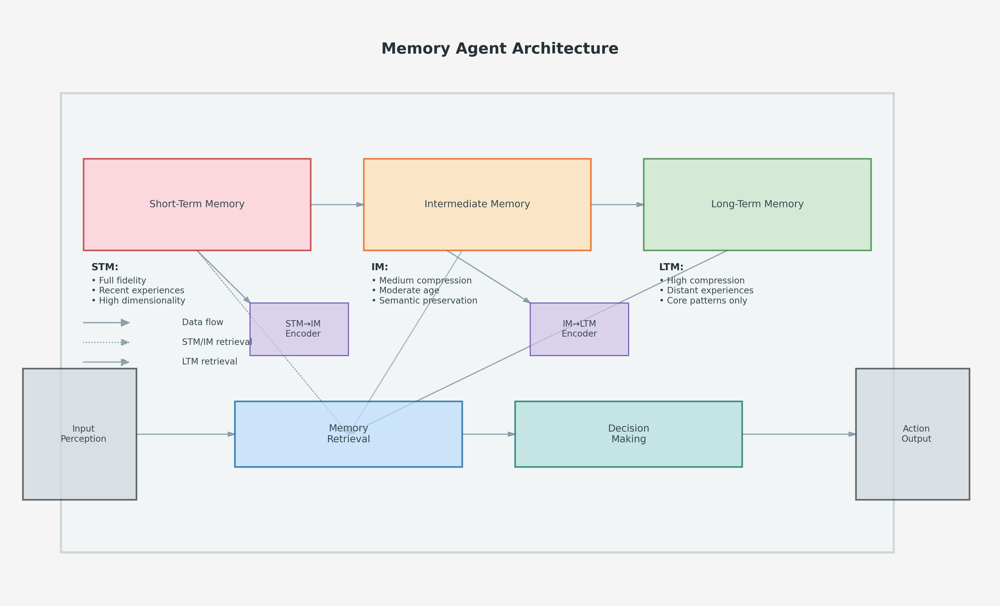
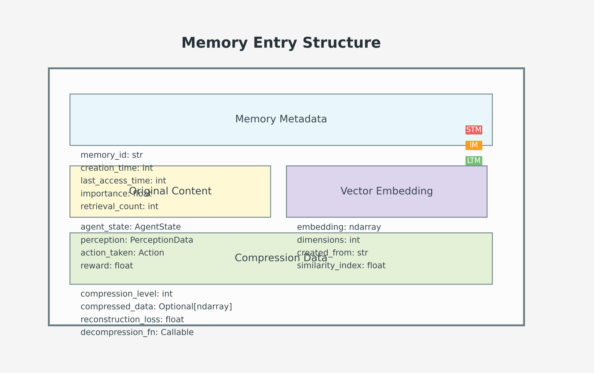
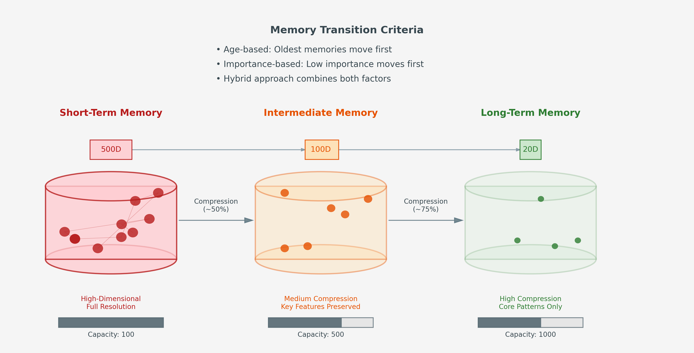

# Memory Agent: Hierarchical Memory Compression in Agent-Based Systems

## Research Purpose

This project investigates how hierarchical memory systems can enhance agent decision-making in simulation environments. Traditional agent architectures either maintain full history (computationally expensive) or rely on limited recent experience (losing valuable long-term patterns). We propose a biologically-inspired approach where memories gradually compress over time while retaining essential information.

## Key Research Questions

1. How can memories be effectively compressed while preserving decision-relevant information?
2. What are the performance trade-offs between memory fidelity and computational efficiency?
3. How does hierarchical memory impact agent learning, adaptation, and decision quality?
4. Which compression techniques yield the best balance of speed and information retention?

## Memory Architecture

The Memory Agent implements a three-tier memory system:

- **Short-Term Memory (STM)**: High-dimensional, complete memories of recent experiences
- **Intermediate Memory (IM)**: Moderately compressed representations of older experiences
- **Long-Term Memory (LTM)**: Highly compressed, abstract representations of distant experiences

Memories transition between tiers based on age, importance, and relevance, with compression increasing at each tier. When making decisions, agents query across all memory tiers to retrieve relevant past experiences.

## Experience Replay & Learning

The hierarchical memory system enhances reinforcement learning through sophisticated experience replay:

- **Cross-Tier Sampling**: During training, experiences are sampled from all memory tiers, not just recent events
- **Importance-Weighted Replay**: Memories with higher importance scores are prioritized in the replay buffer
- **Reconstructive Replay**: Compressed memories (IM/LTM) are reconstructed before being used in training
- **Temporal Pattern Learning**: Long-term patterns become accessible even after specific details are compressed
- **Adaptive Replay Ratios**: The sampling ratio between STM/IM/LTM adjusts based on learning convergence

This approach enables the agent to learn from both recent detailed experiences and older compressed ones, balancing immediate adaptation with long-term pattern recognition.

## Applications & Potential Impact

This research has broad implications for:

- Multi-agent simulation systems
- Reinforcement learning with limited resources
- Autonomous systems requiring efficient memory utilization
- Cognitive models of memory and decision-making

## Integration with AgentFarm

The Memory Agent extends the BaseAgent class in AgentFarm, adding hierarchical memory capabilities while maintaining compatibility with the existing simulation framework. This allows direct comparison with standard agents to measure the impact of enhanced memory systems.

## Research Challenges & Solutions

### Compression Techniques

**Challenge**: Ensuring decision-relevant information isn't lost during compression.

**Solutions**:
- Implement multi-level validation comparing reconstructed memories against originals
- Apply adaptive compression rates based on memory importance scores
- Use feature-preservation techniques focusing on decision-critical information
- Employ variational autoencoders trained to prioritize behaviorally relevant features

### Evaluation Metrics

**Challenge**: Establishing robust metrics to measure memory system effectiveness.

**Solutions**:
- Develop a comprehensive benchmark suite comparing against standard agents
- Track multi-dimensional metrics including memory efficiency, computational overhead, decision quality, and adaptation speed
- Conduct long-term learning assessments in environments requiring temporal pattern recognition
- Measure performance under varying memory constraints to identify optimal configurations

### Reconstruction Accuracy

**Challenge**: Designing effective mechanisms to recover information from compressed memories.

**Solutions**:
- Implement progressive reconstruction accessing multiple memory tiers when needed
- Use context-enhanced reconstruction leveraging current state information
- Apply quality-gated usage with confidence estimates for reconstructed memories
- Train reconstruction models using both MSE and semantic similarity objectives

### Scalability and Generalization

**Challenge**: Ensuring the memory architecture works across different environments and scales effectively.

**Solutions**:
- Design a modular architecture that adapts to different agent types and environments
- Conduct transfer learning tests to measure cross-environment effectiveness
- Perform computational complexity analysis to establish theoretical bounds
- Test scalability with increasing environment complexity and multi-agent scenarios

## Visualizations

The Memory Agent architecture diagram shows the three-tier memory system (STM, IM, LTM) and how information flows between these components. Data enters through environmental perception, is processed through the memory tiers with increasing compression, and influences decision-making through the retrieval system.

This diagram illustrates the structure of individual memory entries, showing how each memory stores metadata, original content, vector embeddings, and compression information across different memory tiers.

The memory transition visualization demonstrates how memories flow between tiers, with increasing compression ratios and changing dimensionality. It also shows the criteria used to determine when memories should transition between tiers.
