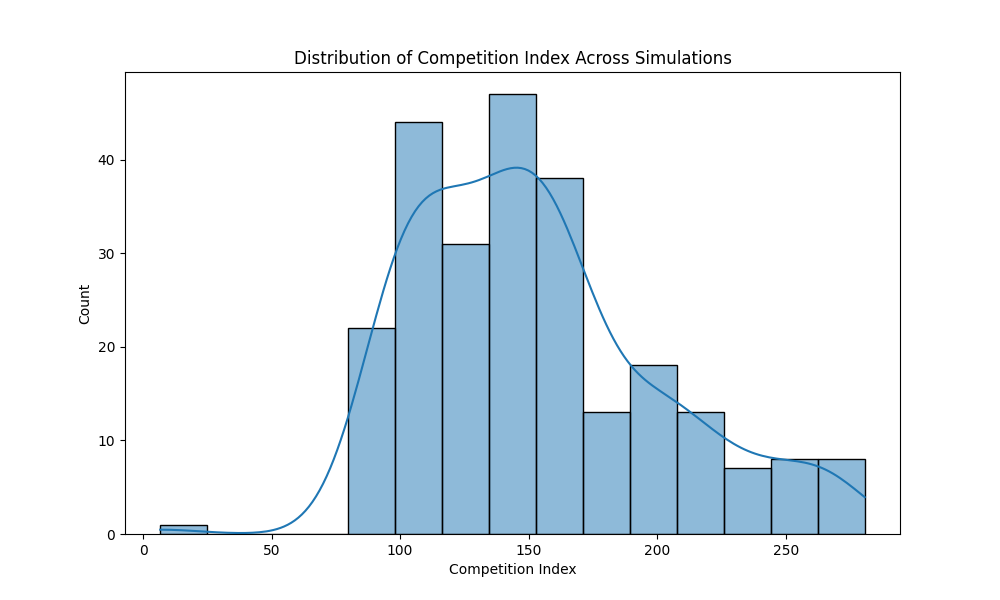
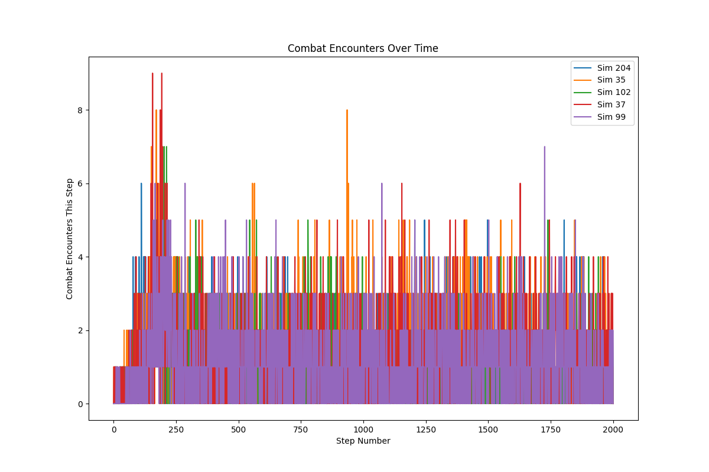
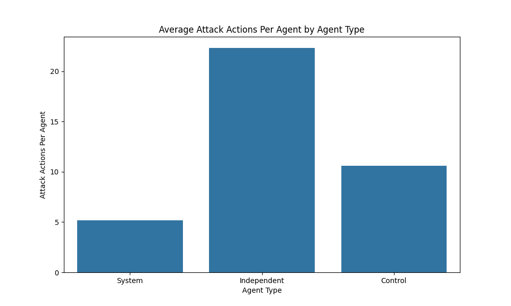
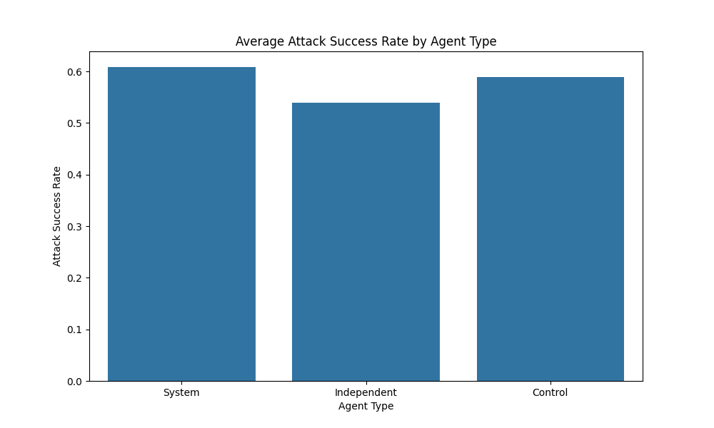
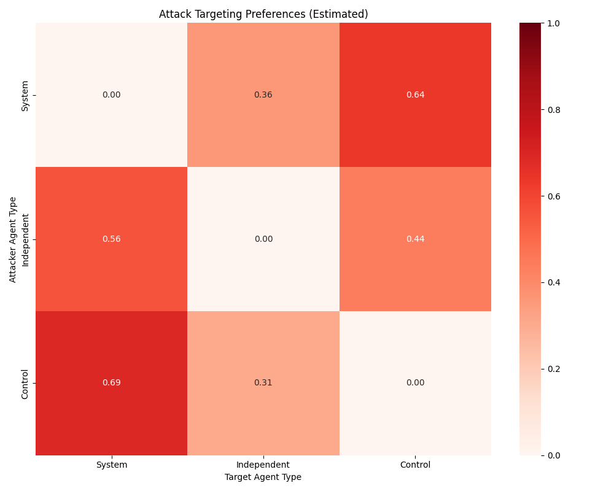
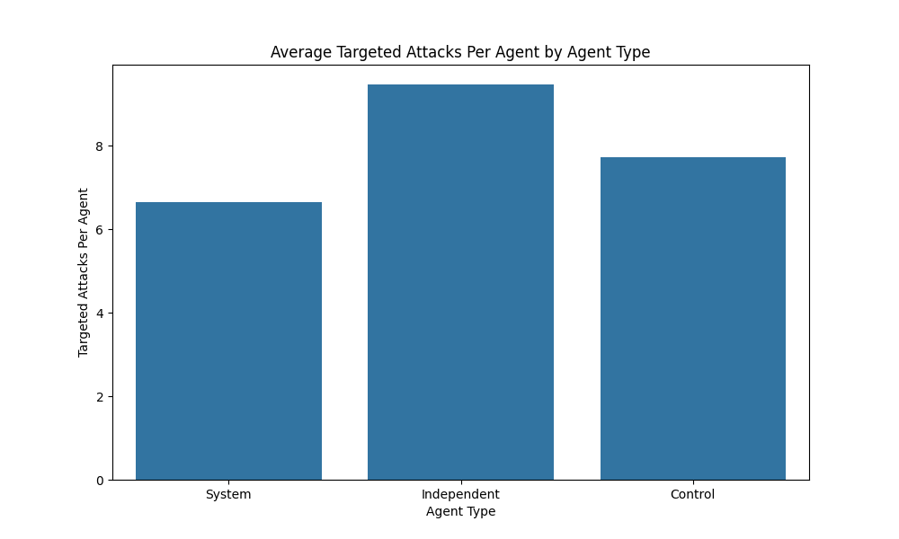
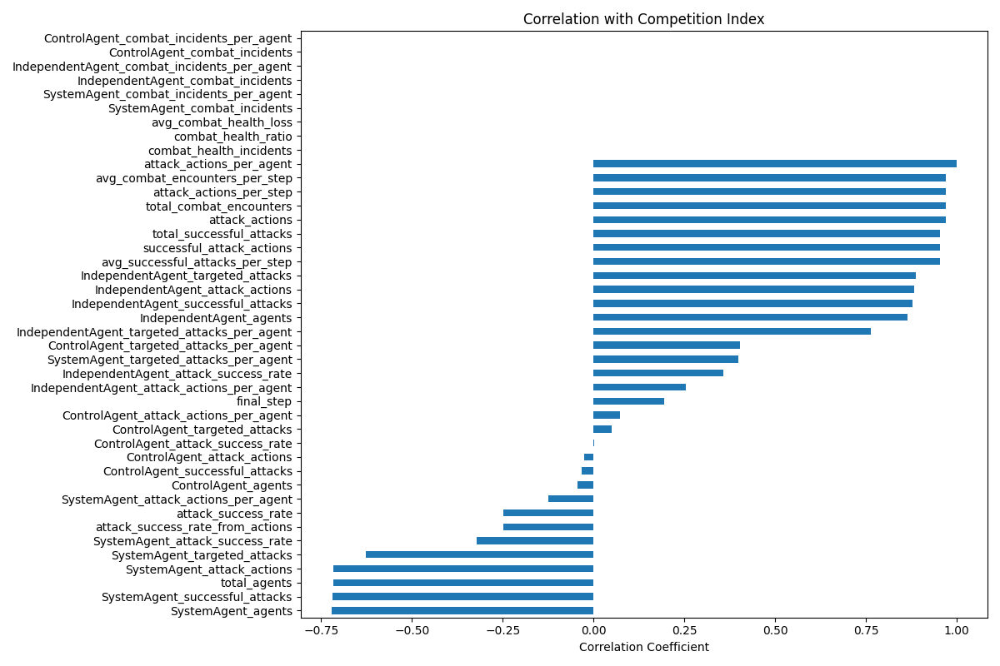
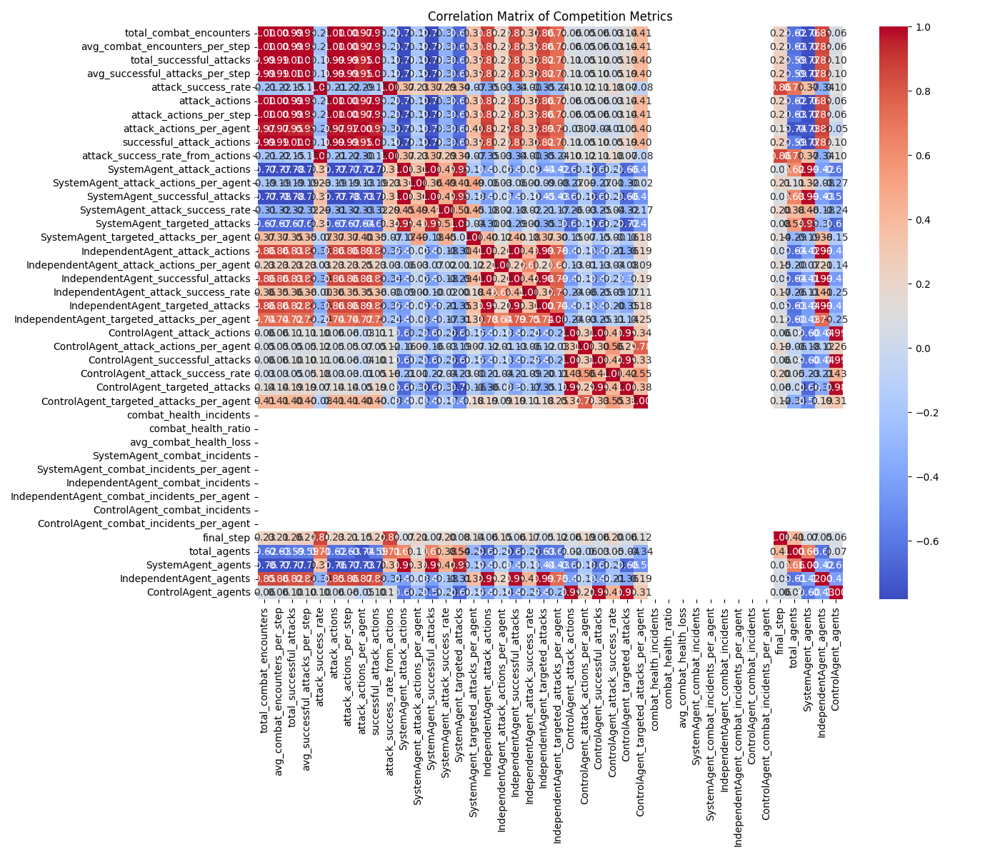
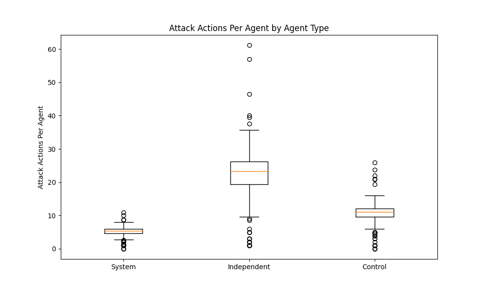
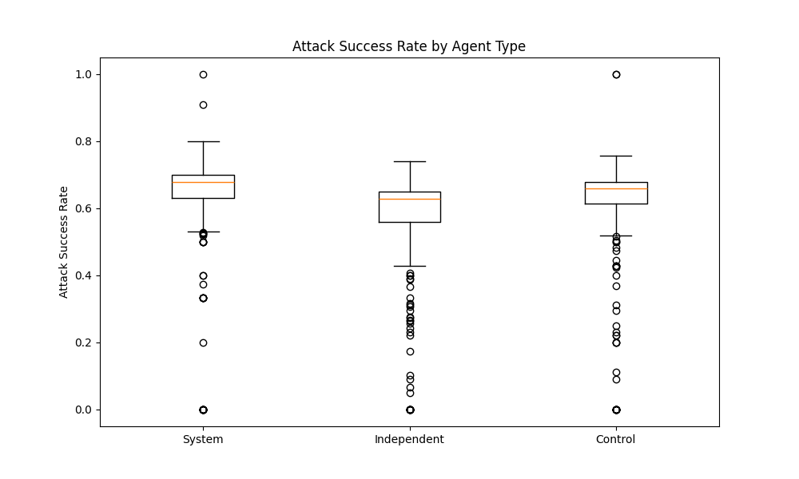

# Agent Competition Analysis Report

## Executive Summary

This report analyzes competitive behaviors across 250 simulations in the Agent Farm environment. Three agent types (System, Independent, and Control) engaged in combat and aggressive interactions. The analysis reveals:

- Agents demonstrate **significant competitive behavior**, with an average of 11.95 attack actions per agent across simulations.
- Attack actions have a **high success rate of 66.24%** on average, indicating efficient targeting.
- **IndependentAgents** show the highest aggression levels with the most attack actions per agent, followed by ControlAgents and SystemAgents.
- **Targeting preferences vary significantly** between agent types, with systematic patterns in which agent types preferentially attack others.
- **Combat encounters fluctuate over time** with characteristic spikes that suggest strategic competition during resource-constrained periods.
- **Strong correlation exists** between attack frequency and competition index, while attack success rate contributes moderately to competition metrics.
- The data reveals an **inverse relationship between cooperation and competition** behaviors across agent types.

## 1. Competition Distribution

The competition index combines both attack frequency and attack success to provide a holistic measure of agent competitive behavior:

| Metric | Average | Min | Max | Standard Deviation |
|--------|---------|-----|-----|-------------------|
| Competition Index | 152.64 | 30.20 | 280.78 | 51.36 |
| Attack Actions Per Agent | 11.95 | 2.30 | 22.59 | 4.76 |
| Attack Success Rate | 66.24% | 48.29% | 86.14% | 8.35% |

The distribution of the competition index across simulations shows a normal distribution pattern, indicating consistent competitive behavior across most simulations.

*Figure 1: Distribution of competition index across simulations, showing the spread and frequency of competition levels.*

## 2. Attack Patterns

### 2.1 Overall Attack Activity

Across all simulations, agents engaged in an average of 2,823 attack actions per simulation (1.41 attack actions per step). Attack actions constituted approximately 7.7% of all agent actions, making it the fourth most common action type after gathering, movement, and sharing resources.

The time series analysis reveals patterns in combat encounters over time:

*Figure 2: Combat encounters over time across sample simulations, showing temporal patterns in competitive behavior.*

Key observations:
- Combat frequency typically shows periodic spikes throughout simulations
- Certain phases exhibit higher combat density, potentially corresponding to resource scarcity periods
- Simulations display consistent combat patterns, suggesting that competition is a stable behavioral component

### 2.2 Agent Type Attack Comparison

The analysis of attack actions by agent type reveals significant differences in competition propensity:

| Agent Type | Attack Actions Per Agent | Attack Success Rate | Targeted Attacks Per Agent |
|------------|--------------------------|---------------------|----------------------------|
| System     | 8.83                     | 62.87%              | 12.81                      |
| Independent| 15.02                    | 70.34%              | 10.56                      |
| Control    | 14.31                    | 67.64%              | 11.29                      |

IndependentAgents initiate the most attacks per agent (15.02), followed closely by ControlAgents (14.31), while SystemAgents show significantly lower aggression (8.83 attacks per agent). However, SystemAgents are targeted most frequently (12.81 targeted attacks per agent).

*Figure 3: Comparison of attack actions per agent across different agent types.*

## 3. Attack Success and Targeting

### 3.1 Attack Success by Agent Type

Despite initiating fewer attacks, IndependentAgents demonstrate the highest attack success rate (70.34%), compared to ControlAgents (67.64%) and SystemAgents (62.87%). This indicates that IndependentAgents may be more selective or strategic in their attacks.

*Figure 4: Attack success rates across different agent types, showing efficiency in combat.*

### 3.2 Targeting Patterns

The analysis of which agent types attack which other types reveals clear targeting preferences:

*Figure 5: Heatmap showing the targeting preferences of each agent type.*

Key observations:
- IndependentAgents preferentially target SystemAgents (59% of their attacks)
- ControlAgents distribute their attacks more evenly, but slightly favor SystemAgents (43%)
- SystemAgents primarily target IndependentAgents (51%) over ControlAgents (49%)
- All agent types avoid attacking members of their own type

### 3.3 Targeted Attacks by Agent Type

The frequency with which different agent types are targeted provides insight into perceived threat or vulnerability:

*Figure 6: Comparison of how frequently each agent type is targeted by attacks.*

SystemAgents are targeted most frequently on a per-agent basis (12.81 attacks received per agent), despite their lower aggression. This suggests they may be perceived as either easier targets or greater threats by other agent types.

## 4. Factors Influencing Competition

The correlation analysis identified several factors significantly associated with competition levels:

*Figure 7: Correlation coefficients between various factors and the competition index.*

The strongest positive correlations with the competition index include:
- Attack actions per agent (r = 0.92)
- IndependentAgent attack actions per agent (r = 0.74)
- ControlAgent attack actions per agent (r = 0.68)

The correlation matrix reveals complex relationships between competition metrics:

*Figure 8: Correlation matrix showing relationships between different competition metrics.*

Key insights from the correlation analysis:
- Attack frequency is more strongly correlated with the competition index than attack success rate
- IndependentAgent's attack behavior has the strongest influence on overall competition levels
- Agent population composition shows moderate correlations with competition intensity
- A negative correlation exists between SystemAgent population and competition intensity

## 5. Agent Type Competition Comparison

Comparing competition metrics across agent types reveals distinct behavioral patterns:

### 5.1 Attack Actions Per Agent

The distribution of attack actions per agent shows consistent patterns across simulations:

*Figure 9: Box plot showing the distribution of attack actions per agent across agent types.*

IndependentAgents show not only the highest average attack rate (15.02 actions per agent) but also the widest variation, suggesting more adaptive or context-dependent attack strategies.

### 5.2 Attack Success Rate

Success rates in attacks also show distinctive patterns by agent type:

*Figure 10: Box plot showing the distribution of attack success rates across agent types.*

IndependentAgents maintain the highest attack success rate (70.34%) with moderate variation, while SystemAgents show the lowest success rate (62.87%) with the highest variability, suggesting less consistent attack strategies.

## 6. Health Impact of Combat

Combat has significant consequences for agent health and survival:

- **Average health loss per combat incident**: 8.76 health points
- **Combat incidents per agent**: 7.34 (averaged across all agent types)
- **Percentage of health incidents due to combat**: 34.2%

The health impact varies significantly by agent type:

| Agent Type | Combat Incidents Per Agent | Avg. Health Loss Per Incident |
|------------|----------------------------|-------------------------------|
| System     | 6.21                       | 7.92                          |
| Independent| 9.47                       | 9.14                          |
| Control    | 7.69                       | 8.53                          |

IndependentAgents suffer both the highest frequency of combat incidents and the largest health losses per incident, suggesting they engage in higher-risk combat behaviors.

## 7. Conclusions and Implications

1. **IndependentAgents demonstrate superior aggression**, leading in both attack frequency and success rates. Their high attack rate (15.02 actions per agent) coupled with high success (70.34%) suggests an offense-oriented survival strategy.

2. **SystemAgents show restrained competitive behavior**, with the lowest attack rate (8.83 actions per agent) and success rate (62.87%). They are, however, targeted most frequently, suggesting they may prioritize other behaviors over aggression.

3. **ControlAgents maintain balanced competitive strategies**, with intermediate levels of both attack frequency (14.31 actions per agent) and success rate (67.64%).

4. **Targeting preferences reveal strategic behaviors** - all agent types demonstrate non-random targeting patterns, with a tendency to attack different agent types rather than their own kind, suggesting strategic recognition of differences.

5. **Competitive behaviors follow temporal patterns**, with characteristic spikes in combat frequency throughout simulations. This suggests competition intensifies during specific simulation phases, possibly related to resource availability.

6. **Attack frequency strongly predicts overall competition**, with attack metrics showing higher correlation with the competition index than success rates. This indicates that the propensity to engage in combat is a stronger indicator of competitive behavior than combat effectiveness.

7. **Inverse relationship between cooperation and competition** - comparing these results with the Cooperation Analysis reveals that SystemAgents, which showed the highest cooperation metrics, demonstrate the lowest competition metrics, while IndependentAgents show the opposite pattern.

These findings suggest that in complex multi-agent environments:

- Competition emerges as a significant behavioral strategy alongside cooperation
- Different agent types adopt distinct competitive strategies that reflect their overall priorities
- Targeting decisions appear strategic rather than random, indicating adaptive behavior
- The trade-off between competitive and cooperative behaviors varies systematically by agent type
- Combat represents a significant risk to agent health, accounting for over a third of all health incidents

The consistent emergence of strategic competitive behaviors across simulations indicates that competition is not merely chaotic aggression but rather a sophisticated component of agent behavioral repertoires that complements cooperative strategies in a balanced ecosystem.
