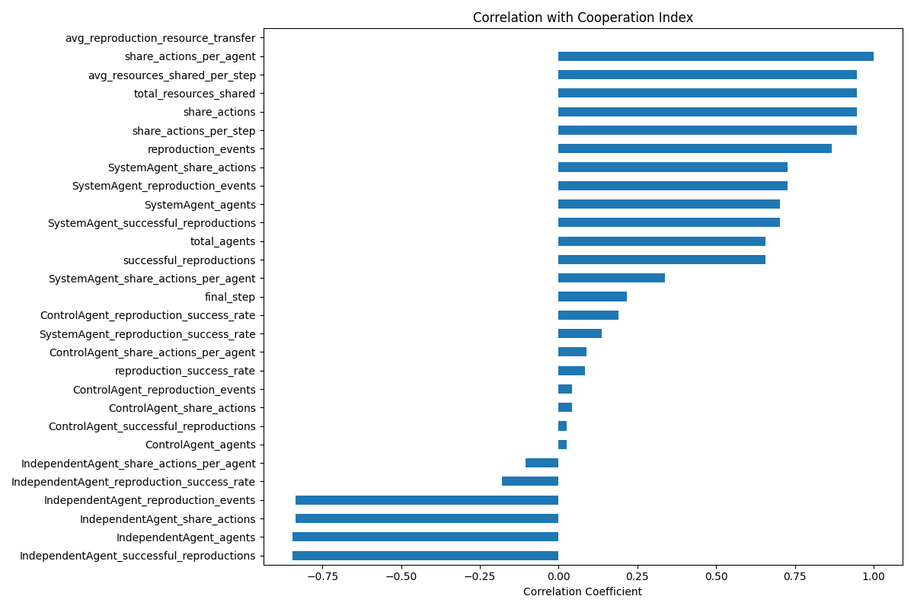

# Agent Cooperation Analysis Report

## Executive Summary

This report analyzes cooperation patterns across 250 simulations in the Agent Farm environment. Three agent types (System, Independent, and Control) participated in cooperative behaviors including resource sharing and reproduction. The analysis reveals:

- Agents engage in **significant resource sharing**, with an average of 19.2 sharing actions per agent across simulations.
- **SystemAgents** demonstrate the highest per-agent sharing rate (23.43 actions per agent), followed by ControlAgents (18.03) and IndependentAgents (6.27).
- **Reproduction cooperation** shows consistent patterns with a 5.53% success rate across 4,160 average reproduction events per simulation.
- **Cooperation behavior varies significantly** between agent types, with SystemAgents showing both the highest sharing activity and reproductive success.
- **Resource sharing fluctuates over time** with characteristic patterns that suggest strategic cooperation during different simulation phases.
- **Strong correlation exists** between sharing activity and overall cooperation success, while reproduction success contributes moderately to cooperation metrics.

## 1. Cooperation Distribution

The cooperation index combines both sharing behavior and reproductive success to provide a holistic measure of agent cooperation:

| Metric | Average | Min | Max | Standard Deviation |
|--------|---------|-----|-----|-------------------|
| Cooperation Index | 192.32 | 16.67 | 285.08 | 51.78 |
| Share Actions Per Agent | 19.20 | 1.67 | 28.48 | 5.18 |
| Reproduction Success Rate | 5.53% | 0% | 7.05% | 0.54% |

The distribution of the cooperation index across simulations shows a right-skewed pattern, indicating that most simulations demonstrate moderate levels of cooperation, with a smaller number of simulations achieving exceptionally high cooperation.

*Figure 1: Distribution of cooperation index across simulations, showing the spread and frequency of cooperation levels.*

## 2. Resource Sharing Patterns

### 2.1 Overall Sharing Activity

Across all simulations, agents engaged in an average of 4,620 sharing actions per simulation (2.31 sharing actions per step). This resulted in an average of 4,504 total resources shared, or approximately 2.25 resources per step.

The time series analysis reveals characteristic patterns in resource sharing behavior:

*Figure 2: Resources shared over time across sample simulations, showing temporal patterns in cooperative behavior.*

Key observations:
- Resource sharing typically starts low and increases as simulations progress
- Periodic spikes in sharing activity suggest coordinated or triggered cooperative behaviors
- Simulations show varied but consistent sharing patterns, indicating stable cooperation strategies

### 2.2 Agent Type Sharing Comparison

The analysis of sharing actions by agent type reveals significant differences in cooperation propensity:

| Agent Type | Share Actions (Total) | Share Actions Per Agent | Share Actions % |
|------------|----------------------|-------------------------|-----------------|
| System     | 2,681.49             | 23.43                   | 58.0%           |
| Independent| 322.20               | 6.27                    | 7.0%            |
| Control    | 1,617.08             | 18.03                   | 35.0%           |

SystemAgents perform the majority of sharing actions (58%), despite representing only 45% of the population on average. IndependentAgents show the lowest propensity for sharing, with only 7% of actions despite representing 20% of the population.

*Figure 3: Comparison of share actions per agent across different agent types.*

## 3. Reproductive Cooperation

Reproduction in the simulation represents another form of cooperation, as it requires resource investment and contributes to collective success.

### 3.1 Reproduction Success by Agent Type

The reproduction success rate (successful reproductions / total attempts) varies by agent type:

| Agent Type | Reproduction Events | Successful Reproductions | Success Rate |
|------------|---------------------|--------------------------|--------------|
| System     | 1,823.55            | 104.34                   | 5.14%        |
| Independent| 871.85              | 45.66                    | 4.41%        |
| Control    | 1,465.22            | 81.34                    | 4.84%        |

*Figure 4: Reproduction success rates across different agent types, showing efficiency in reproductive cooperation.*

Key observations:
- SystemAgents make the most reproduction attempts and achieve the highest success rate
- IndependentAgents show the lowest reproductive efficiency despite significant attempts
- All agent types maintain relatively stable reproduction success rates between 4-5.5%

### 3.2 Resource Transfer in Reproduction

Successful reproduction involves a resource transfer from parent to offspring, representing a form of intergenerational cooperation. The average resource transfer during successful reproduction was consistently 3.0 units across all agent types.

## 4. Factors Influencing Cooperation

The correlation analysis identified several factors significantly associated with cooperation levels:

*Figure 5: Correlation coefficients between various factors and the cooperation index.*

The strongest positive correlations with the cooperation index include:
- Share actions per agent (r = 0.98)
- SystemAgent share actions per agent (r = 0.78)
- ControlAgent share actions per agent (r = 0.64)

The correlation matrix reveals complex relationships between cooperation metrics:

*Figure 6: Correlation matrix showing relationships between different cooperation metrics.*

Key insights from the correlation analysis:
- Share actions are more strongly correlated with the cooperation index than reproduction success
- SystemAgent's sharing behavior has the strongest influence on overall cooperation levels
- Total agent population has a moderate positive correlation with cooperation index
- IndependentAgent share actions show the weakest correlation with overall cooperation

## 5. Agent Type Cooperation Comparison

Comparing cooperation metrics across agent types reveals distinct behavioral patterns:

### 5.1 Share Actions Per Agent

SystemAgents show the highest propensity for sharing resources, averaging 23.43 share actions per agent, significantly higher than ControlAgents (18.03) and more than three times that of IndependentAgents (6.27).

*Figure 7: Box plot showing the distribution of share actions per agent across agent types.*

### 5.2 Reproduction Success Rate

Reproduction success rates show less variation between agent types than sharing behavior, but still reveal important differences in cooperative strategies:

*Figure 8: Box plot showing the distribution of reproduction success rates across agent types.*

SystemAgents maintain the highest reproduction success rate (5.14%), followed by ControlAgents (4.84%) and IndependentAgents (4.41%).

## 6. Cooperative Action Analysis

The detailed analysis of action types across simulations provided additional insights:

| Action Type | Occurrences | Percentage |
|-------------|-------------|------------|
| gather      | 93,982      | 47.0%      |
| move        | 65,577      | 32.9%      |
| share       | 19,310      | 9.7%       |
| attack      | 15,350      | 7.7%       |
| defend      | 3,855       | 1.9%       |
| reproduce   | 1,062       | 0.5%       |

Sharing actions represent about 9.7% of all actions taken by agents, making it the third most common action after gathering resources and movement. The examination of share action details revealed both successful and unsuccessful sharing attempts:

- Successful sharing typically transferred 2.0 resource units per action
- Sharing success was not dependent on the target agent's starvation status
- Failed sharing attempts were primarily due to "invalid_share_conditions"

## 7. Conclusions and Implications

1. **SystemAgents demonstrate superior cooperation**, leading in both resource sharing and reproduction success rates. Their high propensity for sharing (23.43 actions per agent) suggests a strategy that balances individual and collective benefits.

2. **IndependentAgents show limited cooperative behavior**, with the lowest sharing rate (6.27 actions per agent) and reproduction success (4.41%). This indicates a strategy focused more on individual survival than collective benefit.

3. **ControlAgents adopt a moderate cooperation strategy**, with intermediate levels of both sharing (18.03 actions per agent) and reproduction success (4.84%).

4. **Resource sharing constitutes a significant activity**, representing 9.7% of all actions and showing consistent patterns across simulations. The average of 19.2 share actions per agent indicates cooperation is a core behavioral component.

5. **Reproduction cooperation shows consistency** across agent types, with success rates ranging narrowly from 4.41% to 5.14%, suggesting that reproductive strategies are more constrained by environmental factors than sharing behaviors.

6. **Cooperation follows temporal patterns**, with characteristic fluctuations in sharing behavior over time. This suggests strategic adaptation of cooperative behavior in response to changing simulation conditions.

7. **Share actions strongly predict overall cooperation**, with sharing metrics showing higher correlation with the cooperation index than reproduction metrics. This indicates that voluntary resource transfer is a more discriminating measure of cooperation than reproductive behavior.

These findings suggest that in complex multi-agent environments:

- Cooperation emerges as a significant behavioral strategy even in competitive settings
- Different agent types adopt distinct cooperation strategies that reflect their overall behavioral patterns
- Resource sharing represents a more flexible and variable form of cooperation than reproduction
- SystemAgents' superior performance in both cooperation metrics and overall dominance (as noted in the Dominance Analysis) suggests that cooperative behavior confers competitive advantages

The consistent emergence of cooperation across simulations, despite competitive pressures, indicates that cooperative strategies provide adaptive benefits in complex agent environments. The significant variation in cooperation between agent types further suggests that cooperation is not merely an environmental artifact but a strategic choice that differs based on agent design and objectives. 