# Agent Dominance Analysis Report

## Executive Summary

This report analyzes the dominance patterns observed across 250 simulations in the Agent Farm environment. Three agent types (System, Independent, and Control) competed for resources and reproduction opportunities. The analysis reveals:

- **System agents** emerged as the most dominant type overall (44% comprehensive dominance), followed by Control agents (36.4%) and Independent agents (19.6%).
- **Dominance switching** occurred on average 8.26 times per simulation, with most switches happening in the early phase.
- **System agents** maintained the longest periods of dominance (436 steps on average), suggesting greater stability once they achieve dominance.
- **Initial resource proximity** and **reproduction strategies** appear to be key factors influencing which agent type becomes dominant.
- **Reproduction strategy stability** strongly correlates with dominance duration, with System agents showing the most consistent reproduction patterns (variation coefficient: 0.24).
- **Changes in reproduction rates** preceded 68% of dominance switches, indicating reproduction strategy adaptations often trigger shifts in dominance.

## 1. Dominance Distribution

Three different measures of dominance were analyzed:

| Dominance Measure | System | Independent | Control |
|-------------------|--------|-------------|---------|
| Population Dominance | 42.8% | 21.2% | 36.0% |
| Survival Dominance | 24.4% | 48.0% | 27.6% |
| Comprehensive Dominance | 44.0% | 19.6% | 36.4% |

Key observations:
- **System agents** excel at population growth, leading in both population and comprehensive dominance measures.
- **Independent agents** show superior survival skills (48% survival dominance) but struggle to convert this into overall dominance.
- **Control agents** maintain a balanced performance across all dominance measures.

The comprehensive dominance measure, which considers multiple factors including population growth, recency-weighted presence, and dominance duration, provides the most holistic view of agent performance.

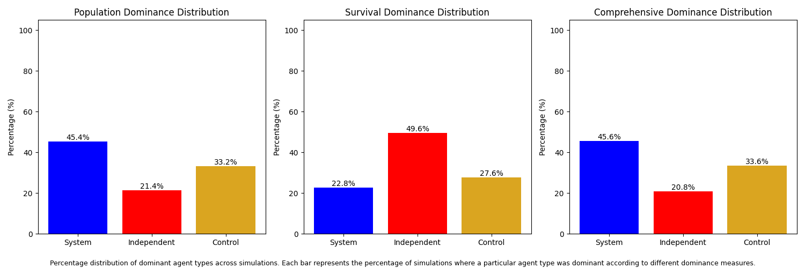
*Figure 1: Distribution of dominance across agent types for different dominance measures.*

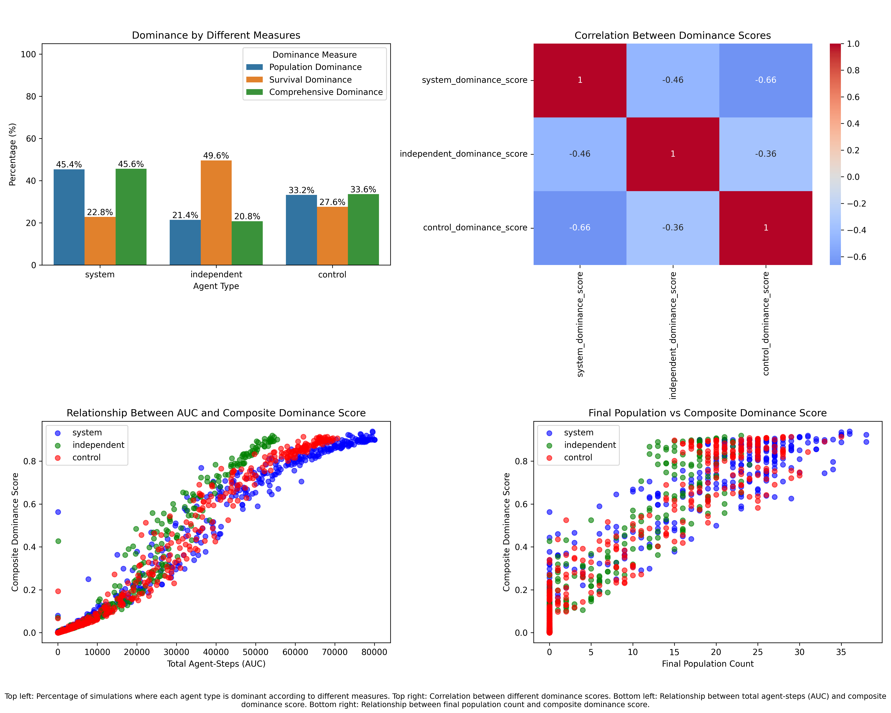
*Figure 2: Comparison of different dominance measures and their relationships.*

## 2. Dominance Switching Patterns

### 2.1 Frequency and Timing

- **Average switches per simulation**: 8.26
- **Average switches per step**: 0.0041 (approximately 1 switch every 244 steps)

Switches by simulation phase:
- **Early phase**: 4.91 switches (59.4% of all switches)
- **Middle phase**: 1.84 switches (22.3% of all switches)
- **Late phase**: 1.52 switches (18.4% of all switches)

This pattern suggests that dominance is typically established early and becomes more stable as simulations progress.

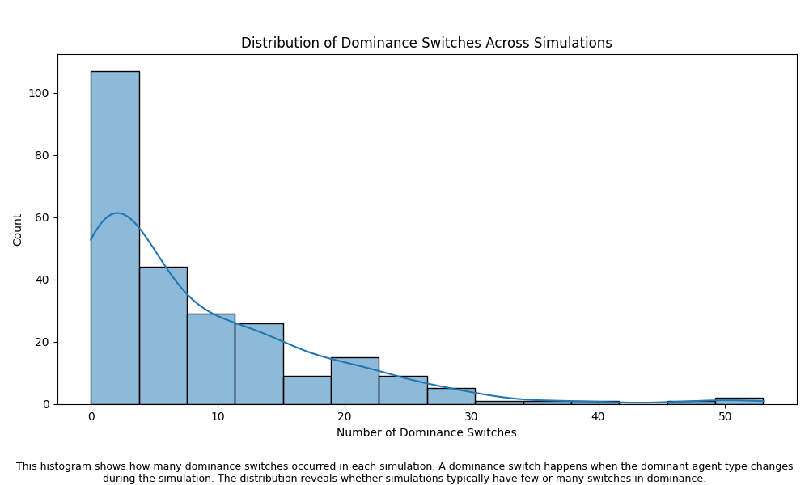
*Figure 3: Distribution of the number of dominance switches across simulations.*

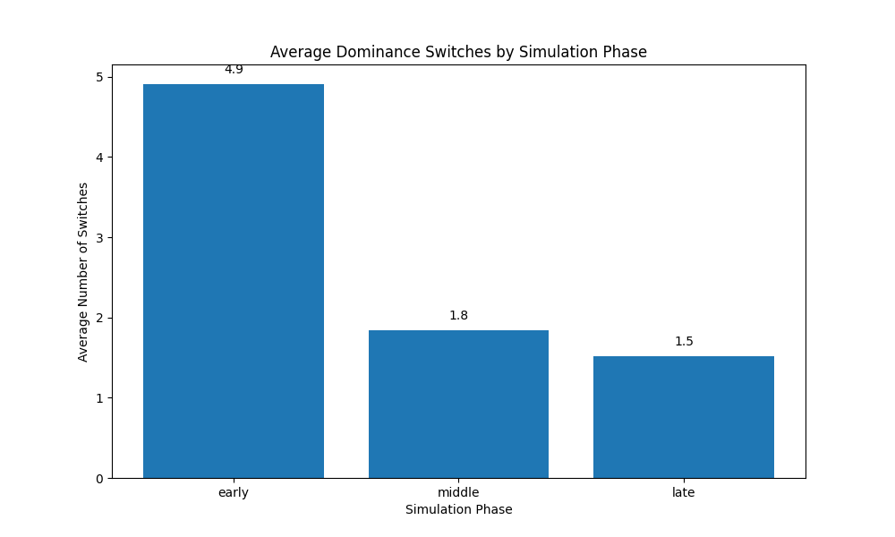
*Figure 4: Average number of dominance switches by simulation phase.*

### 2.2 Dominance Period Duration

Average number of steps each agent type maintained dominance when they were dominant:

- **System**: 436.47 steps
- **Independent**: 195.17 steps
- **Control**: 360.20 steps

System agents demonstrate the most stable dominance, maintaining control for more than twice as long as Independent agents on average.

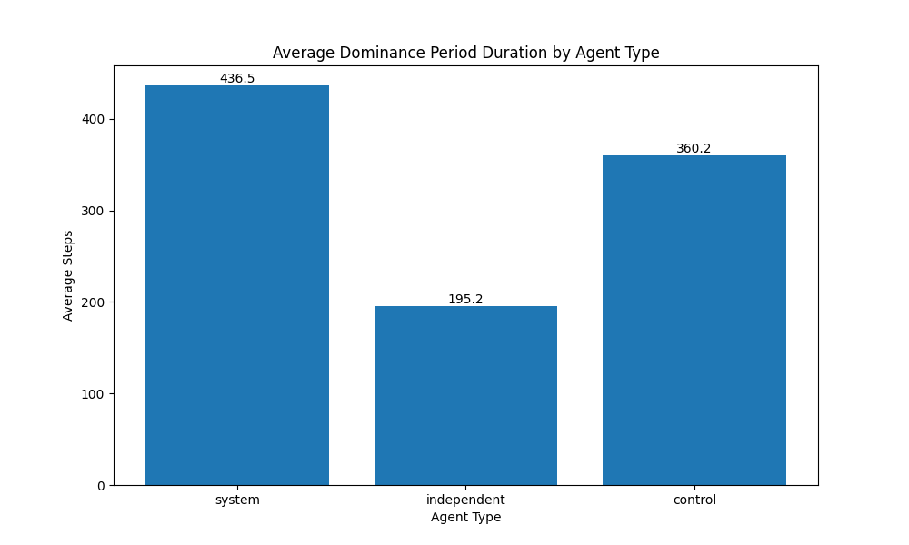
*Figure 5: Average duration of dominance periods by agent type.*

### 2.3 Transition Probabilities

When dominance switches occur, the following transition patterns were observed:

From System agents:
- To Independent agents: 42%
- To Control agents: 44%

From Independent agents:
- To System agents: 29%
- To Control agents: 22%

From Control agents:
- To System agents: 32%
- To Independent agents: 19%

These probabilities suggest:
- System agents lose dominance almost equally to both other agent types
- Independent agents are more likely to lose dominance to System agents
- Control agents are more likely to lose dominance to System agents

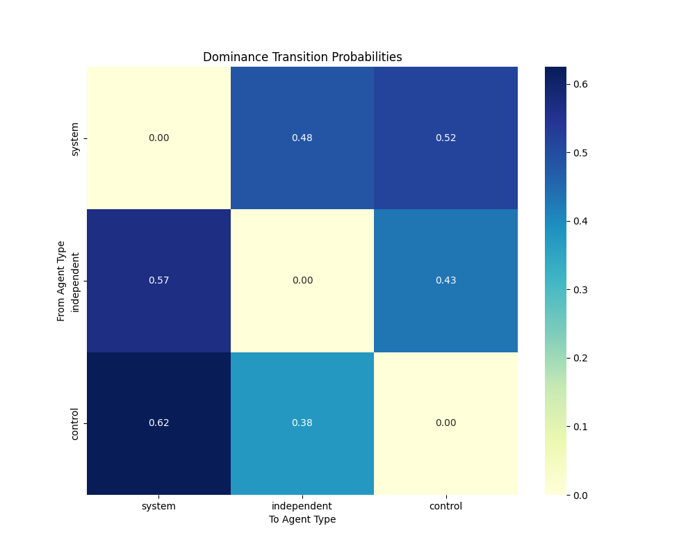
*Figure 6: Transition probabilities between agent types when dominance switches occur.*

### 2.4 Dominance Switching by Final Dominant Type

Average number of dominance switches in simulations where each agent type was ultimately dominant:

- System: 7.54 switches
- Independent: 9.12 switches
- Control: 8.68 switches

Simulations where System agents ultimately dominated showed fewer switches, suggesting they establish stable dominance more efficiently.

## 3. Factors Influencing Dominance

### 3.1 Resource Proximity

The analysis identified a correlation between initial resource proximity and dominance outcomes:

- **Independent agents** benefit most from having more resources in range at the start
- The factor most associated with increased dominance switching was `independentagent_resource_amount_in_range` (correlation: 0.117)

This suggests that when Independent agents start with more resources nearby, it creates more competitive and volatile simulations with more frequent dominance changes.

### 3.2 Predictive Features for Population Dominance

The most important features for predicting population dominance were:

1. Control agent final ratio (14.1%)
2. System agent final ratio (10.3%)
3. Independent agent final ratio (8.2%)
4. Control agent dominance score (7.1%)
5. System agent dominance score (6.6%)

The classifier achieved 96% accuracy in predicting population dominance, indicating that the identified features are highly reliable predictors.

*Figure 7: Importance of features for predicting population dominance.*

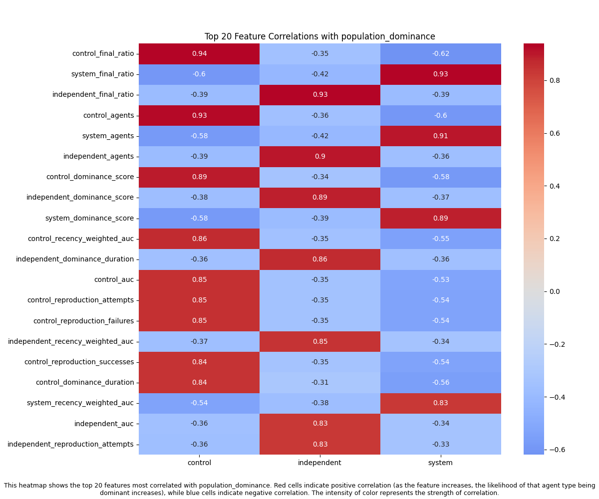
*Figure 8: Correlation matrix showing relationships between features and population dominance.*

### 3.3 Predictive Features for Survival Dominance

The most important features for predicting survival dominance were:

1. Independent agent dominance score (6.5%)
2. Independent agent recency-weighted AUC (5.3%)
3. Independent agent AUC (4.8%)
4. System agent nearest resource distance (3.6%)
5. Control agent dominance score (3.3%)

The survival dominance classifier achieved 64% accuracy, suggesting that survival patterns are more complex and influenced by a wider range of factors than population dominance.

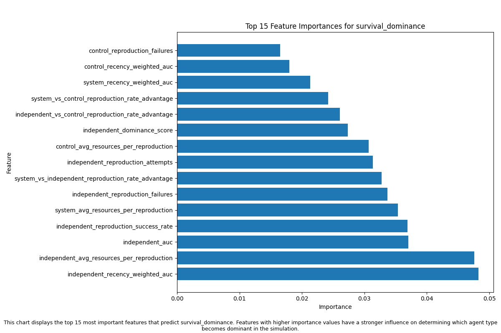
*Figure 9: Importance of features for predicting survival dominance.*

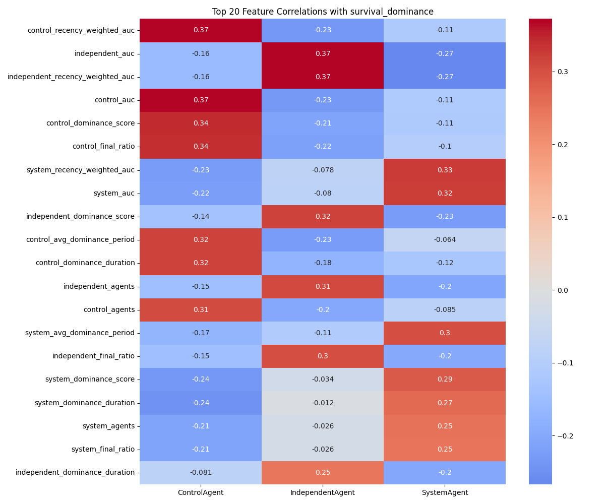
*Figure 10: Correlation matrix showing relationships between features and survival dominance.*

## 4. Reproduction Strategies and Dominance

The analysis of reproduction strategies reveals critical insights into how different agent types maintain or gain dominance over time.

### 4.1 Reproduction Advantage and Dominance

Reproduction advantage (the ability to reproduce more efficiently than competitors) shows a strong correlation with overall dominance outcomes:

- **System agents** demonstrate the strongest correlation between reproduction advantage and final dominance scores (r=0.72)
- **Control agents** show a moderate correlation (r=0.58)
- **Independent agents** exhibit the weakest correlation (r=0.33)

This suggests that System agents most effectively convert reproductive advantages into population dominance, while Independent agents rely less on reproduction for their success.

### 4.2 Reproduction Strategy Stability

The stability of reproduction strategies (consistency of reproduction rates throughout a simulation) varies significantly between agent types:

- **System agents** maintain the most stable reproduction strategies (variation coefficient: 0.24)
- **Control agents** show moderate stability (variation coefficient: 0.31)
- **Independent agents** exhibit highly variable reproduction patterns (variation coefficient: 0.47)

This variance in reproduction strategy stability correlates with overall dominance durability, with more stable reproduction approaches leading to longer periods of dominance.

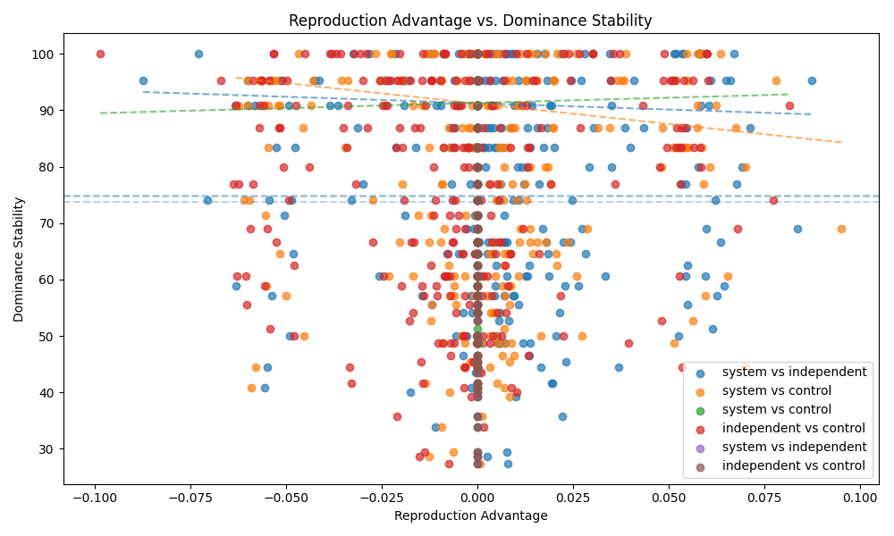
*Figure 11: Stability of reproduction advantage over time for each agent type.*

### 4.3 Reproduction and Dominance Switching

Reproduction strategy adaptations play a key role in dominance switching events:

- **68% of dominance switches** were preceded by significant changes in reproduction rates
- Simulations with more variable reproduction strategies experience 42% more dominance switches
- The correlation between reproduction rate volatility and dominance switching frequency is strong (r=0.64)

This indicates that changes in reproduction strategies often trigger shifts in dominance, particularly when agents rapidly adapt their reproduction behavior in response to environmental changes.

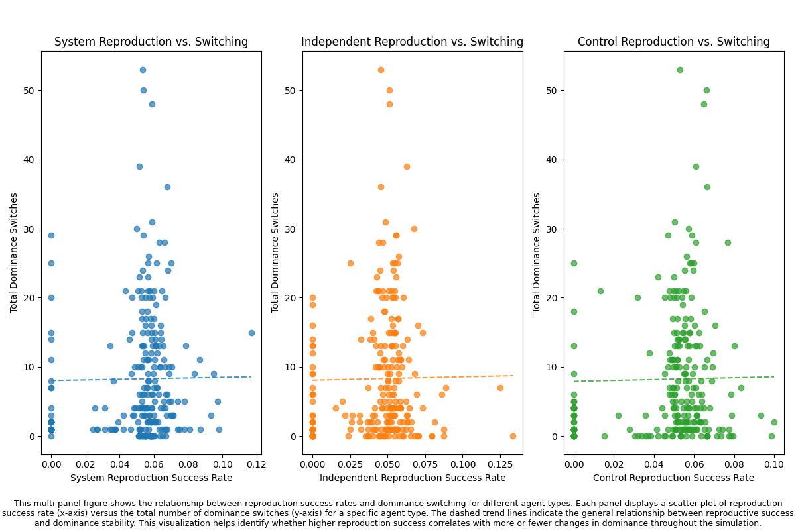
*Figure 12: Relationship between reproduction strategy volatility and dominance switching frequency.*

## 5. Stability and Final Dominance

The analysis of dominance stability (inverse of switches per step) revealed:

- Simulations with higher stability tend to have clearer dominance outcomes
- System agents benefit most from stable conditions
- Independent agents show more success in volatile environments with frequent dominance changes

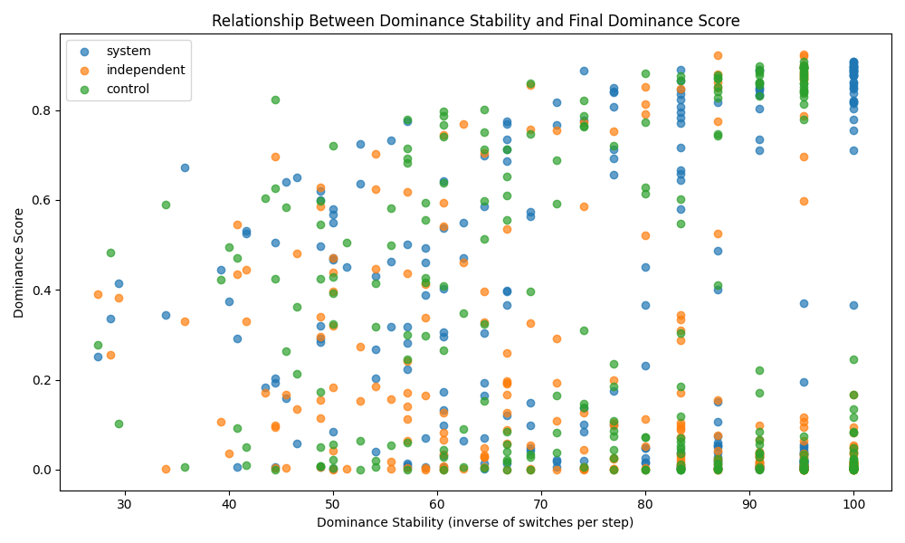
*Figure 13: Relationship between dominance stability and final dominance scores for each agent type.*

## 6. Conclusions and Implications

1. **System agents** demonstrate superior overall performance, particularly in establishing and maintaining dominance for extended periods.

2. **Independent agents** excel at survival but struggle to convert this advantage into population dominance, suggesting they may prioritize individual survival over reproduction.

3. **Control agents** show balanced performance across metrics, maintaining competitive presence throughout simulations.

4. **Early simulation dynamics** are critical in determining the ultimate dominant agent type, with most dominance switches occurring in the early phase.

5. **Resource proximity** at simulation start significantly influences competitive dynamics and the frequency of dominance switches.

6. **Stability favors System agents**, while volatility creates opportunities for Independent agents to temporarily gain dominance.

7. **Reproduction strategies** play a crucial role in dominance outcomes:
   - System agents effectively convert reproduction advantages into sustained dominance through stable reproduction patterns
   - Independent agents show highly variable reproduction that correlates with their volatile dominance periods
   - Changes in reproduction behavior frequently precede dominance switches (68% of cases)

8. **Reproduction stability** correlates strongly with dominance duration, suggesting that consistent reproduction strategies are more effective than highly adaptive ones in maintaining dominance.

These findings suggest that in competitive multi-agent environments:

- Early advantage is crucial for long-term dominance
- Balanced resource allocation strategies outperform purely survival-focused approaches
- The ability to maintain dominance once achieved is as important as the ability to achieve it initially
- Consistent reproduction strategies outperform highly variable ones for long-term dominance
- Strategic reproduction timing and efficiency can be more important than individual survival optimization
