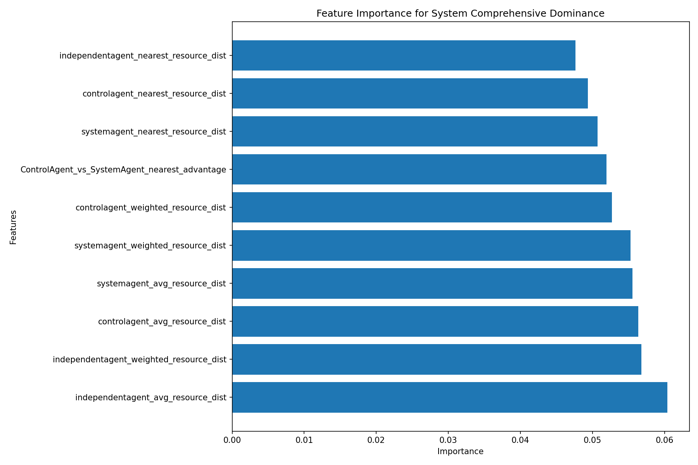
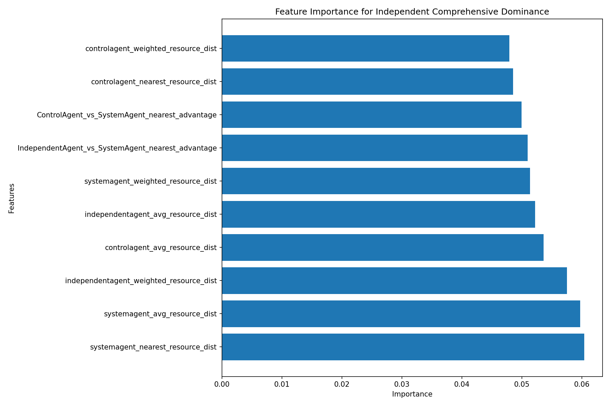
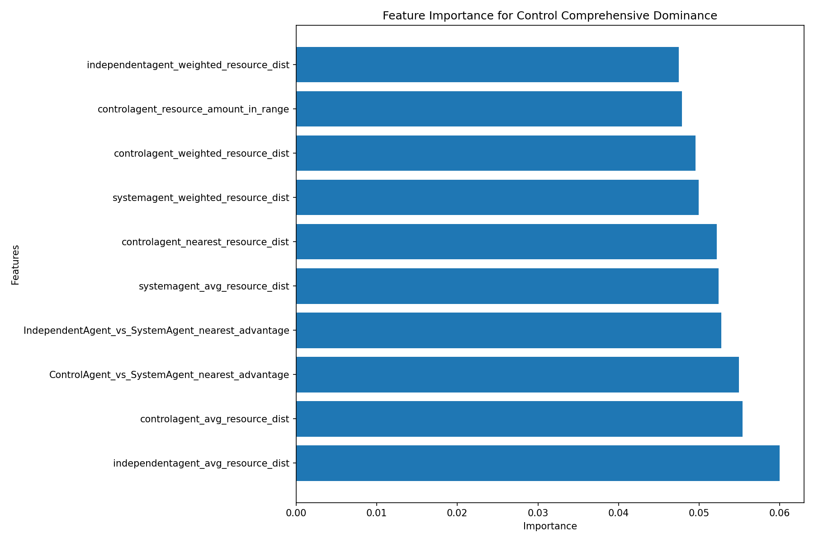
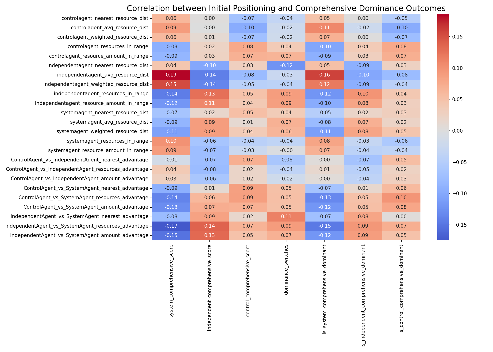
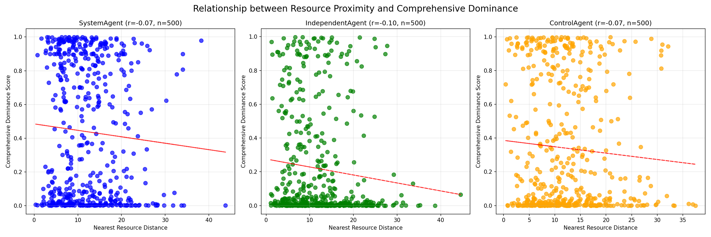
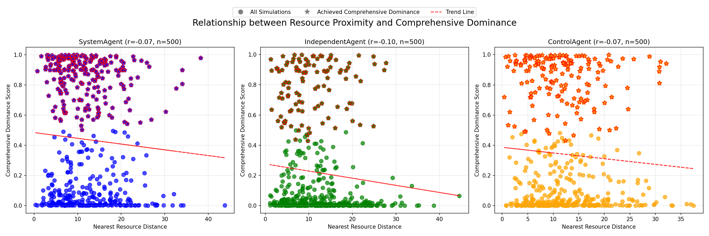
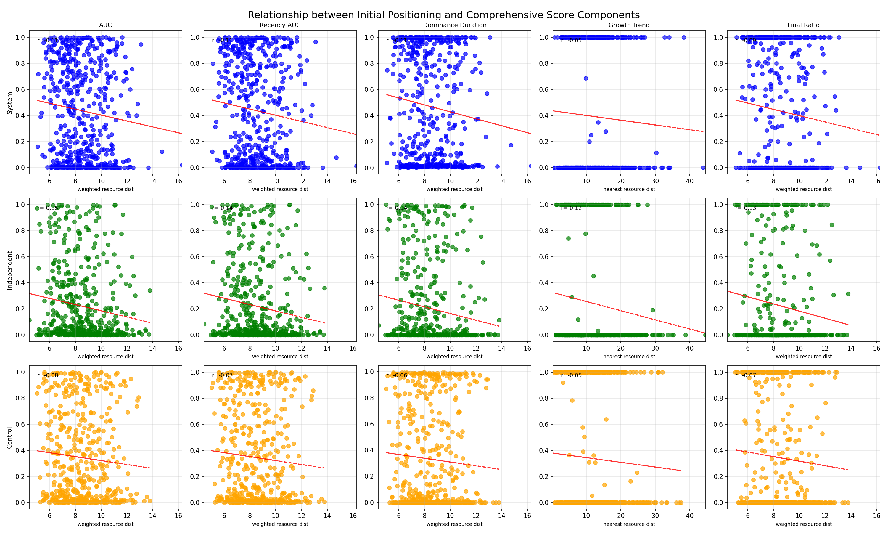
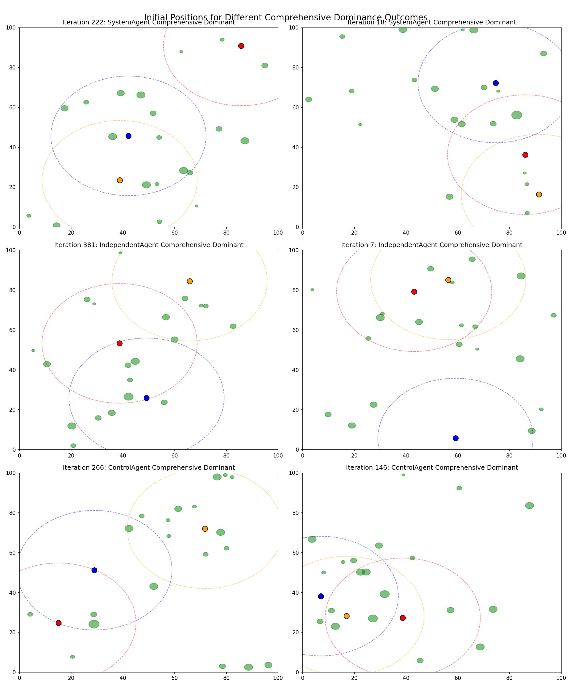

## Executive Summary

This analysis examines how the initial positioning of agents relative to resources impacts their ability to achieve dominance in the simulation. Key findings include:

- **Relative advantage is more important than absolute positioning**: Competitive positioning between agent types shows stronger correlations with dominance outcomes than absolute resource proximity.
- **Resource quantity outweighs proximity**: Having more resources within gathering range is more important than being extremely close to a single resource.
- **System agents** benefit most from having better initial resource access than competitors, with resource proximity advantages being their strongest predictor of dominance.
- **Independent agents** are particularly sensitive to their initial positioning relative to valuable resources, with weighted resource distance being a key predictor.
- **Control agents'** success depends on having good access to resource-rich areas from the start, with resources in gathering range being a critical factor.
- **Winner-takes-all dynamics**: Initial positioning advantages, while modest, tend to compound over time, with early leaders often maintaining dominance throughout the simulation.

## 1. Feature Importance Analysis

Different positioning metrics influence each agent type's ability to achieve dominance:

### 1.1 System Agent Positioning Factors

Key observations:
- System agents benefit most from having **better relative resource access** than competitors
- **Resource amount within gathering range** is a critical predictor of System agent dominance
- Initial positioning advantages allow System agents to establish early resource control

### 1.2 Independent Agent Positioning Factors

Key observations:
- Independent agents are particularly sensitive to their **weighted resource distance** (distance adjusted for resource value)
- The **number of resources in range** at the start significantly impacts their ability to dominate
- Independent agents rely more on strategic positioning near valuable resources rather than just any resources

### 1.3 Control Agent Positioning Factors

Key observations:
- Control agent dominance is strongly influenced by **relative positioning advantages**
- **Nearest resource distance** and **resource amount within gathering range** are key predictors
- Control agents thrive when they have balanced access to resource-rich areas

## 2. Positioning-Dominance Correlations

### 2.1 Correlation Patterns

The heatmap reveals important relationships between positioning metrics and dominance outcomes:

- **Distance metrics** generally show negative correlations with dominance duration (closer resources = longer dominance)
- **Range metrics** (resources in range, resource amount in range) show positive correlations with dominance
- **Relative advantage metrics** correlate more strongly with outcomes than absolute positioning metrics, suggesting competitive positioning matters more than absolute positioning

### 2.2 Resource Proximity and Dominance Duration

The scatter plot shows:
- A weak but consistent negative correlation between resource proximity and dominance duration for all agent types
- Bimodal distribution (many points at either high or low dominance), indicating a "winner-takes-all" dynamic
- Being closer to resources provides an advantage, but it's not the sole determinant of dominance

### 2.3 Comprehensive Positioning Analysis

This visualization compares resource proximity against comprehensive dominance metrics:
- Similar patterns emerge when comparing resource proximity to the comprehensive dominance score
- The relationship becomes clearer when using the comprehensive metric that accounts for multiple factors beyond simple population counts
- The dominance pattern remains bimodal, further supporting the winner-takes-all dynamic

## 3. Positioning Component Relationships

This visualization reveals how different positioning factors interact:
- Initial resource proximity correlates with early resource acquisition effectiveness
- Resource concentration in an agent's starting area affects its early growth potential
- The interplay between absolute and relative positioning metrics shows how competitive advantage emerges

## 4. Initial Positions Comparison

Representative examples of initial positions show:
- In **System agent-dominant** simulations, these agents often had better positioning relative to resources
- In **Independent agent-dominant** simulations, they were strategically positioned near resource clusters
- In **Control agent-dominant** simulations, they had balanced resource access with moderate advantages

## 5. Measuring Relative Advantage

Relative advantage is quantified through three comparative metrics between pairs of agent types:

- **Nearest Resource Advantage**: The difference in nearest resource distances (`type2_nearest_resource_dist - type1_nearest_resource_dist`). A positive value means the first agent type is closer to resources.
- **Resources in Range Advantage**: The difference in the number of resources within gathering range (`type1_resources_in_range - type2_resources_in_range`). A positive value means the first agent type has more accessible resources.
- **Resource Amount Advantage**: The difference in total resource amount within gathering range (`type1_resource_amount_in_range - type2_resource_amount_in_range`). A positive value means the first agent type has access to more resource wealth.

These comparative metrics consistently showed stronger correlations with dominance outcomes than absolute positioning metrics, confirming that competitive positioning relative to other agent types is more important than absolute resource proximity.

## 6. Positioning and Dominance Correlation

The correlation between positioning metrics and dominance shows:
- Distance-based metrics show negative correlations with dominance (shorter distances correlate with longer dominance)
- Quantity-based metrics show positive correlations (more resources in range correlate with longer dominance)
- Relative advantage metrics generally have stronger correlations than absolute metrics

## 7. Key Insights

### 7.1 Relative Advantage is Critical

Initial positioning matters most in a competitive context. An agent's position relative to competitors has more impact than its absolute proximity to resources. This suggests that strategic positioning should account for competitor placement, not just resource proximity.

### 7.2 Resource Quantity Over Proximity

Having more resources within gathering range appears more important than being extremely close to a single resource. This suggests that strategies focusing on positioning near resource clusters provide better advantages than minimizing distance to the nearest resource.

### 7.3 Agent Type Differences

Different agent types show distinct patterns in how positioning affects their outcomes:
- **System Agents** benefit most from relative advantages over other agent types
- **Independent Agents** are particularly sensitive to positioning near valuable resources
- **Control Agents** need good access to resource-rich areas

### 7.4 Winner-Takes-All Dynamics

The bimodal distribution in dominance duration suggests that initial advantages, while small, can compound over time. Once an agent type gains an early lead in resource acquisition, it tends to maintain dominance throughout the simulation.

### 7.5 Positioning as One Factor Among Many

The relatively weak correlations suggest that while positioning is important, other factors (agent strategies, reproduction mechanics, or interaction dynamics) also play significant roles in determining outcomes.

## 8. Conclusions and Implications

1. **Strategic positioning matters**: Initial positioning provides meaningful advantages that can translate to long-term dominance.

2. **Competitive context is key**: An agent's position relative to competitors is more important than its absolute position relative to resources.

3. **Resource clusters outweigh proximity**: Positioning near multiple resources is more advantageous than being extremely close to a single resource.

4. **Agent types have different positioning needs**:
   - System agents thrive with relative resource advantages
   - Independent agents need quality resources within range
   - Control agents benefit from balanced resource access

5. **Early advantage compounds**: Small initial positioning advantages can lead to sustained dominance through winner-takes-all dynamics.

6. **Positioning strategy implications**:
   - For System agents: Focus on establishing relative positioning advantages over competitors
   - For Independent agents: Prioritize positioning near high-value resources
   - For Control agents: Aim for balanced resource access with moderate advantages

These findings suggest that in competitive multi-agent environments, strategic initial positioning decisions that account for both resource distribution and competitor placement can significantly influence long-term success outcomes.
