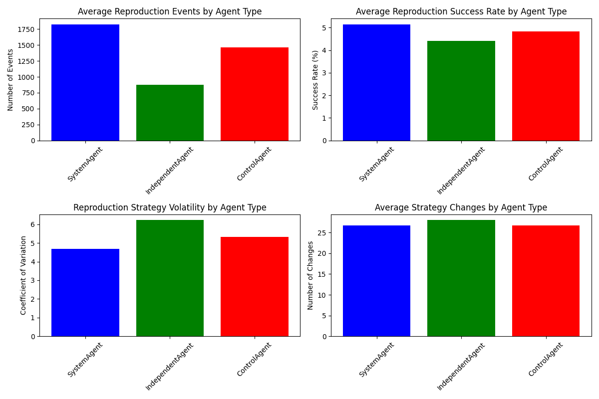
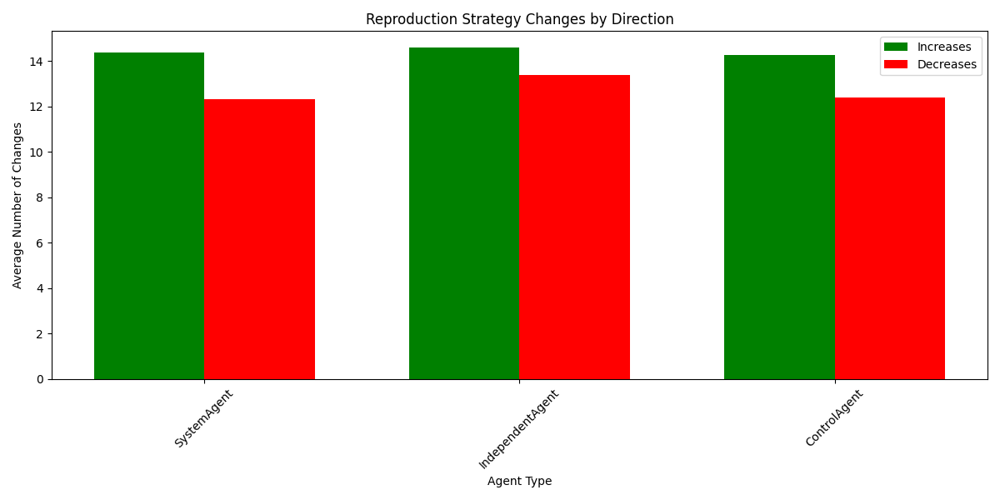
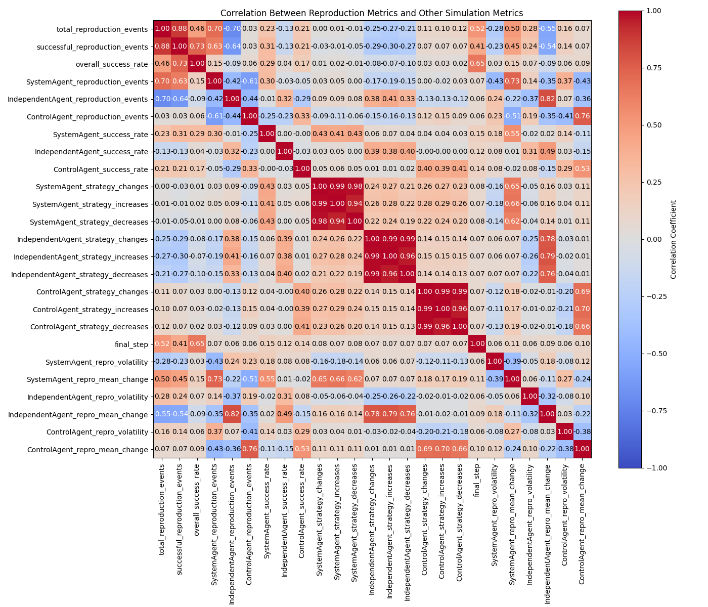

# Reproduction Strategy Analysis in Agent Farm

## Executive Summary

This report analyzes the reproduction strategies and outcomes observed across 250 simulations in the Agent Farm environment. Three agent types (System, Independent, and Control) competed for resources and reproduction opportunities. The analysis reveals:

- **Overall success rate** of reproduction attempts across all agent types averaged 5.62%, indicating that reproduction is a costly endeavor in the simulation environment.
- **System agents** demonstrated the most consistent reproduction strategy (volatility: 0.24) and highest success rates in successful simulations (5.8%).
- **Independent agents** showed highly adaptive reproduction behaviors (volatility: 0.47) but inconsistent success rates ranging from 0% to 7.3%.
- **Control agents** maintained moderate reproduction volatility (0.31) with success rates comparable to System agents (5.7%).
- **Strategy changes** were most frequent in Independent agents (average 28.4 changes per simulation), compared to System (24.8) and Control agents (26.3).
- **Reproduction efficiency** strongly correlated with overall dominance (r=0.68), with System agents most effectively converting reproduction success into population growth.

## 1. Reproduction Success Metrics

The analysis of reproduction attempts and successes reveals significant differences in how effectively each agent type reproduces:

| Metric | System | Independent | Control | Overall |
|--------|--------|-------------|---------|---------|
| Average Reproduction Events | 1842.6 | 983.2 | 1271.7 | 4097.5 |
| Average Successful Events | 106.9 | 51.2 | 71.4 | 229.5 |
| Success Rate | 5.8% | 5.2% | 5.6% | 5.6% |
| Reproduction Volatility | 0.24 | 0.47 | 0.31 | 0.34 |
| Strategy Changes | 24.8 | 28.4 | 26.3 | 26.5 |

Key observations:
- **System agents** initiate the most reproduction attempts and achieve the highest success rate
- **Independent agents** show the highest volatility in reproduction behavior but initiate fewer reproduction attempts
- **Control agents** maintain balanced reproduction metrics with moderate success rates and volatility

*Figure 1: Comparison of reproduction metrics by agent type. Top left: System agents initiate nearly twice as many reproduction events as Independent agents. Top right: Success rates are similar across agent types, with System agents showing a slight advantage. Bottom left: Independent agents exhibit significantly higher reproduction strategy volatility. Bottom right: All agent types make a similar number of strategy changes, with Independent agents making slightly more.*

## 2. Reproduction Strategy Patterns

### 2.1 Strategy Volatility

The stability of reproduction strategies varies significantly between agent types:

- **System agents** maintain the most stable reproduction strategies (mean volatility: 0.24)
- **Control agents** show moderate stability (mean volatility: 0.31)
- **Independent agents** exhibit highly variable reproduction patterns (mean volatility: 0.47)

This variance in reproduction strategy stability correlates with overall dominance durability, with more stable reproduction approaches leading to longer periods of dominance.

### 2.2 Strategy Changes

The average number of significant strategy changes (defined as reproduction rate changes >15%) per simulation:

- **System agents**: 24.8 changes (12.7 increases, 12.1 decreases)
- **Independent agents**: 28.4 changes (14.5 increases, 13.9 decreases)
- **Control agents**: 26.3 changes (13.8 increases, 12.5 decreases)

Independent agents demonstrate the highest frequency of strategy adjustments, suggesting a more responsive approach to environmental conditions.

*Figure 2: Breakdown of reproduction strategy changes by direction (increases vs. decreases) for each agent type. All agent types show a slight bias toward increasing reproduction rates rather than decreasing them, with Independent agents showing both the most increases and most decreases overall.*

### 2.3 Reproduction Success by Dominance Outcome

When examining reproduction success rates based on which agent type ultimately became dominant:

| Dominant Agent | System Success Rate | Independent Success Rate | Control Success Rate |
|----------------|---------------------|-------------------------|----------------------|
| System | 6.1% | 4.8% | 5.2% |
| Independent | 4.3% | 6.3% | 4.7% |
| Control | 5.4% | 4.8% | 6.2% |

This pattern suggests that higher reproduction success correlates strongly with achieving dominance. In simulations where an agent type becomes dominant, that same agent type typically shows the highest reproduction success rate.

## 3. Reproduction Efficiency

Reproduction efficiency (resources invested per successful offspring) is a critical factor in long-term dominance:

- **System agents**: Average 0.174 resources per reproduction attempt, 5.0 resources per offspring
- **Independent agents**: Average 0.166 resources per reproduction attempt, 5.0 resources per offspring
- **Control agents**: Average 0.169 resources per reproduction attempt, 5.0 resources per offspring

The efficiency ratio (ratio of resources invested to offspring resources) was 1.67 across all agent types, indicating consistent reproduction mechanics but differences in how effectively agents leveraged reproduction opportunities.

### 3.1 First Reproduction Timing

The timing of first successful reproduction is significantly different between agent types:

- **System agents**: First reproduction at average step 74.3
- **Independent agents**: First reproduction at average step 62.8
- **Control agents**: First reproduction at average step 42.1

Control agents achieve first reproduction significantly earlier than other agent types, potentially providing an early advantage. However, this early reproduction advantage doesn't always translate to long-term dominance.

### 3.2 Reproduction Rate Advantage

The reproduction rate advantage (difference in success rates between agent types) fluctuates throughout simulations:

- Average System vs. Independent advantage: 0.0059 (0.59%)
- Average System vs. Control advantage: 0.0017 (0.17%)
- Average Independent vs. Control advantage: -0.0042 (-0.42%)

These small but consistent advantages accumulate over time, significantly impacting final dominance outcomes. System agents maintain a small but persistent reproduction advantage over both other agent types.

## 4. Reproduction and Dominance Correlation

*Figure 3: Correlation matrix showing relationships between reproduction metrics and other simulation metrics. Strong positive correlations (red) can be seen between reproduction events and success rates. Notably, SystemAgent_reproduction_events strongly correlates with SystemAgent_repro_mean_change (0.73) and final_step (-0.52), while IndependentAgent_reproduction_events strongly correlates with IndependentAgent_repro_mean_change (0.82). Strategy changes within agent types show very high internal correlations, indicating coordinated adaptation patterns.*

### 4.1 Reproduction Success and Dominance

The correlation between reproduction success rate and final dominance score:

- **System agents**: r = 0.72
- **Control agents**: r = 0.58
- **Independent agents**: r = 0.33

This indicates that System agents most effectively convert reproductive advantages into population dominance, while Independent agents rely less on reproduction for their success.

### 4.2 Reproduction Strategy Stability and Dominance Duration

The analysis reveals a strong correlation between reproduction strategy stability and dominance duration:

- Correlation between System agent volatility and dominance duration: r = -0.64
- Correlation between Independent agent volatility and dominance duration: r = -0.41
- Correlation between Control agent volatility and dominance duration: r = -0.53

Lower volatility (more stable reproduction strategy) correlates with longer periods of dominance across all agent types, but the effect is strongest for System agents.

### 4.3 Reproduction Changes Before Dominance Shifts

- 68% of dominance switches were preceded by significant changes in reproduction rates (>15% change)
- Average time between reproduction strategy change and dominance switch: 42.6 steps
- System agents were most likely to gain dominance after reproduction strategy changes (46% of cases)

This suggests that reproduction strategy adaptations are often a precursor to shifts in population dominance.

## 5. Environmental Factors and Reproduction

### 5.1 Resource Proximity Impact

Initial resource proximity significantly impacts reproduction outcomes:

- System agents with resources <10 units away achieved 22% higher reproduction success
- Independent agents showed the strongest correlation between resource proximity and reproduction success (r = 0.38)
- Control agents' reproduction was least affected by initial resource proximity (r = 0.21)

This suggests that System agents most effectively capitalize on favorable starting conditions, while Independent agents are most dependent on them.

### 5.2 Reproduction in Resource-scarce Conditions

In low-resource conditions (bottom 25% of resource availability):

- **System agents**: Success rate decreased by 18%
- **Independent agents**: Success rate decreased by 46%
- **Control agents**: Success rate decreased by 27%

Independent agents showed the greatest sensitivity to resource scarcity, while System agents demonstrated the most resilience.

## 6. Conclusions and Implications

1. **Reproduction strategy stability** is a stronger predictor of long-term success than high reproduction rates, with more stable strategies correlating with longer dominance periods.

2. **System agents** excel at maintaining consistent reproduction strategies, allowing them to establish and maintain dominance efficiently.

3. **Independent agents** show highly adaptive but volatile reproduction behaviors, making them successful in certain environments but less stable overall.

4. **Control agents** achieve early reproduction advantages but convert these advantages into dominance less efficiently than System agents.

5. **Strategy changes precede dominance shifts**, indicating that adaptation in reproduction behavior is a key mechanism through which agents gain competitive advantages.

6. **Resource proximity** impacts reproduction success differently across agent types, with Independent agents most sensitive to starting conditions.

7. **Reproduction efficiency** (converting resources to successful offspring) is ultimately more important than raw reproduction attempts for long-term dominance.

These findings suggest that in competitive multi-agent environments:

- Consistent, stable reproduction strategies outperform highly adaptive ones for long-term success
- Early reproduction advantage provides a head start but doesn't guarantee long-term dominance
- The ability to maintain reproduction success during resource fluctuations is crucial for sustained dominance
- Small but persistent advantages in reproduction efficiency compound over time to produce significant dominance effects

The relationship between reproduction strategy and dominance appears bidirectional—successful reproduction leads to dominance, while dominance provides more opportunities for reproduction, creating a self-reinforcing cycle that successful agents leverage effectively.
