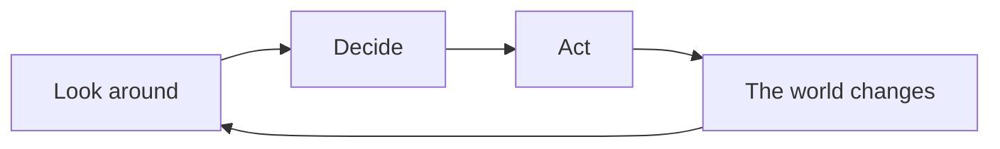

# A gentle introduction

This research asks a simple-sounding question: **when many individuals share a limited world, what mix of helpfulness and self-interest actually works?**

You do not need computer science, mathematics, or machine learning to follow this page. The ideas are closer to a board game than to a textbook.

The shareable explainer below walks through all four ideas — what an agent is, what the environment is, what agents do, and an example on a grid. The file to send is [intro-explainer.mp4](../assets/intro-explainer.mp4) (about 55 seconds, 720p).

<video controls playsinline preload="metadata" style="width:100%;height:auto;border:1px solid var(--border);border-radius:6px;">
  <source src="{{ '/assets/intro-explainer.mp4' | relative_url }}" type="video/mp4" />
</video>

## What is an agent?

An **agent** is one actor in the world. Think of a person, an animal, or a character in a game.

Each agent:

- lives at a place on the map
- carries a little store of energy (food)
- can look at what is nearby
- chooses what to do next
- lives or dies by those choices

Nobody in the middle tells an agent what to do. A clock simply says “your turn,” and the agent decides for itself.

This work uses a few kinds of agents that *lean* in different directions:

| Everyday name | How they tend to behave | Name in the simulation |
| --- | --- | --- |
| Cooperative | Share more, fight less | System agent |
| Self-interested | Keep food, compete more | Independent agent |
| Balanced | A middle path, used as a comparison | Control agent |

These are tendencies, not personalities. Every agent still chooses from the same menu of actions.

## What is the environment?

The **environment** is the world the agents live in. Here it is a **grid**: a checkerboard of squares, like a city-block map or a board-game board.

Each square is a place. Some squares hold **food**. Food can run low and slowly grow back. Agents share this world, so one agent’s meal is food another agent cannot eat.

The environment also has **rules**: how far you can walk, how close you must be to eat, when you can have offspring, what happens if you starve. Agents do not get to rewrite those rules. They only choose actions inside them.

That combination — a shared map, limited food, and fixed rules — is what makes the research interesting. The same world can produce very different stories depending on who lives there.

## What do agents do?

On every turn, each living agent does the same three things:

1. **Look** at nearby food, neighbors, and its own energy.
2. **Decide** among a short list of actions.
3. **Act**, which changes the agent, a neighbor, or the map.



The usual actions, in everyday words:

- **Walk** to another square
- **Eat** food that is close enough
- **Share** food with a neighbor
- **Fight** a nearby agent
- **Defend** against a fight
- **Have offspring** if the agent has enough energy
- **Wait** and do nothing this turn
- **Call out** to neighbors (a simple message)

After everyone has acted, food may grow back a little, some agents may die, and the next turn begins.

From those local choices, larger patterns appear: clusters around food, boom-and-bust populations, cooperation, conflict. The research measures those patterns instead of scripting them.

## An example on a grid

The animation below is a **real, short run** of this world — not a cartoon drawn by hand. The map is 16 squares by 16 squares. A handful of agents share a few patches of food.

<figure>
  
  <figcaption>
    Green patches are food (darker green means more). Blue dots are cooperative agents, red dots are self-interested agents, and orange dots are balanced agents. Larger dots are carrying more energy.
  </figcaption>
</figure>

What to watch for:

- Agents **walk** toward food instead of sitting still.
- A green patch **shrinks** when someone eats and can **return** as food grows back.
- Two dots on the same square are neighbors. They might share, compete, or simply pass through.
- Same-color dots often **cluster**. Nobody programmed “blue agents stick together.” It happens because many local choices add up.
- If a run goes well, new dots appear (offspring). If food runs out, dots disappear (starvation).

This clip is a postcard, not the experiment. Research runs last thousands of turns and repeat the same setup many times so a single lucky (or unlucky) story does not decide the result.

The question behind the postcard is still the one at the top of this page: does a **mix** of cooperative and self-interested agents survive better, waste less food, and stay steadier than a world of only helpers or only competitors?

## Why this is interesting

If the only thing that mattered was “be nice” or “look out for yourself,” the answer would be obvious. In a limited world it is not.

- All helpers may conserve food but adapt slowly when the map changes.
- All competitors may grab food quickly and then strip the map bare.
- A mix can create side effects neither type produces alone — help that leaks to neighbors, pressure that keeps a population from overgrowing, clusters that hold a patch or abandon it.

Those side effects are **emergent**: nobody programmed “form a crowd around the eastern food.” They appear because many agents, each seeing only a little, act at the same time.

Later work in this project also lets agents **learn** during a lifetime and **pass traits** to offspring. You can ignore those layers for now. The grid, the food, and the three tendencies are enough to understand the stage.

## Where to go next

- [Installation](installation.md) — set up a computer to run this yourself
- [First simulation](first-simulation.md) — start a run and look at the files it writes
- [Architecture](../concepts/architecture.md) — how the pieces fit, once you want the technical picture
- [Glossary](../reference/glossary.md) — short definitions of agent, environment, action, and related words
- [Experiments catalog](../research/experiments-catalog.md) — the actual studies built on this world
- [Research notes](../concepts/agents-and-decisions.md) — the original questions about balanced populations

To regenerate the shareable explainer (needs Manim: `pip install '.[intro]'`):

```bash
python scripts/render_intro_explainer.py
```

The short grid-only GIF above can be rebuilt with:

```bash
PYTHONHASHSEED=0 python scripts/render_intro_grid_example.py
```
