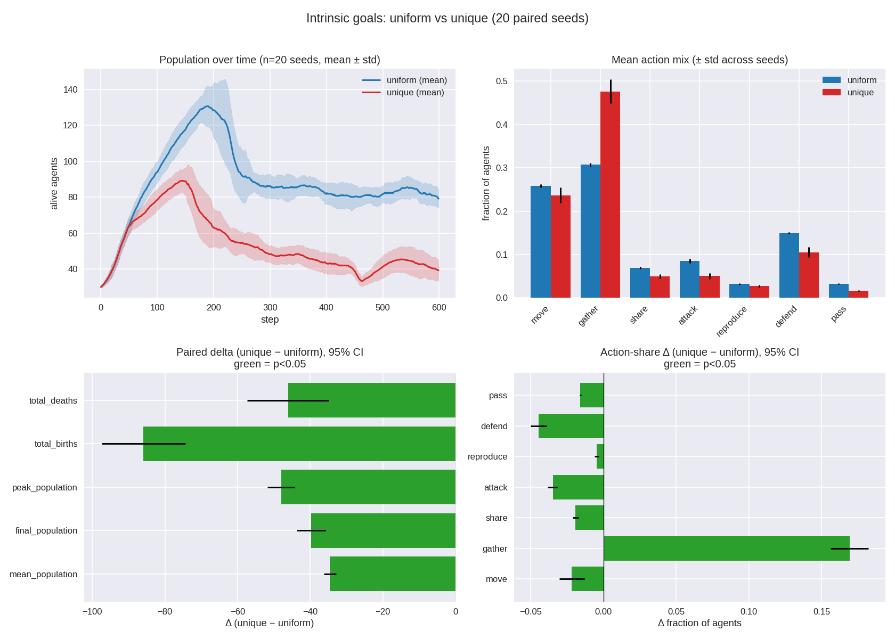

The reward function is the one thing every agent in AgentFarm has historically
shared. Two agents could inherit different learning rates, different action
priors, different everything — but they were all graded by the same yardstick:
gain resources, keep health up, stay alive, do *something* each step. This post
asks what happens when we take that last shared assumption away and let the
**objective itself** be a per-agent, heritable trait.

The short version: heterogeneous, randomly-drawn goals are not a wash and they
are not a free lunch. Against a matched control, a population of agents that
each optimize a *different* reward function carries **~40% fewer agents** and
collapses its behavior toward gathering. The effect is enormous and dead
consistent across 20 paired seeds.

## The manipulation

Each agent's per-step reward is computed in `AgentCore._calculate_reward`, which
now reads a block of **Chromosome C** goal genes (the `reward_*` loci in
`farm/core/hyperparameter_chromosome.py`):

| Gene | Default | Range | Meaning |
|------|---------|-------|---------|
| `reward_resource_weight` | 0.1 | [0, 2] | value of net resource gain |
| `reward_health_weight` | 0.5 | [0, 2] | value of net health gain |
| `reward_survival_weight` | 0.1 | [0, 1] | per-step bonus for staying alive |
| `reward_death_penalty` | 10.0 | [0, 50] | penalty applied on death |
| `reward_action_bonus` | 0.05 | [0, 1] | bonus for any non-`pass` action |
| `reward_gather_bonus` | 0.0 | [0, 2] | intrinsic bonus for gathering |
| `reward_share_bonus` | 0.0 | [0, 2] | intrinsic bonus for sharing |
| `reward_attack_bonus` | 0.0 | [0, 2] | intrinsic bonus for attacking |
| `reward_reproduce_bonus` | 0.0 | [0, 2] | intrinsic bonus for reproducing |

These are ordinary genes: heritable, mutated on reproduction, selected
implicitly (a self-defeating goal kills its carrier and dies out), and logged
automatically by the gene-trajectory and speciation tooling. The default
chromosome reproduces the historical reward formula exactly, so the control arm
is the world as it always was.

The experiment (`farm/runners/intrinsic_goals_experiment.py`) runs two arms with
**identical seeds and configuration** — the only difference is the agents'
objectives:

- **`uniform`** (control) — every agent shares the default reward function.
- **`unique`** (treatment) — every initial agent gets an independently sampled
  reward function (each `reward_*` gene drawn uniformly within its bounds);
  offspring inherit and mutate their parent's goal.

Platform-wide initial diversity is turned **off** in both arms, so learning
hyperparameters and action priors stay at their defaults and *only* the goal
genes differ.

## Setup

20 paired replicates, 600 steps per arm, medium selection pressure. Each
replicate uses a distinct seed for both arms, so every comparison is paired and
the only manipulated variable is the objective.

```bash
source venv/bin/activate
python scripts/run_intrinsic_goals_experiment.py \
    --num-steps 600 --seed 42 --num-replicates 20 \
    --selection-pressure medium \
    --output-dir experiments/intrinsic_goals_comprehensive
```

All deltas below are paired (`unique − uniform`) per seed, reported with a 95%
CI and Cohen's *dz*; every one clears p < 0.05 by a wide margin.



## The manipulation took, and it stuck

The treatment population stays genuinely diverse for the whole run. Summed
goal-gene diversity (std across the population) ends at **17.58** in the unique
arm versus **1.52** in the control (Δ +16.06, *dz* = 7.88). Selection over 600
steps did **not** grind the diverse objectives back down to a monoculture —
multiple goals coexist all the way to the end.

## Diverse goals suppress the population

| Metric | uniform | unique | Δ (paired) | Cohen's *dz* |
|---|---|---|---|---|
| mean population | 88.2 | 53.7 | −34.5 | −9.88 |
| final population | 79.1 | 39.3 | −39.8 | −4.71 |
| peak population | 142.5 | 94.5 | −48.0 | −5.99 |
| total births | 227.0 | 141.1 | −85.9 | −3.50 |
| total deaths | 177.9 | 131.8 | −46.1 | −1.92 |

The population panel tells the story: the control climbs to ~130 around step 180
and then settles near 80, while the unique arm peaks lower (~90) and then
**declines steadily**, still trending down at step 600. Fewer births (−86)
dominate fewer deaths (−46), so the net effect is a smaller population at a lower
carrying capacity. Random objectives are, on average, *maladaptive* relative to
the hand-tuned baseline.

## Behavior collapses toward gathering

| Action | Δ share (unique − uniform) | Cohen's *dz* |
|---|---|---|
| gather | **+16.9 pp** | +6.08 |
| reproduce | −0.5 pp | −1.59 |
| pass | −1.6 pp | −12.73 |
| share | −1.9 pp | −4.55 |
| move | −2.2 pp | −1.16 |
| attack | −3.5 pp | −4.64 |
| defend | −4.4 pp | −3.80 |

Unique-goal agents spend ~48% of their actions gathering versus ~31% in the
control, and *everything else* drops. The behavioral signature of "everyone
wants something different" turns out to be "almost everyone over-invests in
resource gathering" — consistent with the lower birth rate and the shrinking
population.

## How to read this

This is **random heterogeneous goals vs. one hand-tuned goal** — not "diversity
good" vs. "diversity bad" in the abstract. The control is a strong, optimized
baseline, so the cleanest reading is that *un-curated* objective diversity lowers
collective fitness: when each agent is graded by an arbitrary yardstick, most
yardsticks are worse than the one we tuned, and the population pays for it in
births and headcount.

One structural caveat worth flagging up front: `reward_death_penalty` is sampled
on a [0, 50] range and lands ~20× larger than every other gene (population mean
~24, population std ~13.7), and it barely moves over the run. So a large share of the "diversity"
effect may really be that single high-magnitude gene dominating the reward scale
rather than genuine multi-objective heterogeneity. Disentangling that is a
follow-up, not a conclusion.

## Is the result solid?

Yes. With 20 paired seeds every headline metric is significant at p < 0.05 —
most at p ≪ 1e-12 — with effect sizes from *dz* ≈ 1.6 up to ≈ 12.7 (0.8 is
already "large"). The confidence intervals are tight and nowhere near zero. The
question now is not *whether* diverse goals matter but *which* goals are adaptive
and *why* the population shrinks.

## Open questions

- **Does selection ever purge bad goals?** At medium pressure diversity
  persisted. A low/medium/high sweep would show whether stronger selection
  collapses the diverse objectives and eases the suppression
  ([#892](https://github.com/Dooders/AgentFarm/issues/892)).
- **Stabilize or go extinct?** The unique arm is still declining at step 600. A
  longer horizon (≥1500 steps) would reveal whether it plateaus, recovers, or
  dies out ([#893](https://github.com/Dooders/AgentFarm/issues/893)).
- **Is `reward_death_penalty` the whole story?** Ablating / rescaling that one
  high-magnitude gene would isolate how much of the effect is genuinely
  multi-objective ([#894](https://github.com/Dooders/AgentFarm/issues/894)).
- **Which objectives are adaptive?** Correlating each agent's reward genes with
  its lifespan and lineage size would map the selection gradient on every gene
  ([#895](https://github.com/Dooders/AgentFarm/issues/895)).

## Related docs

- [Intrinsic goals experiment doc](../research/experiments/intrinsic_evolution/intrinsic_goals.md)
- [Intrinsic evolution docs](../research/experiments/intrinsic_evolution/intrinsic_evolution.md)
- [Hyperparameter chromosome design](../design/hyperparameter_chromosome.md)
