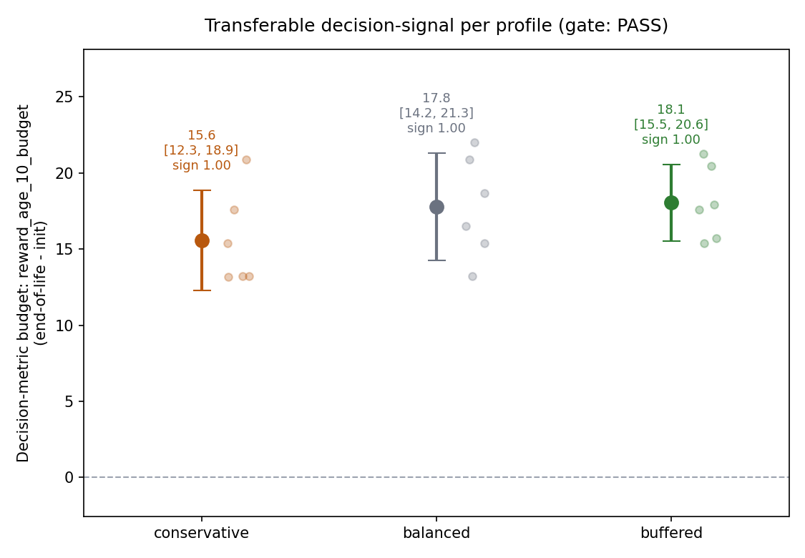
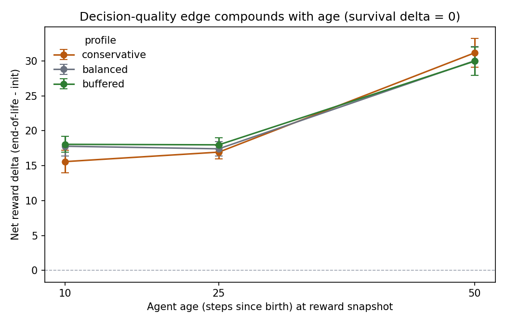
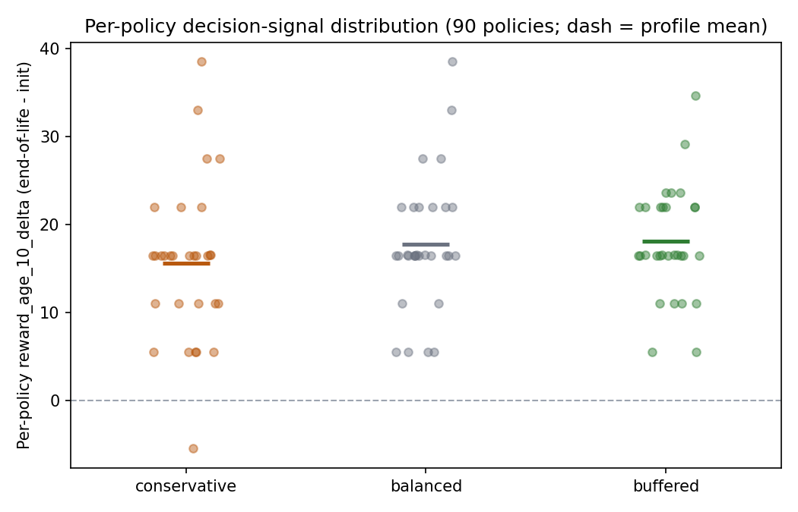

This is the first step of the larger inheritance-ladder experiment tracked in
[#904](https://github.com/Dooders/AgentFarm/issues/904). That issue proposes
building richer inherited payloads (P2 plasticity damping, P3 optimizer +
replay-slice transfer, P4 gated/blended warm-start) on top of the existing P0
(Baldwinian) and P1 (Lamarckian) modes, then running a multi-seed A/B to find
out *when* inheriting more of a parent's learned state helps.

But none of that is worth building if there is nothing worth inheriting. The
[05-16 "is the DQN actually learning?"](2026-05-16-is-the-dqn-actually-learning.md)
post showed that within-life learning in the default config is barely
detectable, and the [05-21 A/B](2026-05-21-baldwinian-vs-lamarckian-ab-harness.md)
and [06-04 newborn-level](2026-06-04-are-we-measuring-at-the-wrong-level.md)
posts found no robust fitness gain from copying a parent's policy. So #904
opens with an explicit **precondition gate**: in a learning-positive regime,
does an end-of-life policy measurably make *better decisions* than a
freshly-initialized one? If that budget is ~null, the richer-payload work stops
and we record the negative result. This post runs that gate.

**It passes — but only once the baseline is fair, and the real signal is much
smaller than it first looks.** An early version of this gate compared the
trained policy against a *pure-greedy* random-init net and reported a huge
+566-616 reward budget. That number was an artifact: greedy-argmax on an
untrained network is a near-degenerate fixed-action controller that simply
dies, so the "budget" was almost entirely *survival* — "the trained net stays
alive, the broken one doesn't." Re-running against a **non-degenerate baseline**
(the real `softmax(Q) x action_weights` policy the agent actually uses) erases
the survival gap completely and leaves a genuine but **modest** decision-quality
signal: the trained policy forages a few percent better per step, worth ~+15-30
net reward over early life. That smaller signal is robust in all three profiles,
so the P2-P4 work is still justified — at a realistic effect size.

## The regime

The gate deliberately does *not* use the default config, where within-life
learning is ~null. It uses a learning-positive regime designed to give the DQN
a fair chance to learn and to make the measurement clean:

- **Small, fixed population (8 agents), long horizon (3000 steps).** Long-lived
  agents accumulate a full lifetime of within-life learning, which is exactly
  the quantity the gate is about.
- **Reproduction disabled.** The runner patches `AgentCore.reproduce` to a no-op
  while instrumentation is active. This isolates within-life learning from
  evolutionary dynamics (no inheritance, no selection) and keeps the run
  tractable — without it, high-resource ecologies have no population cap and the
  colony explodes into the hundreds, which both swamps the signal and exhausts
  RAM.
- **6 seeds x 3 STABLE profiles.** Seeds `{42, 7, 19, 101, 137, 256}` across
  `conservative` / `balanced` / `buffered`, the same fixed-ecology profiles used
  by the inheritance A/B work, on the `development` map.

Runner: [scripts/measure_transferable_signal.py](../../scripts/measure_transferable_signal.py).

## Two-tier measurement

Measuring whether a policy *changed* is not the same as measuring whether it got
*better*, so the gate reports both.

**Tier 1 - probe-state drift (does the policy move at all?).** Early in each run
we cache a fixed set of observation tensors, snapshot every learning agent's
Q-net at birth and at end-of-life, and compare them on that frozen probe set:
argmax disagreement, max-Q drift, and softmax KL. This is cheap and confirms the
network actually moved, but movement alone is not improvement.

**Tier 2 - grounded rollout differential (the decision metric).** For each
harvested `(birth, end-of-life)` weight pair we run paired, single-agent
held-out rollouts and measure net RL reward as a differential

```
Δ = reward(end-of-life policy) − reward(init policy)
```

Two design choices make this measure decision quality rather than an artifact:

- **A non-degenerate baseline.** Both arms run the *real* action policy —
  `softmax(Q) x action_weights` sampling — not pure-greedy argmax. This matters
  enormously (see below): under greedy, a random-init net collapses to one fixed
  action and dies, so "beats init" degenerates into "isn't broken." Under the
  weighted policy, a random-init net instead falls back to the chromosome action
  priors, i.e. the **Baldwinian P0 baseline** #904 actually compares against.
- **A survival-decoupled metric.** Full-episode reward is `~survival_steps x
  foraging_rate`, so it is dominated by *how long* the agent lives, not how well
  it decides. The gate therefore keys off **early-age net reward** (reward at a
  fixed age of 10/25/50 steps), plus per-step reward rate. Because every
  survivor accrues over the same short window, this isolates foraging/decision
  quality — exactly the "net early RL reward at ages N" the inheritance A/B is
  graded on.

Cohort aggregation uses the standard project robustness gate: a profile passes
only if the paired (per-seed) 95% CI **excludes zero** *and* within-profile
**sign agreement >= 0.75**.

## Headline result: PASS (on the decision metric)

All three profiles clear both gate criteria on the survival-decoupled early-age
reward metric, with perfect sign agreement:

| Profile | Mean Δ reward@age10 | 95% CI | Sign agr. | Robust | Mean drift |
| --- | --- | --- | --- | --- | --- |
| conservative | +15.6 | [12.3, 18.9] | 1.00 | yes | 0.80 |
| balanced | +17.8 | [14.2, 21.3] | 1.00 | yes | 0.87 |
| buffered | +18.1 | [15.5, 20.6] | 1.00 | yes | 0.83 |



Every profile's 95% CI sits above zero (faint per-seed points behind each
marker), which is the verdict in one picture — note the y-axis tops out near 25,
not 800.

Tier 1 agrees that the policies genuinely moved: mean argmax disagreement is
**0.83** against a 0.05 threshold, with max-Q drift ~2.8-4.6 and softmax KL
~0.02-0.04 per cell. End-of-life policies are substantially different from their
random init — and, on the fair baseline, that difference is a real (if small)
improvement.

## The baseline correction (why the number dropped 25x)

The first cut of this gate ran **pure-greedy** rollouts for both arms and
reported a +566-616 budget that *looked* decisive. Two diagnostics killed it:

- **Survival delta is now identically zero** — for **all 90** harvested
  policies. Under the realistic action-weighted policy, a random-init agent
  survives the held-out episode exactly as often as a trained one (both
  essentially always survive the easy single-agent ecology). The entire original
  budget lived in a survival gap that only existed because greedy-argmax on a
  random net is a degenerate controller that dies. Fix the baseline and the gap
  vanishes.
- **Full-episode reward collapses from ~+587 to ~+24** (median +24.8, range
  -6.6 to +60.9; only 4/90 ≤ 0). What remains is *not* survival — survival is
  constant — it is a small genuine foraging edge.

So the lesson for the whole #904 program: **the baseline, not the payload, was
doing most of the talking.** A win against a broken controller is not evidence
that there is learned decision-quality signal to inherit.

## What the real signal looks like

With survival neutralized, the signal is a modest, consistent foraging
improvement that **compounds with age** — the fingerprint of a genuinely better
policy rather than noise:

- Net reward at **age 10: +17.1** (99% of policies positive), **age 25: +17.4**
  (100%), **age 50: +30.4** (100%).
- Per-step reward rate **+0.16/step** (96% positive) — a few percent better than
  the ~5/step steady-state foraging rate.



The per-policy distribution of the gate metric is tight and almost entirely
positive — no survival-driven ±800 bimodality, just a band a little above zero:



A few framing numbers:

- 90 harvested policies (5 per cell x 18 cells); harvested agents were long-lived
  (lifespans 1011-2999, mean ~2771 of 3000), so within-life learning had a full
  horizon to act.
- The signal is real but small: ~+0.16 reward/step is a single-digit-percent
  foraging gain, growing to ~+30 net reward by age 50. This is the honest size of
  the prize P2-P4 are competing for — not the +600 the broken baseline implied.

## Patterns

- Across-profile means are **tightly bunched** at age 10 (15.6 / 17.8 / 18.1) and
  essentially converge by age 50 (~30 each), so the signal does not depend on a
  single favorable ecology.
- **`buffered` is marginally strongest early** (+18.1, narrowest CI) — more
  resources, slightly more reliable learning — but the gaps are within noise.
- **Seed 256 is the weakest** (≈13 at age 10 in conservative/balanced) but still
  clearly positive, so it never threatens the gate.

## What it means for #904

The gate passes on the right metric, so the precondition is satisfied and the
P2-P4 inheritance ladder is worth building. But the corrected result reshapes
expectations:

1. **Size the A/B for a small effect.** The prize is ~+15-30 net early reward
   (~+0.16/step), not +600. The inheritance A/B should be powered to detect a
   single-digit-percent foraging gain and must report **early-age net reward**
   (the metric that survived scrutiny), never full-episode reward.
2. **Baselines matter more than payloads.** The 25x drop here came entirely from
   making the *baseline* fair. P2-P4 must each beat the **Baldwinian P0** policy
   (chromosome action priors), which is what a random-init net under the weighted
   policy already is — not a strawman. A richer payload that only beats a broken
   controller proves nothing.
3. **Don't lean on survival.** Under a fair baseline there is *no* survival
   advantage to inherit in this regime; the transferable quantity is foraging
   decision quality. Verify P2-P4 on that, and on cross-ecology retention (the
   `--cross-eval-profile` probe), not on "stays alive."

## What shipped + how to reproduce

The runner instruments a normal simulation rather than changing the core: it
monkeypatches the decision module to (a) capture the frozen probe set and each
agent's birth/end-of-life Q-net snapshots during training, and (b) drive the
chosen eval policy during held-out evaluation. By default eval runs the **real
action-weighted policy** (`--eval-policy weighted`) and the gate keys off the
early-age reward budget (`--gate-metric reward_age_10_budget`); `--eval-policy
greedy` reproduces the old (degenerate) pure-greedy read for comparison. It also
pins torch to a single thread and blocks reproduction while active, so runs stay
fast and bounded.

The full 6x3 sweep (population 8, 3000 steps, eval horizon 150, 2 eval seeds,
reward ages 10/25/50, `min_lifespan` 100, top-5 policies per cell) reproduces
with:

```bash
PYTHONHASHSEED=0 python scripts/measure_transferable_signal.py \
  --output-dir experiments/transferable_signal_v2
```

Outputs land in `experiments/transferable_signal_v2/` —
`signal_budget_summary.json` / `.md` plus per-cell `cell_result.json`
checkpoints (re-run with `--resume` to skip completed cells). The three figures
above are regenerated with:

```bash
python scripts/plot_transferable_signal.py \
  --summary experiments/transferable_signal_v2/signal_budget_summary.json
```

## Open questions

- **Does the small edge transfer without being washed out?** The signal exists
  but is modest, which is exactly the regime where P1 (weights-only) was a null:
  a few good updates can be overwritten by a child's first noisy steps. P2
  (plasticity damping) and P3 (optimizer + replay) are the direct tests.
- **Does it survive a cross-ecology shift?** In-distribution the edge is robust;
  the `--cross-eval-profile` probe asks whether a policy trained in one ecology
  still forages better in another, or whether it has overfit. That is the overfit
  discriminator for the payload ladder.
- **Which payload captures it?** The gate says a (small) signal exists; #904's
  ladder asks which of P2-P4 transfers it to offspring. That is the next post.

## Related docs

- [Implement inherited-payload ladder (P2-P4) and run the #848 experiment (#904)](https://github.com/Dooders/AgentFarm/issues/904)
- [Inherited payload design](../../design/inherited_payload_design.md)
- [Is the DQN actually learning?](2026-05-16-is-the-dqn-actually-learning.md)
- [Baldwinian vs Lamarckian: policy warm-start across three resource regimes](2026-05-21-baldwinian-vs-lamarckian-ab-harness.md)
- [Are we measuring at the wrong level?](2026-06-04-are-we-measuring-at-the-wrong-level.md)
