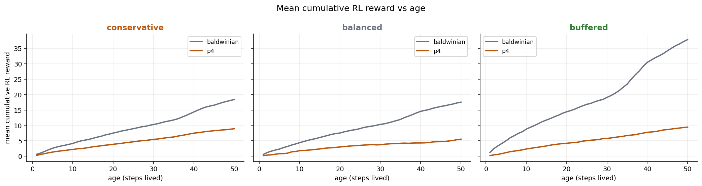

The [06-20 transferable-signal gate](2026-06-20-transferable-signal-budget.md)
cleared the precondition for [#904](https://github.com/Dooders/AgentFarm/issues/904):
in a learning-positive regime an end-of-life policy really does forage a little
better than its own random init, worth ~+15-30 net early reward. That is the
prize the inherited-payload ladder is supposed to hand to offspring. This post
runs the ladder itself — the full matched A/B across all five inheritance arms —
and grades it on the metric the gate validated: **net RL reward over an
offspring's first {10, 25, 50} steps of life.**

The [pilot](https://github.com/Dooders/AgentFarm/issues/964) (balanced profile,
2 seeds) was too underpowered to say anything — huge CIs, seeds disagreeing on
sign. The full 90-run sweep is not underpowered, and the answer is sharp and
negative: **no payload beats Baldwinian cold-start. Every robust early-life
effect is a loss, and the richer the payload, the bigger the loss.** More
importantly, the *shape* of the failure is diagnostic — warm-start doesn't
merely fail to help, it clamps offspring to a low, ecology-blind reward
trajectory.

## The regime and what ran

One matched sweep, graded per (profile, seed) against the P0 baseline with the
standard project robustness gate (paired 95% CI excludes zero **and**
within-profile sign agreement >= 0.75):

- **Arms (5):** `baldwinian` (P0), `lamarckian` (P1, weights), `p2` (plasticity
  damping), `p3` (optimizer state + replay slice), `p4` (fitness-gated θ blend).
  Default warm-start knobs (damping 0.5, replay limit 256, blend 0.5, gate 1.0).
- **Population:** 8 independent agents, `max_population=32`. Unlike the gate,
  **reproduction stays on** — inheritance happens at reproduction — so the cap
  contains the colony instead of the gate's fixed-8 no-repro setup.
- **Horizon:** 3000 steps, 200-step warmup (offspring scored are born after
  warmup), snapshot every 100.
- **Matrix:** 3 profiles (`conservative`/`balanced`/`buffered`) x 6 seeds
  (`42 7 19 101 137 256`) x 5 arms = **90 runs**.

Offspring cohorts are healthy — typically 50-160 post-warmup offspring per run
reaching age 10 — so this is a genuinely powered comparison, not the n=2 pilot.

## Headline result: the ladder is entirely negative

Sixteen (profile, arm, age) cells clear the robustness gate on net early RL
reward. **All sixteen are negative** — offspring do worse than cold-start P0.
None are positive. Mean deltas at age 50 (treatment minus baldwinian):

| Profile | lamarckian | p2 | p3 | p4 |
| --- | --- | --- | --- | --- |
| conservative | -1.5 | -6.6 | -2.4 | **-9.5** |
| balanced | -6.8 | -6.1 | -2.8 | **-12.0** |
| buffered | **-25.3** | **-24.1** | **-21.2** | **-28.4** |

(Bold = robust.) On `buffered`, *every* arm loses robustly at every age; on
`conservative`/`balanced`, P1-P3 are mostly null-to-negative and P4 is
robustly negative. There is no profile, no age, and no arm where a richer
inherited payload beats the cold-start baseline.

The whole-population readouts (`compare_inheritance_arms.py`) tell the
complementary story: **no robust effect for any arm on any profile** for
population mean/final, speciation slope, or startup-transient stability. As in
the 05-21 and 06-04 nulls, the colony-level summaries don't move; the action is
entirely in early life, and there it is harmful.

## The diagnostic: warm-start clamps offspring regardless of ecology

The single most informative view is cumulative reward vs. age, baseline vs. the
richest payload (P4):



Cold-start (baldwinian) offspring **track the ecology**: they earn ~18 net
reward by age 50 in `conservative`/`balanced` and ~38 in `buffered`, because a
richer resource profile is worth more to an agent that can exploit it. The
warm-started offspring **collapse into the same low band (~9) in all three
profiles** — the environment gets richer and the warm-started child cannot cash
in. It is behaving to a parent-derived operating point that is blind to the
ecology it was actually born into.

That is why the harm is largest exactly where the opportunity is largest
(`buffered`): warm-start throws away the most reward precisely where cold-start
offspring gain the most. The loss is also reward-specific — **survival barely
moves and the positive-action fraction is flat** (a single tiny robust shift,
+0.034 for lamarckian/buffered). Warm-started offspring don't die more; they
just forage worse.

## Dose-response: more payload, more harm

The arms form a rough ladder of "how much of the parent is imposed on the
child," and the damage grows with it. **P4 — the richest payload (weight blend +
optimizer state + replay + fitness gate) — is the worst arm nearly everywhere**,
robustly negative even on `conservative` and `balanced` where P1-P3 are only
null. P3 (optimizer + replay) is usually the mildest; P1/P2 sit in between.

This is the key point for interpreting the result: if the problem were "we
didn't transfer *enough* learned signal," transferring more would help. It does
the opposite, monotonically. The mechanism is not insufficient — it is
maladaptive in this regime.

## Is this a design issue or a hard barrier?

Both, and they are separable — and the separation is now closed.

**It is a real barrier for this design.** Across 90 runs / 3 profiles / 6 seeds,
with warm-start firing on 96-100% of reproduction events (P4 gate hit-rate
~0.995), not one arm/profile/age tips robustly positive. A mechanism that merely
needed tuning would usually win *somewhere*. The complete absence of upside,
plus the dose-response, says that transplanting a parent policy into offspring
is net-harmful here and you cannot tune your way out by enriching the payload.

**The regime was confounded, so this post alone was not yet a fundamental
verdict.** Every arm ran at full saturation (final population 32/32 in
essentially every cell). The +15-30 "honest budget" the whole program is graded
against was measured by the gate in a *sparse, fixed-8, no-reproduction*
regime. Offspring here are born into maximal crowding, where a parent policy
tuned to different conditions is most likely to be wrong — which is exactly the
clamping we see.

That confound is settled in the
[07-09 low-churn follow-up](2026-07-09-lowchurn-inheritance-still-loses.md):
the identical A/B with `--low-churn` (`max_population = 8`) still loses on
every cell. Saturation inflated absolute reward gaps; it did not create the
ranking. The barrier holds in both regimes.

## What it means for #904

Under the decision rule — keep a richer payload only if it robustly beats P0 on
early-life net reward without degrading stability — **none of P1-P4 advance.**
Baldwinian cold-start stays the default. Richer payloads don't help and usually
hurt, worst of all in resource-rich ecologies.

Together with the [low-churn follow-up](2026-07-09-lowchurn-inheritance-still-loses.md),
the honest claim is: *Lamarckian-style policy inheritance does not beat
Baldwinian cold-start on early-life reward in either the saturated or the sparse
learning-positive regime, and richer payloads make it worse.*

## Reproduce

Full sweep (resume-safe; skips completed cells):

```bash
PYTHONHASHSEED=0 python scripts/run_inheritance_mode_ab.py \
  --arms baldwinian lamarckian p2 p3 p4 \
  --population 8 --max-population 32 \
  --num-steps 3000 --snapshot-interval 100 \
  --warmstart-replay-buffer-limit 256 \
  --output-dir experiments/inheritance_ab_learning_positive \
  --disk-database --resume
```

Grade it (primary #904 verdict + whole-population comparison):

```bash
python scripts/analyze_early_life_fitness.py \
  --ab-dir experiments/inheritance_ab_learning_positive \
  --baseline-arm baldwinian --treatment-arms lamarckian p2 p3 p4

python scripts/compare_inheritance_arms.py \
  --baseline-dir experiments/inheritance_ab_learning_positive/baldwinian \
  --baseline-label baldwinian \
  --treatment-dir experiments/inheritance_ab_learning_positive/lamarckian \
  --treatment-dir experiments/inheritance_ab_learning_positive/p2 \
  --treatment-dir experiments/inheritance_ab_learning_positive/p3 \
  --treatment-dir experiments/inheritance_ab_learning_positive/p4 \
  --arm-labels lamarckian p2 p3 p4 \
  --output-dir experiments/inheritance_ab_learning_positive/aggregate
```

Outputs land in `experiments/inheritance_ab_learning_positive/early_life/`
(`early_life_ladder_summary.json` / `.md`) and `.../aggregate/`.

## Open questions

- **Is saturation the killer?** Settled — no. See
  [Sparse ecology doesn't save the ladder](2026-07-09-lowchurn-inheritance-still-loses.md).
- **Does the clamp relax with a weaker blend?** P4 at blend 0.5 imposes half the
  parent policy; sweeping the blend toward 0 should interpolate back to P0. If
  even a small blend hurts in `buffered`, the imposition itself is the problem.
- **Per-offspring warm-start contrast.** Coverage is ~100%, so the arm-level
  comparison can't separate "warm-started" from "born via the treatment path."
  Per-offspring applied/skipped telemetry would let us compare warm-started and
  cold offspring *within* the same run (see the `incompatible_state` skip issue).
- **Different transfer designs.** Distilled priors, delayed fitness-gated
  transfer, or partial-layer warm-start are untested; the barrier is for *this*
  warm-start-on-reproduction ladder.

## Related docs

- [Sparse ecology doesn't save the ladder: warm-start still loses](2026-07-09-lowchurn-inheritance-still-loses.md)
- [Implement inherited-payload ladder (P2-P4) and run the #848 experiment (#904)](https://github.com/Dooders/AgentFarm/issues/904)
- [Pilot early-life results: no RL-reward gain vs P0 (#964)](https://github.com/Dooders/AgentFarm/issues/964)
- [The transferable-signal gate: do learned policies beat their own init?](2026-06-20-transferable-signal-budget.md)
- [Baldwinian vs Lamarckian: policy warm-start across three resource regimes](2026-05-21-baldwinian-vs-lamarckian-ab-harness.md)
- [Are we measuring at the wrong level?](2026-06-04-are-we-measuring-at-the-wrong-level.md)
- [Inherited payload design](../../design/inherited_payload_design.md)
