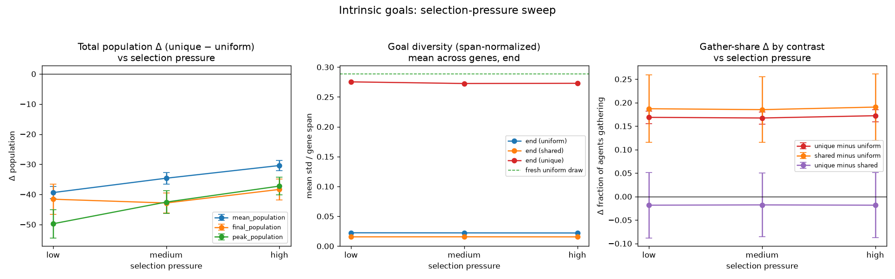

When every agent optimizes an independently sampled reward function, the
population carries fewer agents and its behavior collapses toward gathering.
That raises the question tracked as
[#892](https://github.com/Dooders/AgentFarm/issues/892):

> Does the **strength of selection** decide whether maladaptive/random
> objectives get purged? Stronger selection should shrink goal diversity over
> time (favoring near-baseline objectives) and ease the population suppression;
> weaker selection should let diversity persist or grow with suppression at
> least as severe.

**Short answer:** the unique-goals population is robustly suppressed at every
pressure, and it does **not purge the diverse objectives** — goal diversity
ends near its starting value even under a per-gene, span-normalized metric, and
the gather shift is flat at ~+17 pp. The `unique − uniform` gap *does* shrink
from `low` to `high`, but read the mechanism carefully: the gap narrows because
the **denser control arm** loses more under a density-dependent cost, not
because the random-goal population recovers (see below). And a third `shared`
arm shows the suppression is **mostly not about diversity at all**: ~85% of it
is reproduced by giving every agent the *same* random goal, so the cost is
being *off the tuned default*, while goal heterogeneity per se costs only ~4–6
agents of mean population and is not statistically significant. So pressure changes how heavily
the population *pays* for un-curated objectives, not *which* objectives
persist — and most of that payment is the mean shift, not the diversity.

> **Methodology update.** The first version of this experiment compared only
> `uniform` (default goal) against `unique` (a different random goal per
> agent), which conflates two things: goals being *heterogeneous* and the
> population-mean objective being *shifted off* the hand-tuned default (the
> default sits near the low end of most gene ranges, so a uniform draw weights
> resources ~10× more on average). A third `shared` arm — one random goal given
> to *every* agent — now separates the two. The sweep was re-run with all
> three arms; the runs are deterministic per seed, so the `uniform`/`unique`
> numbers are identical to the first version and the `shared` arm is new.

## The manipulation

The experiment
([`farm/runners/intrinsic_goals_experiment.py`](../../../farm/runners/intrinsic_goals_experiment.py))
runs three arms with identical seeds and configuration so the only difference
is the agents' objectives:

- **`uniform`** (control) — every agent shares the default reward function.
- **`shared`** (homogeneous, off-default) — one reward function is sampled per
  replicate and given to *every* agent, so the population objective is uniform
  but shifted off the tuned default.
- **`unique`** (heterogeneous) — every initial agent gets an independently
  sampled reward function (each `reward_*` gene drawn uniformly within its
  bounds); offspring inherit and mutate their parent's goal.

The three arms decompose the effect: `shared − uniform` is the **mean shift**
off the tuned default, `unique − shared` is **pure goal heterogeneity**, and
`unique − uniform` is the **total** (the original headline). Platform-wide
initial diversity is turned off in every arm, so learning hyperparameters and
action priors stay at their defaults and only the goal genes differ. Selection
pressure is a density-dependent reproduction cost: `low` barely penalizes
crowding, `high` penalizes it steeply, so a maladaptive goal that wastes
actions is punished harder at higher pressure.

## Setup

20 paired replicates, 600 steps per arm, base seed 42, per pressure level. Each
replicate uses a distinct seed shared by all three arms, so every pairwise
contrast is paired and the only manipulated variables are the objective and
the pressure level. The population cap is set to 3000 so density-dependent
selection — not a hard headcount ceiling — governs the dynamics. Ran on a GCP
Spot `n2-standard-8`.

```bash
source venv/bin/activate
python scripts/run_intrinsic_goals_pressure_sweep.py \
    --pressures low medium high \
    --num-steps 600 --seed 42 --num-replicates 20 \
    --max-population 3000 --output-dir experiments
python scripts/analyze_intrinsic_goals_pressure_sweep.py --sweep-dir experiments
```

Deltas are paired per seed, reported with a 95% CI and Cohen's *dz*. The
population/behavior tables below are the `unique − uniform` total; the
`shared`-arm decomposition (`shared − uniform`, `unique − shared`) is in the
"Separating heterogeneity from the mean shift" section. Source artifacts:
`gcp-results-3arm/combined_comparison.*`.



## Population suppression eases with pressure

Paired `unique − uniform` deltas (mean [95% CI], *dz*). `*` marks p < 0.05.

| Metric | low | medium | high |
|---|---|---|---|
| mean population | −39.40* [−41.42, −37.38] (*dz*=−9.13) | −34.63* [−36.55, −32.70] (*dz*=−8.42) | −30.41* [−32.16, −28.66] (*dz*=−8.12) |
| final population | −41.60* [−46.58, −36.62] (*dz*=−3.91) | −42.85* [−46.09, −39.61] (*dz*=−6.18) | −38.35* [−41.79, −34.91] (*dz*=−5.22) |
| peak population | −49.75* [−54.45, −45.05] (*dz*=−4.95) | −42.55* [−46.26, −38.84] (*dz*=−5.36) | −37.25* [−40.18, −34.32] (*dz*=−5.95) |
| total births | −110.65* [−126.59, −94.71] (*dz*=−3.25) | −90.35* [−101.49, −79.21] (*dz*=−3.80) | −61.85* [−71.44, −52.26] (*dz*=−3.02) |
| total deaths | −69.05* [−83.01, −55.09] (*dz*=−2.31) | −47.50* [−59.80, −35.20] (*dz*=−1.81) | −23.50* [−32.80, −14.20] (*dz*=−1.18) |
| gather-share Δ | +0.17* [0.16, 0.18] (*dz*=5.84) | +0.17* [0.15, 0.18] (*dz*=6.06) | +0.17* [0.16, 0.18] (*dz*=6.36) |

Absolute levels for context (mean / peak population):

| Arm | low | medium | high |
|---|---|---|---|
| uniform | 95.3 / 152.3 | 88.4 / 142.3 | 81.9 / 129.2 |
| shared | 62.3 / 108.7 | 58.8 / 100.7 | 56.0 / 96.5 |
| unique | 55.9 / 102.6 | 53.8 / 99.8 | 51.5 / 91.9 |

The unique arm is suppressed at every pressure — fewer agents, lower peak, and
fewer births — and the size of that gap **shrinks as selection gets stronger**:
mean-population Δ narrows from −39.4 to −30.4, peak Δ from −49.8 to −37.2,
births Δ from −110.7 to −61.9, and deaths Δ from −69.1 to −23.5. Final
population is the exception — it stays around −40 across all three levels.

But the *mechanism* is not what the hypothesis assumed. The gap does not narrow
because the random-goal population recovers — in absolute terms it **also
declines** with pressure (mean 55.9 → 53.8 → 51.5). It narrows because the
control declines *faster* (95.3 → 88.4 → 81.9). The entire −9.0 change in the
mean-population gap (−39.4 → −30.4) is the control falling 13.4 while the
treatment falls only 4.4. That is close to mechanical: the reproduction cost is
density-dependent, and the control runs at ~1.7× the treatment's density, so it
is hit harder by the crowding penalty regardless of goal composition. Framed as
a fraction of the control, the unique arm rises only modestly, from 58.7% to
62.9%. So "stronger selection eases the suppression" is better stated as
"stronger density-dependent pressure compresses the denser control toward the
sparser treatment."

## Separating heterogeneity from the mean shift

The `shared` arm splits the total into two paired contrasts. `shared − uniform`
is the cost of the population's *average* objective sitting off the tuned
default; `unique − shared` is what goal *diversity* adds on top of that.

`shared − uniform` (mean shift):

| Metric | low | medium | high |
|---|---|---|---|
| mean population | −33.04* [−42.43, −23.65] (*dz*=−1.65) | −29.58* [−37.88, −21.28] (*dz*=−1.67) | −25.93* [−33.36, −18.50] (*dz*=−1.63) |
| final population | −35.85* [−48.30, −23.40] (*dz*=−1.35) | −34.75* [−46.64, −22.86] (*dz*=−1.37) | −32.15* [−41.62, −22.68] (*dz*=−1.59) |
| peak population | −43.65* [−57.50, −29.80] (*dz*=−1.48) | −41.65* [−54.54, −28.76] (*dz*=−1.51) | −32.60* [−43.20, −22.00] (*dz*=−1.44) |
| gather-share Δ | +0.19* [0.12, 0.26] (*dz*=1.22) | +0.19* [0.12, 0.25] (*dz*=1.24) | +0.19* [0.12, 0.26] (*dz*=1.26) |

`unique − shared` (pure heterogeneity):

| Metric | low | medium | high |
|---|---|---|---|
| mean population | −6.36 [−15.66, 2.93] (*dz*=−0.32) | −5.05 [−13.29, 3.20] (*dz*=−0.29) | −4.48 [−11.91, 2.94] (*dz*=−0.28) |
| final population | −5.75 [−18.20, 6.70] (*dz*=−0.22) | −8.10 [−18.20, 2.00] (*dz*=−0.38) | −6.20 [−14.90, 2.50] (*dz*=−0.33) |
| peak population | −6.10 [−19.70, 7.50] (*dz*=−0.21) | −0.90 [−13.65, 11.85] (*dz*=−0.03) | −4.65 [−15.33, 6.03] (*dz*=−0.20) |
| gather-share Δ | −0.02 [−0.09, 0.05] (*dz*=−0.12) | −0.02 [−0.09, 0.05] (*dz*=−0.12) | −0.02 [−0.09, 0.05] (*dz*=−0.12) |

The split is lopsided. The mean shift alone reproduces **~84–85% of the total
suppression** (−33.0 of −39.4 at low, −25.9 of −30.4 at high) and is
significant on mean, peak, and final population at every pressure. Pure
heterogeneity adds only −4 to −6 agents and is **not significant anywhere** —
every CI crosses zero. The behavioral shift decomposes the same way: the whole ~+17 pp
gather shift is carried by the mean shift (+19 pp, significant), while
heterogeneity contributes −2 pp of noise. The pressure trend also lives in the
mean-shift component (−33.0 → −25.9 from low to high), consistent with the
density-compression reading above.

Two caveats on reading the `shared` contrasts. First, their *dz* values (~−1.5)
are much smaller than the total's (~−9) even though the mean deltas are
similar: each `shared` replicate stakes everything on *one* random draw, so
between-replicate variance is large by design, whereas the `unique` arm
averages over ~30 independent draws per replicate. Second, for the same
reason, `shared − uniform` estimates the *average* cost of a random goal —
individual draws range from nearly harmless to catastrophic.

## Do diverse goals get purged?

The first read used the *summed* population std across all `reward_*` genes.
That metric is misleading: `reward_death_penalty` spans [0, 50], so its std
alone (~14 of ~18) is ~80% of the sum, and the number is blind to purging in
the other eight genes. The fix is to normalize each gene's std by its range
before combining, so a fresh uniform draw sits near `1/√12 ≈ 0.29` for *every*
gene and per-gene collapse becomes visible.

Span-normalized diversity (mean std / gene span), unique arm, start vs end:

| Phase | low | medium | high |
|---|---|---|---|
| start (unique) | 0.28 | 0.28 | 0.28 |
| end (unique) | 0.28 | 0.27 | 0.27 |
| end (uniform, drift only) | 0.02 | 0.02 | 0.02 |

Per-gene end values (unique arm) confirm nothing is singled out — every gene
holds near its ~0.29 starting spread at every pressure:

| Gene | start | end (low) | end (medium) | end (high) |
|---|---|---|---|---|
| resource_weight | 0.28 | 0.26 | 0.27 | 0.26 |
| health_weight | 0.29 | 0.28 | 0.27 | 0.27 |
| survival_weight | 0.28 | 0.29 | 0.28 | 0.28 |
| death_penalty | 0.29 | 0.28 | 0.27 | 0.28 |
| action_bonus | 0.28 | 0.27 | 0.27 | 0.26 |
| gather_bonus | 0.28 | 0.27 | 0.27 | 0.28 |
| share_bonus | 0.28 | 0.27 | 0.27 | 0.27 |
| attack_bonus | 0.28 | 0.28 | 0.28 | 0.29 |
| reproduce_bonus | 0.28 | 0.27 | 0.27 | 0.27 |

So the "no purge" reading survives the better metric: high pressure does **not**
drive any gene's diversity toward 0, and the objectives coexist for the full
horizon. The important caveat is the horizon itself — at 600 steps the unique
arm turns over only ~3 generations (~160–190 births at a mean population of
~55), which is very little opportunity for selection to purge standing
variance, so this is evidence of *slow* purging at most, not of selection being
unable to purge ([#893](https://github.com/Dooders/AgentFarm/issues/893)).

Behavior is pressure-invariant too: unique agents spend ~47–48% of actions
gathering versus ~30–31% in the control, a ~+17 pp shift that is essentially
identical at low, medium, and high (*dz* ≈ 6 throughout). This is the direction
a *mean shift* predicts — a uniform draw weights resources ~10× the default —
and the `shared` arm confirms it: a single random goal produces the same +19 pp
gather shift with no additional contribution from heterogeneity.

## Conclusion

The answer to #892 is a qualified **yes on suppression, no on purging** — with
the twist that the suppression is mostly not about diversity:

1. **Suppression eases with pressure.** The mean-, peak-, and birth/death gaps
   all shrink monotonically from `low` to `high` — though the narrowing is the
   denser control being compressed, not the treatment recovering.
2. **The cost is the mean shift, not the diversity.** Giving every agent the
   *same* random goal reproduces ~85% of the suppression; heterogeneity on top
   of that costs −4 to −6 agents and is not significant at any pressure.
3. **Goals are not purged.** Unique-arm span-normalized diversity ends at
   0.27–0.28 (start 0.28) at every level, with no per-gene collapse — no
   monoculture, even at high pressure — and the gather shift is flat at +17 pp.

So selection pressure changes how heavily a population *pays* for un-curated
objectives without changing *which* objectives persist — and what it pays for
is chiefly being *off the tuned default*, not being *diverse*. A population of
agents that disagree with each other about what matters does roughly as well as
one that agrees on the same wrong thing.

## Open questions / caveats

- `reward_death_penalty` is sampled on a [0, 50] range and dominates the reward
  *magnitude*, so much of the variation in the other eight genes may be
  behaviorally near-neutral. That would explain both halves of the
  heterogeneity result at once: goal diversity costs little *and* is not purged
  because selection cannot see most of it
  ([#894](https://github.com/Dooders/AgentFarm/issues/894)).
- The unique arm's final population sits well below the control at every
  pressure; a longer horizon would show whether it plateaus, recovers, or dies
  out ([#893](https://github.com/Dooders/AgentFarm/issues/893)).

## Related docs

- [Intrinsic goals experiment doc](../experiments/intrinsic_evolution/intrinsic_goals.md)
- [Intrinsic evolution docs](../experiments/intrinsic_evolution/intrinsic_evolution.md)
