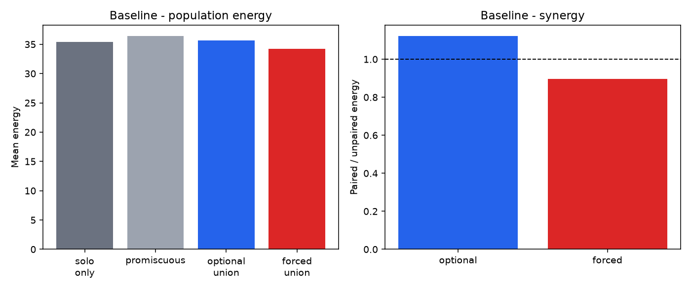
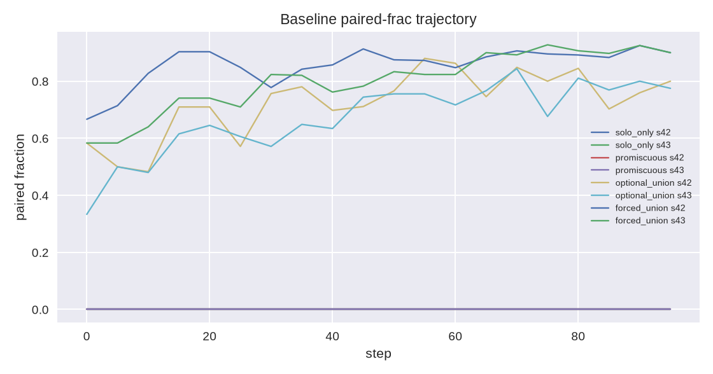
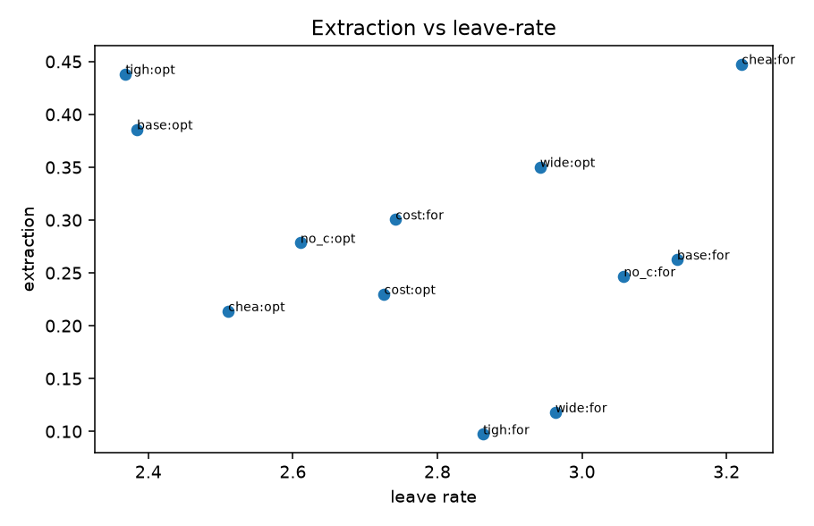

# The union on the chromosome

**Status:** Layer C first-glance complete. Genes and `bond` / `leave` live on the AgentFarm chromosome. 5 of 8 pre-registered direction checks pass. Not a published point-estimate run.

**Question (port).** Do the same cells hold after `pair_commitment`, `fidelity`, and `specialize` sit on `HyperparameterChromosome`, and after `bond` / `leave` sit next to `share`?

The [18 September pre-register](2026-09-18-union-as-emergent-property.md) asked whether an exclusive, costly-to-exit pair-bond is a selected *unit* that promiscuous `share` cannot fake. Layers A and B answered that in a standalone arena. Layer C is the same claim on the live chromosome, in the live action loop, under implicit selection.

**Headline.** Optional pairing is superadditive in-world (synergy **1.12** on baseline; standalone first-glance was 1.15). Forced pairing is not (0.90). Courtship off inflates the optional index to 1.36; cheap exit drops it to 0.91. Commitment stays flat. Fidelity's Δ is +0.001 — the `> 0` gate passes and is noise at this horizon. Promiscuous share still cannot produce a synergy index, because there is no `partner_id`; in this rich 24×24 economy it slightly beats optional on mean energy (36.5 vs 35.6). Han's extraction index still points the wrong way. The through-line holds in the direction that already replicated standalone: **sharing is a transaction; a union is an agent — and only a chosen one.**

## What ran

```bash
PYTHONHASHSEED=0 python scripts/run_union_emergence.py --mode first_glance
```

100 steps × 2 seeds × 6 cells × 4 arms on `UnionEmergenceExperiment`. Learning genes frozen; union, share, and goal loci keep evolving. Default cell is the pre-register baseline: `courtship_steps=12`, `exit_tax=1.1`, `social_range=3.2`, `bonding_cost=0.8`. Ablations are one-at-a-time: courtship ∈ {0, 12}, exit tax ∈ {0.2, 1.1, 2.2}, social range ∈ {2.0, 3.2, 8.0}.

World is 24×24, 24 founders, `max_pop=80`. Population sits on the cap in almost every cell, so the signal is node quality, not headcount — same read as the standalone grid.

## Baseline cell

| Arm | synergy | energy | paired | Δ commit | Δ fidelity | extraction |
|---|---|---|---|---|---|---|
| solo_only | — | 35.4 | 0 | +0.001 | −0.000 | — |
| promiscuous | — | **36.5** | 0 | +0.001 | −0.001 | — |
| optional_union | **1.12** | 35.6 | 0.77 | +0.003 | +0.001 | 0.39 |
| forced_union | 0.90 | 34.2 | 0.91 | +0.000 | −0.001 | 0.26 |



Solo never sets `partner_id`. Optional paired-frac settles near 0.77; forced near 0.90. The gather multiplier only fires when the partner is alive, co-located, and past courtship, so the optional index is not "everyone got a free 1.3×."



## Threshold directions (optional arm)

| Cell | synergy | energy | paired | Δ commit | Δ fidelity | extraction |
|---|---|---|---|---|---|---|
| **baseline** (12 / 1.1 / 3.2 / 0.8) | **1.12** | 35.6 | 0.77 | +0.003 | +0.001 | 0.39 |
| no courtship | **1.36** | 33.7 | 0.78 | +0.000 | +0.002 | 0.28 |
| cheap exit (0.2) | **0.91** | 36.2 | 0.79 | +0.002 | +0.001 | 0.21 |
| costly exit (2.2) | 1.32 | 33.7 | 0.77 | +0.006 | −0.001 | 0.23 |
| tight range (2.0) | 1.16 | 35.7 | 0.79 | +0.003 | −0.002 | 0.44 |
| wide range (8.0) | 1.38 | 32.8 | 0.84 | +0.009 | −0.001 | 0.35 |

Forced synergy on wide range prints **7.39**. That is leftover-solo inflation: a few poor unpaired agents in the denominator, not a 7× gather multiplier. Mean energy there is 34.4. Read every forced synergy next to energy.

## How the papers showed up

Same literature constraints as the pre-register. Same two misses as the standalone first-glance.

| Paper | Constraint | Layer C |
|---|---|---|
| Song, Feldman & Gavrilets 2013 | Do not treat rising `pair_commitment` as success | Optional Δ commit = +0.003. The climb gate is `≤ 0.03`. Pass. |
| Reynolds 2018 | Keep a share-off control; keep `max_pop` | Solo stays unpaired. Cap binds. |
| Akçay et al. 2023 | Courtship before synergy / split-cost; sweep `exit_tax` | Courtship off: 1.12 → 1.36. Cheap exit: 1.12 → 0.91. Both pass. |
| Leimar & McNamara 2024 | Accumulated `bond_strength`; small neighborhood | Tight range holds (1.16). Wide range inflates the optional index and does not lift fidelity. |
| Ogbo, Elragig & Han 2022 | Forced ≠ chosen; log extraction | Forced extraction 0.26 **below** optional 0.39. Same miss as standalone. Forced *is* worse on energy (34.2 vs 35.6) and on synergy (0.90 vs 1.12). The logged index does not capture that. |



Win-condition score: **5 / 8**.

- PASS: baseline optional synergy > 1
- FAIL: baseline forced synergy > 1
- FAIL: optional energy beats promiscuous
- PASS: optional commitment does not climb
- PASS: optional fidelity rises on baseline
- PASS: cheap exit drops optional synergy
- PASS: no courtship inflates optional synergy
- FAIL: forced extraction > optional

The fidelity pass is a technical one. +0.001 over 100 steps is not the standalone +0.012 (first-glance) or +0.07 (published v2 grid). Do not cite it as "selection bought fidelity."

The energy miss is a regime fact, not a scoring bug. Layer B's standalone world was leaner; optional energy 27.9 beat promiscuous 17.3. Layer C's 24×24 economy is rich enough that an open transfer looks fine at the population mean. Share remains a transfer. It has no synergy index because it never grows a pair.

## What the port changed

The 18 September sketch is now the live path.

1. **Three genes** on `HyperparameterChromosome` — `pair_commitment`, `fidelity`, `specialize`, linear 8-bit, same table as `share_weight`.
2. **Bond state** on the agent — `partner_id`, `pair_age`, `bond_strength`, `role`. `bond` / `leave` exist as `ActionType` 8 and 9, but the default action space stays 8-wide. The environment maps them only when `union_enabled`. DQN factories that call `get_action_count()` do not grow a 10-wide head.
3. **Gather** — synergy = \(1 + k \cdot \mathrm{strength} \cdot \mathrm{mean}(s)\) only if the partner is alive, co-located, and `pair_age ≥ courtship_steps`. Otherwise 1.0.
4. **Reproduce** — split offspring cost and co-parent crossover only for a mature bond. Otherwise the existing solo path.
5. **Social log** — `bond` counts as cooperation; `leave` is dissolution, with a separate rate.
6. **Tick, not just RL.** A `bond` action that has to be discovered by a freshly initialized DQN starves pairing. `tick_union_bonds` forms pairs implicitly (assortative on commitment, bonding cost split, refuse if either cannot pay), pulls partners toward each other, and applies accidental divorce plus the leave probability \((1-f)\cdot(0.04+\mathrm{stress})\cdot(1-0.5\cdot\mathrm{strength})\). The actions remain available; they are not the only way in or out.
7. **Runner** — `UnionEmergenceExperiment` plus `scripts/run_union_emergence.py`. Freeze learning genes. Evolve union + share + goal loci.

Invariants, tested: bond is symmetric and charges `bonding_cost`; leave clears both sides and zeros strength; synergy is 1.0 during courtship and when either partner is dead; the solo arm never sets `partner_id`.

What we did **not** add: institutional monogamy norms, LLM courtship talk, lifting `max_pop`, tit-for-tat share, or a `unique+union` arm on `IntrinsicGoalsExperiment`. Those stay Layer D or later.

## What this is not

This is a first-glance of the port: 100 steps, 2 seeds, 48 simulations. It is enough to say the *direction* of the pre-register survives the chromosome. It is not enough to claim the published 1.30 / 1.36 / 1.20 point estimates, and it is not a seed-matched A/B.

Two numbers will mislead if quoted alone:

- **Forced synergy 7.39** on wide range — leftover-solo inflation.
- **Fidelity Δ +0.001** — the gate is `> 0`, not a detectable rise.

## Layer D

The cells that are worth paying for next, in this order:

1. **Seed-matched A/B on the baseline cell.** Same seeds, optional vs promiscuous vs forced, long enough for fidelity Δ to be a real number. This is the confirmatory port.
2. **Ablate the surplus.** Synergy multiplier vs split offspring cost vs exit tax, one term off at a time, same seeds. Which term carries the 1.12×.
3. **`unique+union`.** Heterogeneous `reward_*` vectors crossed with optional pairing. Does reward-weight distance predict `leave`?

Until those run, the claim is the one the first-glance already supports: an exclusive pair is a selected unit only as a chosen bond, only when leaving costs more than staying, and only when courtship keeps the multiplier from firing on day one. Promiscuous share is still the two-agent market. It does not grow a `partner_id`.

## Files

- `farm/core/union_bonds.py` — policy, form / dissolve, synergy, tick
- `farm/core/hyperparameter_chromosome.py` — the three union loci
- `farm/core/action.py` / `farm/core/agent/core.py` / `farm/core/environment.py` — gather, reproduce, mapping
- `farm/core/social_dynamics.py` — bond as cooperation; leave as dissolution
- `farm/runners/union_emergence_experiment.py` — 6 × 4 grid
- `scripts/run_union_emergence.py`
- `experiments/union_emergence/SCOPE.md` — protocol
- `experiments/union_emergence/layer_c/` — `union_emergence_summary.json`, `LAYER_C.md`, figures
- [18 September pre-register](2026-09-18-union-as-emergent-property.md)

Through-line, unchanged: **sharing is a transaction; a union is an agent.** Selection keeps the second only when the bond is chosen, leaving costs more than staying, the neighborhood is small enough to stop shopping, and the surplus split is not silent extraction. The chromosome does not change that sentence. It just lets the genes live where the rest of the genome already lives.
