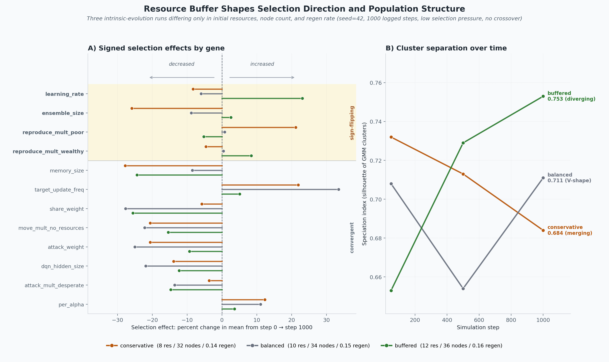

Intrinsic evolution treats hyperparameter selection as an *emergent* property
of one simulation. Each agent carries its own `HyperparameterChromosome`.
Offspring inherit it (optionally crossed, then mutated). There is no external
fitness function and no separate evaluation generation — agents that survive
and reproduce in the shared resource world pass their priors on.

This is the in-situ counterpart of
[hyperparameter evolution convergence](hyperparameter-evolution.md), which
*does* have an external scorer. The two runners answer different questions;
do not mix their artifacts.

The rest of this page is the **whole experiment**: one shared mechanism, then
every major variant run that has been reported. Protocol reference:
[design](../experiments/intrinsic_evolution/intrinsic_evolution.md). Runner:
`IntrinsicEvolutionExperiment`
(`farm/runners/intrinsic_evolution_experiment.py`).

## Shared mechanism

At start, initial diversity seeds the population so it is not a clone army.
During reproduction, offspring usually resemble the parent; an optional
nearest alive co-parent can supply crossover. Mutation keeps new values
entering. The runner records a per-step trajectory of population gene
summaries and periodic individual snapshots for lineage work. Selection
pressure is a density-dependent reproduction cost (`none` / `low` / `high`).

A lineage can rise because of location or timing, not only because its
priors are universally better. Claims that survived here had to live through
multiple seeds and, where relevant, matched A/Bs.

```bash
PYTHONHASHSEED=0 python scripts/run_intrinsic_evolution_experiment.py \
    --num-steps 10000 --snapshot-interval 200 \
    --output-dir experiments/intrinsic_evolution \
    --crossover --selection-pressure low --seed 42
```

## Chromosome attachment {#chromosome}

First wiring: typed genes on each agent, mutation and crossover at
reproduction, no hand-crafted fitness. Field notes:
[DNA-style results](../devlog/2026-04-17-dna-hyperparameter-evolution.md),
[evolving hyperparameter genomes](../devlog/2026-04-23-evolving-hyperparameter-genomes-foraging-learning-agents.md).

This variant established that the chromosome is live in the loop — priors
move, lineages exist, ecology can in principle select. It did not yet
separate drift from selection or single-seed noise from a result.

## 10,000-step development run {#development-run}

One development-profile run, seed 42, crossover on, `low` pressure, 10,000
logged steps. [RESULTS](../experiments/intrinsic_evolution/RESULTS.md).

- Population 30 → peak 77 around step 100 → noisy steady state ~28 alive
- 77% founder-lineage extinction by the end (selection compounding)
- `gamma` 0.809 → 0.846 (sustained rise); `learning_rate` drifted and
  returned near origin
- Speciation index durable (mean 0.46, final 0.48); GMM k = 4 at the end

This run showed the system is **not obviously uniform**. It is still n = 1,
which the next variants exist to punish.

## Resource-buffer comparison {#resource-buffer}

Three runs that share policy and differ only in the stable resource profile
(conservative / balanced / buffered). Field note:
[Does the resource buffer pick the genes?](../devlog/2026-05-04-resource-buffer-shapes-intrinsic-evolution.md).
Comparison writeup:
[stable profile comparison](../experiments/intrinsic_evolution/stable_profile_comparison.md).



Most behavioural genes drifted the same way. Learning rate, ensemble size,
and the speciation trajectory split along the buffer. Ecology is not a
neutral backdrop — it is part of the selection rule. This is also where
single-profile storytelling became obviously unsafe.

## Six-seed replication {#seed-sweep}

Six seeds per profile on the resource-buffer comparison. Field note:
[When one seed disagrees with six](../devlog/2026-05-12-seed-sweep-reality-check.md).

Speciation always diverged. The learning-rate and ensemble-size "flips"
were single-seed artifacts. A couple of gene-level patterns survived, and
only as magnitude trends. Within-seed drift variance was larger than
between-condition differences for most loci. After this variant, per-gene
claims from n = 1 are not results.

## Crossover / gene flow {#gene-flow}

Crossover-enabled rerun against the no-crossover buffer baseline. Field
note: [Gene flow and the buffer](../devlog/2026-05-18-gene-flow-and-the-buffer.md).
Experiment doc: [crossover rerun](../experiments/intrinsic_evolution/crossover_rerun.md).

Profile-dependent: conservative speciation compressed under gene flow;
buffered trajectories still diverged; balanced stayed noisy. Gene flow is
not a universal homogenizer in this ecology — it interacts with the
resource profile.

## Baldwinian vs Lamarckian {#inheritance-ab}

Matched 36-run matrix: 2 inheritance arms × 3 resource profiles × 6 seeds.
Baldwinian offspring inherit the chromosome and a fresh policy; Lamarckian
offspring also warm-start from the parent network. Protocol:
[inheritance A/B](../experiments/intrinsic_evolution/inheritance_mode_ab.md).
Field note:
[Baldwinian vs Lamarckian](../devlog/2026-05-21-baldwinian-vs-lamarckian-ab-harness.md).

Lamarckian warm-start applied ~85% of the time and paired runs diverged.
No profile cleared the robustness gate. Default stays Baldwinian for this
design. Important confound named here and settled later: this A/B ran in a
**saturated, high-churn** colony (`max_population=32`), not the uncrowded
no-repro regime of the later signal gate.

## Newborn-level rescore {#newborn}

Re-score the 36-run inheritance A/B at the offspring, not the population.
Field note:
[Are we measuring at the wrong level?](../devlog/2026-06-04-are-we-measuring-at-the-wrong-level.md).

Warm-start produced two small, robust behavioral shifts — slightly fewer
negative actions, slightly lower net RL reward — and neither was a fitness
gain. Survival and resources did not move. The population-level null was
not a measurement artifact.

## Unique goals {#unique-goals}

The reward function itself becomes a per-agent, heritable trait. 20 paired
seeds, unique vs uniform (hand-tuned shared reward). Field note:
[When every agent has a different goal](../devlog/2026-06-09-every-agent-a-different-goal.md).
Design: [intrinsic goals](../experiments/intrinsic_evolution/intrinsic_goals.md).

The unique-goals population carries ~40% fewer agents than the matched
control and collapses behavior toward gathering (+16.9 pp). Goal diversity
persists for the whole run. Un-curated objective diversity lowers
collective fitness in this world — and it is not rapidly selected away.

## Selection pressure on goals {#pressure-goals}

Does stronger selection purge maladaptive objectives? Three arms
(uniform / shared-random / unique) × pressure (`low` / `high`). Field note:
[Does selection pressure purge maladaptive goals?](../devlog/2026-07-29-selection-pressure-and-intrinsic-goals.md).


Unique-goals populations stay suppressed at every pressure and **do not
purge** diverse objectives — goal diversity ends near its start. The
`unique − uniform` gap shrinks from low to high because the *denser
control* loses more under a density-dependent cost, not because random
goals recover. The `shared` arm shows most of the cost is being off the
tuned default (~85%), not heterogeneity per se (~4–6 agents, not
significant). Pressure changes how heavily the population *pays* for
un-curated objectives, not *which* objectives persist.

## Transferable-signal gate {#signal-gate}

Before building richer inherited payloads, ask whether a learned policy
beats its own initialization on held-out rollouts. Reproduction disabled,
8 agents, 3000 steps. Field note:
[The transferable-signal gate](../devlog/2026-06-20-transferable-signal-budget.md).

Paired rollouts under the non-degenerate weighted policy show a modest but
robust early-age decision-quality signal in all three profiles (~+15–30
net reward, 95% CIs exclude zero). The gate passes: there is something
worth inheriting *in that uncrowded, no-repro regime*.

## Inheritance ladder {#ladder}

Issue [#904](https://github.com/Dooders/AgentFarm/issues/904). Richer
payloads (P2 plasticity damping, P3 replay slice, P4 blend + fitness gate)
on top of Lamarckian warm-start, graded on net early-life offspring reward.

**Saturated A/B** (`max_population=32`, 90-cell ladder). Field note:
[The inheritance ladder doesn't climb](../devlog/2026-07-08-inheritance-ladder-warm-start-clamps-offspring.md).
No payload beats Baldwinian cold-start: all 16 robust effects are losses,
and the richer the payload the bigger the loss (P4 worst). Warm-start
clamps offspring to a low, ecology-blind reward trajectory; cold-start
offspring track the resource profile.

**Low-churn follow-up** (identical ladder, `max_population=8`). Field note:
[Sparse ecology doesn't save the ladder](../devlog/2026-07-09-lowchurn-inheritance-still-loses.md).
Warm-start still loses — zero robust positives, zero positive mean deltas
across 36 cells. Absolute reward jumps in the sparse regime, but
cold-start captures it. Saturation was a confound for *levels*, not
ranking. The barrier is real for this design.

## Synthesis

Intrinsic evolution is a live selection process, not a stalled clone
population: founders go extinct, niches persist, ecology (the resource
buffer) structures some genes. Almost everything interesting is
**conditional**. Single seeds invent gene stories. Crossover's effect
depends on the profile. Lamarckian transfer copies weights and still does
not buy offspring fitness here — if anything it clamps them. Random
goals hurt and are not purged by turning up density-dependent cost.

A planned replicated factorial over pressure × gene flow × population size
is written down as
[research plan: population matrix](../experiments/intrinsic_evolution/research_plan_population_matrix.md).
That matrix is not a result on this page until it has been run.

## Reproduce and artifacts

```bash
PYTHONHASHSEED=0 python scripts/run_intrinsic_evolution_experiment.py \
    --num-steps 10000 --snapshot-interval 200 \
    --output-dir experiments/intrinsic_evolution \
    --crossover --selection-pressure low --seed 42
python scripts/analyze_intrinsic_evolution.py experiments/intrinsic_evolution
```

Specialized CLIs for later variants: `scripts/run_inheritance_mode_ab.py`,
`scripts/run_intrinsic_goals_experiment.py`,
`scripts/run_stable_profile_seed_sweep.py`.

- [Design and reference](../experiments/intrinsic_evolution/intrinsic_evolution.md)
- [10,000-step results](../experiments/intrinsic_evolution/RESULTS.md)
- [Catalog entry](../experiments-catalog.md)
- Related [devlog](../devlog/index.md) posts are linked from each variant
  above; this page is the experiment, those are the dated notes
