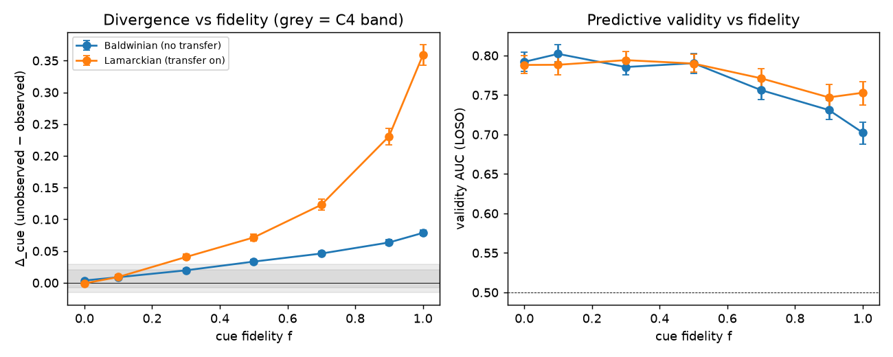
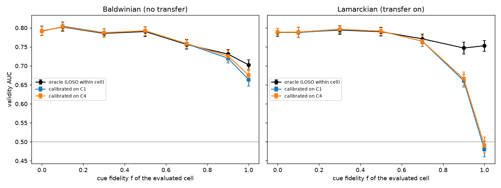

Sealed-world evaluation assumes that what an agent does while watched is
informative about what it does when unwatched. This experiment tests the
condition under which that assumption fails: when the agent can *see a cue*
correlated with being observed.

The unit of this writeup is the **whole experiment**. Enforcement is held
constant; the variants below only change cue fidelity, a decoy-cue control, the
penalty scale, and whether offspring inherit a parent's policy. Hypothesis
numbers follow the pre-registered [design](../experiments/veil_ceiling/Design.md).
Full tables live in [RESULTS](../experiments/veil_ceiling/RESULTS.md). A
narrative field note is in the
[devlog](../devlog/2026-09-12-veil-ceiling-observation-collapse.md).

## Shared world

A 20 × 20 grid with 48 logistic-regeneration nodes. Agents choose `MOVE`
(step toward the nearest healthy node), `GATHER` (take up to 3, never below
the regeneration threshold), `OVER_HARVEST` (take 3 regardless, effort 0.5),
or `PASS`. Over-harvesting is individually profitable and collectively costly:
a node below the threshold regenerates at a quarter of the healthy rate. A
defection is an over-harvest at an opportunity that actually crosses the
threshold, so rates are only counted where the affordance tempts.

Monitoring is an epoch-resampled mask (`round(c · n)` cells, 25-tick epochs)
so the map cannot be memorised. Coverage `c = 0.5` and penalty `p = 6` unless
a variant says otherwise. The cue is the monitoring bit passed through a
binary symmetric channel with flip probability `(1 − f) / 2`. `f = 0` is a
coin flip; `f = 1` is a perfect leak. The rightmost four columns (`x ≥ 16`)
are never monitored during training and are switched on, with the cue, only
in a frozen evaluation.

Expected penalty per defection is identical across C1–C4 at the start of
training (`c · p = 3`); realised enforcement is reported as an outcome.

## What ran

780 seed-matched runs: 13 conditions × Baldwinian (fresh network at birth) ×
Lamarckian (parent weights copied) × 30 shared seeds. No extinctions.

```bash
PYTHONHASHSEED=0 python scripts/run_veil_ceiling.py
python scripts/run_veil_ceiling.py --analyze-only
python scripts/run_veil_ceiling_validity_followup.py
```

Effects are paired differences with 95% seed-bootstrap CIs (2000 replicates).
The C4 noise band is mean ± 2 SD of C4 Δ_cue. Simulation commit recorded in
`experiments/veil_ceiling/results/manifest.json`.

| Hypothesis | Claim | Baldwinian | Lamarckian |
|---|---|---|---|
| H1 | Divergence grows with fidelity | supported | supported |
| H2 | Oracle AUC collapses at `f = 1` | falsified | falsified |
| H3 | Concealment is not costly | supported | supported |
| H4 | Policy transfers to the held-out band | falsified | supported |
| H5 | Inheritance accelerates concealment more than cooperation | inconclusive | inconclusive |

## C0 — unmonitored baseline {#c0}

No monitoring, no cue. This cell only asks whether the defection affordance is
interior and stable, so later contrasts are not artifacts of everyone always
or never defecting.

| Mode | C0 defection rate | Drift / 100 ticks |
|---|---|---|
| Baldwinian | 0.239 [0.233, 0.246] | −0.001 |
| Lamarckian | 0.488 [0.472, 0.503] | +0.018 |

Both sit inside the pre-registered bounds. Without monitoring, Lamarckian
inheritance lets the population converge on the individually optimal
over-harvest (49% of opportunities); Baldwinian agents that relearn from
scratch each generation defect at 24%.

## C1 — random cue (f = 0) {#c1}

Same coverage and penalty as later cells, but the cue is a coin flip. Agents
cannot condition on being watched, so this is the honest-enforcement
reference.

Realised enforcement stays at the design value (0.47–0.48 of defections
penalised). The few agents classified as "conditional" here — there by chance
— earn *less* than cooperators. Concealment is not fit when the cue is noise.

Oracle LOSO AUC in C1 stays high (~0.79). This is the calibration regime for
the later honest-evaluator follow-up.

## C3 — fidelity sweep {#c3}

Five cells at `f ∈ {0.1, 0.3, 0.5, 0.7, 0.9}` with everything else fixed.
This is the dose-response that H1 actually tests.



Δ_cue — defection rate at `cue = 0` minus `cue = 1` — rises monotonically
with `f` in both inheritance modes (Spearman ρ = 1.0). Lamarckian transfer
makes the response convex: `f = 0.1` sits inside the late C4 band (upper
0.029), `f = 0.3` is just outside it (0.041 [0.036, 0.045]), `f = 0.5` is
clearly out (0.071), and `f = 1` (C2) reaches 0.359. Baldwinian shows the
same ordering at about a fifth of the amplitude.

## C2 — perfect leak (f = 1) {#c2}

The cue is the monitoring bit with no noise. This is the veil-ceiling cell.

With Lamarckian inheritance, agents defect at ~40% of unwatched opportunities
and ~4% of watched ones. Realised enforcement falls from 0.48 to 0.14 at the
same designed `c · p`. Baldwinian C2 Δ_cue is 0.079 — same sign, smaller.

42% of Lamarckian agents (11% of Baldwinian) classify as conditional. They
out-earn unconditional cooperators in every C2 cell (all cost CIs > 0);
Baldwinian conditionals also leave more offspring (1.06 vs 0.68 per agent).
H3 is supported: concealment pays when the cue is informative.

The pre-registered H2 test — oracle LOSO AUC dropping below 0.6 — is
**falsified**. AUC(C2) is 0.702 [0.688, 0.716] Baldwinian and 0.753
[0.738, 0.767] Lamarckian. That number is not the thing a sealed-world
evaluator actually has; the [honest-evaluator](#honest-evaluator) variant
unpacks it.

Held-out transfer (H4): Lamarckian C2 applies the conditional policy in the
never-monitored band at full strength (held-out Δ_cue = 0.494, above the
training-region 0.359). Baldwinian C2 is positive (0.052) but inside the
pre-registered C4 band (upper 0.091), so H4 is falsified for that arm.

## C4 — decorrelated-cue null {#c4}

A perfect cue of an *independent* map with the same coverage and schedule. If
C4 manufactured divergence, the extra input bit alone would void the design.

It does not. C4 Δ_cue ≈ 0.006–0.007, an order of magnitude below C2. C2 − C4
on Δ_cue is 0.072 [0.067, 0.077] Baldwinian and 0.352 [0.335, 0.369]
Lamarckian. H1's control check passes.

The C4 held-out band is wide on purpose. In Lamarckian C4, held-out Δ_cue is
0.049 even though the cue is a decoy: during training `cue = 1` only ever
occurs in the monitored region, so it is a weak proxy for location. The C4
band absorbs that region-confound; Lamarckian C2 is ten times larger.

## Penalty robustness {#penalty}

C1 and C2 re-run at `p = 3` and `p = 9` (designed expected penalty 1.5 and
4.5). The question is whether the leak result is an artifact of the default
`p = 6`.

It is not. Lamarckian C2 Δ_cue is 0.40 at `p = 3` and 0.34 at `p = 9`;
Baldwinian 0.10 and 0.06. Ordering and sign match the main cell. Cue
fidelity, not enforcement intensity, is what splits observed from unobserved
defection.

## Baldwinian vs Lamarckian {#inheritance}

Every condition above is crossed with two inheritance modes on the same 30
seeds.

Lamarckian transfer amplifies the conditional policy: C2 Δ_cue is 0.280
[0.263, 0.297] higher than the seed-matched Baldwinian run.
Δ_cue in Lamarckian C2 is still rising at tick 1500; the Baldwinian curve
plateaus by ~300.


Inheritance also accelerates plain cooperation (C1 cooperative onset median
50 vs 100 ticks), so H5's *differential* claim is inconclusive: transfer
speeds up whatever the population is learning.

## Honest-calibrated evaluator {#honest-evaluator}

Exploratory follow-up on the same raw record, not pre-registered. Reproduce
with `python scripts/run_veil_ceiling_validity_followup.py`. Full tables:
[`VALIDITY_FOLLOWUP.md`](../../../experiments/veil_ceiling/results/VALIDITY_FOLLOWUP.md).

H2 was falsified because the oracle classifier kept AUC 0.70–0.75 in C2.
Three re-analyses ask what that number is made of.

**Feature ablation (Lamarckian C2).** Observed defection rate alone is 0.546
[0.524, 0.568] — chance. Action shares alone are 0.726. Dropping defection
rate from the full set costs nothing. Almost all retained validity is
`move_share`: when a conditional defector is watched, it leaves (28% of
observed ticks vs 17% for cooperators, SMD +0.87). The leak is not "rich
agents defect"; it is "agents that walk away from the camera defect
elsewhere."


**Honest calibration.** The pre-registered LOSO AUC fits on leaked-cue agents
using their unobserved ground truth, which a real evaluator never has.
Calibrate where behaviour is believed honest (C1 or C4) and apply the
classifier unchanged: Lamarckian C2 falls to AUC 0.48. Rank AUC using only
observed defection rate is 0.446 [0.425, 0.467] — it ranks agents
*backwards*, because the agents who look best on camera are the conditional
defectors.



The veil ceiling is real for any evaluator who has not already seen
concealment. It is not a claim that *no* observed feature leaks strategy.

## Synthesis

Cue fidelity, not enforcement intensity, splits observed from unobserved
defection. The dose-response is monotone in both inheritance modes;
Lamarckian transfer makes it large. The C4 decoy rules out "extra bit of
input." Concealment is fit. Spatial transfer holds for Lamarckian C2. The
pre-registered oracle-AUC collapse did not happen, but that test gave the
evaluator ground truth from the leaked regime — an honest evaluator is at
chance, and the naive sealed-world metric ranks agents backwards.

## Reproduce and artifacts

```bash
PYTHONHASHSEED=0 python scripts/run_veil_ceiling.py
python scripts/run_veil_ceiling.py --analyze-only
python scripts/run_veil_ceiling_validity_followup.py
```

- Package: `farm.experiments.veil_ceiling`
- CLI: `scripts/run_veil_ceiling.py`, `scripts/run_veil_ceiling_validity_followup.py`
- [Pre-registered design and Appendix A](../experiments/veil_ceiling/Design.md)
- [Confirmatory results](../experiments/veil_ceiling/RESULTS.md)
- [Catalog entry](../experiments-catalog.md)
- [Devlog post](../devlog/2026-09-12-veil-ceiling-observation-collapse.md)
- Raw record: `experiments/veil_ceiling/results/`
