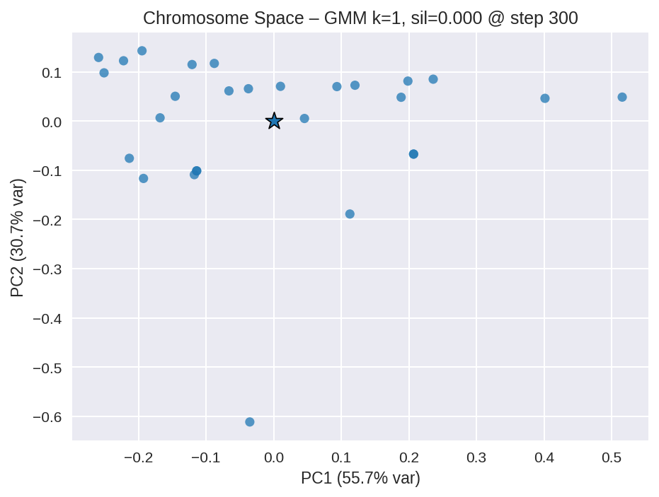
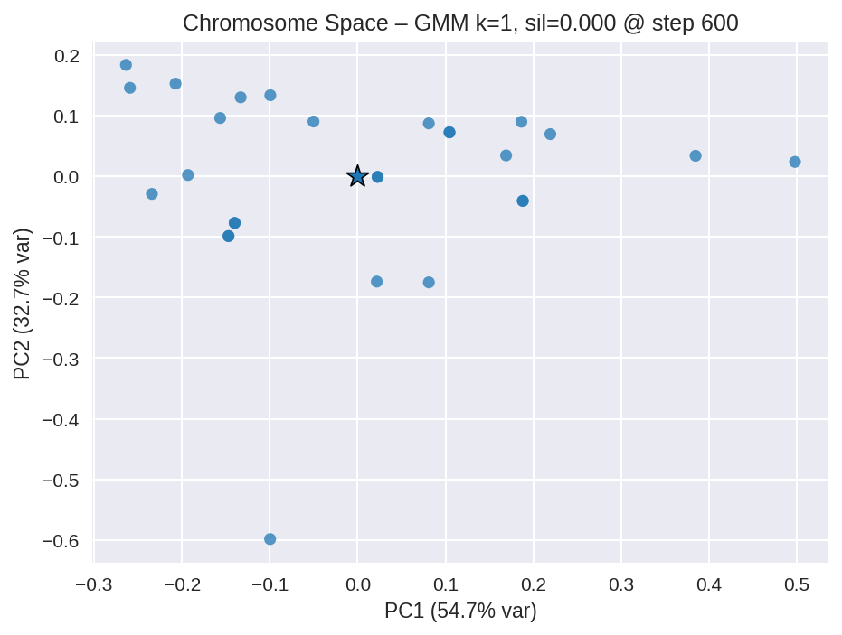

# Intrinsic Evolution Experiment — Results

This run exercises
[`IntrinsicEvolutionExperiment`](../../farm/runners/intrinsic_evolution_experiment.py)
end-to-end: a single 600-step simulation in which every agent carries its
own [`HyperparameterChromosome`](../../farm/core/hyperparameter_chromosome.py),
crossover with a co-parent is enabled, and selection emerges from the shared
resource environment under a `"low"` density-dependent reproduction-cost
preset.

## Configuration

| Setting | Value |
| --- | --- |
| Environment | `development` |
| Steps | 600 |
| Snapshot interval | 25 |
| Seed | 42 |
| Crossover | uniform, nearest alive same-type co-parent |
| Mutation | gaussian, rate 0.15, scale 0.10, reflect boundary |
| Initial diversity seeding | rate 1.0, scale 0.25 |
| Selection pressure | `low` (local density coef = 0.5, no carrying-cap) |
| Speciation tracking | GMM, max k = 4 |

CLI:

```bash
python scripts/run_intrinsic_evolution_experiment.py \
    --num-steps 600 --snapshot-interval 25 \
    --output-dir experiments/intrinsic_evolution \
    --crossover --selection-pressure low --seed 42
```

Reproducibility note: `run_simulation.py`-style scripts re-launch under
`PYTHONHASHSEED=0` for determinism.  The CLI here does not auto-restart, so
it is invoked with `PYTHONHASHSEED=0` from the shell.

## Headline results

- **Population**: 30 → peak 77 (around step 100) → settled ~28 alive at
  step 600.  Mean alive population over the run was ~35.
- **Births / deaths**: 61 births, 63 deaths over 600 steps.
- **Surviving founder lineages**: 30 → 17 (43 % of founders extinct).
- **Speciation index** (silhouette of GMM clusters in chromosome space):
  peaked at ~0.57 around step 75 (during the boom), settled around 0.25 by
  step 600 once the population had homogenised.
- **Gene means (initial → final)**:
  - `learning_rate` 0.260 → 0.277 (+0.017)
  - `gamma` 0.809 → 0.795 (-0.014)
  - `epsilon_decay` 0.846 → 0.847 (+0.001)
  - `memory_size` 2000 → 2000 (locked, evolvable=False)

## Visualisations

All plots are produced by
`scripts/analyze_intrinsic_evolution.py experiments/intrinsic_evolution`.

### Population dynamics


A clear boom-bust at step ~110: density-dependent reproduction cost (the
`low` preset) does not by itself cap growth, but resource depletion
combined with the rising mean reproduction cost (top-third panel) leads to
a death wave that wipes out half the population.  After step ~200, births
and deaths balance around 0.002 / step.

### Gene trajectories (per-step mean ± std)


Means are remarkably stable around the seeded centroids: the population
keeps a wide spread of `learning_rate` (std ≈ 0.18) without converging,
suggesting that the resource environment exerts only weak direct selection
on these hyperparameters at this scale.  The visible plateaus correspond
to long stretches without births / deaths.

### Per-snapshot gene-value distributions


Bimodality in `learning_rate` and `gamma` shows up as the population
matures: violins develop a heavy lower lobe and a lighter upper lobe,
consistent with a partial split into two niches that the speciation
detector picks up.

### Speciation index over time


GMM-BIC silhouette peaks around 0.55–0.60 during the boom phase
(step 50–100) when the population briefly supports multiple coexisting
clusters.  The crash homogenises the population (index drops to ~0.10
between steps 350 and 500) before re-developing some structure later.

### Cluster persistence


`c0` is the dominant founder cluster that boomed and then crashed.
`c6`, `c7`, `c9` are stable smaller clusters that emerged after the
crash and persisted to the end of the run.

### Chromosome-space scatter (GMM clustering)

Step 0 (post seeding):


Step 300 (mid-run):


Step 600 (final):


### Lineage tree (coloured by `learning_rate`)


DAG (because crossover gives two parents) over 91 unique agents.  Most
agents are depth 1 children of seed founders; a handful of depth-2
grandchildren survive at the bottom row, with no further reproduction
captured before the run ended.

### Lineage summary


Surviving founder lineages decline monotonically from 30 to 17 across the
run.  Lineage depth caps at 2 during the boom, then collapses back to 1
once the boom-phase grandchildren die out.

## Interpretation

- Selection is real but modest: 13 founder lineages went extinct, but
  surviving gene means barely shifted from the seeded centroids.  This is
  consistent with the docs' "frequency-dependent dynamics" framing: at
  this scale the ecosystem can support a wide range of `learning_rate`
  values without strong directional pressure.
- The boom-and-crash dynamic is informative on its own — it shows that
  even with `selection_pressure="low"` the runner produces a non-trivial
  birth/death history with measurable selection opportunity (cost CV
  reaches ~0.35 during the boom).
- Speciation detector behaves sensibly: high silhouette during the boom,
  low silhouette during the post-crash homogeneous phase, partial recovery
  late.

For longer / heavier-pressure runs, increase `--num-steps` and pass
`--selection-pressure high` (or a numeric scale) to see stronger gene-mean
drift.  See [`docs/experiments/intrinsic_evolution.md`](../../docs/experiments/intrinsic_evolution.md)
for the runner reference.

## Artifacts on disk

```
experiments/intrinsic_evolution/
├── analysis/
│   ├── analysis_summary.json
│   ├── analysis_summary.md
│   ├── cluster_lineage_sizes.png
│   ├── gene_distribution_history.png
│   ├── gene_trajectories.png
│   ├── intrinsic_lineage_tree.png
│   ├── lineage_summary.png
│   ├── population_dynamics.png
│   ├── speciation_clusters_step0.png
│   ├── speciation_clusters_step300.png
│   ├── speciation_clusters_step600.png
│   └── speciation_index.png
├── cluster_lineage.jsonl
├── intrinsic_evolution_metadata.json
├── intrinsic_gene_snapshots.jsonl
├── intrinsic_gene_trajectory.jsonl
├── run_manifest.json
└── run_summary.json
```
