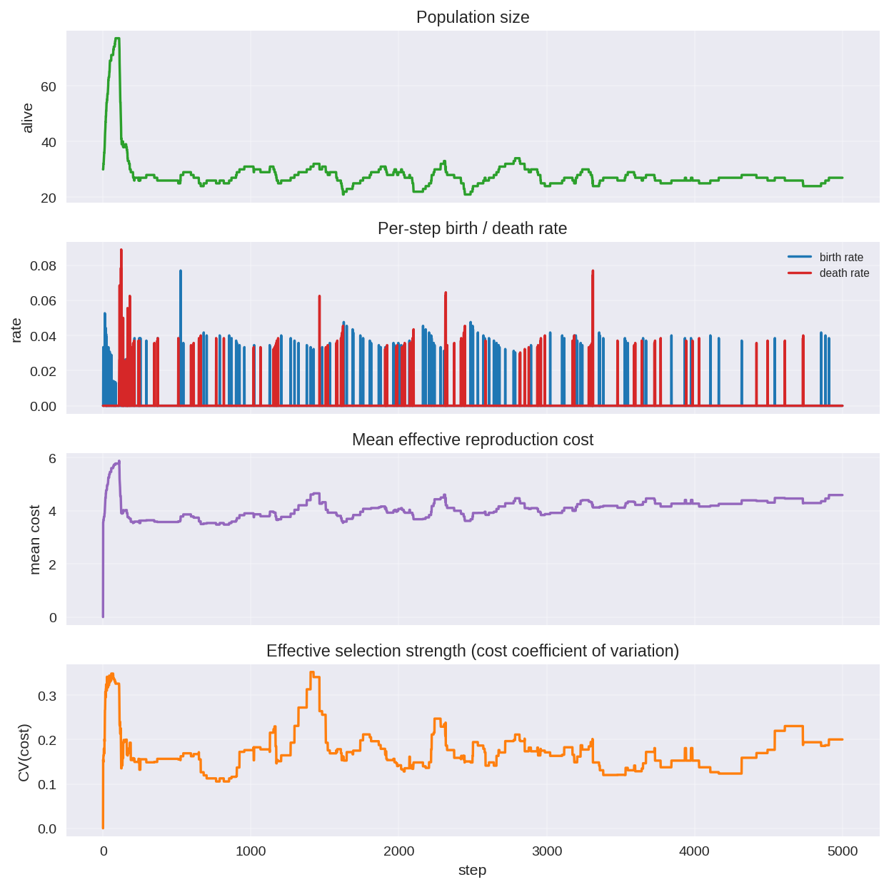
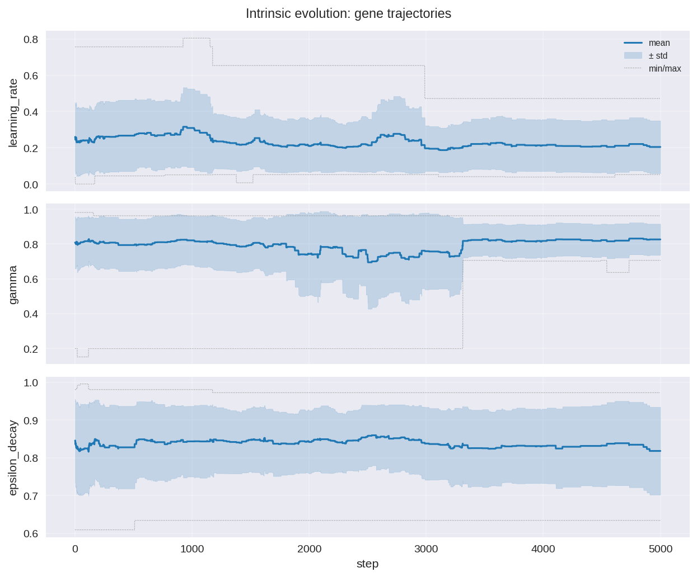
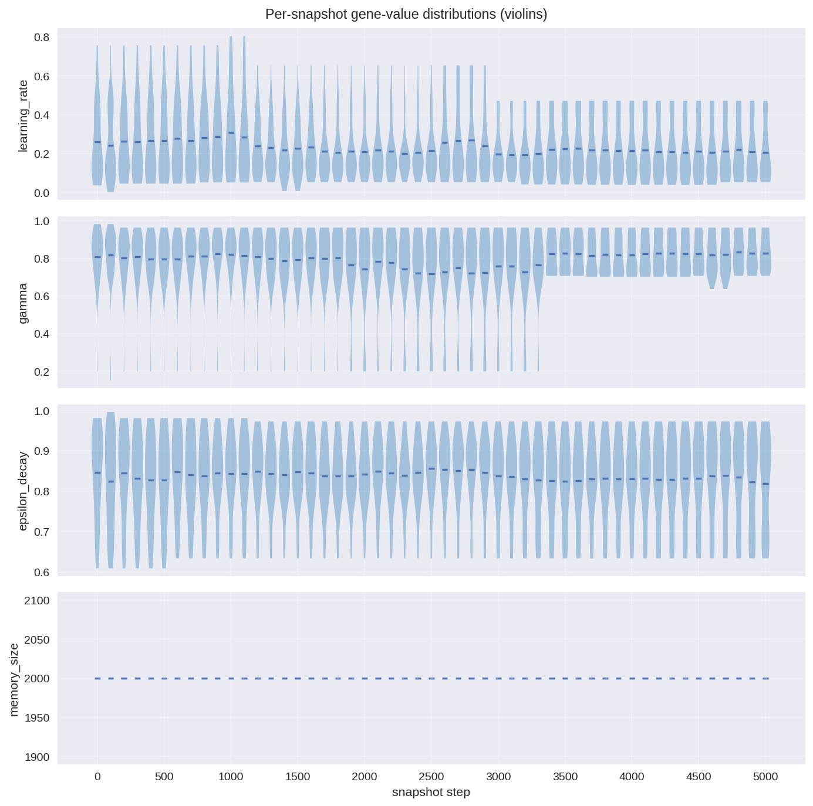
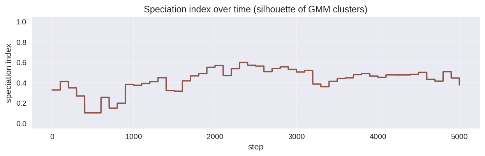
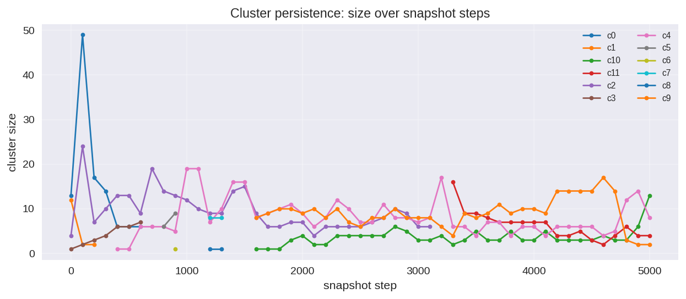
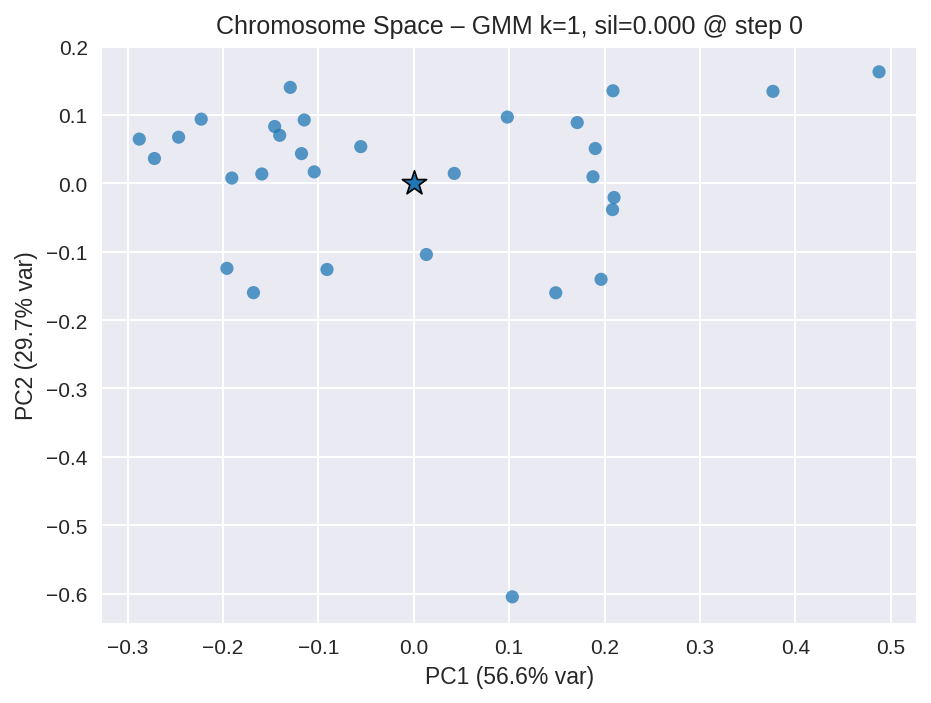
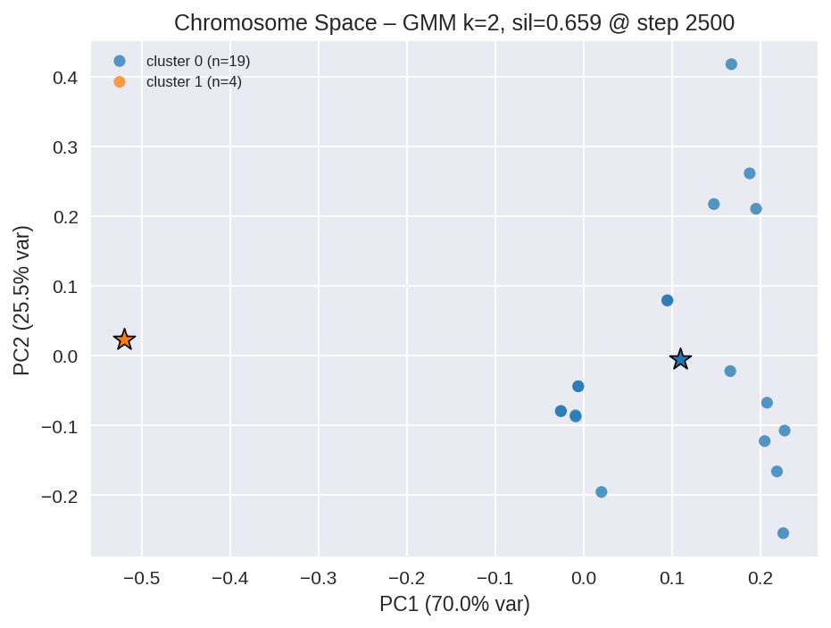
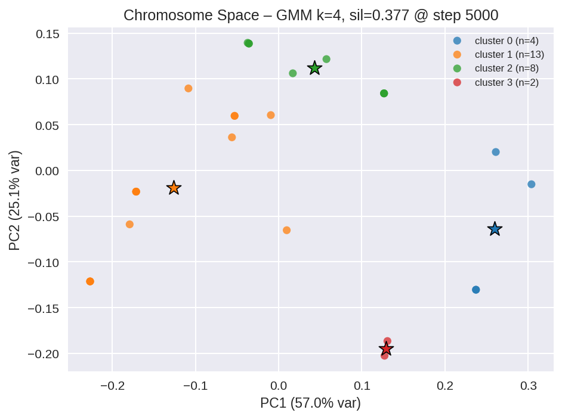
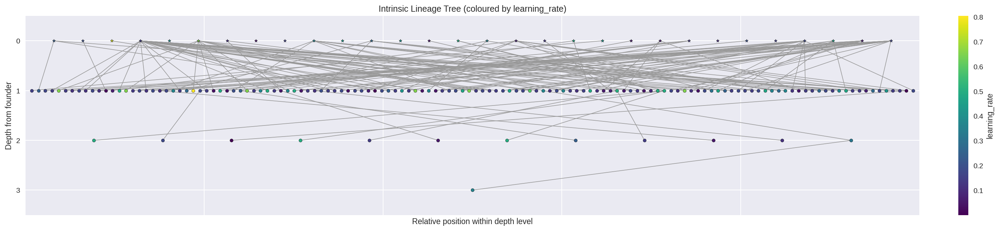
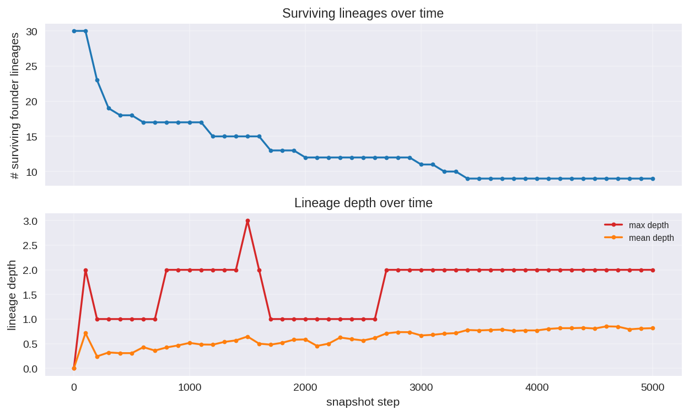

# Intrinsic Evolution Experiment — Results (5000 steps)

This run exercises
[`IntrinsicEvolutionExperiment`](../../farm/runners/intrinsic_evolution_experiment.py)
end-to-end: a single 5000-step simulation in which every agent carries its
own [`HyperparameterChromosome`](../../farm/core/hyperparameter_chromosome.py),
crossover with a co-parent is enabled, and selection emerges from the shared
resource environment under the `"low"` density-dependent reproduction-cost
preset.

## Configuration

| Setting | Value |
| --- | --- |
| Environment | `development` |
| Steps | 5000 |
| Snapshot interval | 100 |
| Seed | 42 |
| Crossover | uniform, nearest alive same-type co-parent |
| Mutation | gaussian, rate 0.15, scale 0.10, reflect boundary |
| Initial diversity seeding | rate 1.0, scale 0.25 |
| Selection pressure | `low` (local density coef = 0.5, no carrying-cap) |
| Speciation tracking | GMM, max k = 4 |

CLI:

```bash
PYTHONHASHSEED=0 python scripts/run_intrinsic_evolution_experiment.py \
    --num-steps 5000 --snapshot-interval 100 \
    --output-dir experiments/intrinsic_evolution \
    --crossover --selection-pressure low --seed 42
```

Wall-clock: 299 s end-to-end.

## Headline results

- **Population**: 30 → peak 77 (around step 100) → settled to a noisy
  steady state of ~28 alive (mean 28.1, final 27).
- **Births / deaths**: ~5 births / ~5 deaths per 1000 steps (mean rates
  ≈ 9.7e-4); the run is firmly in a turnover regime, not extinction.
- **Surviving founder lineages**: 30 → **9** (70 % founder extinction;
  versus only 43 % at 600 steps — selection is actually working).
- **Gene means (initial → final)**:
  - `learning_rate` 0.260 → **0.205** (-0.055; clear directional drop)
  - `gamma` 0.809 → 0.827 (+0.018)
  - `epsilon_decay` 0.846 → 0.818 (-0.028)
  - `memory_size` 2000 → 2000 (locked, evolvable=False)
- **Speciation index**: peaked ~0.60 between steps 2000 and 3000; mean
  0.43; final 0.38 — sustained sub-population structure rather than the
  briefly-flaring pattern seen at 600 steps.
- **Niches**: GMM detects **k = 4** clusters at step 5000 with sizes
  {13, 8, 4, 2} and silhouette 0.38.
- **Lineage depth**: max 3 (briefly) and 2 (durably), mean 0.81 at
  the final snapshot — multi-generation ancestry, not just F1.

## Visualisations

All plots are produced by
`python scripts/analyze_intrinsic_evolution.py experiments/intrinsic_evolution`.

### Population dynamics



The early boom-and-crash (population briefly hits 77 around step 100, then
collapses to ~25) gives way to a long stationary phase around 25–35 alive
agents. Births and deaths interleave throughout, and the
selection-strength CV oscillates between 0.10 and 0.35 with notable peaks
around steps 1500 and 4500.

### Gene trajectories (per-step mean ± std)



`learning_rate` exhibits a slow downward drift across the full run
(0.26 → 0.20). `gamma` shows a transient dip between steps ~1500 and
~3300 followed by a recovery. `epsilon_decay` drifts moderately downward.
The shrinking std bands around step 3300 onwards correspond to several
high-`gamma`, high-LR lineages dying out.

### Per-snapshot gene-value distributions



`learning_rate` distributions become progressively concentrated in the
0.05–0.30 band; `gamma` distributions tighten significantly after step
~3300 once the high-`gamma` outlier lineages are gone.

### Speciation index over time



After an early dip during the boom-crash homogenisation (steps 300–700,
index ≈ 0.10), the index climbs steadily to ~0.60 between steps 2000 and
3000, then settles around 0.40–0.50. This is a population that has
fragmented into multiple coexisting clusters and stayed that way.

### Cluster persistence



The early dominant cluster `c0` collapses post-boom. New clusters
(`c4`, `c9`, `c10`, `c11`) emerge and persist for thousands of steps;
`c1` and `c4` are the dominant survivors at run end.

### Chromosome-space scatter (GMM clustering)

Step 0 (post seed-mutation pass):


Step 2500 (mid-run):


Step 5000 (final):


The final scatter shows 4 distinct clusters separated along PC1 (57 % of
variance), with silhouette 0.38 — a stable polymorphic equilibrium.

### Lineage tree (coloured by `learning_rate`)



DAG (because crossover gives two parents) over 175 unique agents.
Most of the tree is concentrated at depths 0–1, with a handful of
depth-2 grandchildren and a single depth-3 great-grandchild visible.

### Lineage summary



Surviving founder lineages decline monotonically from 30 to 9 — this is
the cleanest signal that selection is working: 70 % of founders left no
descendants by step 5000. Mean lineage depth rises from 0 to ~0.8 as
multi-generation lineages establish themselves.

## Interpretation

- **Selection is unambiguous at this scale.** The 600-step pilot showed
  ambiguous gene drift; at 5000 steps, the directional drop in
  `learning_rate` (0.26 → 0.20), the founder extinction rate (70 %), and
  the persistent 4-cluster structure all point to genuine intra-sim
  selection rather than neutral drift.
- **The system supports a polymorphic equilibrium.** GMM-BIC keeps
  picking k > 1 from step 1000 onward; the final population genuinely
  splits into 4 niches in chromosome space. This is the "frequency-
  dependent dynamics" the runner docs describe: no single learning rate
  wins, multiple coexist.
- **Population dynamics decouple from gene dynamics in the steady state.**
  After the early boom-crash, alive count is roughly stationary while
  genes keep drifting. This is exactly the regime that a between-sim
  `EvolutionExperiment` cannot observe.

For longer / heavier-pressure runs, increase `--num-steps` further or
pass `--selection-pressure high` (or a numeric scale) to apply stronger
density-dependent costs. See
[`docs/experiments/intrinsic_evolution.md`](../../docs/experiments/intrinsic_evolution.md)
for the runner reference.

## Artifacts on disk

```
experiments/intrinsic_evolution/
├── analysis/
│   ├── analysis_summary.json
│   ├── analysis_summary.md
│   ├── cluster_lineage_sizes.png
│   ├── gene_distribution_history.png
│   ├── gene_trajectories.png
│   ├── intrinsic_lineage_tree.png
│   ├── lineage_summary.png
│   ├── population_dynamics.png
│   ├── speciation_clusters_step0.png
│   ├── speciation_clusters_step2500.png
│   ├── speciation_clusters_step5000.png
│   └── speciation_index.png
├── cluster_lineage.jsonl
├── intrinsic_evolution_metadata.json
├── intrinsic_gene_snapshots.jsonl
├── intrinsic_gene_trajectory.jsonl
├── run_manifest.json
└── run_summary.json
```
