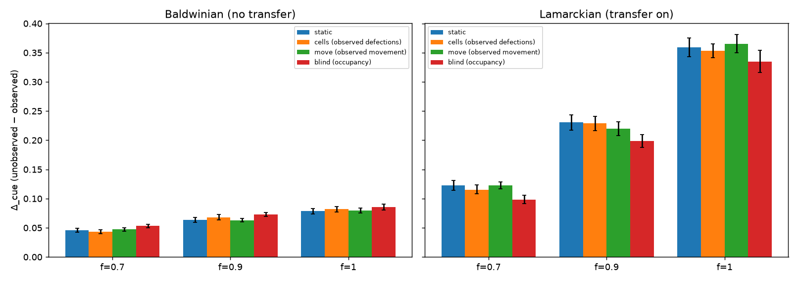
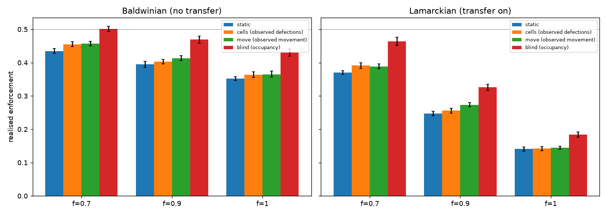
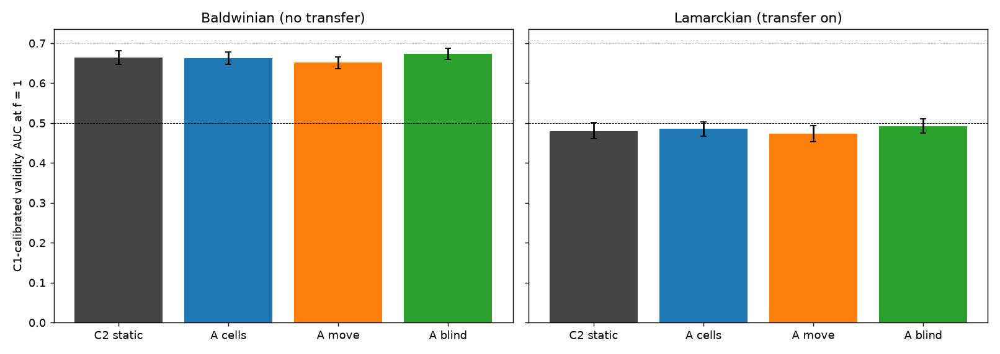

# Adaptive monitor — can a fixed coverage budget catch concealment?

Exploratory follow-up to the Veil Ceiling confirmatory run. Coverage `c = 0.5` and penalty `p = 6` are unchanged; only the next epoch's allocation of the true map varies. Seed-matched against the static cell of the same fidelity. Not pre-registered with the original design.

## 1. Cell summary (late training)

### Baldwinian (no transfer)

| Condition | f | Policy | n | Defection rate | Δ_cue | Realised enforcement | Mask overlap | Weight KL | Held-out Δ_cue |
|---|---|---|---|---|---|---|---|---|---|
| C1 | 0.0 | static | 30 | 0.098 [0.096, 0.101] | 0.004 [0.002, 0.006] | 0.470 [0.464, 0.475] | 0.500 [0.499, 0.501] | 0.000 [0.000, 0.000] | 0.005 [-0.014, 0.031] |
| A_f0.7_blind | 0.7 | blind (occupancy) | 30 | 0.093 [0.091, 0.096] | 0.053 [0.050, 0.056] | 0.501 [0.493, 0.509] | 0.583 [0.582, 0.584] | 0.721 [0.716, 0.726] | 0.028 [0.010, 0.046] |
| A_f0.7_cells | 0.7 | cells (observed defections) | 30 | 0.098 [0.095, 0.100] | 0.044 [0.040, 0.047] | 0.455 [0.448, 0.463] | 0.512 [0.510, 0.513] | 0.024 [0.023, 0.024] | 0.032 [0.010, 0.058] |
| A_f0.7_move | 0.7 | move (observed movement) | 30 | 0.099 [0.097, 0.102] | 0.047 [0.044, 0.050] | 0.457 [0.450, 0.464] | 0.538 [0.537, 0.539] | 0.072 [0.071, 0.073] | 0.045 [0.025, 0.070] |
| C3_f0.7 | 0.7 | static | 30 | 0.101 [0.098, 0.103] | 0.046 [0.043, 0.049] | 0.435 [0.428, 0.442] | 0.500 [0.499, 0.501] | 0.000 [0.000, 0.000] | 0.044 [0.026, 0.064] |
| A_f0.9_blind | 0.9 | blind (occupancy) | 30 | 0.095 [0.092, 0.098] | 0.073 [0.070, 0.076] | 0.469 [0.458, 0.480] | 0.583 [0.581, 0.584] | 0.726 [0.719, 0.732] | 0.055 [0.032, 0.086] |
| A_f0.9_cells | 0.9 | cells (observed defections) | 30 | 0.102 [0.099, 0.105] | 0.068 [0.064, 0.073] | 0.403 [0.396, 0.410] | 0.509 [0.508, 0.510] | 0.021 [0.021, 0.022] | 0.071 [0.043, 0.109] |
| A_f0.9_move | 0.9 | move (observed movement) | 30 | 0.101 [0.098, 0.104] | 0.063 [0.060, 0.066] | 0.414 [0.406, 0.421] | 0.538 [0.537, 0.539] | 0.070 [0.069, 0.071] | 0.056 [0.034, 0.081] |
| C3_f0.9 | 0.9 | static | 30 | 0.103 [0.099, 0.106] | 0.064 [0.060, 0.068] | 0.395 [0.386, 0.404] | 0.500 [0.499, 0.501] | 0.000 [0.000, 0.000] | 0.037 [0.013, 0.064] |
| A_f1_blind | 1.0 | blind (occupancy) | 30 | 0.094 [0.092, 0.097] | 0.086 [0.081, 0.091] | 0.430 [0.420, 0.441] | 0.579 [0.578, 0.580] | 0.733 [0.727, 0.739] | 0.067 [0.036, 0.104] |
| A_f1_cells | 1.0 | cells (observed defections) | 30 | 0.108 [0.105, 0.110] | 0.082 [0.077, 0.087] | 0.364 [0.356, 0.372] | 0.510 [0.509, 0.511] | 0.019 [0.019, 0.020] | 0.051 [0.019, 0.084] |
| A_f1_move | 1.0 | move (observed movement) | 30 | 0.105 [0.102, 0.107] | 0.080 [0.075, 0.084] | 0.365 [0.357, 0.375] | 0.538 [0.537, 0.539] | 0.070 [0.068, 0.071] | 0.061 [0.034, 0.090] |
| C2 | 1.0 | static | 30 | 0.107 [0.104, 0.110] | 0.079 [0.074, 0.083] | 0.352 [0.346, 0.357] | 0.500 [0.499, 0.501] | 0.000 [0.000, 0.000] | 0.052 [0.026, 0.081] |
| C4 | 1.0 | static | 30 | 0.090 [0.087, 0.093] | 0.006 [0.004, 0.009] | 0.472 [0.465, 0.479] | 0.500 [0.499, 0.501] | 0.000 [0.000, 0.000] | 0.010 [-0.005, 0.024] |

### Lamarckian (transfer on)

| Condition | f | Policy | n | Defection rate | Δ_cue | Realised enforcement | Mask overlap | Weight KL | Held-out Δ_cue |
|---|---|---|---|---|---|---|---|---|---|
| C1 | 0.0 | static | 30 | 0.076 [0.074, 0.079] | -0.001 [-0.003, 0.002] | 0.479 [0.473, 0.485] | 0.500 [0.499, 0.501] | 0.000 [0.000, 0.000] | 0.003 [-0.017, 0.022] |
| A_f0.7_blind | 0.7 | blind (occupancy) | 30 | 0.085 [0.081, 0.090] | 0.098 [0.092, 0.106] | 0.464 [0.452, 0.476] | 0.588 [0.587, 0.589] | 0.713 [0.705, 0.720] | 0.166 [0.130, 0.204] |
| A_f0.7_cells | 0.7 | cells (observed defections) | 30 | 0.105 [0.101, 0.109] | 0.115 [0.108, 0.123] | 0.392 [0.382, 0.399] | 0.510 [0.509, 0.511] | 0.021 [0.021, 0.022] | 0.233 [0.192, 0.279] |
| A_f0.7_move | 0.7 | move (observed movement) | 30 | 0.107 [0.104, 0.111] | 0.123 [0.117, 0.129] | 0.389 [0.381, 0.396] | 0.545 [0.543, 0.546] | 0.085 [0.083, 0.086] | 0.247 [0.197, 0.298] |
| C3_f0.7 | 0.7 | static | 30 | 0.112 [0.107, 0.116] | 0.123 [0.115, 0.132] | 0.370 [0.365, 0.376] | 0.500 [0.499, 0.501] | 0.000 [0.000, 0.000] | 0.214 [0.162, 0.267] |
| A_f0.9_blind | 0.9 | blind (occupancy) | 30 | 0.112 [0.108, 0.117] | 0.198 [0.188, 0.210] | 0.326 [0.316, 0.335] | 0.585 [0.583, 0.587] | 0.694 [0.687, 0.702] | 0.332 [0.293, 0.373] |
| A_f0.9_cells | 0.9 | cells (observed defections) | 30 | 0.143 [0.138, 0.149] | 0.229 [0.217, 0.241] | 0.256 [0.249, 0.263] | 0.507 [0.506, 0.509] | 0.016 [0.016, 0.016] | 0.387 [0.348, 0.430] |
| A_f0.9_move | 0.9 | move (observed movement) | 30 | 0.139 [0.133, 0.144] | 0.219 [0.208, 0.232] | 0.274 [0.267, 0.280] | 0.544 [0.543, 0.545] | 0.083 [0.082, 0.085] | 0.351 [0.301, 0.403] |
| C3_f0.9 | 0.9 | static | 30 | 0.150 [0.143, 0.156] | 0.231 [0.217, 0.243] | 0.247 [0.240, 0.254] | 0.500 [0.499, 0.501] | 0.000 [0.000, 0.000] | 0.351 [0.316, 0.385] |
| A_f1_blind | 1.0 | blind (occupancy) | 30 | 0.149 [0.143, 0.155] | 0.335 [0.316, 0.354] | 0.184 [0.176, 0.192] | 0.579 [0.578, 0.581] | 0.669 [0.661, 0.678] | 0.407 [0.361, 0.451] |
| A_f1_cells | 1.0 | cells (observed defections) | 30 | 0.180 [0.174, 0.186] | 0.353 [0.341, 0.365] | 0.142 [0.136, 0.148] | 0.505 [0.504, 0.506] | 0.011 [0.010, 0.011] | 0.475 [0.435, 0.511] |
| A_f1_move | 1.0 | move (observed movement) | 30 | 0.181 [0.177, 0.186] | 0.365 [0.350, 0.381] | 0.145 [0.141, 0.149] | 0.544 [0.542, 0.545] | 0.084 [0.082, 0.086] | 0.453 [0.419, 0.492] |
| C2 | 1.0 | static | 30 | 0.183 [0.177, 0.189] | 0.359 [0.343, 0.375] | 0.141 [0.135, 0.147] | 0.500 [0.499, 0.501] | 0.000 [0.000, 0.000] | 0.494 [0.451, 0.537] |
| C4 | 1.0 | static | 30 | 0.076 [0.072, 0.079] | 0.007 [0.003, 0.011] | 0.472 [0.468, 0.478] | 0.500 [0.499, 0.501] | 0.000 [0.000, 0.000] | 0.049 [0.025, 0.073] |

## 2. Seed-matched contrasts

### Baldwinian (no transfer)

| Fidelity | Contrast | Policy | Metric | Mean difference | Pairs | Sign agreement |
|---|---|---|---|---|---|---|
| f=0.7 | adaptive-static | cells (observed defections) | rate | -0.003 [-0.007, 0.001] | 30 | 0.67 |
| f=0.7 | adaptive-static | cells (observed defections) | delta_cue | -0.003 [-0.007, 0.002] | 30 | 0.57 |
| f=0.7 | adaptive-static | cells (observed defections) | realised_enforcement | 0.020 [0.010, 0.030] | 30 | 0.73 |
| f=0.7 | adaptive-static | cells (observed defections) | eval_heldout_delta_cue | -0.012 [-0.040, 0.016] | 30 | 0.63 |
| f=0.7 | adaptive-static | move (observed movement) | rate | -0.001 [-0.005, 0.002] | 30 | 0.53 |
| f=0.7 | adaptive-static | move (observed movement) | delta_cue | 0.001 [-0.003, 0.006] | 30 | 0.57 |
| f=0.7 | adaptive-static | move (observed movement) | realised_enforcement | 0.022 [0.011, 0.033] | 30 | 0.73 |
| f=0.7 | adaptive-static | move (observed movement) | eval_heldout_delta_cue | 0.000 [-0.019, 0.022] | 30 | 0.47 |
| f=0.7 | adaptive-static | blind (occupancy) | rate | -0.007 [-0.011, -0.004] | 30 | 0.87 |
| f=0.7 | adaptive-static | blind (occupancy) | delta_cue | 0.007 [0.002, 0.011] | 30 | 0.77 |
| f=0.7 | adaptive-static | blind (occupancy) | realised_enforcement | 0.067 [0.056, 0.077] | 30 | 0.97 |
| f=0.7 | adaptive-static | blind (occupancy) | eval_heldout_delta_cue | -0.016 [-0.045, 0.010] | 30 | 0.53 |
| f=0.7 | cells-blind | cells (observed defections) | rate | 0.005 [0.001, 0.008] | 30 | 0.63 |
| f=0.7 | cells-blind | cells (observed defections) | delta_cue | -0.010 [-0.014, -0.005] | 30 | 0.77 |
| f=0.7 | cells-blind | cells (observed defections) | realised_enforcement | -0.047 [-0.057, -0.035] | 30 | 0.90 |
| f=0.7 | cells-blind | cells (observed defections) | eval_heldout_delta_cue | 0.004 [-0.025, 0.036] | 30 | 0.43 |
| f=0.7 | move-cells | move (observed movement) | rate | 0.001 [-0.001, 0.004] | 30 | 0.57 |
| f=0.7 | move-cells | move (observed movement) | delta_cue | 0.004 [-0.001, 0.008] | 30 | 0.63 |
| f=0.7 | move-cells | move (observed movement) | realised_enforcement | 0.002 [-0.009, 0.013] | 30 | 0.47 |
| f=0.7 | move-cells | move (observed movement) | eval_heldout_delta_cue | 0.013 [-0.015, 0.043] | 30 | 0.57 |
| f=0.9 | adaptive-static | cells (observed defections) | rate | -0.001 [-0.005, 0.003] | 30 | 0.50 |
| f=0.9 | adaptive-static | cells (observed defections) | delta_cue | 0.004 [-0.001, 0.010] | 30 | 0.60 |
| f=0.9 | adaptive-static | cells (observed defections) | realised_enforcement | 0.008 [-0.004, 0.020] | 30 | 0.63 |
| f=0.9 | adaptive-static | cells (observed defections) | eval_heldout_delta_cue | 0.035 [-0.001, 0.075] | 30 | 0.60 |
| f=0.9 | adaptive-static | move (observed movement) | rate | -0.001 [-0.005, 0.003] | 30 | 0.53 |
| f=0.9 | adaptive-static | move (observed movement) | delta_cue | -0.001 [-0.006, 0.005] | 30 | 0.60 |
| f=0.9 | adaptive-static | move (observed movement) | realised_enforcement | 0.018 [0.005, 0.032] | 30 | 0.70 |
| f=0.9 | adaptive-static | move (observed movement) | eval_heldout_delta_cue | 0.019 [-0.016, 0.054] | 30 | 0.57 |
| f=0.9 | adaptive-static | blind (occupancy) | rate | -0.008 [-0.013, -0.003] | 30 | 0.73 |
| f=0.9 | adaptive-static | blind (occupancy) | delta_cue | 0.009 [0.004, 0.015] | 30 | 0.70 |
| f=0.9 | adaptive-static | blind (occupancy) | realised_enforcement | 0.074 [0.060, 0.089] | 30 | 0.97 |
| f=0.9 | adaptive-static | blind (occupancy) | eval_heldout_delta_cue | 0.019 [-0.018, 0.059] | 30 | 0.57 |
| f=0.9 | cells-blind | cells (observed defections) | rate | 0.007 [0.003, 0.012] | 30 | 0.77 |
| f=0.9 | cells-blind | cells (observed defections) | delta_cue | -0.005 [-0.011, 0.001] | 30 | 0.73 |
| f=0.9 | cells-blind | cells (observed defections) | realised_enforcement | -0.066 [-0.080, -0.052] | 30 | 0.97 |
| f=0.9 | cells-blind | cells (observed defections) | eval_heldout_delta_cue | 0.016 [-0.031, 0.068] | 30 | 0.57 |
| f=0.9 | move-cells | move (observed movement) | rate | -0.001 [-0.005, 0.004] | 30 | 0.60 |
| f=0.9 | move-cells | move (observed movement) | delta_cue | -0.005 [-0.011, 0.000] | 30 | 0.57 |
| f=0.9 | move-cells | move (observed movement) | realised_enforcement | 0.010 [-0.000, 0.021] | 30 | 0.67 |
| f=0.9 | move-cells | move (observed movement) | eval_heldout_delta_cue | -0.015 [-0.055, 0.021] | 30 | 0.53 |
| f=1 | adaptive-static | cells (observed defections) | rate | 0.000 [-0.003, 0.003] | 30 | 0.53 |
| f=1 | adaptive-static | cells (observed defections) | delta_cue | 0.003 [-0.002, 0.009] | 30 | 0.70 |
| f=1 | adaptive-static | cells (observed defections) | realised_enforcement | 0.012 [0.003, 0.022] | 30 | 0.60 |
| f=1 | adaptive-static | cells (observed defections) | eval_heldout_delta_cue | -0.001 [-0.049, 0.046] | 30 | 0.60 |
| f=1 | adaptive-static | move (observed movement) | rate | -0.002 [-0.004, -0.000] | 30 | 0.60 |
| f=1 | adaptive-static | move (observed movement) | delta_cue | 0.001 [-0.004, 0.007] | 30 | 0.60 |
| f=1 | adaptive-static | move (observed movement) | realised_enforcement | 0.013 [0.004, 0.023] | 30 | 0.70 |
| f=1 | adaptive-static | move (observed movement) | eval_heldout_delta_cue | 0.009 [-0.032, 0.048] | 30 | 0.50 |
| f=1 | adaptive-static | blind (occupancy) | rate | -0.013 [-0.016, -0.009] | 30 | 0.90 |
| f=1 | adaptive-static | blind (occupancy) | delta_cue | 0.007 [0.001, 0.013] | 30 | 0.63 |
| f=1 | adaptive-static | blind (occupancy) | realised_enforcement | 0.079 [0.069, 0.089] | 30 | 1.00 |
| f=1 | adaptive-static | blind (occupancy) | eval_heldout_delta_cue | 0.015 [-0.032, 0.066] | 30 | 0.47 |
| f=1 | cells-blind | cells (observed defections) | rate | 0.013 [0.010, 0.017] | 30 | 0.93 |
| f=1 | cells-blind | cells (observed defections) | delta_cue | -0.004 [-0.010, 0.003] | 30 | 0.60 |
| f=1 | cells-blind | cells (observed defections) | realised_enforcement | -0.067 [-0.081, -0.053] | 30 | 0.97 |
| f=1 | cells-blind | cells (observed defections) | eval_heldout_delta_cue | -0.016 [-0.047, 0.017] | 30 | 0.57 |
| f=1 | move-cells | move (observed movement) | rate | -0.003 [-0.006, 0.000] | 30 | 0.57 |
| f=1 | move-cells | move (observed movement) | delta_cue | -0.002 [-0.008, 0.003] | 30 | 0.57 |
| f=1 | move-cells | move (observed movement) | realised_enforcement | 0.001 [-0.008, 0.011] | 30 | 0.53 |
| f=1 | move-cells | move (observed movement) | eval_heldout_delta_cue | 0.011 [-0.035, 0.054] | 30 | 0.57 |

### Lamarckian (transfer on)

| Fidelity | Contrast | Policy | Metric | Mean difference | Pairs | Sign agreement |
|---|---|---|---|---|---|---|
| f=0.7 | adaptive-static | cells (observed defections) | rate | -0.007 [-0.013, -0.001] | 30 | 0.77 |
| f=0.7 | adaptive-static | cells (observed defections) | delta_cue | -0.008 [-0.018, 0.003] | 30 | 0.63 |
| f=0.7 | adaptive-static | cells (observed defections) | realised_enforcement | 0.021 [0.013, 0.029] | 30 | 0.87 |
| f=0.7 | adaptive-static | cells (observed defections) | eval_heldout_delta_cue | 0.018 [-0.041, 0.078] | 30 | 0.63 |
| f=0.7 | adaptive-static | move (observed movement) | rate | -0.004 [-0.010, 0.001] | 30 | 0.60 |
| f=0.7 | adaptive-static | move (observed movement) | delta_cue | -0.000 [-0.011, 0.011] | 30 | 0.53 |
| f=0.7 | adaptive-static | move (observed movement) | realised_enforcement | 0.018 [0.009, 0.028] | 30 | 0.73 |
| f=0.7 | adaptive-static | move (observed movement) | eval_heldout_delta_cue | 0.033 [-0.035, 0.103] | 30 | 0.60 |
| f=0.7 | adaptive-static | blind (occupancy) | rate | -0.026 [-0.033, -0.020] | 30 | 0.93 |
| f=0.7 | adaptive-static | blind (occupancy) | delta_cue | -0.024 [-0.037, -0.013] | 30 | 0.77 |
| f=0.7 | adaptive-static | blind (occupancy) | realised_enforcement | 0.093 [0.079, 0.108] | 30 | 1.00 |
| f=0.7 | adaptive-static | blind (occupancy) | eval_heldout_delta_cue | -0.048 [-0.120, 0.026] | 30 | 0.63 |
| f=0.7 | cells-blind | cells (observed defections) | rate | 0.019 [0.014, 0.024] | 30 | 0.87 |
| f=0.7 | cells-blind | cells (observed defections) | delta_cue | 0.017 [0.008, 0.026] | 30 | 0.73 |
| f=0.7 | cells-blind | cells (observed defections) | realised_enforcement | -0.072 [-0.087, -0.057] | 30 | 0.93 |
| f=0.7 | cells-blind | cells (observed defections) | eval_heldout_delta_cue | 0.067 [0.000, 0.128] | 30 | 0.70 |
| f=0.7 | move-cells | move (observed movement) | rate | 0.003 [-0.002, 0.007] | 30 | 0.63 |
| f=0.7 | move-cells | move (observed movement) | delta_cue | 0.007 [-0.001, 0.016] | 30 | 0.63 |
| f=0.7 | move-cells | move (observed movement) | realised_enforcement | -0.003 [-0.013, 0.008] | 30 | 0.63 |
| f=0.7 | move-cells | move (observed movement) | eval_heldout_delta_cue | 0.014 [-0.040, 0.071] | 30 | 0.60 |
| f=0.9 | adaptive-static | cells (observed defections) | rate | -0.006 [-0.013, 0.000] | 30 | 0.63 |
| f=0.9 | adaptive-static | cells (observed defections) | delta_cue | -0.002 [-0.016, 0.011] | 30 | 0.50 |
| f=0.9 | adaptive-static | cells (observed defections) | realised_enforcement | 0.009 [0.002, 0.016] | 30 | 0.70 |
| f=0.9 | adaptive-static | cells (observed defections) | eval_heldout_delta_cue | 0.036 [-0.015, 0.088] | 30 | 0.53 |
| f=0.9 | adaptive-static | move (observed movement) | rate | -0.011 [-0.019, -0.003] | 30 | 0.67 |
| f=0.9 | adaptive-static | move (observed movement) | delta_cue | -0.011 [-0.028, 0.004] | 30 | 0.53 |
| f=0.9 | adaptive-static | move (observed movement) | realised_enforcement | 0.026 [0.017, 0.037] | 30 | 0.87 |
| f=0.9 | adaptive-static | move (observed movement) | eval_heldout_delta_cue | 0.000 [-0.047, 0.045] | 30 | 0.43 |
| f=0.9 | adaptive-static | blind (occupancy) | rate | -0.037 [-0.044, -0.031] | 30 | 1.00 |
| f=0.9 | adaptive-static | blind (occupancy) | delta_cue | -0.032 [-0.047, -0.017] | 30 | 0.77 |
| f=0.9 | adaptive-static | blind (occupancy) | realised_enforcement | 0.079 [0.069, 0.089] | 30 | 1.00 |
| f=0.9 | adaptive-static | blind (occupancy) | eval_heldout_delta_cue | -0.019 [-0.070, 0.034] | 30 | 0.53 |
| f=0.9 | cells-blind | cells (observed defections) | rate | 0.031 [0.025, 0.037] | 30 | 1.00 |
| f=0.9 | cells-blind | cells (observed defections) | delta_cue | 0.030 [0.015, 0.045] | 30 | 0.83 |
| f=0.9 | cells-blind | cells (observed defections) | realised_enforcement | -0.070 [-0.080, -0.060] | 30 | 1.00 |
| f=0.9 | cells-blind | cells (observed defections) | eval_heldout_delta_cue | 0.055 [-0.004, 0.111] | 30 | 0.73 |
| f=0.9 | move-cells | move (observed movement) | rate | -0.005 [-0.011, 0.001] | 30 | 0.60 |
| f=0.9 | move-cells | move (observed movement) | delta_cue | -0.009 [-0.025, 0.005] | 30 | 0.57 |
| f=0.9 | move-cells | move (observed movement) | realised_enforcement | 0.018 [0.009, 0.027] | 30 | 0.77 |
| f=0.9 | move-cells | move (observed movement) | eval_heldout_delta_cue | -0.035 [-0.101, 0.031] | 30 | 0.50 |
| f=1 | adaptive-static | cells (observed defections) | rate | -0.003 [-0.011, 0.005] | 30 | 0.63 |
| f=1 | adaptive-static | cells (observed defections) | delta_cue | -0.006 [-0.025, 0.012] | 30 | 0.57 |
| f=1 | adaptive-static | cells (observed defections) | realised_enforcement | 0.001 [-0.005, 0.007] | 30 | 0.50 |
| f=1 | adaptive-static | cells (observed defections) | eval_heldout_delta_cue | -0.019 [-0.074, 0.037] | 30 | 0.50 |
| f=1 | adaptive-static | move (observed movement) | rate | -0.001 [-0.009, 0.006] | 30 | 0.63 |
| f=1 | adaptive-static | move (observed movement) | delta_cue | 0.006 [-0.014, 0.028] | 30 | 0.50 |
| f=1 | adaptive-static | move (observed movement) | realised_enforcement | 0.004 [-0.003, 0.011] | 30 | 0.63 |
| f=1 | adaptive-static | move (observed movement) | eval_heldout_delta_cue | -0.041 [-0.091, 0.009] | 30 | 0.57 |
| f=1 | adaptive-static | blind (occupancy) | rate | -0.033 [-0.039, -0.027] | 30 | 0.97 |
| f=1 | adaptive-static | blind (occupancy) | delta_cue | -0.024 [-0.042, -0.006] | 30 | 0.67 |
| f=1 | adaptive-static | blind (occupancy) | realised_enforcement | 0.043 [0.036, 0.051] | 30 | 1.00 |
| f=1 | adaptive-static | blind (occupancy) | eval_heldout_delta_cue | -0.087 [-0.148, -0.029] | 30 | 0.67 |
| f=1 | cells-blind | cells (observed defections) | rate | 0.030 [0.021, 0.040] | 30 | 0.87 |
| f=1 | cells-blind | cells (observed defections) | delta_cue | 0.018 [-0.008, 0.044] | 30 | 0.57 |
| f=1 | cells-blind | cells (observed defections) | realised_enforcement | -0.042 [-0.051, -0.033] | 30 | 0.93 |
| f=1 | cells-blind | cells (observed defections) | eval_heldout_delta_cue | 0.068 [0.007, 0.124] | 30 | 0.67 |
| f=1 | move-cells | move (observed movement) | rate | 0.002 [-0.005, 0.008] | 30 | 0.50 |
| f=1 | move-cells | move (observed movement) | delta_cue | 0.012 [-0.005, 0.030] | 30 | 0.60 |
| f=1 | move-cells | move (observed movement) | realised_enforcement | 0.003 [-0.003, 0.010] | 30 | 0.47 |
| f=1 | move-cells | move (observed movement) | eval_heldout_delta_cue | -0.022 [-0.067, 0.024] | 30 | 0.63 |

## 3. Honest-calibrated evaluator

Classifier fitted on C1 (uninformative cue) and applied unchanged. The original finding was that this evaluator is at chance on static C2; the question here is whether an adaptive monitor restores that ranking.

### Baldwinian (no transfer)

| Evaluated cell | f | Agents | C1-calibrated AUC |
|---|---|---|---|
| A_f0.7_blind | 0.7 | 4783 | 0.780 [0.769, 0.790] |
| A_f0.7_cells | 0.7 | 5052 | 0.761 [0.746, 0.774] |
| A_f0.7_move | 0.7 | 5026 | 0.770 [0.758, 0.781] |
| A_f0.9_blind | 0.9 | 4677 | 0.742 [0.727, 0.756] |
| A_f0.9_cells | 0.9 | 4959 | 0.732 [0.717, 0.747] |
| A_f0.9_move | 0.9 | 4930 | 0.720 [0.706, 0.733] |
| A_f1_blind | 1.0 | 4629 | 0.673 [0.660, 0.688] |
| A_f1_cells | 1.0 | 4856 | 0.663 [0.647, 0.678] |
| A_f1_move | 1.0 | 4819 | 0.651 [0.637, 0.665] |
| C2 | 1.0 | 4812 | 0.664 [0.647, 0.680] |
| C4 | 1.0 | 5243 | 0.785 [0.775, 0.795] |

### Lamarckian (transfer on)

| Evaluated cell | f | Agents | C1-calibrated AUC |
|---|---|---|---|
| A_f0.7_blind | 0.7 | 5871 | 0.759 [0.746, 0.773] |
| A_f0.7_cells | 0.7 | 6014 | 0.766 [0.754, 0.777] |
| A_f0.7_move | 0.7 | 5873 | 0.757 [0.746, 0.770] |
| A_f0.9_blind | 0.9 | 5334 | 0.679 [0.662, 0.698] |
| A_f0.9_cells | 0.9 | 5188 | 0.652 [0.636, 0.666] |
| A_f0.9_move | 0.9 | 5232 | 0.658 [0.645, 0.671] |
| A_f1_blind | 1.0 | 4610 | 0.492 [0.475, 0.510] |
| A_f1_cells | 1.0 | 4597 | 0.485 [0.466, 0.503] |
| A_f1_move | 1.0 | 4587 | 0.474 [0.453, 0.494] |
| C2 | 1.0 | 4612 | 0.480 [0.460, 0.501] |
| C4 | 1.0 | 6128 | 0.772 [0.758, 0.786] |

## 4. Hypothesis verdicts

| Hypothesis | Mode | Verdict | Claim | Evidence |
|---|---|---|---|---|
| HA1 | Baldwinian (no transfer) | inconclusive | adaptive_cells at f=1 reduces Δ_cue vs static C2 | {'mean_diff': 0.003410784032237564, 'ci': [-0.0023042049937807368, 0.00875672700732346]} |
| HA2 | Baldwinian (no transfer) | supported | adaptive_cells at f=1 raises realised enforcement vs static C2 | {'mean_diff': 0.012008705935039455, 'ci': [0.003172890207632329, 0.021572753892252834]} |
| HA3 | Baldwinian (no transfer) | falsified | adaptive_move reduces Δ_cue more than adaptive_cells (movement leak is actionable) | {'move_minus_cells': [-0.007542617960646728, 0.003349175730977227], 'move_minus_static': [-0.004084786964656032, 0.0065976241027250445]} |
| HA4 | Baldwinian (no transfer) | inconclusive | adaptive_cells beats adaptive_blind: the policy is catching concealment, not crowding | {'mean_diff': -0.003580234838575487, 'ci': [-0.009765242591908292, 0.0030776226613605877]} |
| HA5 | Baldwinian (no transfer) | inconclusive | C1-calibrated evaluator recovers validity on adaptive_cells at f=1 | {'adaptive_auc': 0.6627847427020966, 'adaptive_auc_ci': [0.6473355090914188, 0.677689372678872], 'static_c2_auc': 0.6636349450500457} |
| HA1 | Lamarckian (transfer on) | inconclusive | adaptive_cells at f=1 reduces Δ_cue vs static C2 | {'mean_diff': -0.005923436751598314, 'ci': [-0.025002868036679345, 0.012181244485422958]} |
| HA2 | Lamarckian (transfer on) | inconclusive | adaptive_cells at f=1 raises realised enforcement vs static C2 | {'mean_diff': 0.0010807924393571825, 'ci': [-0.005011540293781665, 0.0073748451410836245]} |
| HA3 | Lamarckian (transfer on) | falsified | adaptive_move reduces Δ_cue more than adaptive_cells (movement leak is actionable) | {'move_minus_cells': [-0.00520125296742958, 0.029701170846106167], 'move_minus_static': [-0.014007173733920084, 0.027729898966533998]} |
| HA4 | Lamarckian (transfer on) | inconclusive | adaptive_cells beats adaptive_blind: the policy is catching concealment, not crowding | {'mean_diff': 0.01795586028794457, 'ci': [-0.007565167394981825, 0.04375430540418081]} |
| HA5 | Lamarckian (transfer on) | falsified | C1-calibrated evaluator recovers validity on adaptive_cells at f=1 | {'adaptive_auc': 0.4852047999739535, 'adaptive_auc_ci': [0.46642602252125015, 0.5029771364785268], 'static_c2_auc': 0.47998063798006146} |

## Figures

