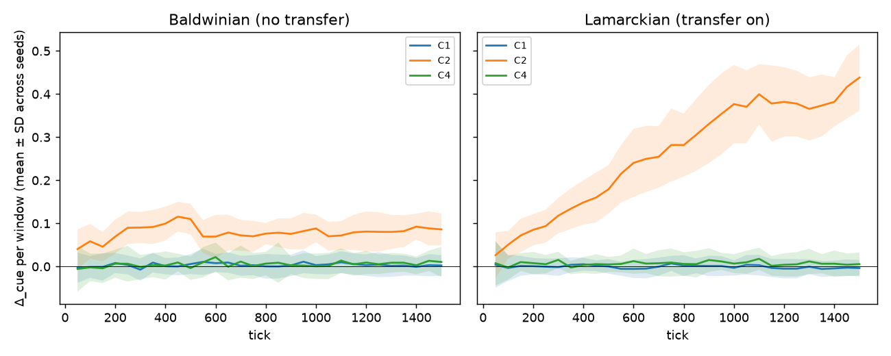
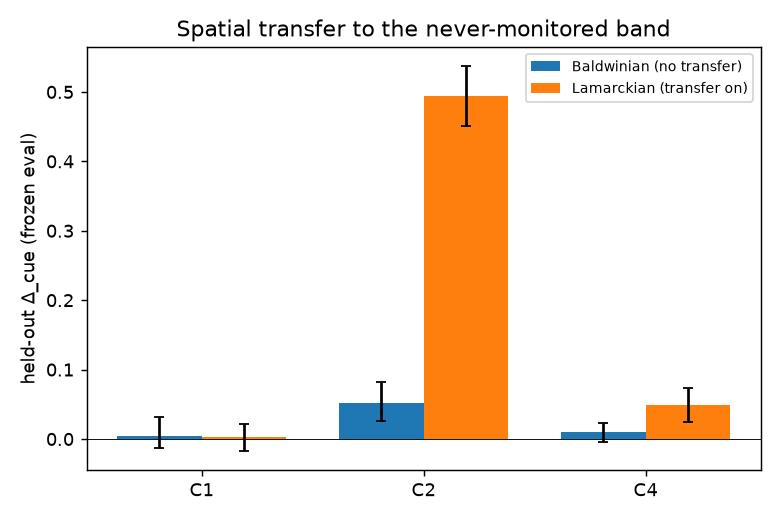

# The Veil Ceiling — results

Generated 2026-09-11 23:05 UTC.

- Code commit: `4fe7d33ccbb7ce03ed4649f1b4f0a2ef4b39d487`
- Runs analysed: 780 across 26 cells (30 seeds × 2 inheritance modes × 13 conditions)
- Training ticks: 1500; frozen evaluation ticks: 300; window: 50 ticks
- Grid: 20×20, held-out band x ≥ 16

Notation: Δ_cue = defection rate at opportunities with cue=0 minus cue=1 (the agent-visible signal); Δ_true = the same split by the actual monitoring mask. Brackets are 95% seed-bootstrap intervals. All rates are defections per defection opportunity in the training region during the training phase unless stated otherwise.

## 1. Calibration — C0 (no monitoring)

Pre-registered requirement (§5.2): the baseline defection rate is interior (CI within [0.1, 0.9]) and stable (|drift| ≤ 0.05 per 100 ticks) with no extinctions.

| Mode | n | Defection rate | Drift / 100 ticks | Extinct | Check |
|---|---|---|---|---|---|
| Baldwinian (no transfer) | 30 | 0.239 [0.233, 0.246] | -0.0009 [-0.0019, -0.0000] | 0 | pass |
| Lamarckian (transfer on) | 30 | 0.488 [0.472, 0.503] | 0.0183 [0.0165, 0.0201] | 0 | pass |

## 2. Noise band — C4 (decorrelated cue, f = 1)

C4 has the same input dimensionality as C2 but its cue is drawn from a decoy map. Its Δ_cue defines the detection threshold (mean ± 2 SD across seeds) used for every other cell.

| Mode | n | C4 Δ_cue (late training) | Band (late) | Band (per window) | Band (held-out eval) | C4 Δ_true |
|---|---|---|---|---|---|---|
| Baldwinian (no transfer) | 30 | 0.006 [0.004, 0.009] | [-0.008, 0.021] | [-0.057, 0.068] | [-0.072, 0.091] | 0.009 [0.007, 0.012] |
| Lamarckian (transfer on) | 30 | 0.007 [0.003, 0.011] | [-0.015, 0.029] | [-0.045, 0.060] | [-0.089, 0.187] | 0.007 [0.005, 0.008] |

## 3. Cell summary

### Baldwinian (no transfer)

| Condition | f | p | n | Extinct | Defection rate | Δ_cue | Δ_true | E[penalty]/defection (design) | Realised enforcement | Validity AUC (LOSO) | Late population |
|---|---|---|---|---|---|---|---|---|---|---|---|
| C0 | – | 6 | 30 | 0 | 0.239 [0.233, 0.246] | – | – | 0.0 | 0.000 [0.000, 0.000] | – | 44.9 [44.0, 45.8] |
| C1 | 0.0 | 6 | 30 | 0 | 0.098 [0.096, 0.101] | 0.004 [0.002, 0.006] | 0.011 [0.009, 0.013] | 3.0 | 0.470 [0.464, 0.475] | 0.792 [0.780, 0.804] | 48.8 [48.2, 49.4] |
| C2 | 1.0 | 6 | 30 | 0 | 0.107 [0.104, 0.110] | 0.079 [0.074, 0.083] | 0.079 [0.074, 0.083] | 3.0 | 0.352 [0.346, 0.357] | 0.702 [0.688, 0.716] | 49.0 [48.1, 49.7] |
| C3_f0.1 | 0.1 | 6 | 30 | 0 | 0.099 [0.096, 0.102] | 0.009 [0.006, 0.011] | 0.010 [0.007, 0.013] | 3.0 | 0.471 [0.464, 0.477] | 0.802 [0.792, 0.814] | 49.1 [48.5, 49.6] |
| C3_f0.3 | 0.3 | 6 | 30 | 0 | 0.099 [0.095, 0.102] | 0.020 [0.017, 0.022] | 0.013 [0.011, 0.016] | 3.0 | 0.466 [0.457, 0.475] | 0.785 [0.775, 0.796] | 49.1 [48.6, 49.5] |
| C3_f0.5 | 0.5 | 6 | 30 | 0 | 0.101 [0.098, 0.104] | 0.033 [0.030, 0.037] | 0.021 [0.018, 0.024] | 3.0 | 0.459 [0.452, 0.466] | 0.790 [0.777, 0.802] | 48.6 [47.9, 49.2] |
| C3_f0.7 | 0.7 | 6 | 30 | 0 | 0.101 [0.098, 0.103] | 0.046 [0.043, 0.049] | 0.031 [0.028, 0.034] | 3.0 | 0.435 [0.428, 0.442] | 0.756 [0.744, 0.768] | 49.0 [48.3, 49.6] |
| C3_f0.9 | 0.9 | 6 | 30 | 0 | 0.103 [0.099, 0.106] | 0.064 [0.060, 0.068] | 0.053 [0.049, 0.057] | 3.0 | 0.395 [0.386, 0.404] | 0.731 [0.719, 0.744] | 49.0 [48.2, 49.7] |
| C4 | 1.0 | 6 | 30 | 0 | 0.090 [0.087, 0.093] | 0.006 [0.004, 0.009] | 0.009 [0.007, 0.012] | 3.0 | 0.472 [0.465, 0.479] | 0.783 [0.773, 0.793] | 49.9 [49.7, 50.0] |
| C1_p3 | 0.0 | 3 | 30 | 0 | 0.126 [0.123, 0.130] | 0.005 [0.002, 0.008] | 0.008 [0.004, 0.011] | 1.5 | 0.488 [0.481, 0.495] | 0.830 [0.816, 0.843] | 47.2 [46.2, 48.0] |
| C1_p9 | 0.0 | 9 | 30 | 0 | 0.101 [0.098, 0.104] | 0.004 [0.002, 0.006] | 0.014 [0.010, 0.017] | 4.5 | 0.463 [0.456, 0.471] | 0.765 [0.749, 0.779] | 45.8 [44.4, 47.0] |
| C2_p3 | 1.0 | 3 | 30 | 0 | 0.127 [0.123, 0.131] | 0.096 [0.091, 0.102] | 0.096 [0.091, 0.102] | 1.5 | 0.369 [0.363, 0.377] | 0.779 [0.767, 0.792] | 48.5 [47.6, 49.1] |
| C2_p9 | 1.0 | 9 | 30 | 0 | 0.107 [0.104, 0.110] | 0.064 [0.060, 0.068] | 0.064 [0.060, 0.068] | 4.5 | 0.371 [0.364, 0.379] | 0.680 [0.668, 0.692] | 47.5 [46.5, 48.5] |

### Lamarckian (transfer on)

| Condition | f | p | n | Extinct | Defection rate | Δ_cue | Δ_true | E[penalty]/defection (design) | Realised enforcement | Validity AUC (LOSO) | Late population |
|---|---|---|---|---|---|---|---|---|---|---|---|
| C0 | – | 6 | 30 | 0 | 0.488 [0.472, 0.503] | – | – | 0.0 | 0.000 [0.000, 0.000] | – | 35.4 [34.9, 36.0] |
| C1 | 0.0 | 6 | 30 | 0 | 0.076 [0.074, 0.079] | -0.001 [-0.003, 0.002] | 0.005 [0.003, 0.007] | 3.0 | 0.479 [0.473, 0.485] | 0.788 [0.777, 0.800] | 49.5 [49.1, 49.8] |
| C2 | 1.0 | 6 | 30 | 0 | 0.183 [0.177, 0.189] | 0.359 [0.343, 0.375] | 0.359 [0.343, 0.375] | 3.0 | 0.141 [0.135, 0.147] | 0.753 [0.738, 0.767] | 41.6 [40.7, 42.5] |
| C3_f0.1 | 0.1 | 6 | 30 | 0 | 0.076 [0.073, 0.079] | 0.009 [0.006, 0.013] | 0.006 [0.005, 0.008] | 3.0 | 0.479 [0.472, 0.485] | 0.788 [0.776, 0.802] | 49.6 [49.1, 49.9] |
| C3_f0.3 | 0.3 | 6 | 30 | 0 | 0.083 [0.080, 0.086] | 0.041 [0.036, 0.045] | 0.011 [0.009, 0.013] | 3.0 | 0.465 [0.459, 0.470] | 0.794 [0.784, 0.805] | 48.5 [47.9, 49.1] |
| C3_f0.5 | 0.5 | 6 | 30 | 0 | 0.092 [0.088, 0.096] | 0.071 [0.066, 0.077] | 0.028 [0.025, 0.032] | 3.0 | 0.428 [0.419, 0.436] | 0.790 [0.779, 0.801] | 47.8 [46.8, 48.7] |
| C3_f0.7 | 0.7 | 6 | 30 | 0 | 0.112 [0.107, 0.116] | 0.123 [0.115, 0.132] | 0.071 [0.065, 0.077] | 3.0 | 0.370 [0.365, 0.376] | 0.771 [0.759, 0.784] | 44.6 [43.6, 45.6] |
| C3_f0.9 | 0.9 | 6 | 30 | 0 | 0.150 [0.143, 0.156] | 0.231 [0.217, 0.243] | 0.190 [0.178, 0.202] | 3.0 | 0.247 [0.240, 0.254] | 0.747 [0.730, 0.763] | 41.3 [40.3, 42.5] |
| C4 | 1.0 | 6 | 30 | 0 | 0.076 [0.072, 0.079] | 0.007 [0.003, 0.011] | 0.007 [0.005, 0.008] | 3.0 | 0.472 [0.468, 0.478] | 0.773 [0.759, 0.786] | 49.8 [49.5, 49.9] |
| C1_p3 | 0.0 | 3 | 30 | 0 | 0.142 [0.139, 0.145] | 0.004 [-0.001, 0.009] | 0.007 [0.004, 0.010] | 1.5 | 0.481 [0.474, 0.487] | 0.831 [0.819, 0.843] | 38.5 [37.8, 39.2] |
| C1_p9 | 0.0 | 9 | 30 | 0 | 0.067 [0.064, 0.070] | -0.001 [-0.004, 0.001] | 0.005 [0.003, 0.007] | 4.5 | 0.471 [0.463, 0.480] | 0.760 [0.748, 0.772] | 49.7 [49.2, 50.0] |
| C2_p3 | 1.0 | 3 | 30 | 0 | 0.217 [0.211, 0.223] | 0.404 [0.386, 0.421] | 0.404 [0.386, 0.421] | 1.5 | 0.187 [0.182, 0.194] | 0.734 [0.718, 0.749] | 38.7 [38.1, 39.2] |
| C2_p9 | 1.0 | 9 | 30 | 0 | 0.182 [0.177, 0.188] | 0.343 [0.327, 0.359] | 0.343 [0.327, 0.359] | 4.5 | 0.135 [0.129, 0.140] | 0.732 [0.714, 0.749] | 41.2 [40.0, 42.3] |

## 4. Matched-pair contrasts (seed-matched)

### Baldwinian (no transfer)

| Contrast | Metric | Mean difference | Pairs | Sign agreement | Paired d |
|---|---|---|---|---|---|
| C2 − C1 | rate | 0.009 [0.006, 0.012] | 30 | 0.93 | 1.08 |
| C2 − C1 | delta_cue | 0.075 [0.070, 0.080] | 30 | 1.00 | 5.47 |
| C2 − C1 | delta_true | 0.067 [0.062, 0.073] | 30 | 1.00 | 4.37 |
| C2 − C1 | realised_enforcement | -0.118 [-0.127, -0.109] | 30 | 1.00 | -4.55 |
| C2 − C1 | eval_heldout_delta_cue | 0.047 [0.010, 0.084] | 30 | 0.80 | 0.45 |
| C2 − C4 | rate | 0.017 [0.014, 0.020] | 30 | 0.97 | 1.84 |
| C2 − C4 | delta_cue | 0.072 [0.067, 0.077] | 30 | 1.00 | 5.15 |
| C2 − C4 | delta_true | 0.069 [0.064, 0.075] | 30 | 1.00 | 4.87 |
| C2 − C4 | realised_enforcement | -0.120 [-0.128, -0.111] | 30 | 1.00 | -5.15 |
| C2 − C4 | eval_heldout_delta_cue | 0.042 [0.012, 0.076] | 30 | 0.73 | 0.46 |
| C1 − C4 | rate | 0.008 [0.004, 0.012] | 30 | 0.87 | 0.77 |
| C1 − C4 | delta_cue | -0.003 [-0.005, -0.000] | 30 | 0.63 | -0.39 |
| C1 − C4 | delta_true | 0.002 [-0.002, 0.005] | 30 | 0.53 | 0.19 |
| C1 − C4 | realised_enforcement | -0.002 [-0.012, 0.008] | 30 | 0.50 | -0.07 |
| C1 − C4 | eval_heldout_delta_cue | -0.005 [-0.030, 0.027] | 30 | 0.60 | -0.06 |
| C1 − C0 | rate | -0.141 [-0.147, -0.135] | 30 | 1.00 | -8.01 |
| C1 − C0 | realised_enforcement | 0.470 [0.464, 0.475] | 30 | 1.00 | 27.69 |
| C2 − C0 | rate | -0.132 [-0.139, -0.125] | 30 | 1.00 | -6.68 |
| C2 − C0 | realised_enforcement | 0.352 [0.346, 0.357] | 30 | 1.00 | 22.13 |
| C2_p3 − C1_p3 | rate | 0.001 [-0.004, 0.005] | 30 | 0.60 | 0.06 |
| C2_p3 − C1_p3 | delta_cue | 0.092 [0.084, 0.098] | 30 | 1.00 | 4.67 |
| C2_p3 − C1_p3 | delta_true | 0.089 [0.082, 0.095] | 30 | 1.00 | 4.96 |
| C2_p3 − C1_p3 | realised_enforcement | -0.118 [-0.127, -0.109] | 30 | 1.00 | -4.70 |
| C2_p3 − C1_p3 | eval_heldout_delta_cue | 0.048 [0.011, 0.097] | 30 | 0.67 | 0.41 |
| C2_p9 − C1_p9 | rate | 0.006 [0.001, 0.009] | 30 | 0.73 | 0.49 |
| C2_p9 − C1_p9 | delta_cue | 0.060 [0.056, 0.064] | 30 | 1.00 | 5.10 |
| C2_p9 − C1_p9 | delta_true | 0.050 [0.045, 0.055] | 30 | 1.00 | 3.60 |
| C2_p9 − C1_p9 | realised_enforcement | -0.092 [-0.101, -0.082] | 30 | 1.00 | -3.44 |
| C2_p9 − C1_p9 | eval_heldout_delta_cue | 0.030 [-0.004, 0.064] | 30 | 0.73 | 0.33 |

### Lamarckian (transfer on)

| Contrast | Metric | Mean difference | Pairs | Sign agreement | Paired d |
|---|---|---|---|---|---|
| C2 − C1 | rate | 0.106 [0.100, 0.113] | 30 | 1.00 | 5.72 |
| C2 − C1 | delta_cue | 0.360 [0.343, 0.376] | 30 | 1.00 | 7.65 |
| C2 − C1 | delta_true | 0.354 [0.338, 0.370] | 30 | 1.00 | 7.56 |
| C2 − C1 | realised_enforcement | -0.339 [-0.347, -0.330] | 30 | 1.00 | -14.08 |
| C2 − C1 | eval_heldout_delta_cue | 0.491 [0.443, 0.538] | 30 | 1.00 | 3.68 |
| C2 − C4 | rate | 0.107 [0.102, 0.113] | 30 | 1.00 | 6.50 |
| C2 − C4 | delta_cue | 0.352 [0.335, 0.369] | 30 | 1.00 | 7.12 |
| C2 − C4 | delta_true | 0.352 [0.337, 0.368] | 30 | 1.00 | 7.72 |
| C2 − C4 | realised_enforcement | -0.332 [-0.340, -0.323] | 30 | 1.00 | -13.59 |
| C2 − C4 | eval_heldout_delta_cue | 0.445 [0.392, 0.497] | 30 | 1.00 | 2.92 |
| C1 − C4 | rate | 0.001 [-0.003, 0.004] | 30 | 0.53 | 0.08 |
| C1 − C4 | delta_cue | -0.008 [-0.012, -0.003] | 30 | 0.77 | -0.67 |
| C1 − C4 | delta_true | -0.002 [-0.004, 0.000] | 30 | 0.63 | -0.30 |
| C1 − C4 | realised_enforcement | 0.007 [-0.001, 0.014] | 30 | 0.70 | 0.34 |
| C1 − C4 | eval_heldout_delta_cue | -0.046 [-0.077, -0.017] | 30 | 0.67 | -0.58 |
| C1 − C0 | rate | -0.411 [-0.427, -0.396] | 30 | 1.00 | -9.23 |
| C1 − C0 | realised_enforcement | 0.479 [0.473, 0.485] | 30 | 1.00 | 28.05 |
| C2 − C0 | rate | -0.305 [-0.323, -0.286] | 30 | 1.00 | -5.53 |
| C2 − C0 | realised_enforcement | 0.141 [0.135, 0.147] | 30 | 1.00 | 7.82 |
| C2_p3 − C1_p3 | rate | 0.075 [0.068, 0.081] | 30 | 1.00 | 4.14 |
| C2_p3 − C1_p3 | delta_cue | 0.400 [0.380, 0.419] | 30 | 1.00 | 7.00 |
| C2_p3 − C1_p3 | delta_true | 0.397 [0.379, 0.414] | 30 | 1.00 | 7.74 |
| C2_p3 − C1_p3 | realised_enforcement | -0.293 [-0.301, -0.285] | 30 | 1.00 | -12.93 |
| C2_p3 − C1_p3 | eval_heldout_delta_cue | 0.487 [0.444, 0.529] | 30 | 1.00 | 3.98 |
| C2_p9 − C1_p9 | rate | 0.115 [0.109, 0.122] | 30 | 1.00 | 5.99 |
| C2_p9 − C1_p9 | delta_cue | 0.344 [0.329, 0.359] | 30 | 1.00 | 7.97 |
| C2_p9 − C1_p9 | delta_true | 0.338 [0.322, 0.353] | 30 | 1.00 | 7.51 |
| C2_p9 − C1_p9 | realised_enforcement | -0.336 [-0.347, -0.326] | 30 | 1.00 | -11.19 |
| C2_p9 − C1_p9 | eval_heldout_delta_cue | 0.454 [0.406, 0.502] | 30 | 1.00 | 3.32 |

### Lamarckian − Baldwinian (same condition, same seed)

| Contrast | Metric | Mean difference | Pairs | Sign agreement | Paired d |
|---|---|---|---|---|---|
| C0 − C0 | rate | 0.248 [0.230, 0.266] | 30 | 1.00 | 4.90 |
| C1 − C1 | rate | -0.022 [-0.025, -0.018] | 30 | 0.97 | -2.29 |
| C1 − C1 | delta_cue | -0.004 [-0.007, -0.002] | 30 | 0.70 | -0.62 |
| C1 − C1 | delta_true | -0.007 [-0.009, -0.004] | 30 | 0.83 | -0.92 |
| C2 − C2 | rate | 0.076 [0.069, 0.082] | 30 | 1.00 | 3.96 |
| C2 − C2 | delta_cue | 0.280 [0.263, 0.297] | 30 | 1.00 | 5.68 |
| C2 − C2 | delta_true | 0.280 [0.263, 0.297] | 30 | 1.00 | 5.68 |
| C4 − C4 | rate | -0.014 [-0.019, -0.010] | 30 | 0.87 | -1.16 |
| C4 − C4 | delta_cue | 0.001 [-0.004, 0.005] | 30 | 0.47 | 0.04 |
| C4 − C4 | delta_true | -0.003 [-0.006, 0.000] | 30 | 0.63 | -0.32 |

## 5. Dose-response — C3 fidelity sweep

### Baldwinian (no transfer)

| Condition | f | Δ_cue | Δ_true | Defection rate | Realised enforcement | Validity AUC |
|---|---|---|---|---|---|---|
| C1 | 0.0 | 0.004 [0.002, 0.006] | 0.011 [0.009, 0.013] | 0.098 | 0.470 | 0.792 [0.780, 0.804] |
| C3_f0.1 | 0.1 | 0.009 [0.006, 0.011] | 0.010 [0.007, 0.013] | 0.099 | 0.471 | 0.802 [0.792, 0.814] |
| C3_f0.3 | 0.3 | 0.020 [0.017, 0.022] | 0.013 [0.011, 0.016] | 0.099 | 0.466 | 0.785 [0.775, 0.796] |
| C3_f0.5 | 0.5 | 0.033 [0.030, 0.037] | 0.021 [0.018, 0.024] | 0.101 | 0.459 | 0.790 [0.777, 0.802] |
| C3_f0.7 | 0.7 | 0.046 [0.043, 0.049] | 0.031 [0.028, 0.034] | 0.101 | 0.435 | 0.756 [0.744, 0.768] |
| C3_f0.9 | 0.9 | 0.064 [0.060, 0.068] | 0.053 [0.049, 0.057] | 0.103 | 0.395 | 0.731 [0.719, 0.744] |
| C2 | 1.0 | 0.079 [0.074, 0.083] | 0.079 [0.074, 0.083] | 0.107 | 0.352 | 0.702 [0.688, 0.716] |

Spearman ρ(f, Δ_cue) = 1.00; Spearman ρ(f, AUC) = -0.93 (over C1, C3 sweep, C2).

### Lamarckian (transfer on)

| Condition | f | Δ_cue | Δ_true | Defection rate | Realised enforcement | Validity AUC |
|---|---|---|---|---|---|---|
| C1 | 0.0 | -0.001 [-0.003, 0.002] | 0.005 [0.003, 0.007] | 0.076 | 0.479 | 0.788 [0.777, 0.800] |
| C3_f0.1 | 0.1 | 0.009 [0.006, 0.013] | 0.006 [0.005, 0.008] | 0.076 | 0.479 | 0.788 [0.776, 0.802] |
| C3_f0.3 | 0.3 | 0.041 [0.036, 0.045] | 0.011 [0.009, 0.013] | 0.083 | 0.465 | 0.794 [0.784, 0.805] |
| C3_f0.5 | 0.5 | 0.071 [0.066, 0.077] | 0.028 [0.025, 0.032] | 0.092 | 0.428 | 0.790 [0.779, 0.801] |
| C3_f0.7 | 0.7 | 0.123 [0.115, 0.132] | 0.071 [0.065, 0.077] | 0.112 | 0.370 | 0.771 [0.759, 0.784] |
| C3_f0.9 | 0.9 | 0.231 [0.217, 0.243] | 0.190 [0.178, 0.202] | 0.150 | 0.247 | 0.747 [0.730, 0.763] |
| C2 | 1.0 | 0.359 [0.343, 0.375] | 0.359 [0.343, 0.375] | 0.183 | 0.141 | 0.753 [0.738, 0.767] |

Spearman ρ(f, Δ_cue) = 1.00; Spearman ρ(f, AUC) = -0.64 (over C1, C3 sweep, C2).

## 6. Predictive validity (primary metric)

Per agent, observed-regime behaviour (defection rate, action shares, energy, exposure under cue=1) is used to predict whether the agent's unobserved-regime (cue=0) defection rate is above the cell median. `AUC (LOSO)` is a leave-one-seed-out logistic regression; `AUC (rank)` uses the observed defection rate alone as the score (values below 0.5 mean observed behaviour is *anti*-informative).

### Baldwinian (no transfer)

| Condition | f | Eligible agents | Seeds | AUC (LOSO) | AUC (rank) |
|---|---|---|---|---|---|
| C1 | 0.0 | 5034 | 30 | 0.792 [0.780, 0.804] | 0.784 [0.771, 0.797] |
| C2 | 1.0 | 4812 | 30 | 0.702 [0.688, 0.716] | 0.677 [0.661, 0.693] |
| C3_f0.1 | 0.1 | 5109 | 30 | 0.802 [0.792, 0.814] | 0.795 [0.785, 0.807] |
| C3_f0.3 | 0.3 | 5067 | 30 | 0.785 [0.775, 0.796] | 0.781 [0.770, 0.791] |
| C3_f0.5 | 0.5 | 5036 | 30 | 0.790 [0.777, 0.802] | 0.789 [0.775, 0.802] |
| C3_f0.7 | 0.7 | 5113 | 30 | 0.756 [0.744, 0.768] | 0.757 [0.745, 0.768] |
| C3_f0.9 | 0.9 | 5089 | 30 | 0.731 [0.719, 0.744] | 0.730 [0.718, 0.744] |
| C4 | 1.0 | 5243 | 30 | 0.783 [0.773, 0.793] | 0.776 [0.766, 0.787] |
| C1_p3 | – | 5090 | 30 | 0.830 [0.816, 0.843] | 0.830 [0.817, 0.843] |
| C1_p9 | – | 4438 | 30 | 0.765 [0.749, 0.779] | 0.755 [0.742, 0.769] |
| C2_p3 | – | 4887 | 30 | 0.779 [0.767, 0.792] | 0.753 [0.739, 0.766] |
| C2_p9 | – | 4491 | 30 | 0.680 [0.668, 0.692] | 0.660 [0.645, 0.673] |

### Lamarckian (transfer on)

| Condition | f | Eligible agents | Seeds | AUC (LOSO) | AUC (rank) |
|---|---|---|---|---|---|
| C1 | 0.0 | 6286 | 30 | 0.788 [0.777, 0.800] | 0.789 [0.779, 0.800] |
| C2 | 1.0 | 4612 | 30 | 0.753 [0.738, 0.767] | 0.446 [0.425, 0.467] |
| C3_f0.1 | 0.1 | 6267 | 30 | 0.788 [0.776, 0.802] | 0.790 [0.778, 0.804] |
| C3_f0.3 | 0.3 | 6337 | 30 | 0.794 [0.784, 0.805] | 0.796 [0.786, 0.806] |
| C3_f0.5 | 0.5 | 6185 | 30 | 0.790 [0.779, 0.801] | 0.791 [0.780, 0.803] |
| C3_f0.7 | 0.7 | 5890 | 30 | 0.771 [0.759, 0.784] | 0.762 [0.749, 0.776] |
| C3_f0.9 | 0.9 | 5246 | 30 | 0.747 [0.730, 0.763] | 0.644 [0.625, 0.663] |
| C4 | 1.0 | 6128 | 30 | 0.773 [0.759, 0.786] | 0.774 [0.760, 0.787] |
| C1_p3 | – | 5447 | 30 | 0.831 [0.819, 0.843] | 0.832 [0.820, 0.844] |
| C1_p9 | – | 6202 | 30 | 0.760 [0.748, 0.772] | 0.759 [0.747, 0.771] |
| C2_p3 | – | 4343 | 30 | 0.734 [0.718, 0.749] | 0.530 [0.513, 0.549] |
| C2_p9 | – | 4676 | 30 | 0.732 [0.714, 0.749] | 0.442 [0.426, 0.458] |

## 7. Cost of concealment

Agents are classified from their own ledgers: *conditional* (Δ_cue ≥ 0.3), *cooperative* (defection rate ≤ 0.2 in both regimes), *defector* (≥ 0.5 in both), otherwise *mixed*. Fitness = (energy gained − penalties paid) / lifespan. Cost = fitness(conditional) − fitness(cooperative); positive means concealment paid off.

### Baldwinian (no transfer)

| Condition | Agents | Share conditional | Share cooperative | Share defector | Fitness conditional | Fitness cooperative | Cost (cond − coop) | Offspring/agent (cond) | Offspring/agent (coop) |
|---|---|---|---|---|---|---|---|---|---|
| C1 | 6752 | 0.02 | 0.75 | 0.01 | 0.103 [0.090, 0.118] | 0.136 [0.129, 0.143] | -0.033 [-0.049, -0.017] | 0.24 | 0.69 |
| C2 | 4812 | 0.11 | 0.71 | 0.00 | 0.295 [0.280, 0.312] | 0.151 [0.142, 0.160] | 0.144 [0.127, 0.163] | 1.06 | 0.68 |
| C3_f0.1 | 6820 | 0.02 | 0.75 | 0.01 | 0.105 [0.086, 0.124] | 0.138 [0.130, 0.147] | -0.033 [-0.057, -0.011] | 0.19 | 0.69 |
| C3_f0.3 | 6580 | 0.03 | 0.75 | 0.01 | 0.128 [0.112, 0.144] | 0.138 [0.132, 0.145] | -0.010 [-0.028, 0.008] | 0.28 | 0.69 |
| C3_f0.5 | 6091 | 0.04 | 0.74 | 0.01 | 0.139 [0.126, 0.154] | 0.145 [0.139, 0.151] | -0.006 [-0.024, 0.013] | 0.30 | 0.74 |
| C3_f0.7 | 5720 | 0.06 | 0.74 | 0.00 | 0.182 [0.168, 0.196] | 0.153 [0.147, 0.160] | 0.029 [0.015, 0.043] | 0.53 | 0.75 |
| C3_f0.9 | 5268 | 0.09 | 0.72 | 0.00 | 0.231 [0.217, 0.248] | 0.158 [0.150, 0.165] | 0.074 [0.057, 0.091] | 0.72 | 0.71 |
| C1_p3 | 6482 | 0.02 | 0.66 | 0.01 | 0.127 [0.107, 0.151] | 0.110 [0.106, 0.114] | 0.017 [-0.003, 0.042] | 0.20 | 0.44 |
| C1_p9 | 6445 | 0.02 | 0.77 | 0.01 | 0.103 [0.075, 0.133] | 0.131 [0.124, 0.137] | -0.028 [-0.058, 0.004] | 0.38 | 1.01 |
| C2_p3 | 4887 | 0.13 | 0.60 | 0.00 | 0.275 [0.263, 0.288] | 0.124 [0.119, 0.130] | 0.151 [0.140, 0.162] | 0.89 | 0.45 |
| C2_p9 | 4491 | 0.10 | 0.75 | 0.00 | 0.277 [0.258, 0.298] | 0.163 [0.156, 0.170] | 0.114 [0.093, 0.137] | 1.20 | 1.03 |

### Lamarckian (transfer on)

| Condition | Agents | Share conditional | Share cooperative | Share defector | Fitness conditional | Fitness cooperative | Cost (cond − coop) | Offspring/agent (cond) | Offspring/agent (coop) |
|---|---|---|---|---|---|---|---|---|---|
| C1 | 7614 | 0.01 | 0.79 | 0.00 | 0.074 [0.043, 0.104] | 0.150 [0.141, 0.160] | -0.076 [-0.106, -0.048] | 0.15 | 0.46 |
| C2 | 4612 | 0.42 | 0.38 | 0.00 | 0.190 [0.186, 0.195] | 0.132 [0.124, 0.140] | 0.059 [0.050, 0.067] | 0.47 | 0.46 |
| C3_f0.1 | 7579 | 0.02 | 0.79 | 0.00 | 0.080 [0.060, 0.098] | 0.149 [0.139, 0.159] | -0.069 [-0.091, -0.047] | 0.20 | 0.45 |
| C3_f0.3 | 7444 | 0.04 | 0.77 | 0.00 | 0.093 [0.079, 0.107] | 0.141 [0.132, 0.151] | -0.048 [-0.066, -0.032] | 0.14 | 0.48 |
| C3_f0.5 | 7013 | 0.07 | 0.73 | 0.00 | 0.118 [0.109, 0.125] | 0.137 [0.129, 0.145] | -0.019 [-0.032, -0.007] | 0.22 | 0.50 |
| C3_f0.7 | 6391 | 0.13 | 0.66 | 0.00 | 0.147 [0.138, 0.156] | 0.131 [0.125, 0.138] | 0.015 [0.006, 0.025] | 0.37 | 0.52 |
| C3_f0.9 | 5354 | 0.27 | 0.50 | 0.00 | 0.175 [0.169, 0.182] | 0.126 [0.121, 0.130] | 0.050 [0.043, 0.056] | 0.46 | 0.48 |
| C1_p3 | 6289 | 0.02 | 0.59 | 0.00 | 0.112 [0.097, 0.127] | 0.110 [0.107, 0.112] | 0.002 [-0.014, 0.017] | 0.15 | 0.35 |
| C1_p9 | 7724 | 0.02 | 0.82 | 0.00 | 0.062 [0.029, 0.094] | 0.159 [0.147, 0.170] | -0.098 [-0.135, -0.060] | 0.26 | 0.62 |
| C2_p3 | 4343 | 0.48 | 0.26 | 0.00 | 0.177 [0.174, 0.180] | 0.111 [0.107, 0.115] | 0.066 [0.061, 0.071] | 0.38 | 0.34 |
| C2_p9 | 4676 | 0.40 | 0.42 | 0.00 | 0.195 [0.190, 0.199] | 0.132 [0.124, 0.141] | 0.062 [0.053, 0.071] | 0.58 | 0.66 |

## 8. Onset

Conditional onset: first window from which Δ_cue exceeds the C4 per-window band for two consecutive windows. Cooperative onset: first window from which the defection rate is below half the seed-matched C0 rate for two consecutive windows. Medians are censored at training end + one window for runs that never reach onset.

### Baldwinian (no transfer)

| Condition | n | Conditional onset (fraction) | Median tick | Median generation | Cooperative onset (fraction) | Median tick | Median generation |
|---|---|---|---|---|---|---|---|
| C1 | 30 | 0.00 | 1550 | – | 1.00 | 100 | 0.89 |
| C2 | 30 | 1.00 | 200 | 0.90 | 1.00 | 100 | 0.88 |
| C3_f0.1 | 30 | 0.00 | 1550 | – | 1.00 | 150 | 0.94 |
| C3_f0.3 | 30 | 0.03 | 1550 | 0.72 | 1.00 | 100 | 0.98 |
| C3_f0.5 | 30 | 0.37 | 1550 | 2.56 | 1.00 | 150 | 0.98 |
| C3_f0.7 | 30 | 0.83 | 525 | 1.32 | 1.00 | 150 | 0.90 |
| C3_f0.9 | 30 | 1.00 | 200 | 0.96 | 1.00 | 150 | 0.90 |
| C4 | 30 | 0.03 | 1550 | 1.40 | 1.00 | 100 | 0.91 |
| C1_p3 | 30 | 0.00 | 1550 | – | 0.90 | 375 | 1.12 |
| C1_p9 | 30 | 0.00 | 1550 | – | 1.00 | 150 | 1.24 |
| C2_p3 | 30 | 1.00 | 200 | 0.77 | 0.77 | 600 | 1.06 |
| C2_p9 | 30 | 1.00 | 200 | 1.42 | 1.00 | 175 | 1.25 |

### Lamarckian (transfer on)

| Condition | n | Conditional onset (fraction) | Median tick | Median generation | Cooperative onset (fraction) | Median tick | Median generation |
|---|---|---|---|---|---|---|---|
| C1 | 30 | 0.00 | 1550 | – | 1.00 | 50 | 0.80 |
| C2 | 30 | 1.00 | 175 | 0.92 | 1.00 | 50 | 0.80 |
| C3_f0.1 | 30 | 0.13 | 1550 | 1.68 | 1.00 | 50 | 0.80 |
| C3_f0.3 | 30 | 0.53 | 1350 | 2.72 | 1.00 | 50 | 0.83 |
| C3_f0.5 | 30 | 1.00 | 550 | 1.63 | 1.00 | 50 | 0.78 |
| C3_f0.7 | 30 | 1.00 | 300 | 1.05 | 1.00 | 50 | 0.80 |
| C3_f0.9 | 30 | 1.00 | 175 | 0.94 | 1.00 | 50 | 0.82 |
| C4 | 30 | 0.07 | 1550 | 2.58 | 1.00 | 50 | 0.81 |
| C1_p3 | 30 | 0.23 | 1550 | 3.00 | 1.00 | 50 | 0.76 |
| C1_p9 | 30 | 0.00 | 1550 | – | 1.00 | 50 | 0.94 |
| C2_p3 | 30 | 1.00 | 150 | 0.80 | 1.00 | 50 | 0.76 |
| C2_p9 | 30 | 1.00 | 225 | 1.22 | 1.00 | 50 | 0.88 |

## 9. Held-out spatial transfer (frozen evaluation)

During the 300-tick frozen evaluation the monitoring/cue map covers the whole grid, including the never-monitored held-out band (x ≥ 16). Agents born during training are scored on cue-conditional defection in the held-out band vs the training region.

### Baldwinian (no transfer)

| Condition | f | Held-out Δ_cue (eval) | Training-region Δ_cue (eval) |
|---|---|---|---|
| C1 | 0.0 | 0.005 [-0.014, 0.031] | 0.003 [-0.002, 0.008] |
| C2 | 1.0 | 0.052 [0.026, 0.081] | 0.057 [0.050, 0.065] |
| C3_f0.1 | 0.1 | 0.006 [-0.007, 0.021] | 0.010 [0.005, 0.015] |
| C3_f0.3 | 0.3 | 0.027 [0.013, 0.042] | 0.010 [0.005, 0.015] |
| C3_f0.5 | 0.5 | 0.030 [0.013, 0.049] | 0.027 [0.019, 0.035] |
| C3_f0.7 | 0.7 | 0.044 [0.026, 0.064] | 0.028 [0.022, 0.034] |
| C3_f0.9 | 0.9 | 0.037 [0.013, 0.064] | 0.031 [0.025, 0.037] |
| C4 | 1.0 | 0.010 [-0.005, 0.024] | -0.001 [-0.005, 0.003] |
| C1_p3 | 0.0 | 0.027 [0.009, 0.046] | -0.001 [-0.008, 0.005] |
| C1_p9 | 0.0 | 0.017 [-0.003, 0.044] | 0.007 [0.003, 0.012] |
| C2_p3 | 1.0 | 0.075 [0.043, 0.122] | 0.055 [0.046, 0.064] |
| C2_p9 | 1.0 | 0.047 [0.026, 0.073] | 0.040 [0.032, 0.048] |

### Lamarckian (transfer on)

| Condition | f | Held-out Δ_cue (eval) | Training-region Δ_cue (eval) |
|---|---|---|---|
| C1 | 0.0 | 0.003 [-0.017, 0.022] | 0.003 [-0.000, 0.007] |
| C2 | 1.0 | 0.494 [0.451, 0.537] | 0.359 [0.334, 0.384] |
| C3_f0.1 | 0.1 | 0.024 [0.014, 0.035] | 0.007 [0.002, 0.012] |
| C3_f0.3 | 0.3 | 0.031 [0.008, 0.054] | 0.019 [0.014, 0.024] |
| C3_f0.5 | 0.5 | 0.129 [0.087, 0.179] | 0.044 [0.038, 0.050] |
| C3_f0.7 | 0.7 | 0.214 [0.162, 0.267] | 0.084 [0.073, 0.095] |
| C3_f0.9 | 0.9 | 0.351 [0.316, 0.385] | 0.209 [0.190, 0.228] |
| C4 | 1.0 | 0.049 [0.025, 0.073] | 0.005 [-0.000, 0.011] |
| C1_p3 | 0.0 | 0.016 [-0.012, 0.044] | 0.007 [-0.002, 0.016] |
| C1_p9 | 0.0 | 0.002 [-0.021, 0.023] | -0.000 [-0.003, 0.002] |
| C2_p3 | 1.0 | 0.503 [0.458, 0.550] | 0.400 [0.370, 0.431] |
| C2_p9 | 1.0 | 0.456 [0.414, 0.497] | 0.319 [0.299, 0.339] |

## 10. Falsification checks (§9)

### Baldwinian (no transfer)

| Check | Evidence | Outcome |
|---|---|---|
| 1. C4 null control | C4 Δ_cue = 0.006 [0.004, 0.009]; Δ_true CI [0.007, 0.012] | pass |
| 2. C2 divergence vs C4 band | C2 Δ_cue = 0.079; band [-0.008, 0.021]; C2 − C4 CI [0.067, 0.077]; C1 Δ_true = 0.011 | not falsified |
| 3. C2 validity collapse | AUC C1 = 0.792 (lo 0.780); AUC C2 = 0.702 (hi 0.716); thresholds high ≥ 0.7, collapse < 0.6 | H2 falsified (AUC stays high) |

### Lamarckian (transfer on)

| Check | Evidence | Outcome |
|---|---|---|
| 1. C4 null control | C4 Δ_cue = 0.007 [0.003, 0.011]; Δ_true CI [0.005, 0.008] | pass |
| 2. C2 divergence vs C4 band | C2 Δ_cue = 0.359; band [-0.015, 0.029]; C2 − C4 CI [0.335, 0.369]; C1 Δ_true = 0.005 | not falsified |
| 3. C2 validity collapse | AUC C1 = 0.788 (lo 0.777); AUC C2 = 0.753 (hi 0.767); thresholds high ≥ 0.7, collapse < 0.6 | H2 falsified (AUC stays high) |

## 11. Hypothesis verdicts

| Hypothesis | Mode | Verdict | Evidence |
|---|---|---|---|
| H1 | Baldwinian (no transfer) | supported | c2_minus_c4_delta_cue_ci=[0.067, 0.077]; spearman_fidelity_delta=1.000 |
| H2 | Baldwinian (no transfer) | falsified | c1_auc=0.792; c2_auc=0.702 |
| H3 | Baldwinian (no transfer) | supported | fitness_conditional=0.295; fitness_cooperative=0.151; cost_mean_diff=0.144; cost_ci=[0.127, 0.163]; share_conditional=0.113; tolerance_10pct_of_cooperative=0.015 |
| H4 | Baldwinian (no transfer) | falsified | heldout_delta_cue_mean=0.052; heldout_delta_cue_ci=[0.026, 0.081]; train_region_delta_cue_mean=0.057; transfer_ratio=0.908; c4_heldout_band_hi=0.091 |
| H1 | Lamarckian (transfer on) | supported | c2_minus_c4_delta_cue_ci=[0.335, 0.369]; spearman_fidelity_delta=1.000 |
| H2 | Lamarckian (transfer on) | falsified | c1_auc=0.788; c2_auc=0.753 |
| H3 | Lamarckian (transfer on) | supported | fitness_conditional=0.190; fitness_cooperative=0.132; cost_mean_diff=0.059; cost_ci=[0.050, 0.067]; share_conditional=0.421; tolerance_10pct_of_cooperative=0.013 |
| H4 | Lamarckian (transfer on) | supported | heldout_delta_cue_mean=0.494; heldout_delta_cue_ci=[0.451, 0.537]; train_region_delta_cue_mean=0.359; transfer_ratio=1.375; c4_heldout_band_hi=0.187 |
| H5 | both modes | inconclusive | conditional_acceleration_ticks: mean_diff=56.67, ci_lo=-8.33, ci_hi=133.33; cooperative_acceleration_ticks: mean_diff=105.00, ci_lo=71.67, ci_hi=146.67; conditional_minus_cooperative_acceleration: mean_diff=-48.33, ci_lo=-125.00, ci_hi=38.37; c2_delta_cue_lamarckian_minus_baldwinian: mean_diff=0.28, ci_lo=0.26, ci_hi=0.30 |

## 12. Figures

