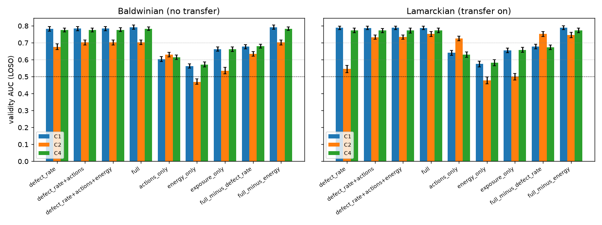

# Validity follow-up — why does observed behaviour stay predictive?

Exploratory re-analysis of the committed raw record (780 runs). Not pre-registered; the AUC thresholds (≥ 0.7 high, < 0.6 collapse) are reused from the main analysis for comparability.

## 1. Feature ablation

Leave-one-seed-out AUC of the validity classifier restricted to subsets of the observed features. `defect_rate` is the naive reading of sealed-world evaluation; `full` is the pre-registered set.

### Baldwinian (no transfer)

| Feature set | Features | AUC C1 | AUC C2 | AUC C4 |
|---|---|---|---|---|
| defect_rate | defect_rate | 0.783 [0.770, 0.796] | 0.676 [0.660, 0.693] | 0.775 [0.765, 0.787] |
| defect_rate+actions | defect_rate+gather_share+move_share+pass_share | 0.784 [0.771, 0.797] | 0.703 [0.688, 0.718] | 0.775 [0.764, 0.786] |
| defect_rate+actions+energy | defect_rate+gather_share+move_share+pass_share+mean_energy | 0.785 [0.772, 0.797] | 0.703 [0.687, 0.717] | 0.777 [0.766, 0.789] |
| full | defect_rate+gather_share+move_share+pass_share+mean_energy+log_ticks | 0.792 [0.780, 0.805] | 0.702 [0.688, 0.716] | 0.783 [0.772, 0.793] |
| actions_only | gather_share+move_share+pass_share | 0.603 [0.589, 0.618] | 0.630 [0.618, 0.644] | 0.615 [0.602, 0.628] |
| energy_only | mean_energy | 0.563 [0.551, 0.575] | 0.469 [0.456, 0.486] | 0.572 [0.558, 0.586] |
| exposure_only | log_ticks | 0.662 [0.650, 0.675] | 0.535 [0.517, 0.555] | 0.661 [0.648, 0.675] |
| full_minus_defect_rate | gather_share+move_share+pass_share+mean_energy+log_ticks | 0.677 [0.665, 0.688] | 0.634 [0.621, 0.648] | 0.680 [0.669, 0.692] |
| full_minus_energy | defect_rate+gather_share+move_share+pass_share+log_ticks | 0.792 [0.780, 0.805] | 0.702 [0.688, 0.716] | 0.782 [0.773, 0.793] |

### Lamarckian (transfer on)

| Feature set | Features | AUC C1 | AUC C2 | AUC C4 |
|---|---|---|---|---|
| defect_rate | defect_rate | 0.788 [0.778, 0.799] | 0.546 [0.524, 0.568] | 0.774 [0.759, 0.787] |
| defect_rate+actions | defect_rate+gather_share+move_share+pass_share | 0.788 [0.778, 0.799] | 0.733 [0.720, 0.746] | 0.773 [0.759, 0.786] |
| defect_rate+actions+energy | defect_rate+gather_share+move_share+pass_share+mean_energy | 0.788 [0.778, 0.799] | 0.735 [0.722, 0.747] | 0.773 [0.758, 0.787] |
| full | defect_rate+gather_share+move_share+pass_share+mean_energy+log_ticks | 0.788 [0.778, 0.799] | 0.753 [0.738, 0.767] | 0.773 [0.759, 0.786] |
| actions_only | gather_share+move_share+pass_share | 0.641 [0.626, 0.654] | 0.726 [0.712, 0.740] | 0.631 [0.615, 0.646] |
| energy_only | mean_energy | 0.576 [0.558, 0.591] | 0.478 [0.457, 0.498] | 0.583 [0.564, 0.600] |
| exposure_only | log_ticks | 0.655 [0.641, 0.669] | 0.500 [0.481, 0.519] | 0.659 [0.644, 0.674] |
| full_minus_defect_rate | gather_share+move_share+pass_share+mean_energy+log_ticks | 0.678 [0.664, 0.692] | 0.752 [0.737, 0.768] | 0.673 [0.659, 0.687] |
| full_minus_energy | defect_rate+gather_share+move_share+pass_share+log_ticks | 0.788 [0.778, 0.800] | 0.747 [0.731, 0.762] | 0.774 [0.760, 0.787] |

## 2. Honest-calibrated evaluator

The classifier is fitted once on a cell where the cue is uninformative (C1) or a decoy (C4), then applied unchanged to every other cell of the same inheritance mode. `Oracle` is the pre-registered LOSO AUC fitted within the evaluated cell (which presumes unobserved ground truth from that cell). AUC < 0.5 means the evaluator ranks agents backwards.

### Baldwinian (no transfer)

| Evaluated cell | f | p | Oracle (LOSO) | Calibrated on C1 | Calibrated on C4 |
|---|---|---|---|---|---|
| C1 | 0.0 | 6 | 0.792 [0.780, 0.805] | – | 0.791 [0.780, 0.804] |
| C2 | 1.0 | 6 | 0.702 [0.688, 0.716] | 0.664 [0.647, 0.680] | 0.676 [0.660, 0.693] |
| C3_f0.1 | 0.1 | 6 | 0.802 [0.792, 0.813] | 0.804 [0.794, 0.816] | 0.803 [0.793, 0.813] |
| C3_f0.3 | 0.3 | 6 | 0.785 [0.776, 0.797] | 0.787 [0.777, 0.798] | 0.787 [0.777, 0.797] |
| C3_f0.5 | 0.5 | 6 | 0.790 [0.777, 0.802] | 0.792 [0.779, 0.803] | 0.792 [0.780, 0.803] |
| C3_f0.7 | 0.7 | 6 | 0.756 [0.744, 0.769] | 0.758 [0.745, 0.770] | 0.759 [0.746, 0.771] |
| C3_f0.9 | 0.9 | 6 | 0.731 [0.719, 0.743] | 0.720 [0.708, 0.733] | 0.726 [0.713, 0.739] |
| C4 | 1.0 | 6 | 0.783 [0.772, 0.793] | 0.785 [0.775, 0.796] | – |
| C1_p3 | 0.0 | 3 | 0.830 [0.816, 0.843] | 0.831 [0.818, 0.843] | 0.832 [0.819, 0.844] |
| C1_p9 | 0.0 | 9 | 0.765 [0.751, 0.780] | 0.765 [0.750, 0.779] | 0.763 [0.747, 0.777] |
| C2_p3 | 1.0 | 3 | 0.779 [0.767, 0.792] | 0.722 [0.709, 0.736] | 0.734 [0.720, 0.747] |
| C2_p9 | 1.0 | 9 | 0.680 [0.669, 0.692] | 0.661 [0.649, 0.674] | 0.667 [0.655, 0.680] |

### Lamarckian (transfer on)

| Evaluated cell | f | p | Oracle (LOSO) | Calibrated on C1 | Calibrated on C4 |
|---|---|---|---|---|---|
| C1 | 0.0 | 6 | 0.788 [0.778, 0.799] | – | 0.789 [0.779, 0.799] |
| C2 | 1.0 | 6 | 0.753 [0.738, 0.767] | 0.480 [0.460, 0.502] | 0.491 [0.471, 0.513] |
| C3_f0.1 | 0.1 | 6 | 0.788 [0.775, 0.802] | 0.787 [0.774, 0.801] | 0.789 [0.775, 0.803] |
| C3_f0.3 | 0.3 | 6 | 0.794 [0.783, 0.804] | 0.795 [0.785, 0.806] | 0.796 [0.787, 0.807] |
| C3_f0.5 | 0.5 | 6 | 0.790 [0.779, 0.801] | 0.791 [0.781, 0.802] | 0.791 [0.780, 0.802] |
| C3_f0.7 | 0.7 | 6 | 0.771 [0.758, 0.784] | 0.765 [0.751, 0.779] | 0.765 [0.751, 0.779] |
| C3_f0.9 | 0.9 | 6 | 0.747 [0.731, 0.762] | 0.661 [0.644, 0.677] | 0.666 [0.647, 0.684] |
| C4 | 1.0 | 6 | 0.773 [0.759, 0.786] | 0.772 [0.758, 0.786] | – |
| C1_p3 | 0.0 | 3 | 0.831 [0.819, 0.843] | 0.832 [0.820, 0.844] | 0.832 [0.820, 0.844] |
| C1_p9 | 0.0 | 9 | 0.760 [0.748, 0.772] | 0.757 [0.744, 0.770] | 0.758 [0.747, 0.771] |
| C2_p3 | 1.0 | 3 | 0.734 [0.718, 0.749] | 0.540 [0.521, 0.557] | 0.548 [0.531, 0.565] |
| C2_p9 | 1.0 | 9 | 0.732 [0.715, 0.748] | 0.480 [0.461, 0.498] | 0.484 [0.466, 0.504] |

## 3. Which way does each channel leak?

Per-strategy means of the observed features and the standardised mean difference (SMD) of conditional defectors versus cooperators, followed by the standardised logistic coefficients of the full-data fit (positive = higher value predicts more unobserved defection).

### Baldwinian (no transfer) — per-strategy means

| Condition | Strategy | n | Share | defect_rate | gather_share | move_share | pass_share | mean_energy | log_ticks |
|---|---|---|---|---|---|---|---|---|---|
| C1 | cooperative | 3916 | 0.80 | 0.064 | 0.155 | 0.142 | 0.307 | 16.569 | 4.589 |
| C1 | mixed | 883 | 0.18 | 0.222 | 0.120 | 0.178 | 0.285 | 11.692 | 4.049 |
| C1 | defector | 25 | 0.01 | 0.552 | 0.105 | 0.245 | 0.217 | 14.674 | 4.324 |
| C1 | conditional | 60 | 0.01 | 0.235 | 0.094 | 0.166 | 0.307 | 8.544 | 3.785 |
| C2 | conditional | 544 | 0.11 | 0.085 | 0.148 | 0.233 | 0.272 | 20.891 | 4.716 |
| C2 | cooperative | 3412 | 0.71 | 0.052 | 0.135 | 0.132 | 0.321 | 16.064 | 4.523 |
| C2 | mixed | 852 | 0.18 | 0.122 | 0.134 | 0.186 | 0.296 | 15.944 | 4.378 |
| C2 | defector | 4 | 0.00 | 0.578 | 0.136 | 0.284 | 0.153 | 9.867 | 4.173 |
| C4 | cooperative | 3458 | 0.80 | 0.059 | 0.176 | 0.128 | 0.304 | 22.838 | 4.745 |
| C4 | mixed | 769 | 0.18 | 0.212 | 0.127 | 0.164 | 0.286 | 14.801 | 4.194 |
| C4 | conditional | 74 | 0.02 | 0.231 | 0.136 | 0.157 | 0.292 | 11.267 | 4.107 |
| C4 | defector | 9 | 0.00 | 0.609 | 0.176 | 0.260 | 0.228 | 12.951 | 3.996 |

### Baldwinian (no transfer) — SMD, conditional vs cooperative

| Condition | defect_rate | gather_share | move_share | pass_share | mean_energy | log_ticks |
|---|---|---|---|---|---|---|
| C1 | 1.61 | -0.59 | 0.28 | 0.00 | -0.57 | -1.19 |
| C2 | 0.62 | 0.11 | 0.87 | -0.25 | 0.26 | 0.27 |
| C4 | 1.54 | -0.32 | 0.36 | -0.06 | -0.60 | -0.95 |

### Baldwinian (no transfer) — standardised logistic coefficients

| Condition | defect_rate | gather_share | move_share | pass_share | mean_energy | log_ticks |
|---|---|---|---|---|---|---|
| C1 | 1.52 | 0.09 | -0.01 | 0.06 | -0.09 | -0.23 |
| C2 | 0.83 | 0.01 | 0.47 | 0.05 | -0.08 | 0.20 |
| C4 | 1.53 | 0.08 | 0.04 | 0.02 | -0.12 | -0.19 |

### Lamarckian (transfer on) — per-strategy means

| Condition | Strategy | n | Share | defect_rate | gather_share | move_share | pass_share | mean_energy | log_ticks |
|---|---|---|---|---|---|---|---|---|---|
| C1 | cooperative | 5074 | 0.82 | 0.066 | 0.157 | 0.169 | 0.353 | 22.962 | 4.633 |
| C1 | mixed | 1018 | 0.17 | 0.215 | 0.110 | 0.220 | 0.309 | 12.635 | 4.001 |
| C1 | defector | 10 | 0.00 | 0.517 | 0.078 | 0.322 | 0.175 | 14.753 | 3.957 |
| C1 | conditional | 52 | 0.01 | 0.205 | 0.099 | 0.229 | 0.340 | 8.832 | 3.865 |
| C2 | cooperative | 1771 | 0.38 | 0.048 | 0.123 | 0.165 | 0.360 | 15.826 | 4.617 |
| C2 | conditional | 1943 | 0.42 | 0.039 | 0.109 | 0.277 | 0.358 | 12.815 | 4.681 |
| C2 | mixed | 896 | 0.19 | 0.075 | 0.111 | 0.242 | 0.353 | 13.753 | 4.488 |
| C2 | defector | 2 | 0.00 | 0.545 | 0.122 | 0.255 | 0.264 | 10.569 | 3.887 |
| C4 | cooperative | 4477 | 0.83 | 0.062 | 0.178 | 0.154 | 0.343 | 27.868 | 4.784 |
| C4 | mixed | 816 | 0.15 | 0.195 | 0.125 | 0.216 | 0.310 | 14.933 | 4.118 |
| C4 | conditional | 114 | 0.02 | 0.192 | 0.112 | 0.209 | 0.311 | 13.758 | 4.060 |
| C4 | defector | 4 | 0.00 | 0.496 | 0.049 | 0.447 | 0.165 | 11.919 | 3.787 |

### Lamarckian (transfer on) — SMD, conditional vs cooperative

| Condition | defect_rate | gather_share | move_share | pass_share | mean_energy | log_ticks |
|---|---|---|---|---|---|---|
| C1 | 1.69 | -0.55 | 0.55 | -0.08 | -0.79 | -1.12 |
| C2 | -0.25 | -0.13 | 0.87 | -0.01 | -0.21 | 0.09 |
| C4 | 1.57 | -0.52 | 0.57 | -0.18 | -0.63 | -1.08 |

### Lamarckian (transfer on) — standardised logistic coefficients

| Condition | defect_rate | gather_share | move_share | pass_share | mean_energy | log_ticks |
|---|---|---|---|---|---|---|
| C1 | 1.52 | 0.02 | 0.05 | -0.09 | -0.12 | 0.00 |
| C2 | -0.07 | -0.25 | 1.11 | 0.22 | -0.31 | 0.53 |
| C4 | 1.35 | 0.06 | 0.07 | -0.01 | -0.13 | -0.02 |

## 4. Summary statistics

**Baldwinian (no transfer), C2:**

- Feature sets keeping AUC ≥ 0.7: defect_rate+actions, defect_rate+actions+energy, full, full_minus_energy
- Feature sets collapsing below 0.6: energy_only, exposure_only
- Evaluator calibrated on C1: AUC 0.664 [0.647, 0.680] (retained)
- Evaluator calibrated on C4: AUC 0.676 [0.660, 0.693] (retained)

**Lamarckian (transfer on), C2:**

- Feature sets keeping AUC ≥ 0.7: defect_rate+actions, defect_rate+actions+energy, full, actions_only, full_minus_defect_rate, full_minus_energy
- Feature sets collapsing below 0.6: defect_rate, energy_only, exposure_only
- Evaluator calibrated on C1: AUC 0.480 [0.460, 0.502] (inverted)
- Evaluator calibrated on C4: AUC 0.491 [0.471, 0.513] (inverted)

## 5. Figures

